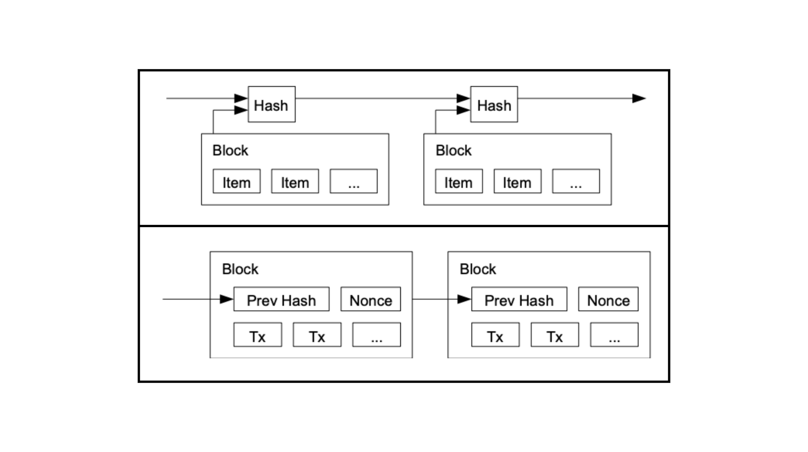

---
**由此收听或观看本期内容:**

<iframe width="560" height="315" src="https://www.youtube.com/embed/0ZxM_i6vLT0" title="YouTube video player" frameborder="0" allow="accelerometer; autoplay; clipboard-write; encrypted-media; gyroscope; picture-in-picture; web-share" allowfullscreen></iframe>

---

在之前的第20课中，我们讨论了将Bit Gold整合到Ethereum Classic（ETC）中，以消除对货币是否稳健的任何疑虑。

Bit Gold是最初导致比特币诞生的想法。Bit Gold是未被用作货币但用作保护墙的区块哈希。

在本课程中，第21课，我们将解释如果加密货币网络不是工作量证明（POW），那么它就不是区块链。

没有经过工作量证明的批量数据是不安全的。经过工作量证明的批量数据是安全的。

股权证明（POS）和权威证明（POA）网络就像是纸板制成的。工作量证明区块链是由Bit Gold制成的。

## 数据批量

在计算机科学中，从一组数据中选择的记录称为“批量”。批量只是信息，在互联网上，信息易于生成、复制和修改。

在传统系统中，数据批量通过隔离它们、将它们保存在专有服务器上，并通过加密使入侵者难以访问来防止未经授权的生成、复制和修改。

然而，在去中心化的公共区块链中，账本是未加密的、透明的，并且任何人都可以访问，没有任何东西保护包含新交易和智能合约的数据批量。

这就是为什么在区块链上使用工作量证明来保护这些批量数据的原因。

## 数据区块

当在工作量证明区块链中将一批交易分组并用工作量证明印章或哈希密封时，它可以被称为“区块”。

这是因为现在数据批量是安全的了。

这种工作方式是，POW区块链中的矿工不断接收新交易并将它们分组。当他们这样做时，他们在批量数据中添加了上一个区块的加密印章、时间戳和一个称为随机数的随机数。当他们准备好这个信息包时，他们会做大量的计算工作来生成该数据包或批量数据的哈希或印章。当这个哈希或印章被生成并添加到数据包中时，那个批量就是一个正确的区块了。

现在，问题是为什么POW区块是安全的呢？

## 区块安全特性

如果一批数据没有经过工作量证明密封，那么它仍然只是一批未受保护的交易。

这有点像在港口的混凝土上放置一批苹果等待装入集装箱。苹果托盘就像是一批数据，它们暴露在人们和环境中，除非它们被装入集装箱并用强力锁定，否则苹果会腐烂或被盗。

以相同的方式，用加密印章或哈希密封的区块是受保护的，因为修改它们的唯一方式是重新做所有的工作。

这是区块链数据安全的关键，即使所有数据区块都暴露给公众，它们也极难篡改，因为修改它们的唯一方式是累积庞大的计算基础，同时花费大量的电费来实现。

## 股权证明和权威证明区块是纸板制成的

未经密封且无需任何工作即可构建的数据批量可以轻松重新哈希。

我们称这种类型的“区块”为纸板制成的。

在POS和POA网络中，质押者或节点运营商可以轻松获取数据并更改它。他们可以返回到创世区块并重新构建整个区块链，而这需要很少的努力。

这对于区块链来说是一个非常脆弱的地位。

由于这些网络有质押精英或受信任的节点，比如一些POA系统中的银行，它们很容易被政府或利益集团控制，并被视为传统系统，实施审查、KYC和AML控制，并基于政治实施限制。

## 工作量证明区块是由Bit Gold制成的

正如我们之前所说，通过工作制作的区块很难重新哈希或篡改，因为必须重新做所有的工作。印章需要大量的工作，就像从自然界中提取黄金需要大量的工作一样。

这就是为什么我们说通过工作制作的区块是由[Bit Gold](https://ethereumclassic.org/blog/2024-03-28-etc-proof-of-work-course-20-integrating-bit-gold-in-ethereum-classic)制成的。这使得它们极其难以伪造。

两者都是数据批量，但“区块”是那些用额外工作哈希的批量数据，因此任意更改它们的成本非常高昂。

## “区块链”仅指使用工作量证明的系统

第一个加密货币网络中将数据批量命名为“区块”的人是比特币的创始人

中本聪是第一个在第一个加密货币网络中将数据批量命名为“区块”的人，他也是比特币的创始人和整个系统的发明者。

在[比特币白皮书](https://bitcoin.org/bitcoin.pdf)中，他对时间戳服务器上的信息块和经过工作量证明哈希的信息块进行了类比，并将它们命名为“区块”。

据我们所知，这是第一次将这种类型的数据批量命名为“区块”。

中本聪可能使用这个术语是因为它与混凝土块相似，或者仅仅因为其在拟声上的强烈声音，这符合他想要给比特币中的工作量证明印章区块的描述。

所有其他不使用工作量证明的系统都不是区块链，因为它们的信息批量没有经过工作量证明的保护（并且它们的技术确实过时）。
---

**感谢您阅读本期文章!**

了解更多有关ETC: https://ethereumclassic.org
