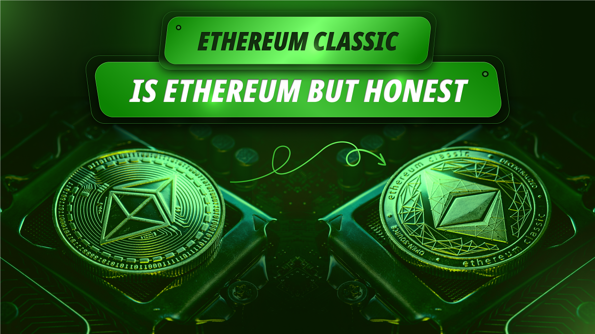

---
**You can listen to or watch this video here:**

<iframe width="560" height="315" src="https://www.youtube.com/embed/mIqv55ADqfs" title="YouTube video player" frameborder="0" allow="accelerometer; autoplay; clipboard-write; encrypted-media; gyroscope; picture-in-picture; web-share" allowfullscreen></iframe>

---

One of the most impactful discoveries when one starts to learn more about proof of work blockchains such as Bitcoin (BTC) or Ethereum Classic (ETC) is the honesty and truth behind these systems.

Traditional industries such as banking, insurance, asset management, or investing advice depend on the boasting and exaggeration of their services or institutions, often over inflating their features and attributes of trustworthiness.

Proof of work blockchains are harsh truths. 

Elaine Ou put it best in a [Bloomberg article](https://www.bloomberg.com/view/articles/2019-01-16/bitcoin-and-other-cryptocurrencies-are-open-about-being-at-risk):

“Financial institutions make people feel safe by hiding risk behind layers of complexity. Crypto brings risk front and center and brags about it on the internet. It’s a bit uncivilized, but for some participants, a world where risk is quantified and individual is preferable to one where it’s unknown and distributed.”

As proof of stake systems are centralized, they suffer of the same kind of dishonesty as traditional fiat industries.

A prototypical example of this phenomenon is the Ethereum (ETH) blockchain community.

Ethereum Classic and Ethereum are practically the same technology, but since [the split](https://ethereumclassic.org/blog/2023-01-26-ethereum-classic-course-6-ethereum-classic-is-the-original-chain) of both chains in 2016, ETC has consistently followed a “Code Is Law” philosophy, sticking to proof of work, and Ethereum a “Social Consensus” way of managing the system, while migrating to proof of stake.

ETC’s approach is the same dry and cut reality as Bitcoin. Whatever is inside the chain is immutable, uncensorable, and permissionless. But Ethereum is about community ethics, political acceptance, and punishment of the supposedly undesirable.

This mindset has led Ethereum to brag and boast about imaginary attributes of their system that put it in stark contrast with the truths of Ethereum Classic.

In this post we will go over some of these contrasts.

## The Weak Subjectivity Fallacy

The founding assumption of blockchains that are not proof of work, that is, that use the proof of stake or proof of authority consensus mechanisms, is the principle of “weak subjectivity”.

This was an invention by Vitalik Buterin, founder of Ethereum, that he explained in his essay “[Proof of Stake: How I Learned to Love Weak Subjectivity](https://blog.ethereum.org/2014/11/25/proof-stake-learned-love-weak-subjectivity)”. In it, he argued that computers and blockchain networks are just helpers of humans, and that humans are very good at achieving honest consensus in the long term. Therefore, to introduce some minor subjective rules into these systems was perfectly fine.

This is a flagrant contradiction of trust minimization, the main goal of blockchains, which was even stated in the [Ethereum white paper](https://etherplan.com/ethereum-white-paper.pdf)!

Bitcoin and ETC seek to minimize as much as possible the dependency in trusted third parties precisely because any margin of trust in people will always be abused. It is just a matter of time.

Proof of this abuse is that Ethereum has migrated to proof of stake, a centralizing consensus mechanism, and that they have changed the monetary policy more than 5 times.

## The Proof of Stake Saves Trees Fallacy

The main reason for Ethereum to move to proof of stake was that proof of work is too energy intensive, that it would eternally need a large security budget, and thus kills the trees.

However, it is becoming increasingly evident that proof of work in Bitcoin and ETC actually saves trees.

As mining is distributed globally and constantly moves to seek cheaper sources of energy, it provides cash flows to renewable energy sources promoting clean power industries across the globe. 

In their quest to tap stranded energy, proof of work miners even use methane gas from oil fields as an energy source, which reduces its climate impact by more than 80 times.

By moving to proof of stake, Ethereum is actually the one killing the trees by not producing the positive environmental effects it would have had it stayed as a proof of work blockchain!

## The Cost of Attack Asymmetry Fallacy

In his seminal essay “[A Proof of Stake Design Philosophy](https://medium.com/@VitalikButerin/a-proof-of-stake-design-philosophy-506585978d51)” Vitalik Buterin, the main promoter of proof of stake in Ethereum, argued that proof of work failed to realize the cypherpunk spirit which says that the cost of attack in the system should be orders of magnitude higher than the cost of defense.

If this were a principle, in any case, it would be a mantra of cryptography, but not of Cypherpunks. But, in truth, it was never a stated goal of Bitcoin or ETC. 

The proof of work consensus mechanism was always meant to be a symmetrical kind of defense and it has been stated as such since the Bitcoin white paper of 2008, that whoever had more than 50% of the computing base of the system could reorganize the chain. This is so much so that this attack vector is called a 51% attack, marking its practical symmetry even in its name!

Establishing imaginary problems and then supposedly solving them is one of the main argumentative tactics of fiat institutions and insecure centralized blockchain networks.

## The Proof of Stake Finality Fallacy

Another widely held belief in Ethereum and proof of stake circles is the idea that because those networks have specific “finality” rules, that transactions are indeed final after a certain threshold.

The curious thing about this belief is that even Vitalik Buterin has openly declared that “[finality is always probabilistic](https://blog.ethereum.org/2016/05/09/on-settlement-finality)” in any system.

However, the fallacy relies in not clarifying that even though proof of work systems as Bitcoin and ETC have no subjective finality rules, that finality in those blockchains is orders of magnitude stronger than in proof of stake.

As proof of work demands a lot of work and electricity to seal the blocks, then it is practically impossible to reverse older transactions that happened in the past because all the subsequent blocks would all have to be redone with the same amount of work and energy all over again.

As Ethereum’s proof of stake does not use any work, the whole history of the chain may be rewritten with a fraction of the effort.

Proof of stake has no protection other than the good will of the community, which, again, is what blockchains were trying to avoid in the first place!

## The Low Fees and High Scalability Fallacies

The last two fallacies that we will mention (there are many more, but to cover all of them would require too many more paragraphs in this article!) are the low fees and the scalability fallacies.

In terms of low fees, one of the main expectations of Ethereum users when it migrated to proof of stake was that the high fees that they were paying when it was a proof of work blockchain would go down significantly. 

However, this did not happen, and it didn’t happen because the migration to proof of stake was never meant to solve that problem!

What causes high fees is not the proof method in consensus mechanisms (whether proof of work or proof of stake) but the size of the blocks. And as long as blockchains want to be fully replicated, then blocks will have to remain small. And in small blocks fit a limited number of transactions. This is what causes the competition for block space that increases the cost per transaction.

This same restriction in block space causes the lack of scalability in Ethereum as well as in Bitcoin and ETC.

However Bitcoin and ETC never stated the goals of becoming scalable at the base layer.

---

**Thank you for reading this article!**

To learn more about ETC please go to: https://ethereumclassic.org
