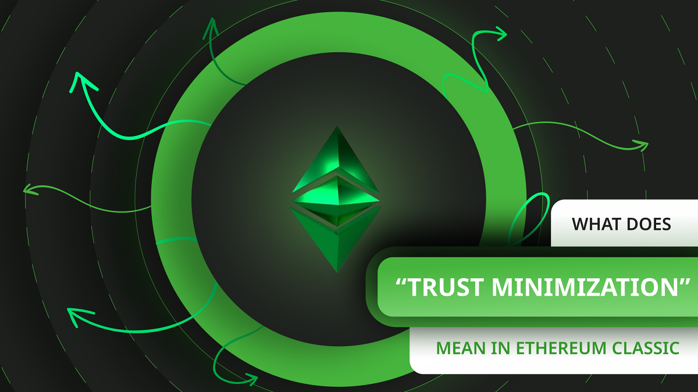
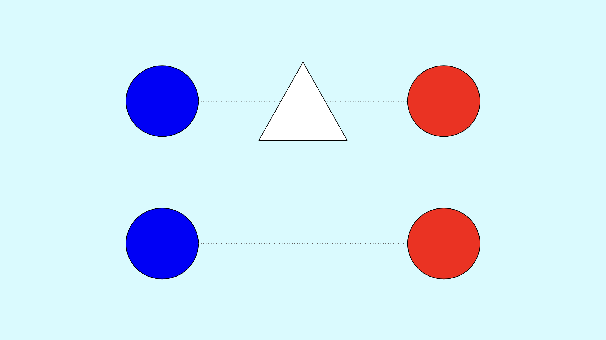
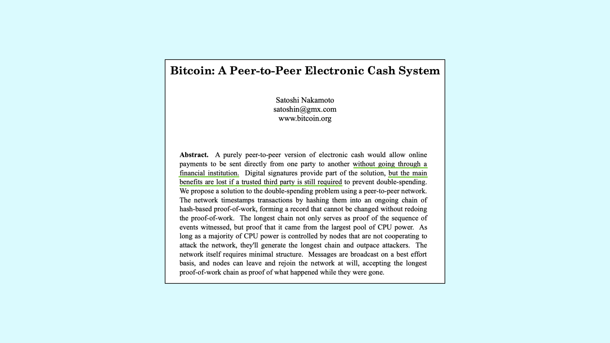

---
**由此收听或观看本期内容:**

<iframe width="560" height="315" src="https://www.youtube.com/embed/08BocPBQO98" title="YouTube video player" frameborder="0" allow="accelerometer; autoplay; clipboard-write; encrypted-media; gyroscope; picture-in-picture; web-share" allowfullscreen></iframe>

---

## Cipherpunk的愿景

在1970年代末发明[公钥密码学](https://ethereumclassic.org/blog/2022-12-22-ethereum-classic-course-1-public-key-cryptography)时，互联网已经存在，个人计算机即将进入市场。

到了1980年代末和1990年代初，一群密码学家和计算机科学家已经意识到，尽管互联网和个人计算将彻底改变世界，但中心化的技术暴政将威胁基本自由，除非发明了良好的密码工具来确保隐私和稳健货币等价值。

有了这个想法，他们成立了一个在线邮件列表，开始称自己为“Cipherpunk”，并开始勾勒潜在的威胁并计划对抗这些威胁的设计。

## 什么是可信第三方

由于密码学假设主要威胁是可能拦截消息并解密消息的“窃听者”，对于Cipherpunk来说，威胁是那些在我们所有事务中进行中介的可信第三方。

在在线互动的背景下，可信第三方将看到我们所有的通信和活动，记录它们，并开始对我们进行政治或其他方面的个人资料分析，以及任意审查我们的言论，使我们下线，取消我们的资格，并控制我们的行为。听起来耳熟吗？

可信第三方可能是处理我们支付和持有我们财富的银行，通信应用程序，社交媒体应用程序，搜索引擎，云服务以及政府可能通过这些技术公司和服务来强加其议程。

## 什么是信任最小化

因此，互联网和个人计算呈现了两种对立的现象：在全球范围内自由言论和商业的机会，以及[受信任的第三方](https://nakamotoinstitute.org/library/trusted-third-parties)通过中心化的技术平台来捕捉我们的威胁。

Cipherpunk所设想的解决方案是尽可能地减少对第三方的信任，使用密码学来避免由公司，政府和特殊利益所控制。

这个目标被称为“信任最小化”，因为即使使用去中心化技术，也总会向第三方存放一些信任来传递信息。

## 比特币白皮书中提到信任最小化14次

在寻求在互联网上实现稳健货币的努力中，第一个也是最成功的设计，以在全球范围内实现信任最小化，就是比特币。

信任最小化是如此重要，以至于在比特币白皮书中提到了14次。

在货币，储蓄和支付方面，信任最小化意味着减少对银行，中央银行和政府的依赖，减少对货币发行，支付处理和货币保管的依赖。

然而，比特币从未进化到只是一个账户和余额的账簿。这意味着仍然需要可信第三方来运行外部应用程序来使用它。

## 以太经典中的信任最小化

这就是为什么重新创建尼克·萨博在1990年代初设想的[智能合约](https://web.archive.org/web/20140413000357/http://szabo.best.vwh.net/smart.contracts.html)的想法是如此重要。

如果在现实世界中，每个人都需要像银行，第三方担保代理人，支付应用程序，交易所，财产登记处和中央银行这样的可信第三方，那么就有必要尝试用在线去中心化代理来替代这些实体来执行这些任务。

这就是为什么Vitalik Buterin在2013年致力于，并提出了以太经典（原始以太坊）的想法，一个智能合约的工作证明区块链，不仅可以托管像比特币一样的账户和余额，还可以托管智能合约来支持去中心化应用程序，以取代可信第三方。

## 实现信任最小化的Dapps示例

智能合约支持的去中心化应用程序（dapps）是区块链行业的第二个最重要的发明，因为它们最终实现了最小化对第三方的信任的目标。

以太经典中dapps的示例有：

**去中心化交易所：**

 去中心化交易所通过提供链上流动性池来代替经纪人和传统交易所，这些流动性池代表着可以与用户进行交易的自主市场制造商，从而实现各种代币交换。

**非同质化代币（NFTs）：** NFTs是智能合约，可以代表在线和离线资产，充当完整的服务财产登记处，具有抗审查和无需许可的特性。

**以太坊域名服务（ENS）：** ETC上的ENS服务取代了传统的DNS服务，并在区块链上启用了可以分配给地址或智能合约的域名，以避免区块链上账户的长格式和复杂格式。

## 关于虚假Dapps的警告

然而，由于智能合约使得以太经典这样的区块链成为通用的计算平台，这意味着任何类型的设计都可以托管。这甚至可能包括集中式应用程序！

集中式应用程序的示例可能包括：

**治理和投票代币：** 任何具有治理或投票代币的应用程序基本上都是常规的中心化实体，由第三方，即投票者控制，但后端代码是托管在区块链上的。

**稳定币：** 稳定币看起来像是去中心化应用程序，但事实上，对外部可转换资产（通常是法定货币）的保管完全依赖于区块链之外的可信第三方。

**权益池：** 在权益证明区块链上的权益池不仅因为这些网络[是集中化的](https://ethereumclassic.org/blog/2023-12-27-ethereum-classic-at-scale-is-decentralized-ethereum-is-centralized)，还因为它们具有选择性的过滤机制，可选择谁可以在这些链中提出和验证区块，并且具有治理系统，使其开发团队对其系统拥有大量的中央化决策权。

---

**感谢您阅读本文！**

要了解更多关于ETC的信息，请访问：https://ethereumclassic.org
