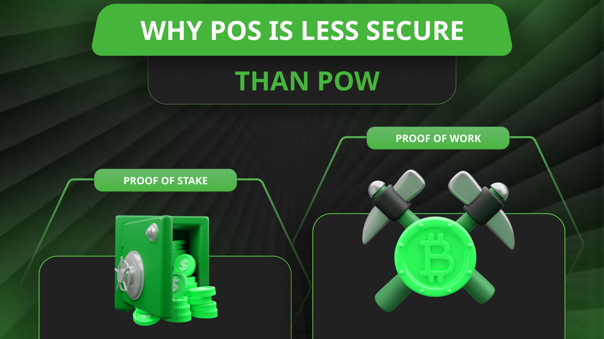

---
**You can listen to or watch this video here:**

<iframe width="560" height="315" src="https://www.youtube.com/embed/BZWMQCSq2ZI" title="YouTube video player" frameborder="0" allow="accelerometer; autoplay; clipboard-write; encrypted-media; gyroscope; picture-in-picture; web-share" allowfullscreen></iframe>

---

In the previous class, 21, we explained that batches of data that are not sealed with proof of work (POW) are not blocks, and if they are not blocks, then the networks that host those data structures are not blockchains. 

Blockchains are the ones that seal the batches with proof of work hashes because they offer all the security guarantees of true decentralization.

In this class, 22, we will explain a related topic, which is that, for various reasons, networks that are not proof of work are less secure. 

## From Byzantine Fault Tolerance to Nakamoto Tolerance

Proof of stake is a convoluted type of Byzantine Fault Tolerant (BFT) network. A type which was proven to be tolerant to only 1/3 of dishonest nodes many [decades ago](https://lamport.azurewebsites.net/pubs/byz.pdf).

Today, a POS blockchain such as Ethereum needs to have the validators vote on each block with supermajorities of two thirds of the voters precisely because they have not solved the problem.

There is zero innovation in POS. No matter how many pseudo-scientific white papers they may write, or complex terms they may invent, they are iterations of the same old paradigms.

POW [did solve](https://satoshi.nakamotoinstitute.org/emails/cryptography/11) the problem by raising the attack threshold to 51%, and even added additional benefits such as costliness to the production of the money and a barrier to change past transactions. 

## No Objective Physical Base

As explained in [class 19](https://ethereumclassic.org/blog/2024-03-21-etc-proof-of-work-course-19-pow-is-digital-gold-pos-is-community-fiat-money), POS networks do not have an objective POW physical base, this is what we call an intellectual tragedy. 

For seeking to “save trees”, that it doesn’t, “scalability”, when it doesn’t scale, and “low fees” that it doesn’t lower, proof of stake eliminated the single most important invention by Satoshi Nakamoto, which was to achieve consensus in a totally decentralized way just by producing and verifying the proofs of work.

POW blockchains, as they preserve this incredible invention, do achieve consensus in a truly decentralized way.

The lack of POW, or the lack of this objectivity in the system, makes it centralized, thus insecure.

## No Barrier to Change Past Transactions

Due to the absence of the objective physical base, POS chains do not present a barrier to reverse past transactions.

“Blocks” in POS networks are really just insecure batches of data that are hashed with no POW, therefore do not require to redo all the work; using enormous computing power, spending enormous amounts of electricity; if attackers wanted to reverse the history.

This means that, as POS networks are centralized, it is just a matter of the few special interests controlling the system to want to change things, that they could do it trivially. 

To reorganize POS databases requires no additional effort other than common computers.

## No Work to Discern Which Is the Correct Block

With no objective POW base, POS networks have no work done to discern which is the correct block in each round.

POW stamps in each block require so much work to create that it is very difficult for attackers to imitate them, thus to corrupt the system.

In POW, when nodes globally receive blocks, it is very easy for them to verify whether the work was done in each round according to the difficulty imposed by the protocol. 

This means that if nodes receive multiple candidate blocks from impostors except for one that did all the work, then it becomes very easy for them to know which is the correct block in each round. Even in complete isolation, without the need to consult anyone else.

This was the paramount design achievement of Bitcoin, but POS did away with all of it.

## No Fork Choice

Just as with POS it becomes difficult to discern which is the correct block in each round, it doesn’t have a fork choice through accumulated work done in case there are involuntary chain splits or if nodes wish to leave and join again later.

Where, in POW, nodes just have to check the accumulated work done to know which is the canonical blockchain to follow, POS nodes actually would have to check these things with trusted third parties. Exactly what blockchains were supposed to avoid!

Today, if POS blockchains suffer forks or splits on a global scale, the only way for all nodes worldwide to come back to the canonical chain is through a conference call, a Discord server, emergency text messages, or halting the chain, as it has happened with Solana several times for their outages.

## No Energy to Produce the Money

Finally, yet another point of insecurity in POS is that its money is weak.

As POS does not spend any energy to create the money, then there is no unforgeable costliness nor scarcity to its issuance.

When national currencies were backed by gold, this gave them scarcity and value as politicians couldn’t just print more of it every time they wished to increase the national debt or finance their spending sprees.

POW imitates the hardness of gold but on the internet, therefore POW coins are digital gold.

Because it doesn’t do any of these things, proof of stake is basically jello.

---

**Thank you for reading this article!**

To learn more about ETC please go to: https://ethereumclassic.org
