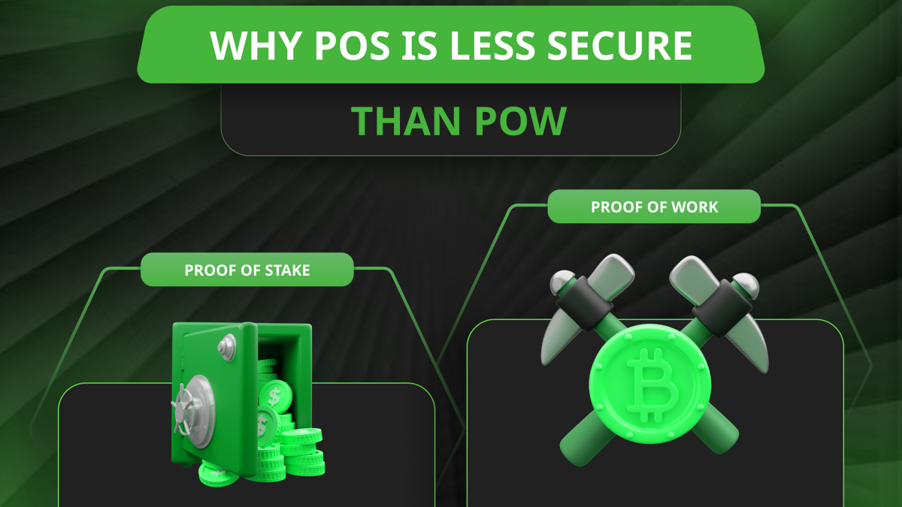

---
**由此收听或观看本期内容:**

<iframe width="560" height="315" src="https://www.youtube.com/embed/BZWMQCSq2ZI" title="YouTube video player" frameborder="0" allow="accelerometer; autoplay; clipboard-write; encrypted-media; gyroscope; picture-in-picture; web-share" allowfullscreen></iframe>

---

在上一课（第21课）中，我们解释了未经工作证明（POW）封闭的数据批次不是区块，如果它们不是区块，那么托管这些数据结构的网络也不是区块链。

区块链是用工作证明哈希封闭批次的，因为它们提供真正去中心化的所有安全保证。

在这节课（第22课）中，我们将解释一个相关主题，即由于各种原因，不是工作证明的网络较不安全。

## 从拜占庭容错到中本聪容错

权益证明是一种复杂的拜占庭容错（BFT）网络。这种类型在[几十年前](https://lamport.azurewebsites.net/pubs/byz.pdf)已被证明只能容忍1/3的不诚实节点。

今天，像以太坊这样的POS区块链需要验证者对每个区块进行投票，确保超过三分之二的选民支持，这正是因为他们尚未解决这个问题。

在POS中没有任何创新。无论他们写了多少伪科学的白皮书，或者发明了多少复杂的术语，它们都是相同旧范式的迭代。

工作证明通过将攻击门槛提高到51%解决了这个问题，甚至还增加了额外的好处，比如生产货币的成本性和改变过去交易的障碍。

## 没有客观的物理基础

如[第19课](https://ethereumclassic.org/blog/2024-03-21-etc-proof-of-work-course-19-pow-is-digital-gold-pos-is-community-fiat-money)所解释的那样，POS网络没有客观的工作证明物理基础，这就是我们所谓的智力悲剧。

由于寻求“拯救树木”，实际上并没有拯救，“可扩展性”，实际上并不可扩展，以及“低费用”，实际上并没有降低，权益证明消除了中本聪最重要的发明之一，那就是通过生产和验证工作证明实现完全去中心化共识。

工作证明区块链，因为保留了这一令人难以置信的发明，确实以真正去中心化的方式达成共识。

没有工作证明，或系统中缺乏这种客观性，使其变得中心化，因此不安全。

## 没有阻止改变过去交易的障碍

由于缺乏客观的物理基础，POS链不会对撤销过去交易构成障碍。

POS网络中的“区块”实际上只是用无工作证明哈希的不安全数据批次，因此不需要重做所有工作；如果攻击者想要撤销历史，需要使用大量计算能力，花费大量电力。

这意味着，由于POS网络是中心化的，控制系统的少数特殊利益集团想要改变事物，他们可以轻而易举地做到。

重新组织POS数据库不需要额外的努力，只需要普通计算机即可。

## 没有工作来区分哪个是正确的区块

没有客观的工作证明基础，POS网络在每轮中没有完成工作来区分哪个是正确的区块。

在每个区块中，工作证明印记需要大量工作才能创建，攻击者很难模仿它们，因此很难破坏系统。

在工作证明中，当节点全球接收到区块时，它们可以很容易地验证每轮中是否完成了所需的工作量，根据协议设定的难度。

这意味着，如果节点收到来自伪造者的多个候选区块，除了一个做了所有工作的区块之外，那么它们很容易知道每轮中哪个是正确的区块。甚至在完全隔离的情况下，无需咨询其他任何人。

这是比特币的最重要的设计成就，但POS摒弃了所有这些。

## 没有分叉选择

与POS一样，它变得难以区分每轮中哪个是正确的区块，它没有通过累积工作完成的分叉选择，以防发生非自愿的链分裂或节点希望稍后离开并再次加入。

在工作证明中，节点只需检查已完成的累积工作量即可知道要遵循的规范区块链，而POS节点实际上必须与可信第三方检查这些内容。这正是区块链本应避免的！

如今，如果POS区块链在全球范围内发生分叉或分裂，所有全球节点回到规范链的唯一方式是通过电话会议、Discord服务器、紧急短信或停止链条，就像Solana因多次宕机而发生的情况一样。

## 没有生产货币的能量

最后，POS中的另一个不安全点是其货币的脆弱性。

由于POS不花费任何能量来创造货币，因此它的发行没有不可伪造的昂贵性和稀缺性。

当国家货币以黄金为后盾时，这赋予了它们稀缺性和价值，因为政治家们无法随意增加国家债务或资助他们的开销。

工作证明模仿了黄金的硬度，但是在互联网上，因此工作证明币是数字黄金。

由于POS没有做任何这些事情，因此权益证明基本上是果冻。

---

**感谢您阅读本文！**

要了解更多关于ETC的信息，请访问：https://ethereumclassic.org
