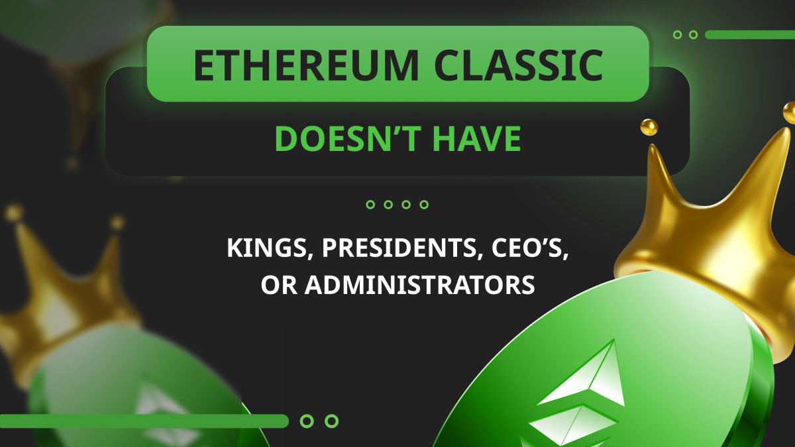

---
**由此收听或观看本期内容:**

<iframe width="560" height="315" src="https://www.youtube.com/embed/y1_3Pz66z00" title="YouTube video player" frameborder="0" allow="accelerometer; autoplay; clipboard-write; encrypted-media; gyroscope; picture-in-picture; web-share" allowfullscreen></iframe>

---

这个行业存在一种误解，即拥有大规模ICO（首次代币发行）、风险投资（VC）融资、庞大的开发团队以及资金充足的基金会或公司管理的区块链项目一定是好的和值得尊敬的。

然而，事实并非如此。区块链项目，特别是第一层网络，必须尽可能地去中心化，而ICO、VC、知名领导开发团队以及基金会等方面恰恰是中心化的强烈标志。

正如君主制国家有国王，公司或集中式计算系统有总裁和管理者一样，真正去中心化的区块链项目不应该有任何这些领导或指导他们的人。

## 比特币最初也是中心化的

然而，这可能听起来有些反直觉，但如今世界上最去中心化的区块链项目实际上最初都是中心化的系统。

比特币（BTC）就是一个例子，它于2009年启动时只有两个节点，一个由其创始人[Satoshi Nakamoto](https://en.wikipedia.org/wiki/Satoshi_Nakamoto)运行，另一个由[Hal Finney](https://en.wikipedia.org/wiki/Hal_Finney_(computer_scientist))运行。

最初，Finney先生对Nakamoto先生提出了几个建议和漏洞修复，他会单方面将它们集成到存储客户端软件的代码库中。

后来，开发人员[Gavin Andresen](https://en.wikipedia.org/wiki/Gavin_Andresen)和[Jeff Garzik](https://en.bitcoin.it/wiki/Jeff_Garzik)加入了软件代码库，但Nakamoto先生仍然对系统中的所有决策拥有集中化的控制权。

## 然而，如今比特币已经在规模上去中心化

比特币最初中心化的原因有几个，而这些原因在今天已经不存在了。首先，正如前面所述，一个人指导并决定系统中的所有更改。

第二个原因是，因为像技术创始人这样重要的人物掌控着技术的发展方向，所有运行节点的人都会跟随他的领导。可以说，比特币在这个时候是有君主的。

第三个原因是，在一段时间内，比特币节点运营和挖矿活动没有区分或分开。事实上，只要下载并运行客户端，任何计算机都可以挖掘BTC，因为专门用于此目的的计算基础非常小。

然而，如今，在规模上，比特币有900多名贡献者开发者，全球运营着数以万计的节点，这些节点分为矿工和验证节点，其哈希率巨大，而其创始人已经在2010年消失。

## 以太坊最初也是中心化的

以太坊（ETH）和以太坊经典（ETC）最初是同一条区块链。导致两个系统分离的事件是发生在2016年的一次名为[The DAO硬分叉](https://ethereumclassic.org/blog/2023-01-26-ethereum-classic-course-6-ethereum-classic-is-the-original-chain)。

最初，以太坊作为一个单一系统是相当中心化的，因为它是由其创始人[Vitalik Buterin](https://en.wikipedia.org/wiki/Vitalik_Buterin)及其同事团队组织的大规模众筹活动资助的；最初的代币持有者是有限数量的投资者；初始代币的大部分分配给了开发人员和以太坊基金会；而如今，以太坊基金会从其初始资金筹集活动中获得了数亿美元，继续主导着发展。

直到今天，Vitalik Buterin仍然领导着这个项目和以太坊生态系统，并且[通常](https://x.com/VitalikButerin/status/1588669782471368704)项目会遵循他的指导。可以说，以太坊在这个时候有一个总统或CEO。

## 最初的中心化导致了The DAO硬分叉

事实上，The DAO硬分叉当时如此容易实现，这是一个奇怪的事件，因为当时统一的区块链以太坊是一个工作量证明网络。

然而，这可以解释为以太坊当时没有达到任何显著的规模；就像现在一样，它是由其创始人主导的；以太坊基金会通过其资金控制了发展；而所有生态系统的节点运营者和矿工都只是在追随领导者的命令。

如今，这种领导力非常强大，其追随者因其集中化命令的巨大资源而受到财务激励，以至于网络甚至迁移到了更加集中化的模式，即权益证明。

## 然而，ETC现在已经在规模上去中心化

The DAO硬分叉事实上对以太坊经典来说是一个奇迹般的事件。通过保持作为原始链，并且没有任何更改，不可改变，以及遵守“法律即代码”的理念，它突然变得孤立、没有资金支持和无人支持的项目。这种突然的荒芜对今天以太坊经典的真正去中心化来说再合适不过了。

随着时间的推移，新的支持者和开发人员加入了ETC生态系统；更多的交易所和节点运营者开始支持该链；哈希算力和挖矿开始显著增长；ETC已成为[世界上最大的](https://ethereumclassic.org/blog/2024-04-03-ethereum-classic-etc-is-the-leading-smart-contracts-proof-of-work-blockchain-in-the-world)工作量证明智能合约区块链！

在哲学和生态系统拓扑结构方面，现在ETC与比特币非常相似：它没有魅力四射的创始人，节点运营者和矿工遍布全球；没有任何有着大量资金的实体来指导系统。

## 因此，ETC没有国王、总统、CEO或管理员

这意味着ETC是一个完全去中心化的区块链，不仅因为在规模上，其设计自然趋向于去中心化，就像工作量证明的共识模式一样，而且还因为没有任何单一的角色来领导或管理系统。

以太坊经典没有任何ICO或VC资金、庞大的开发团队，也没有资金充足的基金会或公司来管理它。

所有这些生态系统中的部分都在全球范围内有机地增长和分布，不仅因为世界意识到ETC具有这些真实的原则，而且因为其去中心化的原则实际上被编码到其系统中。

基于这些原因，我们可以说，ETC没有国王、总统、CEO或管理员。

---

**感谢您阅读本文！**

要了解更多关于ETC的信息，请访问：https://ethereumclassic.org
