---
**You can listen to or watch this video here:**

<iframe width="560" height="315" src="https://www.youtube.com/embed/COajELs3_n4" title="YouTube video player" frameborder="0" allow="accelerometer; autoplay; clipboard-write; encrypted-media; gyroscope; picture-in-picture; web-share" allowfullscreen></iframe>

---

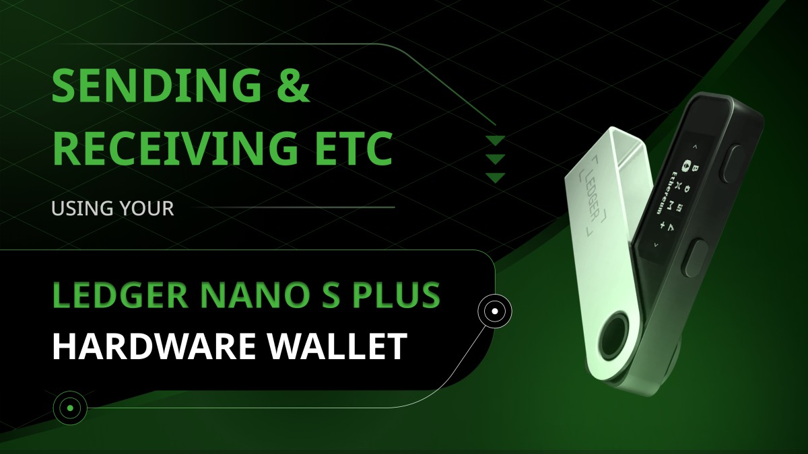

In this post we will explain how to send and receive ETC with the Ledger Nano S Plus.

To learn where to get the hardware wallet and to set it up on your computer, please see our guide in the following link:

“Using the Ledger Nano S Plus With Ethereum Classic”

https://ethereumclassic.org/blog/2024-02-27-using-the-ledger-nano-s-plus-with-ethereum-classic

## The Ledger Hardware and Software Components

Ledger Nano S Plus is a hardware wallet, so to use it you need to have your Ledger Nano S Plus device and the Ledger Live app on your computer as we explained in our [previous guide](https://ethereumclassic.org/blog/2024-02-27-using-the-ledger-nano-s-plus-with-ethereum-classic
).

In this tutorial we will explain how to send and receive ETC using your Ledger Nano S Plus hardware wallet.

We will show the parallel actions on your Ledger Nanos S Plus and on the Ledger Live app on your computer where appropriate.

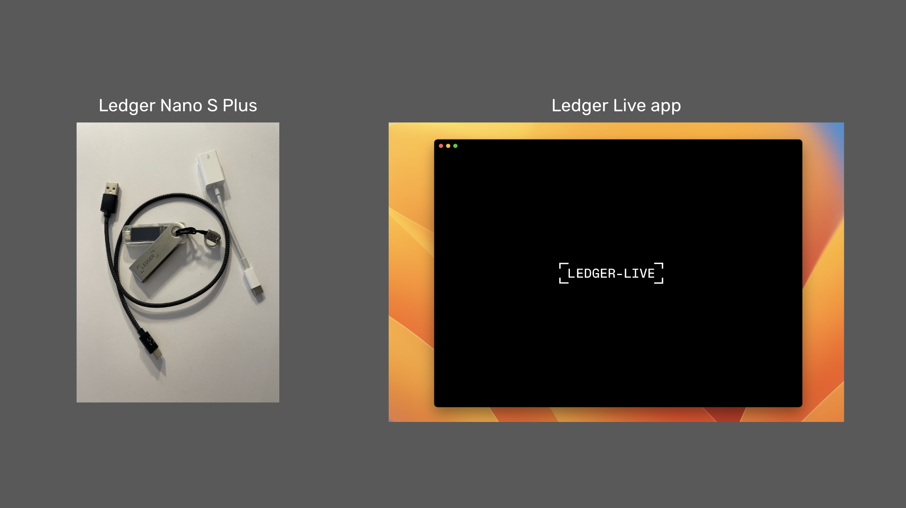

## Sending ETC

### 1. Open the Ledger Live App and Select the Accounts Tab

The first step to send ETC from your Ledger Nano S Plus hardware wallet is to open the Ledger Live app on your computer and then click on the “Accounts” tab on the left menu.

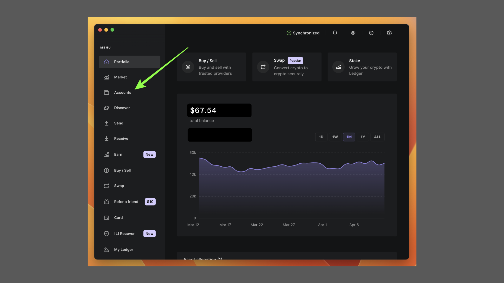

### 2. Click on the Account From Where You Will Send ETC

On the “Accounts” page select the account from where you wish to send ETC.

In this example, we chose the account with the name “Ethereum Classic 2”.

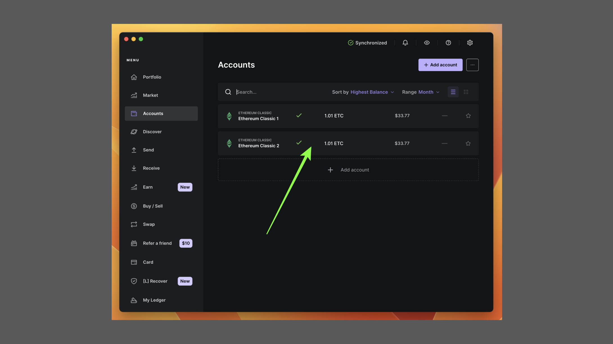

### 3. Click on the “Send” Button

In the next screen, you will see your account information. To send ETC from this account, click on the “Send” button on the top menu as shown in the image.

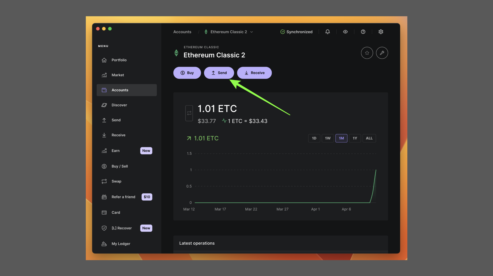

### 4. Enter the Address to Where You Will Send ETC

In the next screen, Ledger Live will ask to which address you wish to send the ETC. Enter the address in the field provided and press “Continue”.

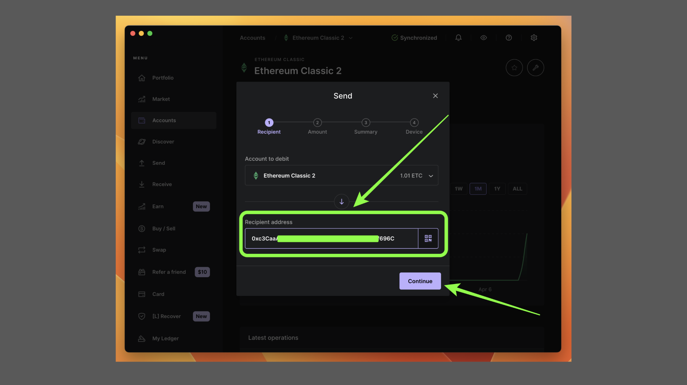

### 5. Enter the Amount to Send

In the next screen, Ledger Live will ask you to enter the amount you wish to send. Enter that amount on the field provided or use the “Send Max” button to send all the ETC in the address. Then, press “Continue”.

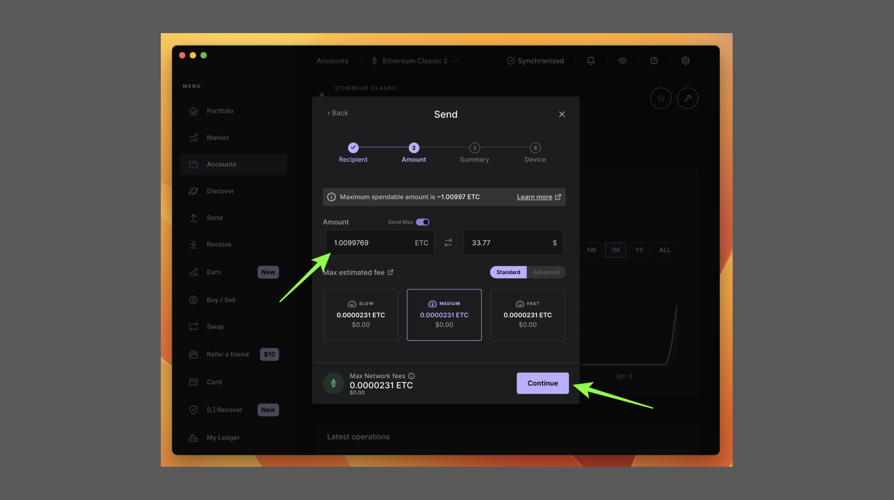

### 6. Check That the Transaction Information Is Correct

In the next screen, Ledger Live will show you the transaction information for you to check that it is correct. If it is correct, then press “Continue”.

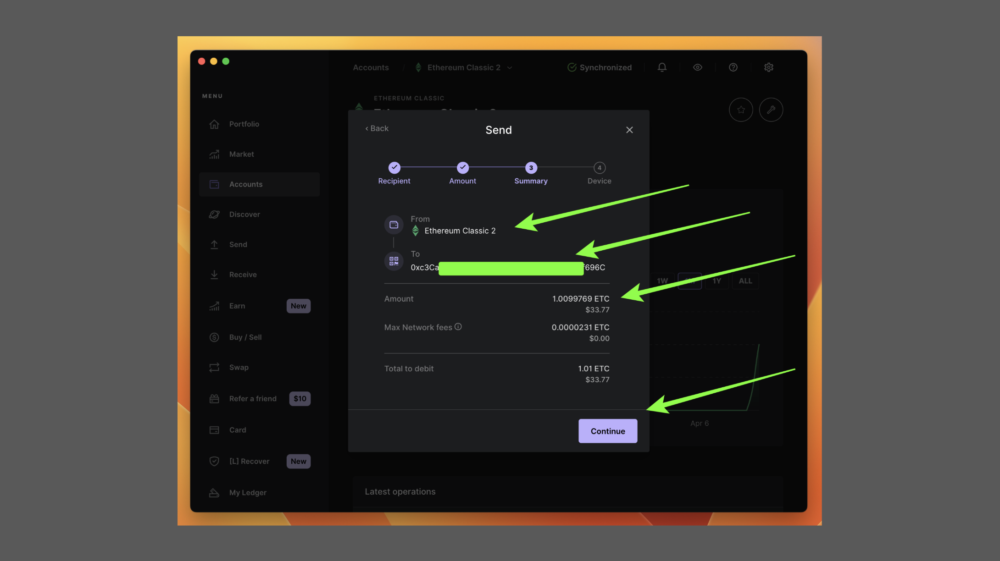

### 7. Connect and Unlock You Ledger Nano S Plus

Now Ledger Live will ask you to connect your device to your computer and to unlock it using the PIN number you chose for it. Go ahead and unlock your Ledger Nano S Plus.

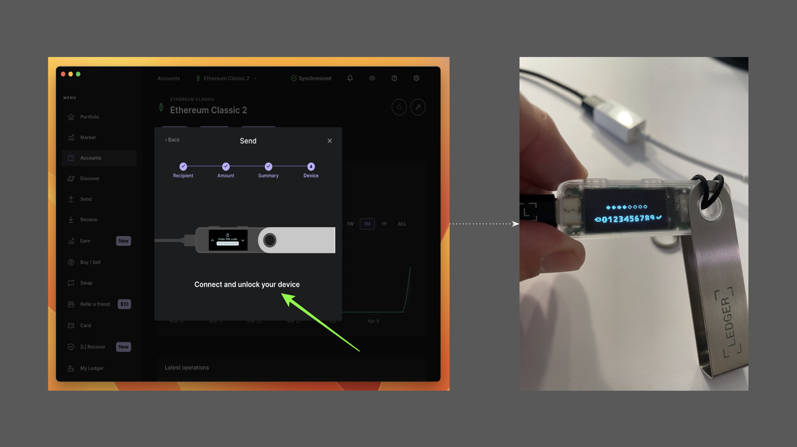

### 8. Open the ETC App, Confirm, and Send

Next, on your Ledger Nano S Plus, you will need to open the ETC app, then confirm the transaction details, and if all is correct, then accept the transaction by pressing both buttons at the top of the device when you see the “Accept” prompt.

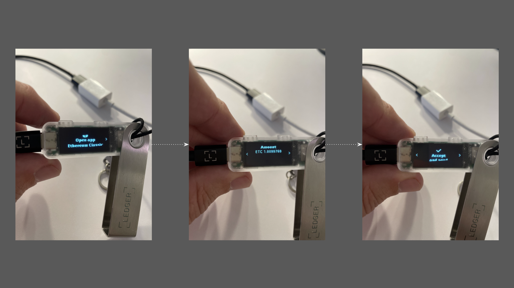

### 9. Transaction Sent!

Once you accepted the transaction on your Ledger Nano S Plus, Ledger Live on your computer will receive the signed transaction from your device and confirm that it was sent.

If you wish to see the transaction details and status, you can click on the “View details” button.

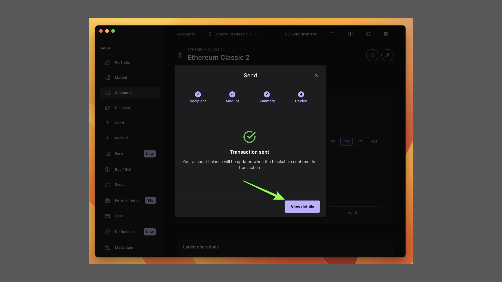

## Receiving ETC

### 1. Open the Ledger Live App and Select the Accounts Tab

To receive ETC into one of your ETC addresses in your Ledger Nano S Plus you need to open the Ledger Live app on your computer and select the “Accounts” tab from the left menu.

### 2. Click on the Account Into Which You Will Receive ETC

In the next screen, you can choose into which account you wish to receive ETC. For this guide, we chose the “Ethereum Classic 2” account.

In the next screen click on the “Receive” button on the top menu.

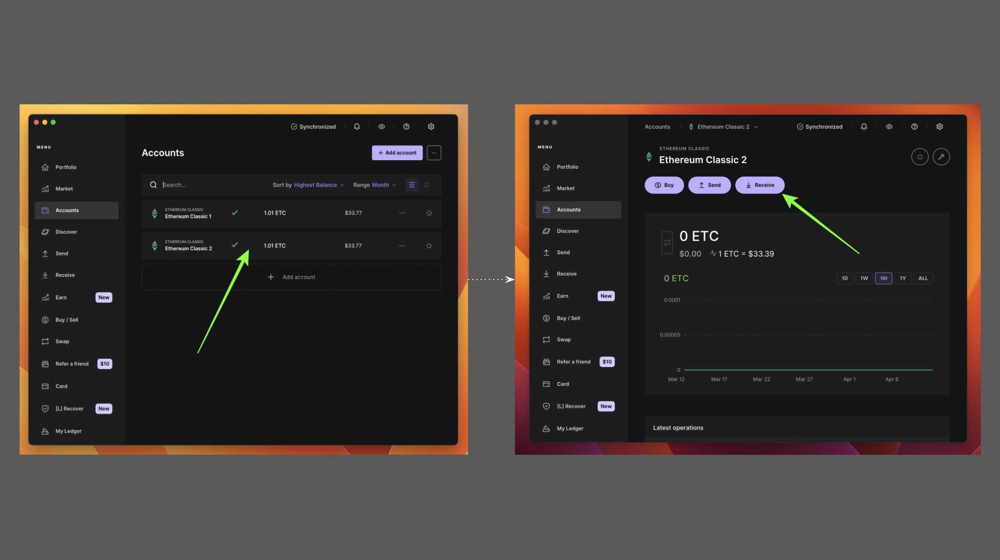

### 3. Select the ETC Address Again

For some reason, in the next screen the Ledger Live app will ask you to select again to which account you wish to receive ETC.

We chose again “Ethereum Classic 2” for this example. When you do this, then click on the “Continue” button.

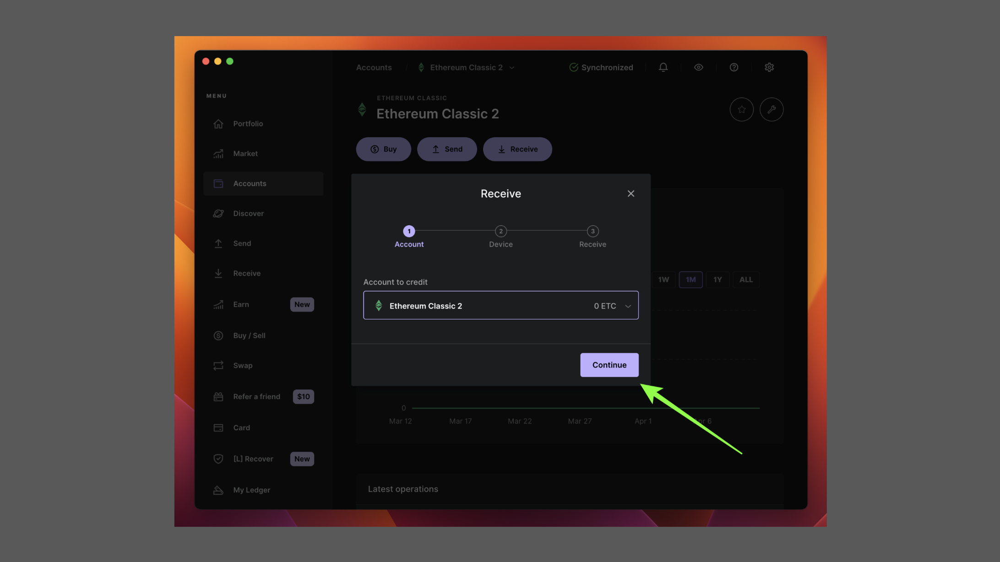

### 4. Connect and Unlock Your Ledger Nano S Plus

In the next screen, Ledger Live will ask you to connect and unlock your Ledger Nano S Plus device.

Connect your device to your computer and then enter your PIN number to unlock it.

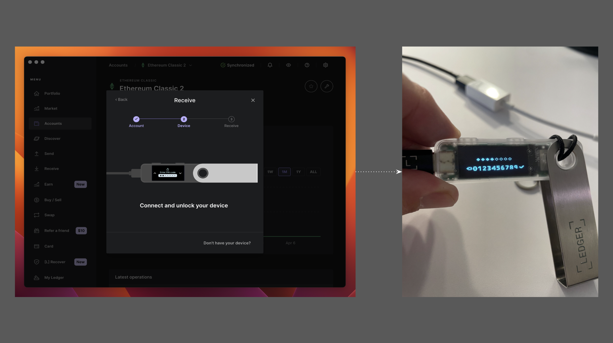

### 5. Open the ETC App, Copy the Address, Confirm it, and Approve it

In the next step, you need to open the ETC app on your Ledger Nano S Plus. Then, go to your Ledger Live app on your computer and copy the address shown. Next, on your Ledger Nano S Plus, you need to confirm whether that address is correct. Once verified, you can approve the address on the device.

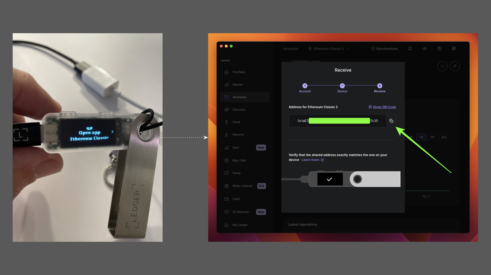

### 6. Use the Address Retrieved To Receive ETC!

In the next step, Ledger Live would have received your approval from the Ledger Nano S Plus and will confirm that the address that you copied was the correct one.

Now you can use that address to receive ETC into your Ledger Nano S Plus!

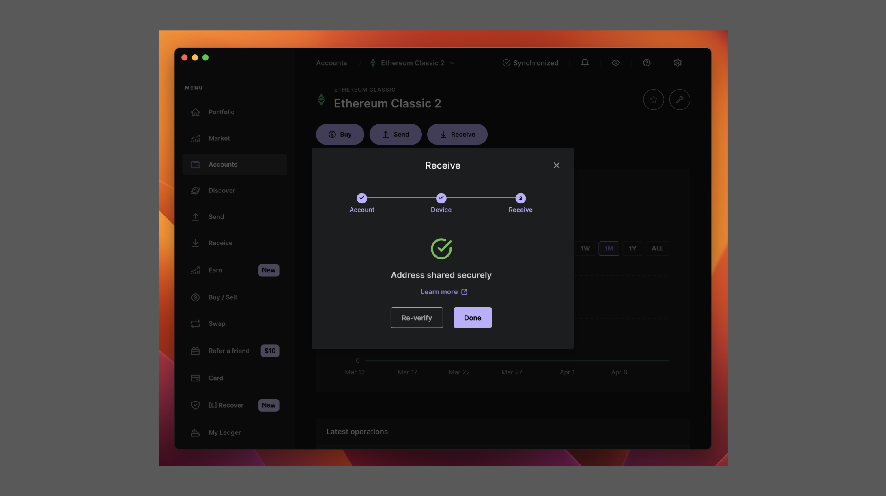

---

**Thank you for reading this article!**

To learn more about ETC please go to: https://ethereumclassic.org
