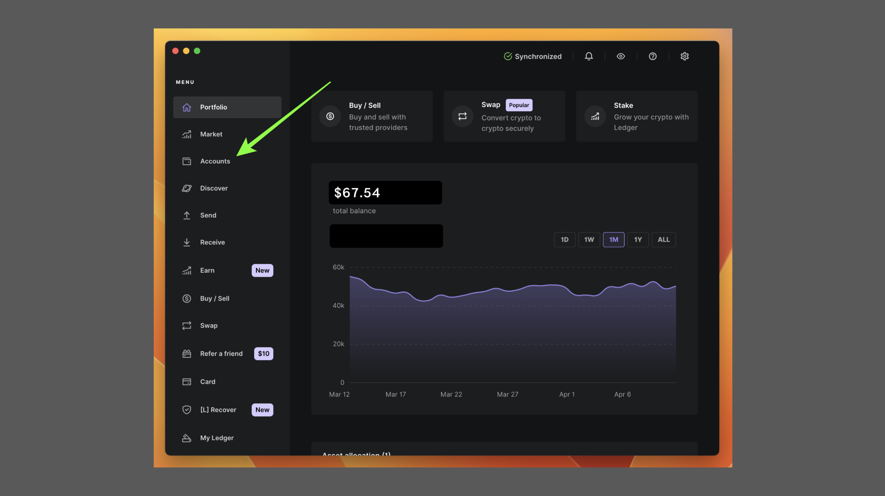

---
**由此收听或观看本期内容:**

<iframe width="560" height="315" src="https://www.youtube.com/embed/COajELs3_n4" title="YouTube video player" frameborder="0" allow="accelerometer; autoplay; clipboard-write; encrypted-media; gyroscope; picture-in-picture; web-share" allowfullscreen></iframe>

---

这篇文章将解释如何使用Ledger Nano S Plus发送和接收ETC。

要了解硬件钱包的获取方式，并在您的计算机上设置它，请参阅我们以下链接中的指南：

“使用Ledger Nano S Plus与以太坊经典”

https://ethereumclassic.org/blog/2024-02-27-using-the-ledger-nano-s-plus-with-ethereum-classic

## Ledger硬件和软件组件

Ledger Nano S Plus是一个硬件钱包，因此要使用它，您需要拥有您的Ledger Nano S Plus设备以及我们在[上一篇指南中](https://ethereumclassic.org/blog/2024-02-27-using-the-ledger-nano-s-plus-with-ethereum-classic
)解释的Ledger Live应用程序。

在本教程中，我们将解释如何使用您的Ledger Nano S Plus硬件钱包发送和接收ETC。

我们将展示您的Ledger Nano S Plus上的并行操作，并在适当的时候在您计算机上的Ledger Live应用程序上显示。

## 发送ETC

### 1. 打开Ledger Live应用程序并选择“账户”选项卡

从您的Ledger Nano S Plus硬件钱包发送ETC的第一步是打开计算机上的Ledger Live应用程序，然后单击左侧菜单中的“账户”选项卡。

### 2. 点击您将要发送ETC的账户

在“账户”页面上，选择您希望发送ETC的账户。

在本示例中，我们选择了名称为“以太经典 2”的账户。

### 3. 点击“发送”按钮

在下一个屏幕上，您将看到您的账户信息。要从此账户发送ETC，请点击顶部菜单中的“发送”按钮，如图所示。

### 4. 输入您将要发送ETC的地址

在下一个屏幕上，Ledger Live将询问您要发送ETC的地址。在提供的字段中输入地址并按“继续”。

### 5. 输入要发送的金额

在下一个屏幕上，Ledger Live将询问您要发送的金额。在提供的字段中输入该金额或使用“发送最大”按钮发送地址中的所有ETC。然后，按“继续”。

### 6. 检查交易信息是否正确

在下一个屏幕上，Ledger Live将向您显示交易信息，以便您检查是否正确。如果正确，请按“继续”。

### 7. 连接并解锁您的Ledger Nano S Plus

现在，Ledger Live将要求您将设备连接到计算机，并使用您为其选择的PIN码解锁设备。继续解锁您的Ledger Nano S Plus。

### 8. 打开ETC应用程序，确认并发送

接下来，在您的Ledger Nano S Plus上，您需要打开ETC应用程序，然后确认交易详细信息，如果一切正确，则在设备顶部的两个按钮上看到“接受”提示时，接受交易。

### 9. 交易已发送！

一旦您在Ledger Nano S Plus上接受了交易，Ledger Live将接收来自您设备的签名交易，并确认已发送。

如果您想查看交易详情和状态，可以点击“查看详情”按钮。

## 接收ETC

### 1. 打开Ledger Live应用程序并选择“账户”选项卡

要将ETC接收到您的Ledger Nano S Plus中的某个ETC地址中，您需要打开计算机上的Ledger Live应用程序，并从左侧菜单中选择“账户”选项卡。

### 2. 点击您将要接收ETC的账户

在下一个屏幕上，您可以选择要接收ETC的账户。对于本指南，我们选择了“以太经典 2”账户。

在下一个屏幕上，点击顶部菜单中的“接收”按钮。

### 3. 再次选择ETC地址

出于某种原因，在下一个屏幕上，

Ledger Live应用程序将要求您再次选择要接收ETC的账户。

对于本示例，我们再次选择了“以太经典 2”。当您这样做时，然后点击“继续”按钮。

### 4. 连接并解锁您的Ledger Nano S Plus

在下一个屏幕上，Ledger Live将要求您连接并解锁您的Ledger Nano S Plus设备。

将设备连接到计算机，然后输入PIN码解锁。

### 5. 打开ETC应用程序，复制地址，确认并批准

在接下来的步骤中，您需要打开Ledger Nano S Plus上的ETC应用程序。然后，转到您计算机上的Ledger Live应用程序，复制显示的地址。接下来，在您的Ledger Nano S Plus上，您需要确认该地址是否正确。验证后，您可以在设备上批准该地址。

### 6. 使用检索到的地址接收ETC！

在接下来的步骤中，Ledger Live将收到您在Ledger Nano S Plus上的批准，并确认您复制的地址是正确的。

现在，您可以使用该地址将ETC接收到您的Ledger Nano S Plus中！

---

**感谢您阅读本文！**

要了解更多关于ETC的信息，请访问：https://ethereumclassic.org
