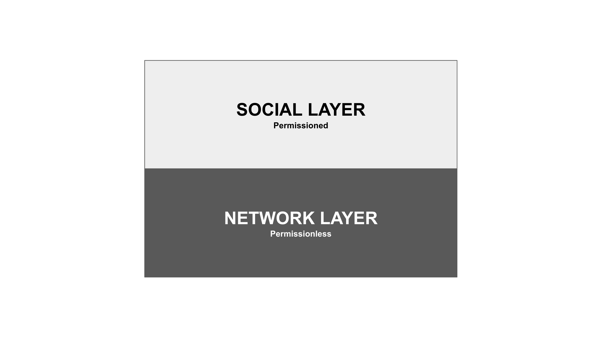
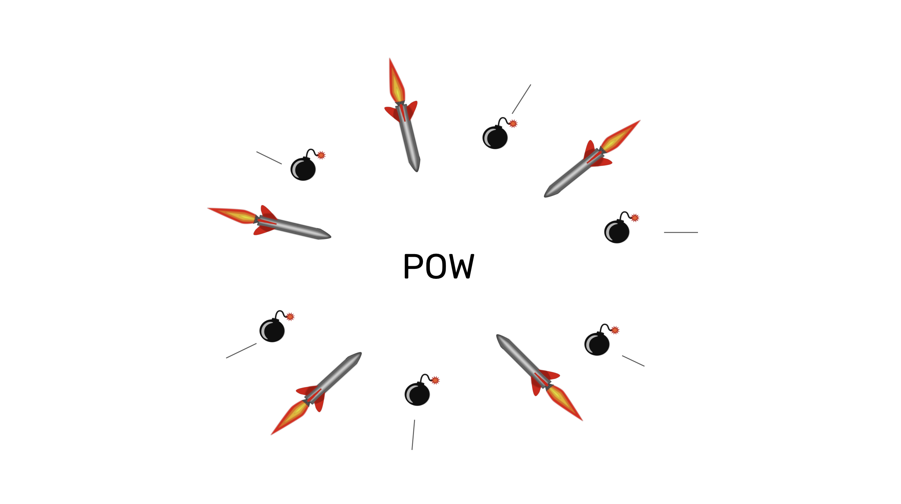

---
**You can listen to or watch this video here:**

<iframe width="560" height="315" src="https://www.youtube.com/embed/il2VjzynBVQ" title="YouTube video player" frameborder="0" allow="accelerometer; autoplay; clipboard-write; encrypted-media; gyroscope; picture-in-picture; web-share" allowfullscreen></iframe>

---

In the previous class, 22, we explained that, for various reasons, networks that are not proof of work (POW) are less secure. 

Blockchains are the ones that seal the batches with POW hashes because they offer all the security guarantees of true decentralization.

In this class, 23, we will explain why this true decentralization is enabled by the security model of POW, how the social layer is not a risk, why POW ungovernance is the natural way of managing the system, and that it actually works better without governance!

## To Focus on Price Is Good

Many people prefer not to talk about coin price in conferences, business circles, or crypto social groups because they consider it secondary to the mission of these decentralized systems. 

We think this is a mistake because the price of the coin is the main driver of the security model of POW blockchains, thus of their mission in the world.

POW blockchains have three key components for their security:

1. Full replication of the database to ensure decentralization, redundancy, and verification

2. Proof of work as the consensus mechanism to enable this full replication in a decentralized manner

3. The price of the token that incentivizes the participants to use it and miners to dedicate more hashpower to the network

## The Security Model of Proof of Work

Indeed, the way the model works is that more coin demand means higher prices, higher prices means mining becomes more profitable, more profitability brings more hash power to the system, more hash power means more security, and more security means more value and demand for the coin.

Note that the profitability of mining does not only depend on the payment of the block rewards in the native coin of the POW blockchain, but also on the fees paid by users so that miners process their transactions.

This competition for block space is directly related to the security of the system. The more secure it is, the more demand for that security there will be. Therefore, more transactions will be sent to the system.

For many use cases, people prefer to use more secure methods to store and transfer their savings.

## The Social Layer Is Not a Risk

The perceived wild card in this security model is the social layer. Theoretically, the social layer could coalesce and agree on nefarious changes to the protocol. 

However, Bitcoin (BTC) had the [block size war](https://www.bitstamp.net/learn/crypto-101/what-was-the-blocksize-war/) in 2017; before that, Ethereum Classic (ETC) had [The DAO war](https://ethereumclassic.org/blog/2023-01-26-ethereum-classic-course-6-ethereum-classic-is-the-original-chain) in 2016; and in 2021 ETC also had the [IOHK treasury attack](https://etherplan.com/2021/06/01/ethereum-classic-treasury-response-to-charles-hoskinson/15909/). 

In all cases, the ability to split that we spoke about in [class 17](https://ethereumclassic.org/blog/2024-03-07-etc-proof-of-work-course-17-pow-has-division-of-power-pos-does-not) of this course protected the principled side of these conflicts and BTC and ETC prevailed against the attacks. 

These cases show that, if all were to agree on a change, it would likely be because it is a generally desired upgrade, but when there is controversy, coordination is so difficult, and the natural tendency to decentralization of POW so strong, that these threats are prevented. 

## POW is Ungovernable

It is precisely because of this true and purely objective decentralization that POW is ungovernable. If no central control may be established in the system, then there cannot be control!

And, it is worth reminding that proof of work is the only signaling system that enables true decentralization. 

In social groups, if decentralization is achievable without degenerating the system, then participants will choose decentralization. 

As we said in [class 18](https://ethereumclassic.org/blog/2024-03-14-etc-proof-of-work-course-18-pow-blockchains-will-always-be-under-constant-social-attack) of this course, centralization is not a desired state of affairs. “Voting”, “Democracy”, and “Republic” are not ideal systems, they are just the least worse we can do. But in proof of work systems there cannot be tyrants, kings, constitutions, presidents, or congresses. 

It is not possible because participants will never choose that, because they are not necessary, and they will always prefer to split.

## The Inevitability of Toxicity

As we also said in class 18, in the context of ungovernance, there are no arbiters or authorities that impose order. The factions must fight for their desired outcomes. 

Therefore, it is impossible to have “civilized debates”. 

All those who criticize “toxicity” make a mistake. Toxicity and maximalism are actually rational game-theoretical and evolutionarily stable behaviors in decentralized systems. 

If toxicity is absent during periods of peace, and the factions seem to dissolve, it is not because they failed. It is because they were temporarily not needed. But when new threats emerge, which is inevitable, then, the toxic maximalists will re-emerge as well and will be welcomed as heroes again.

## The System Actually Works Better Without Governance

Whenever people who could have a decentralized system opt for the centralized one, even knowing their risks, is because it is significantly better or more convenient.

For example, payments with cash are more private and trust minimized than paying with electronic methods. However, [only 12% of in-store transactions](https://capitaloneshopping.com/research/cash-vs-credit-card-spending-statistics/) are paid in cash in the United States.

But when a decentralized system as Bitcoin or ETC is better than any centralized system, then there are little incentives to sacrifice security for convenience.

As long as the premium for safety and security is higher than the convenience and efficiency of centralization, and as long as people have the freedom to opt due to true decentralization, then governance, which is another word for centralization, will not be the choice of users.

---

**Thank you for reading this article!**

To learn more about ETC please go to: https://ethereumclassic.org
