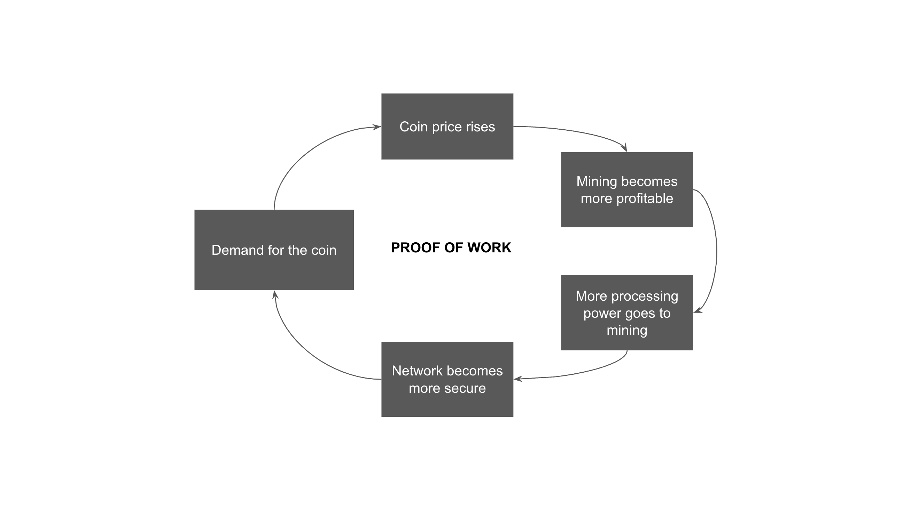
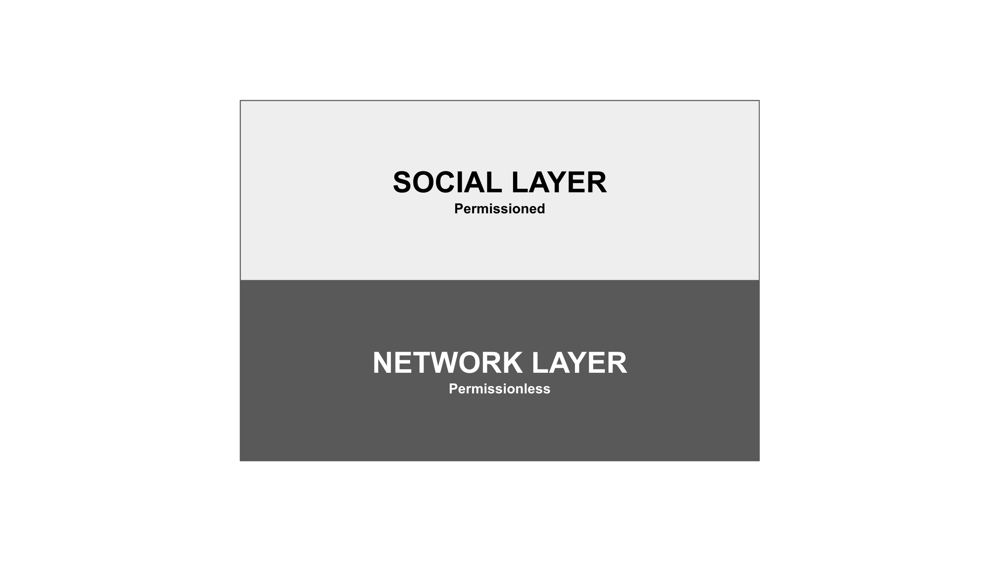
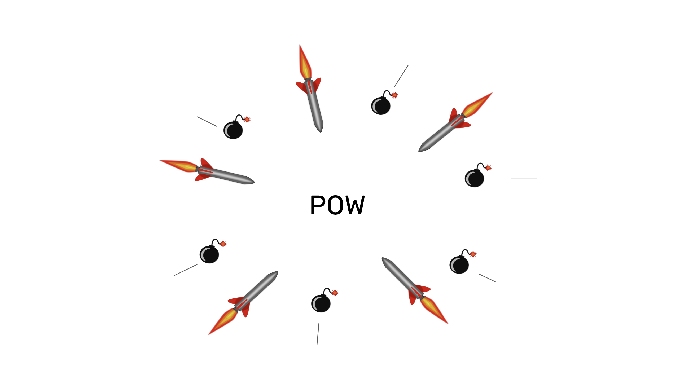

---
**由此收听或观看本期内容:**

<iframe width="560" height="315" src="https://www.youtube.com/embed/il2VjzynBVQ" title="YouTube video player" frameborder="0" allow="accelerometer; autoplay; clipboard-write; encrypted-media; gyroscope; picture-in-picture; web-share" allowfullscreen></iframe>

---

上一堂课，第22课，我们解释了，出于各种原因，不采用工作量证明（POW）的网络安全性较低。

区块链通过使用POW哈希来封存批次，因为它们提供了真正去中心化的所有安全保证。

在本节课中，第23课，我们将解释为什么真正的去中心化是由POW的安全模型实现的，社会层不构成风险的原因，为什么POW的非治理是管理系统的自然方式，并且实际上在没有治理的情况下运行更加高效！

## 关注价格是有益的

许多人在会议、商业圈或加密社交群体中不愿谈论货币价格，因为他们认为这次谈论次要于这些去中心化系统的使命。

我们认为这是一个错误，因为货币价格是POW区块链安全模型的主要驱动因素，从而也是它们在世界上使命的主要驱动因素。

POW区块链的安全性有三个关键组成部分：

1. 数据库的完全复制，以确保去中心化、冗余和验证

2. 作为共识机制的工作量证明，以分散方式实现这种完全复制

3. 令牌价格，激励参与者使用它并促使矿工将更多的哈希算力投入到网络中

## 工作量证明的安全模型

事实上，这种模型的工作方式是，更多的货币需求意味着更高的价格，更高的价格意味着挖矿变得更加有利可图，更高的盈利能力带来更多的哈希算力到系统中，更多的哈希算力意味着更多的安全性，而更多的安全性则意味着对货币的更高价值和需求。

需要注意的是，挖矿的盈利性不仅取决于以POW区块链的原生货币支付的区块奖励，还取决于用户支付的交易费用，以便矿工处理他们的交易。

这种对区块空间的竞争直接关系到系统的安全性。系统越安全，对该安全性的需求就越大。因此，会有更多的交易发送到系统中。

对于许多用例，人们更愿意使用更安全的方法来存储和转移他们的储蓄。

## 社会层不构成风险

这种安全模型中被认为是不稳定因素的是社会层。从理论上讲，社会层可能会团结起来，并就对协议的恶意更改达成一致。

然而，比特币（BTC）在2017年有过[区块大小战争](https://www.bitstamp.net/learn/crypto-101/what-was-the-blocksize-war/)；在此之前，以太经典（ETC）在2016年有过[DAO之战](https://ethereumclassic.org/blog/2023-01-26-ethereum-classic-course-6-ethereum-classic-is-the-original-chain)；在2021年，ETC还经历了[IOHK财政攻击](https://etherplan.com/2021/06/01/ethereum-classic-treasury-response-to-charles-hoskinson/15909/)。

在所有情况下，我们在本课程的[第17课](https://ethereumclassic.org/blog/2024-03-07-etc-proof-of-work-course-17-pow-has-division-of-power-pos-does-not)中谈到的分裂能力保护了这些冲突的原则性一面，BTC和ETC在这些攻击中取得了胜利。

这些案例表明，如果所有人都同意进行变更，那么这可能是因为这是一个普遍希望的升级，但当存在争议时，协调是如此困难，POW去中心化的自然倾向如此强烈，以至于这些威胁被阻止。

## POW是无法治理的

正是因为POW具有真正和纯粹客观的去中心化，所以它是无法治理的。如果系统中没有中央控制，那么就不可能有控制！

值得提醒的是，工作量证明是唯一能实现真正去中心化的信号系统。

在社会群体中，如果可以实现去中心化而不会破坏系统，那么参与者将选择去中心化。

正如我们在本课程的[第18课](https://ethereumclassic.org/blog/2024-03-14-etc-proof-of-work-course-18-pow-blockchains-will-always-be-under-constant-social-attack)中所说的，集中是不可取的状态。“投票”、“民主”和“共和国”并非是理想的系统，它们只是我们能做到的最不坏的选择。但在工作量证明系统中，不可能有暴君、国王、宪法、总统或国会。

这是不可能的，因为参与者永远不会选择那样做，因为它们是不必要的，并且他们总是更愿意分裂。

## 毒性的必然性

正如我们在第18课中所说，在非治理的情况下，没有仲裁者或当局

可以强加秩序。各派别必须为他们期望的结果而战斗。

因此，不可能有“文明的辩论”。

所有批评“毒性”的人都犯了一个错误。毒性和极端主义实际上是理性的、博弈论的和在去中心化系统中具有进化稳定性的行为。

如果在和平时期缺乏毒性，并且各派别似乎分裂，这并不是因为它们失败了。而是因为它们暂时不需要。但当新的威胁出现，这是不可避免的，那么，毒性极端主义者也将重新出现，并再次被视为英雄。

## 没有治理的系统实际上运行得更好

每当可能选择去中心化系统的人选择集中化系统，即使知道其风险时，这是因为后者显著更好或更方便。

例如，现金支付比电子支付更具隐私性和最小信任，但是在美国，[只有12%的线下交易](https://capitaloneshopping.com/research/cash-vs-credit-card-spending-statistics/)使用现金支付。

但当比特币或ETC等去中心化系统比任何集中化系统更好时，人们几乎没有动力为了方便而牺牲安全性。

只要安全性的溢价高于集中化的便利性和效率，并且人们由于真正的去中心化而有选择的自由，那么治理，也就是集中化的另一种说法，就不会成为用户的选择。

---

**感谢您阅读本文！**

要了解更多关于ETC的信息，请访问：https://ethereumclassic.org
