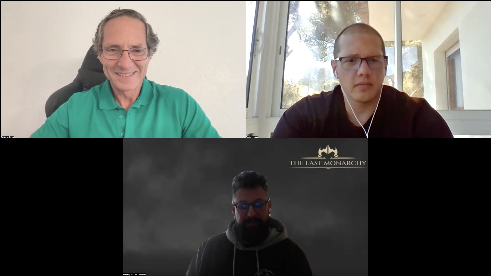

---
**由此收听或观看本次采访:**

<iframe width="560" height="315" src="https://www.youtube.com/embed/TmlYqhuS_j4" title="YouTube video player" frameborder="0" allow="accelerometer; autoplay; clipboard-write; encrypted-media; gyroscope; picture-in-picture; web-share" allowfullscreen></iframe>

---

ETC生态系统聚焦：《最后的君主》

在这篇ETC生态系统聚焦中，我们将重点介绍游戏《[最后的君主](https://thelastmonarchy.io/)》背后的团队。

我们与《最后的君主》的联合创始人Dominik Jurada和Sandro Licul进行了以下讨论：

- 《最后的君主》是什么？
- 背后的团队是谁？
- 为什么选择使用ETC？
- 它在ETC上的两个后端功能：NFT和治理代币
- 它将在何时推出，以及支持哪些平台？

Sandro做了一个关于团队和游戏的简短介绍，我相信你会喜欢的！

我们要感谢Garalo，他是一位活跃的ETC社区成员，为我们介绍了这个项目。

---

**感谢您阅读本文！**

要了解更多关于ETC的信息，请访问：https://ethereumclassic.org
