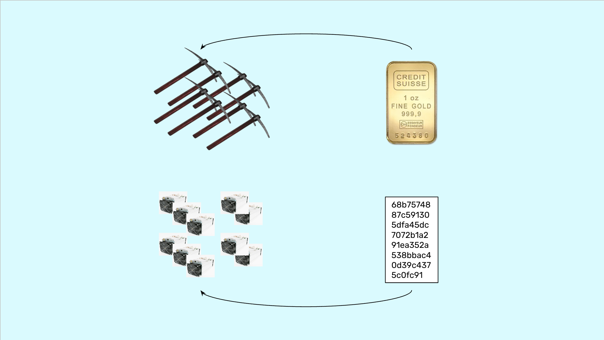
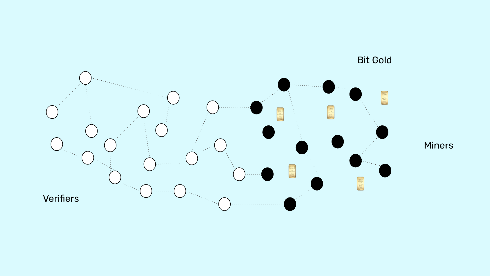

---
**You can listen to or watch this video here:**

<iframe width="560" height="315" src="https://www.youtube.com/embed/08BocPBQO98" title="YouTube video player" frameborder="0" allow="accelerometer; autoplay; clipboard-write; encrypted-media; gyroscope; picture-in-picture; web-share" allowfullscreen></iframe>

---

The idea of integrating Bit Gold into Ethereum Classic (ETC) stems from some perceived lingering risks that still hang over proof of work blockchains.

Bit Gold solves all of these risks.

The risks are:

1. Possible monetary policy changes by the network ecosystems.

2. Whether fees will pay for the security budgets.

3. Whether the native coins will always be used to pay for transaction fees.

In this post we will explain the threat of monetary policy changes and how Bit Gold fixes it. 

In future posts we will explain the other two risks.

## What Is Bit Gold?

The idea of Bit Gold was born in early 1998 when Nick Szabo, a blockchain pioneer, realized that computing proof of work could be used to create an analogy of gold but in cyberspace. 

If computers can do a lot of work, spending a lot of energy, to create a cryptographic stamp or hash, and that hash is proof that the work was done, then the hash is similar to an ounce of gold but in cyberspace.

If we think about it, gold is very difficult to extract from nature. This is why it is scarce and valuable as a monetary asset. 

If this is the case, then an ounce of gold is a proof that gold miners in the real world did a lot of work to extract it.

Similarly, proof of work hashes are scarce and very difficult to produce, hence the analogy with gold in the real world.

This is why these computer hashes are called “Bit Gold”.

## Why Are Bitcoin and ETC Not Bit Gold?

However, the idea of Bit Gold was never implemented for several reasons.

The first reason was that each proof of work hash is not equal to the other. This means that they are not fungible. This is because as time passes by computer technology evolves and becomes more efficient, thus older Bit Gold hashes may have used less computer power, and newer ones much more.

Inversely, older Bit Gold hashes may acquire more value because of their history, and newer ones may be less valuable subjectively in the market.

For these reasons, Bit Gold needed a market inside the blockchain for users to be able to price them and find out their relative values.

But when Bitcoin (BTC) was invented in 2009, the technology for decentralized exchanges did not exist yet. And when ETC was created it was launched using the same design as BTC.

## The Coins in Bitcoin and ETC Are Community Fiat Money

The idea of the original design of Bit Gold was that the proof of work hashes would be grouped into bundles of equal value so they would become standardized, similar to gold bars in the real world.

Then, these Bit Gold bundles would be used to issue cryptocurrencies backed by the Bit Gold.

This is the design in Bitcoin and ETC but much simplified.

Bitcoin and ETC obtain the block hashes created by means of proof of work from the miners, and then they issue artificially created coins called “BTC” or “ETC” but they are just tokens printed to pay for the miner’s work. They are not the actual Bit Gold.

This is why I call the coins in Bitcoin and ETC “community fiat money”. The Bit Gold hashes are actually buried in the blockchains in the form of block hashes.

## The Monetary Policy Is Only a Software Parameter

The reason I use the term “community fiat money” is because the monetary policies in Bitcoin and ETC are rules established by the blockchain communities. Similar to how monetary policies are established by the government.

These monetary rules were encoded in their protocols in the form of software parameters.

For example, in Bitcoin the parameters were:

“Print 50 BTC per block and credit it to the miners account. And, every 210,000 blocks, reduce that payment by 50%.”

In ETC the policy was:

“Print 5 ETC per block and credit it to the miner’s account. And, every 5,000,000 blocks, reduce that payment by 20%.”

## Therefore, It Could Be Changed

The point of pointing out the fact that BTC and ETC supplies are set just by software is that the creation of the coins is a matter of a trivial software change, not of brute force using energy as are the block hashes.

This does not mean that actually implementing these software changes would be easy. It will certainly not be, and we even [note](https://ethereumclassic.org/blog/2023-03-02-ethereum-classic-course-11-ethereum-classic-social-and-physical-layer-security) to our readers that there are barriers in the social layers of these systems to implementing bad changes, such as modifications to their monetary policies.

However, the idea that it may happen is not far fetched either. Ethereum changed its monetary policy 6 times since inception and several of these occurred when it was a proof of work blockchain.

Ethereum Classic changed its monetary policy once in 2017 after the separation crisis from Ethereum. 

## However, Bit Gold is Perpetual Digital Gold

So, the permanent solution to this lingering risk is to transform ETC into a Bit Gold blockchain.

By producing block hashes, miners would perpetually be producing digital gold, just like gold miners in the real world constantly produce more gold every year and have been doing this for 6,000 years.

Indeed, the ratio of gold production to the global stock of gold is around 1.7%. This means that gold has a dilution rate, sometimes called inflation rate, of 1.7% per year.

It would be very probable that a perpetual mechanism that would create Bit Gold in ETC would also settle around these ratios.

The important thing, is that no possibility of changing the monetary policy would exist because, with Bit Gold, ETC would stop depending on a software parameter for its monetary supply, but exclusively on the physical work done by ETC miners.

---

**Thank you for reading this article!**

To learn more about ETC please go to: https://ethereumclassic.org
