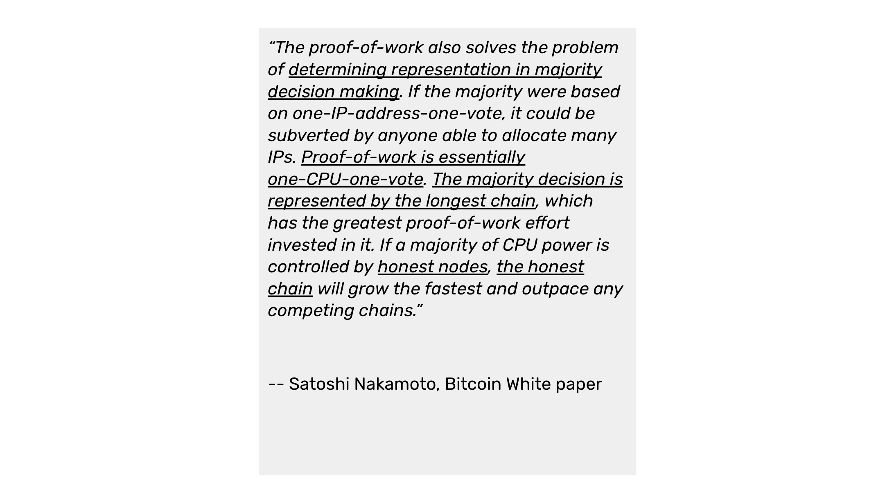
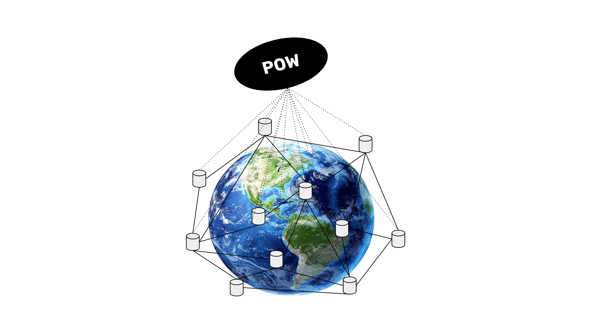

---
**You can listen to or watch this video here:**

<iframe width="560" height="315" src="https://www.youtube.com/embed/l-DxYeZ7L5I" title="YouTube video player" frameborder="0" allow="accelerometer; autoplay; clipboard-write; encrypted-media; gyroscope; picture-in-picture; web-share" allowfullscreen></iframe>

---

In the previous class, 23, we explained why true decentralization is enabled by the security model of proof of work (POW) consensus, how the social layer is not a risk, why POW ungovernance is the natural way of managing the system, and that it actually works better without governance!

Speaking of “ungovernance” and “governance”, in this class, 24, we will explain that there is a misconception in POW ecosystems that says that the POW process, or better named Nakamoto Consensus, is a voting mechanism.

This can’t be further from the truth. POW is really a competition, but not a voting mechanism. In this class we will analyze and explain these differences.

## Romantic “Democracy” Language In the Bitcoin White Paper

Unfortunately, Satoshi Nakamoto introduced romantic “democracy” like language in the Bitcoin white paper and that has confused many idealists in the blockchain industry who think that blockchains are ethical communities, and that these communities should make decisions about the protocol based on democratic methods.

It was clearly a mistake by Mr. Nakamoto to introduce such language. He was really trying to explain why proof of work avoided the problem of sockpuppet nodes taking over the network when voting was necessary in other kinds of systems.

POW actually does not solve the sockpuppet problem either! 

In POW it is just mere hashpower that determines which is the next block, but it is not known who owns that hashpower. In other words, that hashpower could be controlled by a single attacker. And, it is even not known today how many individual miners are behind the mining pools. 

So, even through POW it couldn’t be determined who are the majority and what is their true vote.

## Proof of Work Is Savage Competition

What we explained in the previous section means that POW IS NOT VOTING NOR A DEMOCRACY. 

POW is truly savage competition and survival of the fittest within a very civilized and strict method imposed by cryptography.

Miners around the world just plug as many machines as they can to as cheap as possible energy sources so they can achieve the highest efficiency possible to try to outrun and outearn the other miners in the world.

Then, through the POW protocol, they produce as many hashes as possible, and when one of them hits the target difficulty, they immediately send the block to the rest of the network for verifications and to receive the block reward.

Note, that the above means that the “rest of the network” is not even involved in the supposed voting process, therefore if it were such a mechanism, then all these nodes would actually be left out of the supposed political system!

POW, hence, is like a 100 meter sprint. When all the men in the race sprint to the finish line, whoever got there first won and will get the prize. The runners did not actually “vote” who would win. And, the result was determined by the extreme minority of one single winner.

## Voting Is a Conflict Resolution Device

In truth, voting is a social conflict resolution device, not even a good decision making system. 

In nature, animals resolve conflict to prevent constant fighting between themselves by various methods. These may range from comparing body size, to howling contests, who got to a mating partner first, or marking territory with urine. All these methods avoid the excess costs of violence, but none of them are “voting”.

Similarly, to avoid constant violence between the parties, voting in human societies is a method to force the parties to accept results even if they don’t like them, and even if the result is a grossly bad decisions.

As an example, imagine voting who will fly the plane in your next flight.

POW is pure merit and free adoption, thus purely voluntary. 

In POW, nobody is forced to anything just because some majority decided it. Indeed, nodes can even split from the network at will as we explained [in class 17](https://ethereumclassic.org/blog/2024-03-07-etc-proof-of-work-course-17-pow-has-division-of-power-pos-does-not) of this course.

## Voting Submits the Minority

Simplistic voting mechanisms that, for example, resolve issues by simple majority are actually submission methods. The minorities must submit to what the majorities decide no matter what are the consequences.

This is why the “Republic” was invented to avoid the tyranny of the majorities. This was even [discovered](https://en.wikipedia.org/wiki/Republic_(Plato)) in in antiquity by the Greeks 2,400 years ago!

## POW Achieves Voluntary Consensus

But, POW is even better than the Republic model because it is by mere merit and physical prowess, both absolute moral virtues, that the participants achieve voluntary consensus in the system. 

POW is so decentralized, that strangers around the world, who may even be totally antagonistic in geopolitics, are collaborating as we speak in building and verifying Bitcoin and ETC blocks and processing transactions peacefully. 

Examples of this are Ukrainian and Russian nodes and miners, and Iranian and Israeli nodes and miners.

## Therefore, POW Is Not Voting

All of the above are powerful illustrations of why the POW based Nakamoto Consensus mechanism is not a voting mechanism. It is what its name says, a violence free consensus mechanism.

It is objectively powered by physics and the natural drive of man to compete and earn rewards for winning. Nobody is submitted, and no minority has to accept any results.

Indeed, the minority is king in POW as only one miner may decide which is the next block…and the great majority happily accepts such results because we were Designed to do so.

Pure voting is a limited scope, subjective method of channeling tyranny through manipulation and coercion. This is exactly the opposite of what blockchains are designed to do.

---

**Thank you for reading this article!**

To learn more about ETC please go to: https://ethereumclassic.org
