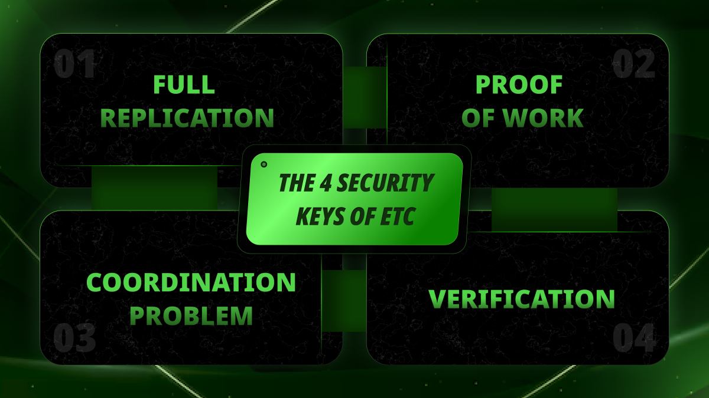

---
**由此收听或观看本期内容:**

<iframe width="560" height="315" src="https://www.youtube.com/embed/P87_N7fQ0xM" title="YouTube video player" frameborder="0" allow="accelerometer; autoplay; clipboard-write; encrypted-media; gyroscope; picture-in-picture; web-share" allowfullscreen></iframe>

---

人们通常认为以太坊经典（ETC）区块链的“安全性”指的是挖矿算力、工作量证明（POW）共识机制或加密强度。

这些确实是正确的，但我们认为应该列出和解释更完整的高级安全组件清单。

在本文中，我们将讨论安全性的含义，并解释ETC安全的四个关键因素：

- 完全复制
- 工作量证明
- 验证功能
- 协调问题

## 安全性的含义是什么？

在我们的文章“以太坊经典的安全性是什么意思？”中，我们写道：

*“因此，以太坊经典中的安全性将是这样的：它将是那些逃离全球范围内的中心化、任意没收、迫害和暴政的人的避难所。”*

在这里，“安全性”并不意味着避免自然事件、野生动物或入室盗窃。它意味着避免依赖我们数百年来一直依赖的受信任的第三方所带来的风险。

这些受信任的第三方包括银行、中央银行、政府、公司和科技公司等等。

因此，ETC中的安全性实质上意味着信任最小化，即尽量不依赖这些受信任的实体。

而且，如果信任最小化是目标，那么ETC必须尽可能地去中心化！

## 什么是完全复制？

在上世纪九十年代和二千年初，[密码朋克](https://ethereumclassic.org/blog/2022-12-29-ethereum-classic-course-2-the-cypherpunks)们关注的对象是如何实现一个点对点网络，减少对任何中央管理员的信任。

当时计算机科学面临的主要问题之一是被称为“[拜占庭将军问题](https://en.wikipedia.org/wiki/Byzantine_fault)”的问题。这个问题是说，只要网络中有1/3的节点是攻击者，他们就能破坏网络。

然而，密码朋克们已经确定，理论上完全复制的产权设计可以作为一个货币系统的基础，这个系统可以像今天的以太坊经典一样是可编程的。

当比特币于2009年推出时，这个完全复制的产权数据库的愿景终于实现了。

ETC中的完全复制，遵循比特币的安全模型，意味着系统中的所有账户、余额和智能合约在系统中所有参与计算机中都是完全相同的。

## 什么是工作量证明？

然而，让他们解决完全复制产权网络的难题花费了很长时间的原因是，他们没有一个安全的共识机制来使世界各地的完全陌生的所有者拥有的计算机，以及来自不同大陆、国家、文化和语言的所有者之间，共享信息以完全同步关于数据库的账户、余额和智能合约的信息。

解决方案是工作量证明共识机制，也被称为中本聪共识，最终提供了一个信号系统，使得节点能够在每10分钟（比特币的情况）或每13秒（ETC的情况）内完全协调，拥有比以前更高的错误容忍度。

工作量证明用密码戳封存了网络中每个新区块，作为系统中所有计算机需要知道的关于每一轮中正确区块的所有信息。

这是中本聪的[了不起的发明](https://ethereumclassic.org/blog/2023-11-16-etc-proof-of-work-course-2-what-didnt-exist-was-a-secure-consensus-mechanism)！

## 什么是验证？

然而，比特币和ETC不仅仅是复制信息。它们是账户和余额的总账（以及在ETC的情况下是智能合约），不断接收新交易来将资金从一个地方转移到另一个地方。

不仅如此，还有进行工作量证明的矿工，他们实际上会因为他们的贡献而获得这些加密货币的报酬。那么，谁来监督矿工的工作，确保他们保持诚实呢？

答案是网络中不是矿工的其余节点的角色。这些计算机被称为完整节点、经济节点，或简单地称为“节点”。

它们的作用实际上是接收并验证矿工构建的所有区块，包括区块中的每笔交易，以确保a）区块是正确构建的，需要做很多工作；b）每笔包含的交易都是正确和合法的。

这种验证功能建立了一种[权力分配](https://ethereumclassic.org/blog/2024-03-07-etc-proof-of-work-course-17-pow-has-division-of-power-pos-does-not)，保持了网络的平衡，并监督了矿工的权力，使其无法滥用系统。

## 协调问题是什么？

在ETC这样的系统中一旦上述组件就位，还有什么可能出错的呢？

那么，人们可能会变得疯狂，开始改变系统的规则！

这意味着，在计算机网络中没有规则集是不可更改的。如果所有点对点区块链（如比特币或ETC）的所有者都决定同意进行恶意变更，比如增加他们的货币供应，那么他们实际上可以做到。

但这里有很多人没有看到这种努力的全部影响。

事实上，一旦区块链真正去中心化，这意味着全球范围内的陌生人都在参与，他们的计算机也在参与。正如我们上面写的，这些陌生人生活在不同的国家和大陆，说着不同的语言，有着不同的文化信仰和宗教。要让数以千计的比特币或ETC参与者实施可能会损害系统价值并违背自身利益的恶意更改，是极其困难的。

这个困难被称为“协调问题”。

而且，使协调问题更加严重的是，这些系统中的任何节点组织[都可以随时从网络中分裂](https://ethereumclassic.org/blog/2024-03-07-etc-proof-of-work-course-17-pow-has-division-of-power-pos-does-not#the-right-to-split)。这种潜在的流动性损失极大地阻止了对这些系统进行恶意更改。

## ETC中四个安全关键的好处

- 在ETC中，[完全复制](https://ethereumclassic.org/blog/2022-12-29-ethereum-classic-course-2-the-cypherpunks)确保了信息的去中心化，使得信息很难被篡改。这种模式不仅保护系统免受攻击者和不诚实的受信任第三方的侵害，而且还能抵御自然灾害甚至核战争！

- 在ETC中，[工作量证明](https://ethereumclassic.org/blog/2023-11-16-etc-proof-of-work-course-2-what-didnt-exist-was-a-secure-consensus-mechanism)确保了网络中的所有参与者可以以完全去中心化的方式，每13秒进行一次同步，拥有完全相同的信息状态。

- 在ETC中，[验证功能](https://ethereumclassic.org/blog/2024-03-07-etc-proof-of-work-course-17-pow-has-division-of-power-pos-does-not)确保了工作量证明矿工的工作是正确的，并对其权力进行了监督，使其无法滥用系统。

- 在以太坊经典中，[协调问题](https://ethereumclassic.org/blog/2024-03-07-etc-proof-of-work-course-17-pow-has-division-of-power-pos-does-not#the-right-to-split)解决了潜在的恶意变更规则的问题，因为很难让全球范围内的所有参与者同意对系统价值有损害的更改。这一难度得到了增强，因为在ETC和比特币等区块链中，任何一组参与者都可以在他们愿意的时候分裂并形成他们自己的网络。

---

感谢阅读本文！

要了解更多关于ETC的信息，请访问：https://ethereumclassic.org
