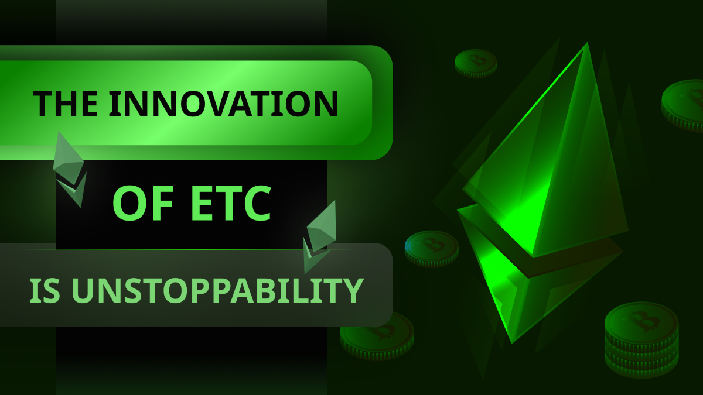

---
**由此收听或观看本期内容:**

<iframe width="560" height="315" src="https://www.youtube.com/embed/eaNNOLm3zPM" title="YouTube video player" frameborder="0" allow="accelerometer; autoplay; clipboard-write; encrypted-media; gyroscope; picture-in-picture; web-share" allowfullscreen></iframe>

---

在上一课中，我们解释了工作量证明（POW）并不是一种投票机制，而是一种争夺每个区块奖励的竞争。我们澄清了主观系统如“投票”是有限的，并且容易被滥用，但客观的POW挖矿和共识更像是一种精英制度和自愿参与。

在本节课中，我们将解释POW的一个基本好处，以及如何应用于以太经典（ETC），产生了这个系统在发明时的关键创新：应用程序的不可阻挡性。

## 由工作量证明带来的创新

区块链行业的新发明是POW和智能合约。没有其他了。

POW是一个革命性的技术，它使比特币的创新得以实现，即可靠的网络货币，以及以太经典的创新，即应用程序的不可阻挡性。

正如我们在这门课程的[第2课](https://ethereumclassic.org/blog/2023-11-16-etc-proof-of-work-course-2-what-didnt-exist-was-a-secure-consensus-mechanism)中所写的那样，工作量证明的惊人作用是通过成为一个信号系统，以完全去中心化的方式使节点网络保持同步。

POW提供了任何计算机所需的信息，以知道每轮中哪个是正确的区块，并允许它们自愿地、无需任何中心化管理者或系统管理员的审查来加入和离开网络。

## 比特币的无需许可和可靠的网络货币

比特币为世界带来的新东西，由工作量证明共识机制支撑，是我们在前一节中提到的无需许可和可靠的网络货币。

加密朋克们已经寻找了很长时间一种方法来产生信任最小化、稀缺且不可伪造的货币。其中一个问题是他们的尝试缺乏一个安全的点对点网络，该网络应该具有比传统[拜占庭错误](https://en.wikipedia.org/wiki/Byzantine_fault)网络更高的安全性保证。

工作量证明最终提供了这样一个信号系统，使网络安全，并且随着它的出现，比特币可以提供一个具有账户和余额的分类账，支持固定的货币政策，以产生类似于黄金的东西，但在互联网上，可以通过通信渠道进行转移。

## 以太经典的无需许可可编程性

然而，尽管比特币是一个了不起的发展，但它无法支持智能合约，而智能合约实际上是[Satoshi Nakamoto](https://ethereumclassic.org/blog/2023-12-14-etc-proof-of-work-course-6-etc-is-btc-philosophy-with-eth-technology)愿景的一部分。

由于以太经典包含了比特币的工作量证明和具有可靠货币的分类账的创新，并且支持智能合约，因此ETC的创新在于将可编程性添加到无需许可和可靠的网络货币中。

在以太经典内部具有智能合约的情况下，去中心化应用比任何其他类型的应用程序（无论是在任何其他类型的网络、数据中心还是云服务中运行）都更加安全。

## 以太经典中的应用是不可阻挡的

因为ETC本质上是比特币，但具有智能合约，这意味着它的账户、余额和dapp与比特币一样不可变和无需许可。

可以说，与比特币相比，ETC更加信任最小化，因为要使用比特币，应用程序必须在其高度安全的内部环境之外执行程序。当然，它们会失去可组合性。

ETC更安全，因为应用程序是在其高度安全的POW环境中托管和执行的。

这意味着ETC中的应用是不可阻挡的，因此社区使用“法律即代码”这个口号来描述其哲学。

## 可组合性的额外安全性

在上一节中，我们提到比特币中的应用程序失去了可组合性，因为它们是托管在外部服务器上的，在独立的系统中。

ETC中的“可组合性”意味着，因为所有的去中心化应用程序都在同一个数据库和计算环境中，所以复杂的多应用程序交易可以同时发送和执行在网络中。

在分开的系统中，多应用程序交易必须分别输入每个网络，并且无法同时执行，因为各组件不知道其他组件的状态。

在像ETC这样的可组合系统中，交易更加安全，因为所有的dapps都受到同一POW环境的保护，并且组件之间没有延迟或延迟，因此执行的确定性和最终性要高得多。

在不可组合的系统中，这些确定性是无法复制的。

## 以太经典中的应用是世界上最安全的

因此，由于ETC是可编程的比特币，所以我们在这门课程的第16课中所写的就得到了证实：

*“总之，以太经典是世界上最安全的应用程序所存在的环境，因为它是一个工作量证明的区块链，因此是真正的去中心化；它有一个固定的货币政策，因此是可靠的货币；它是可编程的，因此比其他替代品更加多样化和安全。*

*除了这些特质之外，ETC是一个完全复制的区块链，这增加了它的安全性；而且它是可组合的，这降低了风险和结算成本；而且它是世界上最大的具有这种结构的区块链！*

*这些特质在同一个集成系统中提供了最高水平的去中心化，因此最小化信任，因此对于任何托管在其中的应用程序来说，都提供了最高水平的安全性。”*

---

**感谢您阅读本文！**

要了解更多关于ETC的信息，请访问：https://ethereumclassic.org
