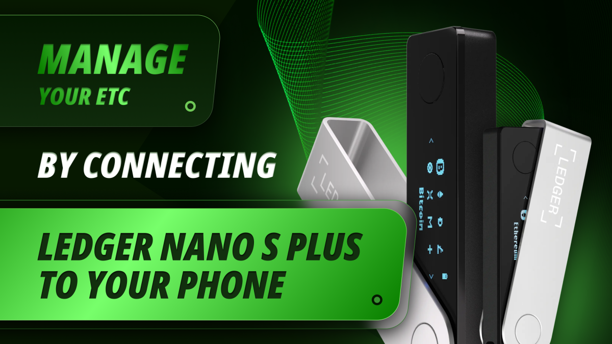
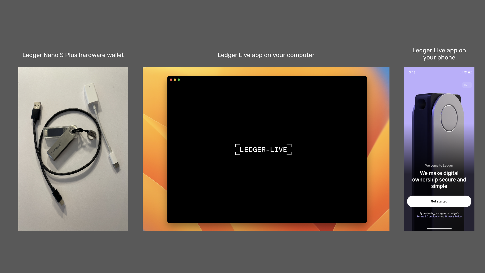
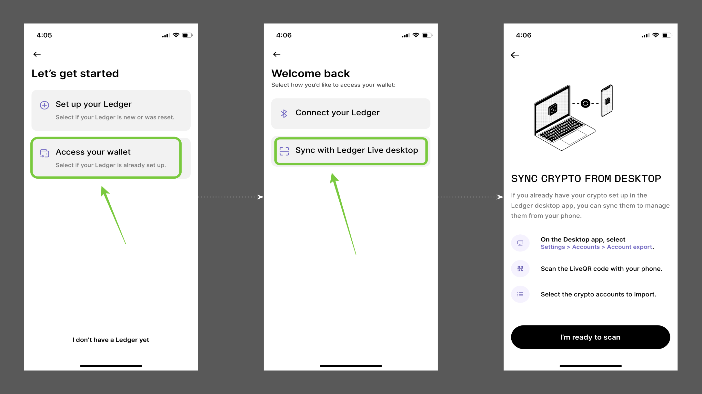
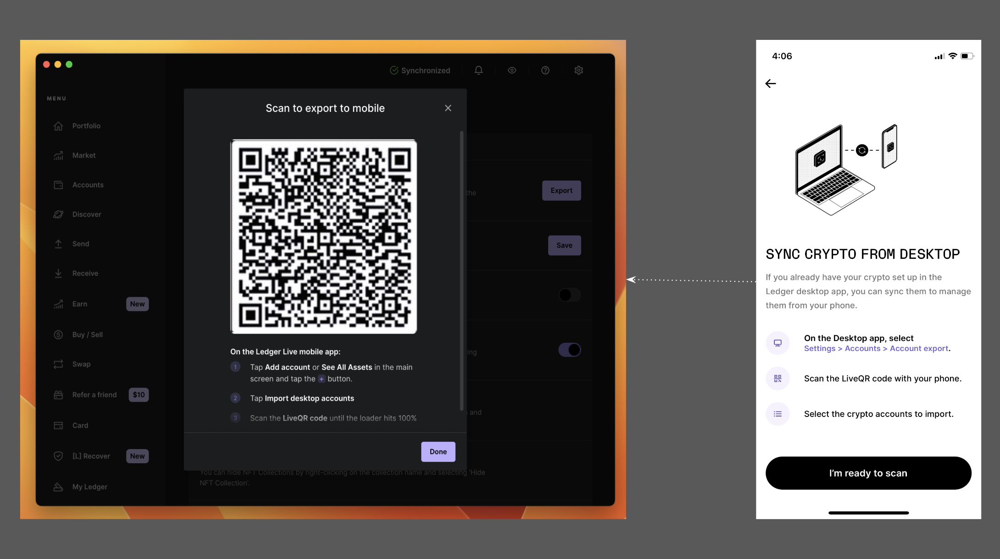
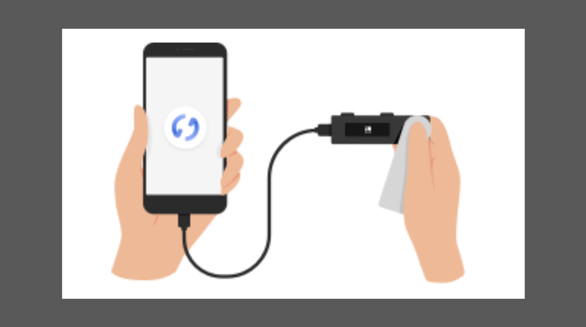

---
**You can listen to or watch this video here:**

<iframe width="560" height="315" src="https://www.youtube.com/embed/qxp5Q0KPF-0" title="YouTube video player" frameborder="0" allow="accelerometer; autoplay; clipboard-write; encrypted-media; gyroscope; picture-in-picture; web-share" allowfullscreen></iframe>

---

In this post we will explain how to manage your ETC by connecting your Ledger Nano S Plus to your phone.

There is a limited association of your Ledger Live app on your computer with the iPhone platform and a full connection of the hardware wallet device with Android phones. We will explain both.

To learn where to get the Ledger Nano S Plus hardware wallet and to set it up on your computer, please see our guide in the following link:

“Using the Ledger Nano S Plus With Ethereum Classic”

https://ethereumclassic.org/blog/2024-02-27-using-the-ledger-nano-s-plus-with-ethereum-classic

## The Ledger Hardware and Software Components

Ledger Nano S Plus is a hardware wallet, so to use it with your phone you need to have your Ledger Nano S Plus device, the Ledger Live app on your computer as we explained in a [previous guide](https://ethereumclassic.org/blog/2024-02-27-using-the-ledger-nano-s-plus-with-ethereum-classic), and the Ledger Live app on your phone.

In this tutorial we will explain how to manage your ETC by connecting your Ledger Nano S Plus to your phone.

We will show the parallel actions between your devices where appropriate.

## Associate Ledger Live With iPhone

### 1. Download Ledger Live on Your iPhone

To manage your ETC with your iPhone, you will need your Ledger Nano S Plus hardware device and your Ledger Live app on your computer. For now it's not possible to connect a Ledger Nano S Plus to an iPhone directly, but it is possible to associate your Ledger Live apps on your computer and iPhone.

To begin, download Ledger Live on your iPhone and open it. Then, select “Access your wallet”, and in the next screen select “Synch with Ledger Live desktop”.  After these steps, see the instructions in the following screen. 

### 2. Associate Ledger Live Desktop to Your iPhone

To associate your Ledger Live desktop to your iPhone, open it and go to “Settings”, then “Accounts”, and then to “Accounts export”. In the next screen you will see a dynamic QR code.

On your Ledger Live on your iPhone, click on the “I’m ready to scan” button. Then, scan the dynamic QR code on your computer screen.

### 3. Select the Accounts You Wish to Synchronize

After scanning, in the next screen on your phone, you will see that Ledger Live will give you the option to select which accounts you want to synchronize with your iPhone.

Select the ETC accounts you wish to monitor on your iPhone and then press “Import”.

### 4. You Are All Set Up!

After you press “Import” in the previous step, your desktop and your iPhone Ledger Live apps will synchronize and you will be taken to your home screen on your Ledger Live on your iPhone where you will see your ETC balance.

Congratulations! You are now set up to monitor your ETC accounts on your iPhone using your Ledger Nano S Plus!

## Associate Ledger Nano S Plus With Android

### 1. Android Connection Set Up

To connect your Ledger Nano S Plus to your Android phone, you do not need to have Ledger Live on a desktop. You can connect your device directly to your phone.

To begin, download the Ledger Live app on your Android phone. Then, connect the OTG cable that came with your device to your phone.

### 2. Follow the Ledger Instructions

1. Open and unlock Ledger Live on your smartphone.
2. Connect your Ledger device to your smartphone using the appropriate OTG cable.
3. Unlock your Ledger device.
4. That's it! Your Ledger Nano S Plus is now connected to your Android phone.

**What You Can Do**

Once you have your Android phone connected to your Ledger Nano S Plus you can:

- Install and uninstall apps in My Ledger.
- Add accounts managed by your Ledger device.
- Receive ETC.
- Send ETC.

You can find the above instruction on the Ledger website on the following link:

https://support.ledger.com/hc/en-us/articles/360021488913-Connect-Ledger-to-your-phone?docs=true

---

**Thank you for reading this article!**

To learn more about ETC please go to: https://ethereumclassic.org
