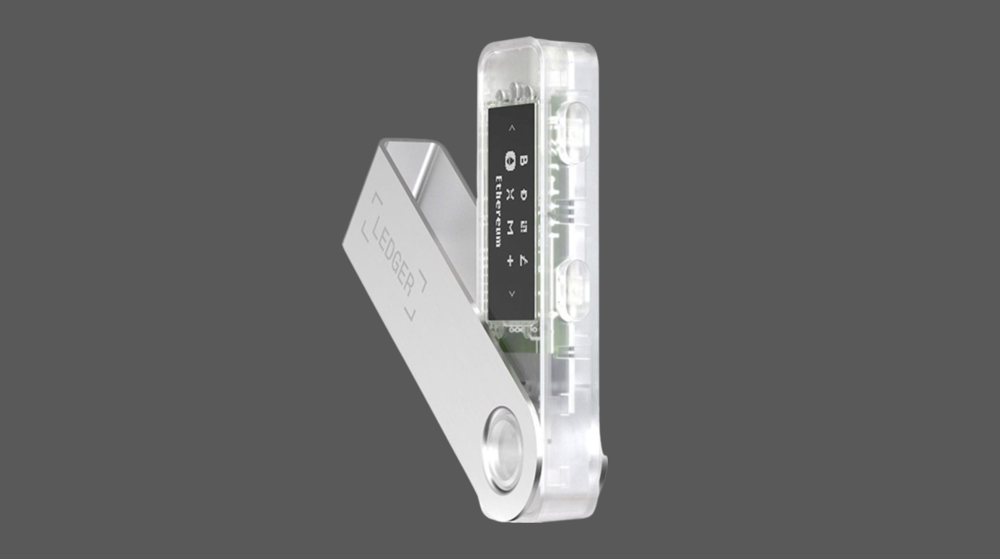

---
**由此收听或观看本期内容:**

<iframe width="560" height="315" src="https://www.youtube.com/embed/qxp5Q0KPF-0" title="YouTube video player" frameborder="0" allow="accelerometer; autoplay; clipboard-write; encrypted-media; gyroscope; picture-in-picture; web-share" allowfullscreen></iframe>

---

在这篇文章中，我们将解释如何通过连接您的 Ledger Nano S Plus 到您的手机来管理您的 ETC。

您的 Ledger Live 应用与 iPhone 平台有限关联，与 Android 手机的硬件钱包设备有完全连接。我们将两者都解释一下。

要了解在您的计算机上获取 Ledger Nano S Plus 硬件钱包并设置它，请查看以下链接中的我们的指南：

“使用 Ledger Nano S Plus 与 Ethereum Classic”

https://ethereumclassic.org/blog/2024-02-27-using-the-ledger-nano-s-plus-with-ethereum-classic

## Ledger 硬件和软件组件

Ledger Nano S Plus 是一个硬件钱包，因此要使用它与您的手机，您需要您的 Ledger Nano S Plus 设备，我们在之前的指南中解释过的计算机上的 Ledger Live 应用，以及您手机上的 Ledger Live 应用。

在本教程中，我们将解释如何通过连接您的 Ledger Nano S Plus 到您的手机来管理您的 ETC。

我们将在适当的时候展示您的设备之间的平行操作。

## 将 Ledger Live 与 iPhone 关联

### 1. 在您的 iPhone 上下载 Ledger Live

要使用您的 iPhone 管理您的 ETC，您需要您的 Ledger Nano S Plus 硬件设备和您计算机上的 Ledger Live 应用。目前无法直接连接 Ledger Nano S Plus 到 iPhone，但可以关联您计算机和 iPhone 上的 Ledger Live 应用。

首先，在您的 iPhone 上下载 Ledger Live 并打开它。然后，选择“访问您的钱包”，在下一个屏幕中选择“与 Ledger Live 桌面同步”。完成这些步骤后，查看以下屏幕中的说明。

### 2. 将 Ledger Live 桌面与您的 iPhone 关联

要将您的 Ledger Live 桌面与您的 iPhone 关联，打开它并转到“设置”，然后转到“帐户”，然后转到“帐户导出”。在下一个屏幕中，您将看到一个动态二维码。

在您的 iPhone 上的 Ledger Live 上，点击“我准备好扫描”按钮。然后，扫描您计算机屏幕上的动态二维码。

### 3. 选择您想要同步的帐户

扫描后，在您手机上的下一个屏幕上，您将看到 Ledger Live 将为您提供选择要与您的 iPhone 同步的帐户的选项。

选择您希望在您的 iPhone 上监视的 ETC 帐户，然后按“导入”。

### 4. 完成设置！

在上一步中按“导入”后，您的桌面和您的 iPhone 上的 Ledger Live 应用将同步，并且您将被带到您的 iPhone 上的 Ledger Live 主屏幕，您将在那里看到您的 ETC 余额。

恭喜！您现在已经设置好在您的 iPhone 上使用您的 Ledger Nano S Plus 监视您的 ETC 帐户！

## 将 Ledger Nano S Plus 与 Android 关联

### 1. Android 连接设置

要将您的 Ledger Nano S Plus 连接到您的 Android 手机，您不需要在桌面上安装 Ledger Live。您可以直接将您的设备连接到您的手机。

首先，在您的 Android 手机上下载 Ledger Live 应用。然后，将随您的设备附带的 OTG 电缆连接到您的手机上。

### 2. 按照 Ledger 的说明操作

1. 在您的智能手机上打开并解锁 Ledger Live。
2. 使用适当的 OTG 电缆将您的 Ledger 设备连接到您的智能手机。
3. 解锁您的 Ledger 设备。
4. 完成！您的 Ledger Nano S Plus 现在已连接到您的 Android 手机。

**您可以做什么**

一旦您将您的 Android 手机连接到您的 Ledger Nano S Plus，您可以：

- 在我的 Ledger 中安装和卸载应用程序。
- 添加由您的 Ledger 设备管理的帐户。
- 接收 ETC。
- 发送 ETC。

您可以在以下链接上的 Ledger 网站上找到上述说明：

https://support.ledger.com/hc/en-us/articles/360021488913-Connect-Ledger-to-your-phone?docs=true

---

**感谢您阅读本文！**

要了解更多关于 ETC 的信息，请访问：https://ethereumclassic.org
