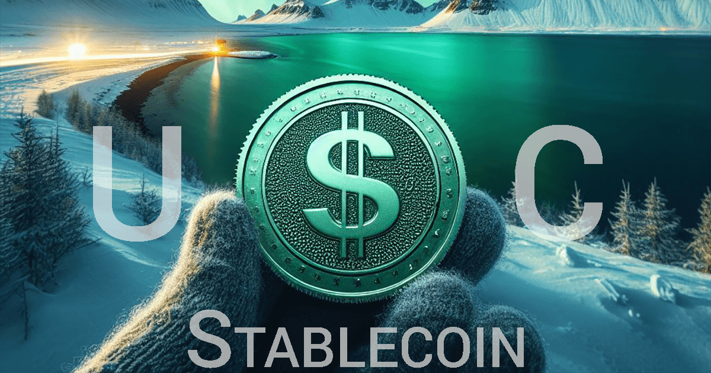
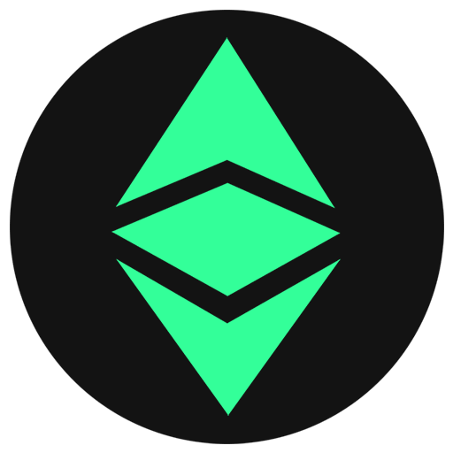

Source: [https://ethereumclassic.com/news/2024/05/14/introducing-ethereum-classic-usd-backed-usc-stablecoin/](https://ethereumclassic.com/news/2024/05/14/introducing-ethereum-classic-usd-backed-usc-stablecoin/)

### Classic USD (USC): A Regulated Stablecoin Issued on Ethereum Classic

The Ethereum Classic ecosystem welcomes the launch of its premiere USD-denominated stablecoin, [**Classic USD**](https://brale.xyz/stablecoins/USC) (ticker: [**USC**](https://brale.xyz/stablecoins/USC)). This announcement is made possible through a partnership between regulated stablecoin issuer [**Brale**](https://brale.xyz/) and the web3 development team at [**EthereumClassic.com**](https://ethereumclassic.com/). The USC stablecoin is fully backed by cash, cash equivalents, and short-term U.S. government bonds held in U.S. financial institutions. USC is always redeemable 1:1 for U.S. dollars with reserves reported daily by Brale. The USC stablecoin is a foundational component for on-chain fiat liquidity, regulated collateral, and real-time global settlement via the Ethereum Classic network.

> ###### “Brale is streamlining the regulated stablecoin issuance space and we are excited to work with them in developing our network’s native stablecoin. The Classic USD (USC) partnership establishes Ethereum Classic’s premiere regulated stablecoin. The USC digital asset is a key primitive in the Ethereum Classic DeFi product suite. Brale facilitates the issuance, redemption, and treasury management of the USC stablecoin in a licensed and regulated manner ensuring each USC token is redeemable 1:1 for U.S. dollars. This allows our team to focus on building composable DeFi protocols for the Ethereum Classic ecosystem.”Christopher Mercer EthereumClassic.com

### USC Stablecoin Specifications:

Asset Website: [**brale.xyz/stablecoins/USC**](https://brale.xyz/stablecoins/USC)
Contract Address: [**0xDE093684c796204224BC081f937aa059D903c52a**](https://etc.blockscout.com/token/0xDE093684c796204224BC081f937aa059D903c52a)
Asset Name: Classic USD
Ticker Symbol: USC
Decimals: 6
Social Assets: [**.gif**](https://raw.githubusercontent.com/white-b0x/classic-usd/main/assets/usc-logo-200x200.gif) | [**.png**](https://raw.githubusercontent.com/white-b0x/classic-usd/main/assets/usc-logo-200x200.png) | [**media kit**](https://github.com/white-b0x/classic-usd) 

### Web3 Secured by Nakamoto Consensus

As the first native stablecoin deployed on Ethereum Classic, Classic USD (USC) transactions inherit the robust security properties of the most secure decentralized smart contract platform in the world. Ethereum Classic is the largest smart contract network secured by Nakamoto Consensus, a decentralized consensus mechanism, ensuring the integrity and security of transactions by enabling network participants to collectively validate and agree upon the state of the ledger without the need for a central authority, thus fostering trust and immutability within the system.

Prior to USC, the only fiat-backed token options for the Ethereum Classic development community were bridged assets sourced from less secure EVM chains through high risk interoperable protocols. These bridging protocols are often the targets of high value cryptocurrency [hacks](https://www.ccn.com/education/crypto-hacks-2023-full-list-of-scams-and-exploits-as-millions-go-missing/) with nearly every bridging protocol becoming the victims of an exploit (e.g.: [Multichain.org](https://thedefiant.io/news/defi/fantom-foundation-to-pursue-multichain-liquidation-after-winning-default-judgment)).

The native deployment of the USC asset to Ethereum Classic combined with Brale’s daily reporting provides the regulatory integrity, consumer protection and transparency required of a flagship stablecoin in a global decentralized financial ecosystem operating on an industry leading smart contract blockchain like Ethereum Classic.

### Building around the USC Stablecoin

The regulated Classic USD (USC) digital asset is a necessary primitive component for Ethereum Classic’s decentralized financial (DeFi) ecosystem to grow. USC allows our team and the greater Ethereum Classic ecosystem to build decentralized applications that source on-chain liquidity and execute settlement from a secure and transparent [**ETC/USC**](https://v3.etcswap.org/#/swap?chain=classic&inputCurrency=ETC&outputCurrency=0xDE093684c796204224BC081f937aa059D903c52a&exactAmount=1) pair. This is Ethereum Classic’s first meaningful decentralized exchange market. Immediate use-cases for the USC token are:

*   **Arbitrage Activity:** With greater than 5% spot price volatility  a common occurrence on the ETC/USD pair, users are incentivized by lucrative financial opportunity to arbitrage the the decentralized ETC/USC pair with the much larger centralized ETC/USD markets. Due to consistently high volume and mature liquidity, the ETC/USD market is widely supported in the centralized exchange ecosystem. The ETC/USD daily volume ranges from $100M to $1B in daily volume since 2018. This metric establishes ETC/USD as one of the strongest and most liquid trading markets out of all Layer 1 or Layer 2 networks.
    
*   **Collateral:** USC can be employed as collateral for on-chain perpetuals/derivatives, lending/borrowing, and collateralized debt position (CDP) protocols. These protocols are part of the composable DeFi protocol development path for the team at EthereumClassic.com.
    
*   **Crowdfunding:** An Initial DEX offering (IDO) through the ETCswap v3 protocol involves creating a liquidity pool with specific price ranges corresponding to the project token’s initial offering price, where participants contribute funds directly into the pool and receive tokens at a predetermined price within the specified ranges in a non-custodial environment. The USC digital asset allows development projects to sell their project’s ERC-20 tokens at a fiat value that is more closely correlated with the project’s USD-denominated development expenses. This reduces the risk of loss of value due to cryptocurrency volatility in the funds raised through the project’s IDO campaign.
    
*   **Flash Loans:** Flashloans from ETCswap V3 enable users to borrow a specific amount of assets from the protocol instantly and without collateral, as long as the borrowed amount is repaid within the same transaction, empowering sophisticated DeFi strategies such as arbitrage and liquidation.
    
*   **Liquidity Mining:** USC and ETC users are incentivized to provide liquidity to decentralized exchanges like ETCswap by rewarding them with transaction fees in proportion to their contribution to the liquidity pool of an asset pair. This fosters a vibrant and liquid decentralized ecosystem where ETC network users have the ability to earn passive income on their Ethereum Classic digital assets in a non-custodial manner.
    
*   **Payments:** Global, real-time payments on a widely adopted and integrated smart contract blockchain with 14 second block times and low network fees.
    
*   **Price Oracles:** TWAP oracles from ETCswap V3 provide Time-Weighted Average Price (TWAP) data over specific intervals, ensuring accurate and reliable pricing information for decentralized finance applications, enabling efficient trading strategies and mitigating risks associated with price manipulation.
    
*   **Trading:** As the first regulated, fiat-backed stablecoin on Ethereum Classic, USC enables on-chain settlement against ETC and other native digital assets through non-custodial decentralized exchanges like ETCswap.
    
*   **Yield Farming:** Users are able to lock their Ethereum Classic crypto assets in smart contracts to provide liquidity, and in return, they receive rewards in the form of additional tokens or interest.
    

_Recommended confirmations based on_ [_ETC’s network hashrate_](https://2miners.com/etc-network-hashrate)_: 30 confirmations or ~7 minutes._

### Brale: The platform for creating stablecoins

[**Classic USD (USC)**](https://brale.xyz/stablecoins/USC) is managed by [**Brale**](https://brale.xyz/), a regulated financial institution that facilitates the issuance and settlement of asset-backed stablecoins. Through its innovative platform, Brale offers a range of services aimed at modernizing and streamlining stablecoin creation and issuance. With an emphasis on regulatory compliance and security, Brale has emerged as a trusted partner for Web3 projects seeking to realize efficiency, transparency, and open connectivity to the traditional financial ecosystem through stable digital assets.

Businesses are able move large quantities of USD through Brale with real-time settlement & low network fees.

### Acquiring the USC Stablecoin

USC is available on the [**Brale**](https://brale.xyz/stablecoins/USC) platform for direct purchase and redemption 1:1 for U.S. dollars and available on [**ETCswap**](https://v3.etcswap.org/#/swap?chain=classic&inputCurrency=ETC&outputCurrency=0xDE093684c796204224BC081f937aa059D903c52a&exactAmount=1) for trading initially against ETC. USC will be supported by additional Web3 protocols and tradeable to more assets in the coming months as composable DeFi primitive development continues at [**EthereumClassic.com**](https://ethereumclassic.com/).

**U.S. Business**

U.S. businesses in supported states are able to mint USC 1:1 with deposits of traditional USD or USDC, USDP stablecoins directly through their Brale accounts. [**Sign up**](https://app.brale.xyz/buy/signup/USC?ref=ethereumclassic.com) for a Brale account today.

**International Business**

The USC stablecoin is also available to non-U.S. parties via [**1Konto**](https://www.1konto.com/) for trading and settlement to over 60 fiat and digital currencies globally. This postions USC to be the fiat settlement assets for all business on Ethereum Classic.

### Off-chain Use Cases for the USC Stablecoin

**Rain Visa Cards**

[**Rain**](https://raincards.xyz/) enables direct spending of your USC stablecoin asset held on the Ethereum Classic through their physical and virtual cards, bill pay, and other platform features. Use your Ethereum Classic digital assets to spend at merchants globally where Visa is accepted.

This is a big value add to the proof-of-work miner base which earns +$500k/day in newly emitted ETC as reward for securing the Ethereum Classic network. This large user base can convert their ETC into the fiat-backed USC stablecoin via [**ETCswap**](https://v3.etcswap.org/#/swap?chain=classic&inputCurrency=ETC&outputCurrency=0xDE093684c796204224BC081f937aa059D903c52a&exactAmount=1) in a non-custodial manner with no centralized intermediaries. With the USC acquired, the miner can deposit into an Ethereum Classic wallet connected to their Rain card and directly pay their electricity bills –no exchange or centralized custodian account required. The very network the miners are securing is now securing their operational capital. [**Sign up**](https://use.raincards.xyz/signup?ref=ethereumclassic.com) for a Rain card today.

**Coinflow Stablecoin Payouts**

[**Coinflow**](https://coinflow.cash/) supports USC stablecoin payouts via ACH and Push-to-card. The Coinflow user experience feels like withdrawing from Venmo and or other leading web2 payment experiences. Coinflow seamlessly connects the Ethereum Classic network to the traditional financial ecosystem providing a world-class experience for the holders of the USC stablecoin.

### About Brale

[**Brale**](https://brale.xyz/) offers a user-friendly platform which enables seamless conversion between fiat currency and digital assets. With a focus on regulatory compliance, transparency, and user experience, Brale stands as a trusted partner for navigating the complexities of creating regulated stablecoins.

### About EthereumClassic.com

We are the leading blockchain company developing a subsystem of revenue generating decentralized protocols, digital assets, and complimentary product suites secured by Nakamoto Consensus on Ethereum Classic, the only proof-of-work Ethereum Virtual Machine (EVM) and largest decentralized smart contract platform.

We believe ETC is a complimentary asset to the wildly successful BTC asset on the Bitcoin network. We believe digital assets attached to the global energy markets with truly permissionless and open participation is the meaningful innovation happening around Layer 1 networks. Our development focus is around realizing ETC’s full utility to the world as the only meaningful **programmable stored-value digital asset** that is secured by the sovereign-grade Nakamoto Consensus.

**PR Contacts:**

For Brale: [media@brale.xyz](mailto:media@brale.xyz)

For EthereumClassic.com: [press@ethereumclassic.com](mailto:press@ethereumclassic.com)

---

**Thank you for reading this article!**

To learn more about ETC please go to: https://ethereumclassic.org
