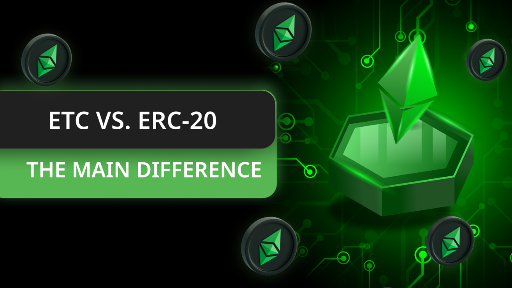
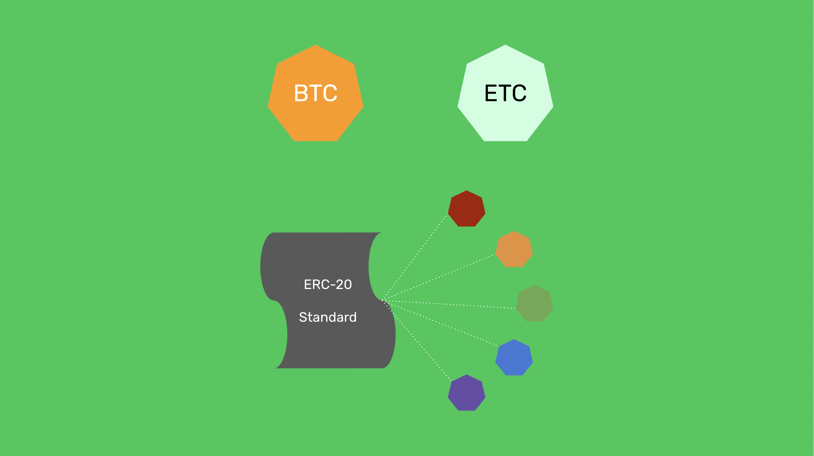

---
**由此收听或观看本期内容:**

<iframe width="560" height="315" src="https://www.youtube.com/embed/8A8ocKn7XBc" title="YouTube video player" frameborder="0" allow="accelerometer; autoplay; clipboard-write; encrypted-media; gyroscope; picture-in-picture; web-share" allowfullscreen></iframe>

---

区块链行业中一个主要的困惑是如何定义不同类型的代币。

大多数人并不知道，并非所有代币都是区块链协议的一部分，或者代币可以由任何人在可编程的区块链（如以太坊经典（ETC））中轻松创建。

在本文中，我们将通过解释以下主题来澄清这些问题：

- 什么是本地币？
- 什么是可编程的本地币？
- 什么是ERC-20代币？
- ERC-20代币的例子
- 为什么ETC在dapp中被用作包装代币
- ETC和ERC-20代币的货币政策

## 什么是本地币？

当比特币（BTC）被发明时，每当矿工创建一个区块时，比特币就会被发行。仿照比特币的例子，ETC也是以同样的方式创建的，因此BTC和ETC都可以被描述为“社区法定代币”，用于支付这些网络中矿工的工作。

有趣的是，BTC和ETC都是硬货币，因此被视为数字黄金，因为只有在矿工付出大量工作、耗费大量电力的情况下才会被发行。

这种不可伪造的稀缺性，以及BTC和ETC具有基础的经济用例，即支付区块奖励，这赋予了这两种本地币价值。

此外，像BTC和ETC这样的本地币在工作量证明（POW）区块链中用于支付交易费，这为它们增加了另一个经济用例。

## 什么是可编程的本地币？

一些区块链只是普通的账户和余额账本，仅此而已。这意味着用户唯一能做的事情就是通过向区块链发送交易并直接支付费用来将硬币从一个账户移动到另一个账户。

在ETC的情况下，它是可编程的本地币，因为用户不仅可以做上面描述的事情，而且开发人员还可以将称为智能合约的内容发送到以太坊经典区块链上，这些软件程序在存储在网络中时变成了分散的。

这些智能合约通过启用各种方式管理加密货币的应用程序，例如在去中心化交易所交易，用于购买NFT，设置具有继承规则的资产计划等，为ETC赋予了可编程性。

## 什么是ERC-20代币？

正是因为这种智能合约的可编程性，许多东西可以在以太坊经典中创建。

在这些被启用的东西中，包括使用业界采用的称为[ERC-20代币](https://ethereumclassic.org/blog/2023-06-08-ethereum-classic-course-25-what-are-erc-20-tokens)的智能合约标准创建的非本地代币。

ERC-20代币是价值单位，就像本地加密货币一样，但它们实际上是作为区块链中的应用程序创建的。它们不是本地代币，因为它们不是ETC基础协议的一部分，并且没有像支付区块奖励或交易费用这样的基础经济用例。

但是，ERC-20代币可能有价值，因为它们可能对dapps具有指定的用例，例如支付dapps的实用性或用于治理目的，在这些生态系统中，用户可以投票支持各种事情。

## ETC中的ERC-20代币的例子

在以太坊经典中，用户可以直接投资和交易ETC，也可以使用区块链来发行、购买和出售ERC-20代币。一些ERC-20代币的例子是：

**HebeToken：** $HEBE是由名为[HebeBlock](https://hebeblock.com/)的ETC开发团队发行的ERC-20代币，该团队已经构建了几个应用程序，如HebeSwap、HENS、一个钱包和ETCInscribe。

**ETCPOW：** $ETCPOW是由名为[ETCMC](https://etcmc.org/)的ETC开发团队发行的ERC-20代币，该团队已经推出了即插即用硬件节点、一个ETC挖矿池和一个去中心化交易所。

**包装的ETC：** $WETC是一种特殊类型的ERC-20代币，它接受本地代币ETC作为存款，并为用户发行所谓的包装代币，代表1：1的比例的硬币，以便在dapps中使用。

## 为什么ETC在dapps中被用作包装代币？

尽管包装代币代表它们1：1的本地硬币，但包装代币的存在是因为ERC-20代币标准是在以太坊经典和以太坊上线后才创建的。

dapps主要使用的标准是ERC-20代币标准，因此这使得在dapps内部使用每条链的本地加密货币变得困难。

为解决这个问题，使用ERC-20代币创建的包装代币被创建来代表每个网络中的本地硬币。

这就是为什么在ETC内部存在WETC与本地币ETC并行存在的原因。

除了在dapps内部的使用外，WETC还在其他区块链中发行，以代表锁定在原始链中智能合约中的ETC。

## ETC和ERC-20代币的货币政策

众所周知，ETC有一个[货币政策](https://ethereumclassic.org/blog/2023-02-09-ethereum-classic-course-8-ethereum-classics-monetary-policy)，类似于比特币。它最初以每区块5个硬币的速度发行，每500万个区块，或大约每两年，就会减少20%。这个时间表保证了在网络历史上永远只会有210,700,000个ETC被创建。

ERC-20代币可能有任何类型的货币政策，这取决于他们的开发者决定。

例如，ETCPOW被永久发行作为用户在使用其各种服务时的奖励。至于HebeToken，它有一个总共将存在的500,000,000的固定供应量，目前在撰写本文时已发行约102,000,000。

每种单位的价值实际上取决于它们的应用程序、用例、流行度以及其货币设计的可靠性。

---

**感谢您阅读本文！**

要了解更多关于ETC的信息，请访问：https://ethereumclassic.org
