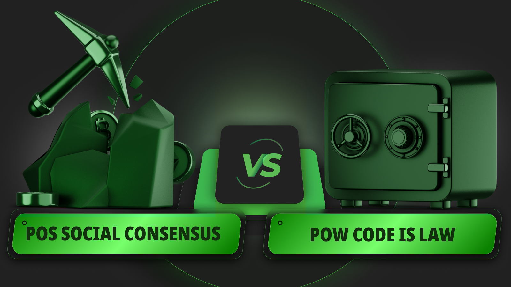
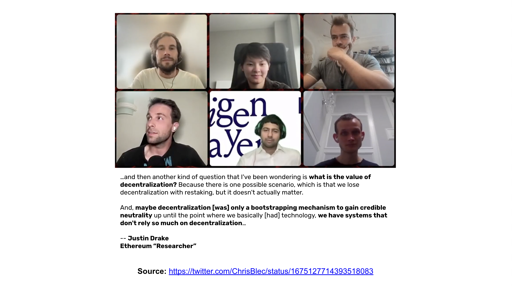
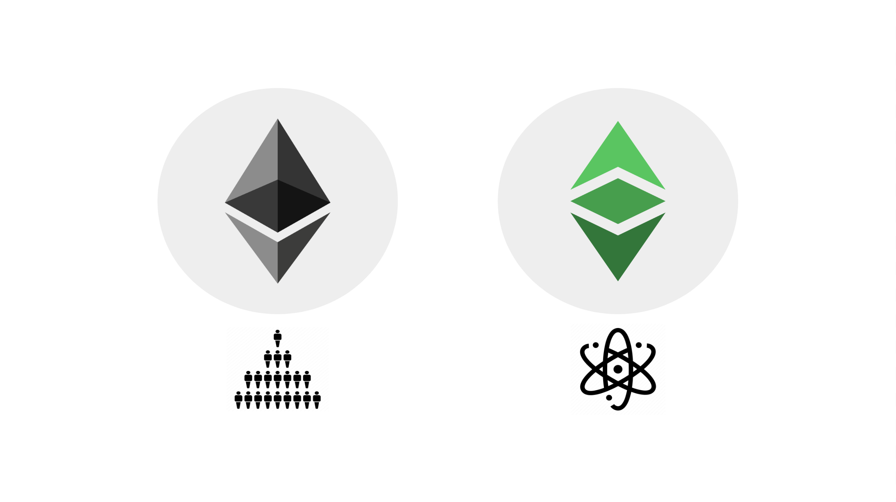
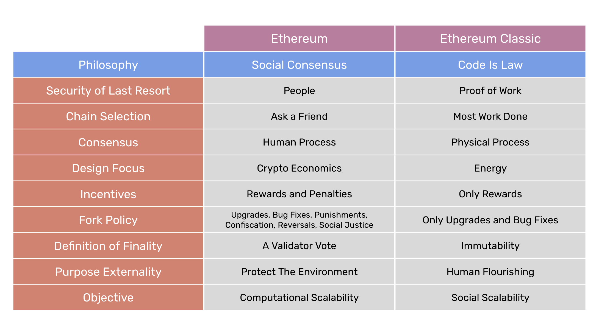

---
**由此收听或观看本期内容:**

<iframe width="560" height="315" src="https://www.youtube.com/embed/AfJBOtaEujo" title="YouTube video player" frameborder="0" allow="accelerometer; autoplay; clipboard-write; encrypted-media; gyroscope; picture-in-picture; web-share" allowfullscreen></iframe>

---

在上一课程中（第25课），我们解释了工作量证明（POW）的基本优势，以及如何将其应用到Ethereum Classic（ETC）上产生了该区块链在发明时的关键创新：应用的无法阻挡性。

在本课程（第26课）中，我们将解释与“无法阻挡性”相关的一个主题，即像ETC这样的网络与像以太坊（ETH）这样的网络之间的哲学差异。

ETH有一个称为“社会共识”的哲学，这使得它失去了很大一部分的安全性，因此它在很大程度上成为了一个中心化的系统。

ETC的哲学被称为“法律即代码”，这使得它符合去中心化、不可变性和抗审查的精神。

接下来我们将解释“社会共识”和“法律即代码”的区别。

## 以太坊重新定义了“去中心化”叙事

因为POS是中心化的，以太坊“社区”开始重新定义“去中心化”的叙事，并使用术语“社会共识”。

在他们看来，去中心化只是以太坊历史上的一个阶段，目的是获得公众的信任。在这个阶段之后，他们的愿景是依赖于他们发明的一个叫做“可信中立”的东西。

这意味着世界应该相信以太坊开发社区、权益证明精英和以太坊基金会在系统管理方面的中立性。

从某种程度上说，他们暗示了一种如“让我们继续表现得像以太坊是去中心化的，这样人们就会继续相信它是安全的”的说法。

作为这些策划的证据，在这一节中，我们展示了[一次对话](https://twitter.com/ChrisBlec/status/1675127714393518083)以太坊创始人Vitalik Buterin在2023年7月与以太坊开发人员之间的对话。

## 社会共识简介

社会共识意味着“社区”根据他们的世界观来决定何时出现问题，因此他们可以通过社会共识来改变事物。

这意味着通过不规则的状态更改，手动更改账户余额，删除dapps，审查“不良行为者”等方式来改变事物。

基本上，社会共识完全恢复了区块链本应最小化的受信任的第三方。

Cypherpunks的哲学是，无论信任被寄托在何处，这种信任都将被滥用。这只是人性。

社会共识是一种气体灯论据，它说现在无论信任被寄托在何处，都不会因为某种神奇的原因而被滥用。

## 法律即代码是真正的去中心化

POW是“法律即代码”，这恰恰相反。

社会共识相信“人是善良的”，而法律即代码则认为“受信任的第三方正是我们试图解决的问题！”

法律即代码是处于区块链设计顶层的一组原则。一切都源自这种哲学，或者是从这些原则下游的。

这种思维方式只会在协议层产生规则，以尽量减少人或社区的影响。

法律即代码主要依赖于客观的物理力量来保护系统。

由于法律即代码的哲学设计了系统，这种去中心化的设计恰恰使得网络信任最小化，因此安全，因此不可变。

## 对比表格

在这一部分，我们展示了我们在2023年1月发表的一篇文章中描述的表格，其中我们概述了社会共识和法律即代码之间的区别。下面我们简要解释表格中的每一行。

**最后保护的安全性：** 在社会共识中，人们认为必须由人们来处理安全性，并解决可能在区块链上出现的任何问题。在法律即代码中，最终解决方案是工作量证明。每个回合中的每个区块的决定都是通过工作完成来确定的，而不是通过主观的社区决策。如果存在冲突或对智能合约的黑客攻击，这些问题必须在链外由各方解决，但链保持不可变。

**链选择：** 当新加入者希望加入网络，或者节点离开并需要重新连接时，社会共识没有客观的去中心化方法来通知他们。他们需要在公共网站、朋友或其他受信任的方面进行核实。在法律即代码中，累积的工作量证明，或“完成最多的”规则，总是确定要遵循的链。

**共识：** 在社会共识系统中，每个回合中决定每个区块的方式是通过一个人类流程，这个过程需要来自权益证明验证者的2/3投票，因为不使用工作量证明的网络可能会受到只有1/3的不诚实参与者的攻击。在法律即代码中，共识是通过一种纯粹的客观物理过程达成的。没有投票也没有人类代理。

**设计重点：** 社会共识系统的安全设计重点取决于他们所谓的“加密经济学”，这基本上是权益证明精英的人类财务激励。在法律即代码区块链中，使系统安全的设计重点是用于每个区块的工作量证明印章的暴力和能量。

**激励：** 在社会共识中，保持系统安全的激励围绕着遵守规则的奖励和发送区块超出协议的惩罚。这种方法，加上基于人类和主观共识设计的方法，容易导致冲突和不稳定性。在法律即代码中，只有奖励，所有人都被激励去参与和赢得效率和计算能力竞赛。

**分叉政策：** 在社会共识系统中，由于它们容易集中化并由权益和其他精英控制，自愿分叉的动机不仅是为了达到期望的升级和修复错误，而且还有政治目标，如惩罚、没收、逆转和社会正义问题。在法律即代码中，任何不是期望的升级或修复错误的事物通常都会被彻底拒绝。

**最终性的定义：** 在社会共识中，最终性是由权益证明的投票来定义的。然而，这非常薄弱，因为链没有完成工作，因此这些参与者可以随意进行更改并在任何时候反转链。在法律即代码中，区块链是不可变的，因为要反转链是非常困难的，这需要重新完成所有的工作。

**目标外部性：** 在外部性方面，社会共识的哲学试图符合政治意识形态，例如气候变化。这是在以太坊中创建权益证明作为区块链共识机制的主要驱动因素。在法律即代码中，所有的设计重点和原则都是为了人类的繁荣。

**客观性：** 社会共识试图使系统尽可能可扩展，而不考虑风险和集中化。可能出现的任何问题都可以通过社会层面的决策来解决。在法律即代码中，目标是提供社会可扩展性，这样任何人都可以自由使用系统，无需担心审查或需要中央管理员的许可。

---

**感谢您阅读本文！**

要了解更多关于ETC的信息，请访问：https://ethereumclassic.org
