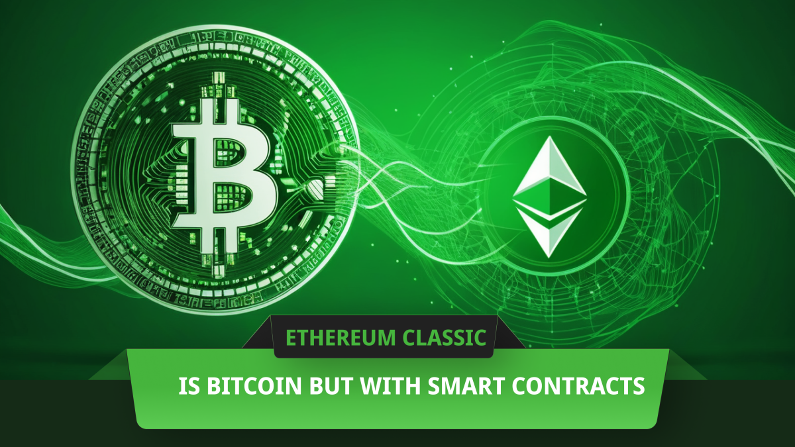

---
**由此收听或观看本期内容:**

<iframe width="560" height="315" src="https://www.youtube.com/embed/btzFfy0m-1U" title="YouTube video player" frameborder="0" allow="accelerometer; autoplay; clipboard-write; encrypted-media; gyroscope; picture-in-picture; web-share" allowfullscreen></iframe>

---

## 两个最重要的发明：工作量证明和智能合约

大多数人认为比特币（BTC）是一个辉煌的发明，这确实是事实，但实际上系统中的几乎每一个组件在比特币诞生前很长时间就已经存在。

中本聪的[伟大发现](https://ethereumclassic.org/blog/2023-11-16-etc-proof-of-work-course-2-what-didnt-exist-was-a-secure-consensus-mechanism)在于工作量证明（POW）加密戳不仅可以用来创建互联网黄金的类比，即“[比特金](https://unenumerated.blogspot.com/2005/12/bit-gold.html)”，而且POW本身的信息可以成为网络中所有节点在完全隔离的情况下，无需咨询任何其他来源或权威机构，同步数据库状态的焦点。这是去中心化的关键。

智能合约是区块链行业的第二个最重要的发明。

由于设计上的技术问题，比特币在其高度安全的POW环境中不支持智能合约。这就是为什么Vitalik Buterin发明了以太坊经典（ETC），它是原始的以太坊，作为一个POW区块链，拥有数字黄金，同时还可以编程。

## 比特币如何工作？

本质上，比特币是一个非常简单的系统。它只是一个账本，接受新交易以在账户之间移动BTC。仅此而已！

网络的主要目标是创建这个完全复制的账本，该账本将托管在世界各地的许多计算机上，以便尽可能冗余，从而尽可能有弹性。

正如我们之前所说，关键在于使用POW使网络中的所有计算机以去中心化的方式同步。

比特币的中本聪共识规则包括网络不断接收新交易；然后将这些交易在系统的每个节点中重新传输和复制；然后让一部分机器，即矿工，用加密戳哈希这些交易批次，做大量工作，消耗大量电力；然后将这些数据块发送给网络的其他部分进行验证。

当系统的其他节点收到这些加戳的数据块时，他们可以很容易地验证加密哈希并确认这是每轮中正确的数据块，从而以去中心化的方式与其他节点同步。

## 为什么比特币是数字黄金？

每当比特币中的新块被验证时，网络会发行并在构建该块的矿工的账户中记入新铸造的BTC。

由于比特币使用POW达成共识，而这种工作量证明需要大量的工作和能量来生产，只有在完成这些工作后才会铸造BTC支付给矿工，因此它被认为是“数字黄金”。

上述观点还得到了比特币供应计划设定上限的事实的支持，这意味着系统历史上只会存在2100万个硬币。

这是因为比特币开始时每块支付50个BTC给矿工，但它被编程为每四年减少50%。这种递减的硬币创造计划，到撰写本文时，每块支付3.125个BTC，保证了货币的有限供应，从而使BTC类似于现实世界中的黄金。

## 中本聪实际上想在比特币中加入智能合约！

我们之前写过，智能合约是区块链行业最重要的两大发明之一。智能合约是一个如此重要的概念，以至于中本聪甚至想在比特币中加入智能合约！

证明这一点的是他在2010年写道：

“设计支持了多种可能的交易类型，这是我多年前设计的。托管交易、担保合同、第三方仲裁、多方签名等。如果比特币大规模普及，这些都是我们未来想要探索的东西，但它们都必须在开始时设计好，以确保将来有可能实现。” -- 中本聪，BitcoinTalk: https://bitcointalk.org/index.php?topic=195.msg1611#msg1611

## 以太坊经典如何工作？

这将我们带到了以太坊经典！

正如我们在本文第一部分中提到的，Vitalik Buterin发明并于2015年推出了ETC，正是因为中本聪和许多其他人无法在比特币中添加智能合约。

ETC的基本设计与比特币相同。它是一个不断接收新交易的节点网络；这些交易被分组为批次并由矿工进行哈希处理；然后将数据块发送到网络的其他部分进行验证；网络每块支付矿工奖励。

然而，Vitalik的伟大发明在于通过在系统中添加一个在网络所有节点上复制的虚拟机来将智能合约引入ETC；创建一个燃气系统来支付矿工的计算能力；在系统中添加一种编程语言；并使账本能够在高度安全的POW区块链中托管这些智能合约。

## 为什么ETC是可编程的数字黄金？

ETC不仅使用与比特币相同的基础POW设计，使其真正去中心化，而且还使用非常类似于BTC的供应计划。

在ETC中，支付给矿工的奖励也随着时间的推移而减少。2015年，以太坊经典开始时支付给矿工每块5个ETC作为他们工作的报酬。此后，每500万个区块减少矿工支付的20%。

由于ETC的区块时间为13秒，这意味着每两年将矿工的奖励减少20%。

到撰写本文时，ETC处于区块19,857,092，每块支付矿工3.20个ETC，但当它达到区块20,000,000时，它将减少到每块2.56个ETC。

这一计划最终会减少，限制了ETC的供应总量，使其总供应量为210,700,000。

所以，如果BTC是数字黄金，那么，因为ETC具有与比特币相同的基础设计，但它是可编程的，那么ETC可以被认为是“可编程的数字黄金”。

## 比特币和ETC应该是世界上最大的区块链

由于以太坊经典是比特币的基础设计，但具有可编程性，它可以托管所谓的去中心化应用程序（dapps）来管理其稀缺的可编程数字黄金资源，即其货币ETC。

这种可编程性不仅使其比比特币更具多样性，而且使其成为世界上最大的POW智能合约区块链。

作为世界上最大的POW智能合约区块链，ETC上的应用程序是世界上最安全的应用程序。

这是ETC极其宝贵的定位，权益证明和权威证明网络如以太坊和瑞波永远无法声称这一点，因为它们是中心化系统。

由于比特币是世界上最大的区块链，而ETC则是具有可编程性的比特币，它是继POW之后的下一个最重要的发明，因此合理地认为BTC和ETC应该共同成为世界上最大的区块链。

---

**感谢您阅读本文！**

要了解更多关于ETC的信息，请访问：https://ethereumclassic.org
