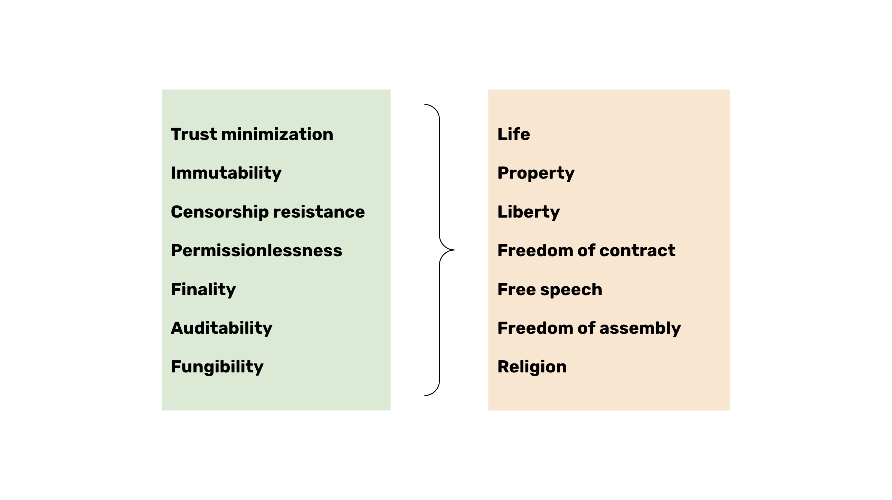

---
**You can listen to or watch this video here:**

<iframe width="560" height="315" src="https://www.youtube.com/embed/X8fGbQwmaBA" title="YouTube video player" frameborder="0" allow="accelerometer; autoplay; clipboard-write; encrypted-media; gyroscope; picture-in-picture; web-share" allowfullscreen></iframe>

---

In the previous class, 26, we explained the difference in philosophies between a network such as ETC and another such as Ethereum (ETH).

We talked about that ETH has a philosophy called “Social Consensus” which made it lose a great part of its security, thus making it largely a centralized system, and that ETC’s philosophy is called “Code Is Law” which keeps it inline with the ethos of decentralization, immutability, and censorship resistance.

In this class, 27, we will dig deeper into what is the meaning of “security” in proof of work (POW) blockchains. 

We will delve into what are the safety goals of POW networks and the external benefits that they bring to the world in the context of the techno tyranny that is coming.

## The Meaning of “Security”

In the context of the blockchain industry, the term “security” means to depend the least possible on trusted third parties when it comes to money and applications to manage that money.

To reduce the dependency on trusted third parties through decentralization increases censorship resistance and immutability.

The questions then are, why should we not trust third parties? And, what are the benefits of censorship resistance and immutability?

## People Are Not Aware of the True Meaning of “Security”

A large part of the market for these technologies comes from advanced free nations, who tend to forget their revolutionary origins, and former lack of freedoms, so people have been attracted just for the speculative side or perhaps for the technological innovation.

The United States, for example, which was forged through the revolutionary war against the tyranny of Britain, is the largest market for crypotassets, but the value placed in decentralization, censorship resistance, and immutability seems to be scarce.

A great number of American users use centralized exchanges such as Coinbase and Kraken as their wallets; if they use non-custodial wallets, they store their seed phrases in file storage services such as Google Drive or Dropbox; blockchain nodes are run on centralized cloud computing providers, such as AWS and Azure; and transactions for major networks are channeled through centralized infrastructure, such as Infura.

All this shows a major unawareness of what security means.

## Trust Minimization is Key to Our Future

So, to answer the two questions we posed above, POW blockchains were invented to avoid the abuse of government, woke corporations, elites, and special interests. This abuse is increasing even in advanced countries.

Their abuse is manifested in surveillance technology and laws that violate individual rights.

The individual rights violated may be privacy and private property, both critical to the flourishing of human action and life.

This is why censorship resistance and immutability through decentralization is key to our future.

Globalism and techno-tyranny are at our doorstep, and we must be prepared.

## The Techno Tyranny That Is Coming

But, how would globalism and techno-tyranny be manifested?

Soon, the threat of global government, digital passports, CBDCs, constant health emergencies, and climate hysteria (as seen by the attacks on POW) will tend to enslave us. 

Once the elites know each of our transactions and gain the ability to control them, they will impose their worldviews on everyone on a global scale.

They will stop purchases of meat on the grounds of the government recommended food pyramid; stop purchases of gas for our vehicles on the grounds of climate change; and cancel donations to churches on the basis of national security.

The only escape to the calamitous globalist absolutism that is coming will be non-compliance, and non-compliance will only be possible through technologies such as POW blockchains as ETC.

Even in biblical terms, this was prophesied thousands of years ago, and it was called to avoid the mark of the beast to be saved.

## How Does POW Protect Basic Rights

We mentioned above privacy and property as examples of basic rights that will be violated by government, special interests, and elites.

But, as we wrote in [class 8](https://ethereumclassic.org/blog/2023-12-28-etc-pow-course-8-pow-promotes-basic-rights) of this course, the security features that POW blockchains as ETC promote protect many more basic rights, such as freedom of contract, free speech, freedom of assembly, freedom of religion, liberty, and, as a result of all these, life itself.

On a programmable blockchain such as Ethereum Classic many dapps may deter the techno-elites to mark us and control us.

For example a decentralized exchange will let us trade crypto assets permissionlessly, smart contracts will let us enter into agreements avoiding obstacles, and web3 dapps will let us communicate without censorship.

## There Will Only Be 3 or 4 Large POW Blockchains in the Future

Because of all of these things that we are expressing in this class, it is very important to discern what blockchains will be truly secure and protect our rights, and which ones will not.

Proof of stake and proof of authority blockchains such as Ethereum and Ripple are not secure and will not protect us from the techno-tyranny that is coming. They can be easily controlled by special interests and government because they are centralized.

As we wrote in [class 13](https://ethereumclassic.org/blog/2024-02-08-etc-proof-of-work-course-13-there-will-only-be-3-or-4-pow-blockchains-in-the-future) of this course, there will only be 3 or 4 truly secure POW blockchains in the future. It is important to spot them as of now to go accumulating our savings and wealth, and for developers to build on them. 

Among these, we will have Bitcoin very likely as the biggest one, and ETC as the second largest base layer POW blockchain in the world. Then, we may have Litecoin and Monero as part of the leading group.

Combined they will provide a technological refuge against the precursors of and the technologies that will try to enslave us.

---

**Thank you for reading this article!**

To learn more about ETC please go to: https://ethereumclassic.org
