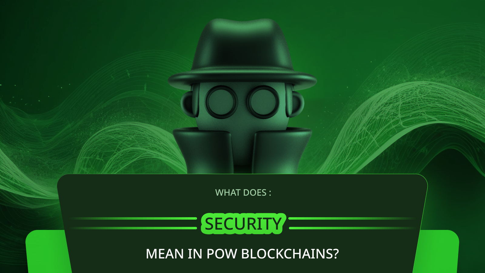
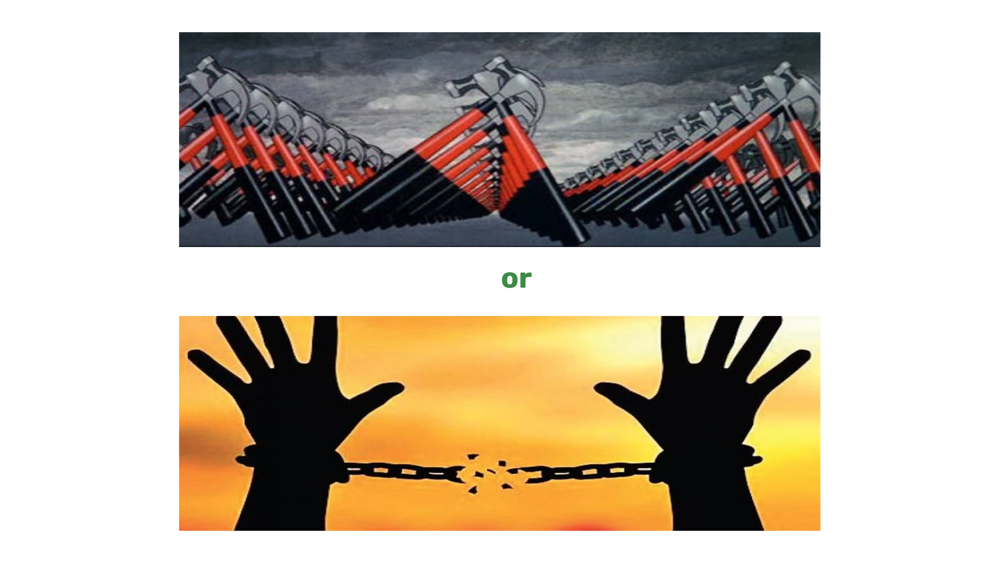
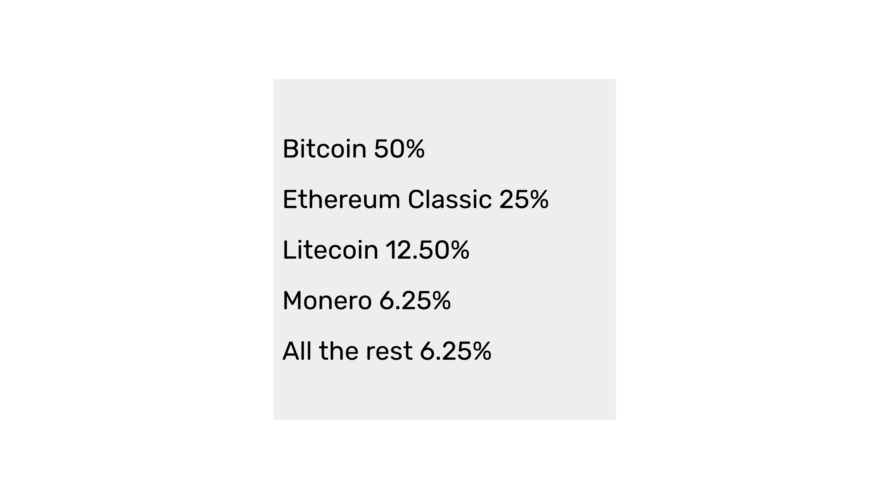

---
**由此收听或观看本期内容:**

<iframe width="560" height="315" src="https://www.youtube.com/embed/X8fGbQwmaBA" title="YouTube video player" frameborder="0" allow="accelerometer; autoplay; clipboard-write; encrypted-media; gyroscope; picture-in-picture; web-share" allowfullscreen></iframe>

---

在前一节课（第26节）中，我们解释了像ETC和像以太坊（ETH）这样的网络之间的哲学差异。

我们谈到，ETH有一种称为“社会共识”的哲学，这使其失去了很大一部分安全性，从而使其在很大程度上成为一个集中的系统，而ETC的哲学称为“代码即法律”，这使其保持去中心化、不可篡改和抗审查的精神。

在本节课（第27节），我们将深入探讨工作量证明（POW）区块链中“安全”的含义。

我们将深入探讨POW网络的安全目标及其在即将到来的科技暴政背景下为世界带来的外部利益。

## “安全”的含义

在区块链行业的背景下，“安全”一词意味着在管理资金和应用程序时尽可能少地依赖可信的第三方。

通过去中心化减少对可信第三方的依赖可以增加抗审查性和不可篡改性。

那么问题是，为什么我们不应该信任第三方？以及抗审查性和不可篡改性有什么好处？

## 人们不了解“安全”的真正含义

这些技术的大部分市场来自先进的自由国家，这些国家的人们往往忘记了他们的革命起源和以前缺乏的自由，因此人们仅仅被投机或技术创新所吸引。

例如，美国通过革命战争反对英国的暴政而铸就，是加密资产的最大市场，但对去中心化、抗审查性和不可篡改性的重视似乎很少。

大量的美国用户使用中心化的交易所，如Coinbase和Kraken作为他们的钱包；如果他们使用非托管钱包，他们会将其种子短语存储在Google Drive或Dropbox等文件存储服务中；区块链节点运行在AWS和Azure等中心化的云计算提供商上；主要网络的交易通过Infura等中心化基础设施进行。

所有这些都显示出对“安全”含义的极大无知。

## 信任最小化是我们未来的关键

因此，为了回答我们上面提出的两个问题，POW区块链的发明是为了避免政府、觉醒企业、精英和特殊利益的滥用。即使在先进国家，这种滥用也在增加。

这种滥用表现在侵犯个人权利的监控技术和法律中。

被侵犯的个人权利可能是隐私和私有财产，这两者对人类行动和生活的繁荣至关重要。

这就是为什么通过去中心化实现的抗审查性和不可篡改性对我们的未来至关重要。

全球主义和科技暴政就在我们面前，我们必须做好准备。

## 即将到来的科技暴政

但是，全球主义和科技暴政将如何表现出来呢？

很快，全球政府的威胁、数字护照、CBDC（中央银行数字货币）、持续的健康紧急情况和气候歇斯底里（如对POW的攻击所见）将倾向于奴役我们。

一旦精英们知道我们每一笔交易并获得控制它们的能力，他们将把他们的世界观强加于每个人，全球范围内。

他们将以政府推荐的食物金字塔为由，阻止购买肉类；以气候变化为由，阻止购买汽油；并以国家安全为由，取消对教会的捐款。

逃离即将到来的全球主义绝对主义灾难的唯一办法将是非合作，而非合作只能通过像ETC这样的POW区块链技术来实现。

即使在圣经中，这也在数千年前被预言过，被称为避免兽的印记以获得救赎。

## POW如何保护基本权利

我们在上面提到隐私和财产作为政府、特殊利益和精英将侵犯的基本权利的例子。

但是，正如我们在本课程的[第8节课](https://ethereumclassic.org/blog/2023-12-28-etc-pow-course-8-pow-promotes-basic-rights)中写道，POW区块链如ETC促进的安全特性保护了更多的基本权利，如合同自由、言论自由、集会自由、宗教自由、自由，以及所有这些的结果：生命本身。

在像以太坊经典这样的可编程区块链上，许多去中心化应用（dapps）可以阻止科技精英标记我们并控制我们。

例如，一个去中心化的交易所将允许我们无许可地交易加密资产，智能合约将让我们避开障碍进行协议，web3 dapps将让我们在没有审查的情况下进行交流。

## 未来只有3到4个大型POW区块链

因为我们在本课中表达的所有这些事情，辨别哪些区块链将真正安全并保护我们的权利，哪些不会，是非常重要的。

像以太坊和瑞波（Ripple）这样的权益证明（POS）和权威证明（POA）区块链并不安全，也不能保护我们免受即将到来的科技暴政的侵害。它们因为是集中化的，可以很容易地被特殊利益和政府控制。

正如我们在本课程的[第13节课](https://ethereumclassic.org/blog/2024-02-08-etc-proof-of-work-course-13-there-will-only-be-3-or-4-pow-blockchains-in-the-future)中写道，未来只有3到4个真正安全的POW区块链。现在识别它们以积累我们的储蓄和财富，对开发人员来说，在这些区块链上进行构建是很重要的。

在这些区块链中，我们很可能会有比特币作为最大的一个，ETC作为世界第二大基础层POW区块链。然后，我们可能会有莱特币和门罗币作为领先集团的一部分。

它们结合起来将提供一个对抗前驱和试图奴役我们的技术的避难所。

---

**感谢您阅读这篇文章！**

想了解更多关于ETC的信息，请访问：https://ethereumclassic.org
