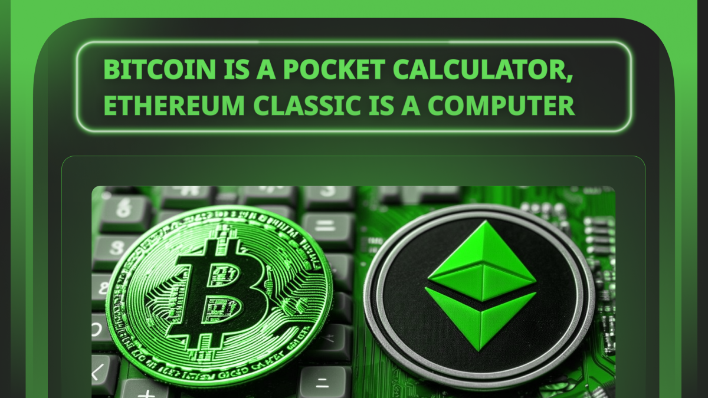

---
**You can listen to or watch this video here:**

<iframe width="560" height="315" src="https://www.youtube.com/embed/rCK2j99oFDA" title="YouTube video player" frameborder="0" allow="accelerometer; autoplay; clipboard-write; encrypted-media; gyroscope; picture-in-picture; web-share" allowfullscreen></iframe>

---

## The Amazing Invention of Bitcoin

Satoshi Nakamoto must have been a [Cypherpunk](https://ethereumclassic.org/blog/2022-12-29-ethereum-classic-course-2-the-cypherpunks) as the goals, parts, and components of Bitcoin (BTC) were all things that had been discussed and worked on before in those circles.
 
The immediate predecessor of Bitcoin was [Bit Gold](https://unenumerated.blogspot.com/2005/12/bit-gold.html), which introduced the idea of using computing work and electricity to create hard money on the internet as an analogy of gold in the real world.

It could be said that all the components of the system had already existed before it was launched by Satoshi in 2009. 

Except one!

Using the results of the computing work, also known as proof of work (POW), as the [consensus mechanism](https://ethereumclassic.org/blog/2023-11-30-etc-roof-of-work-course-4-why-pow-based-nakamoto-consensus-is-secure-and-complete) as well was the main and brilliant invention by Mr. Nakamoto. 

POW consensus unlocked the door to synchronize computers on the same state of the data on a global scale with no need of central arbiter or administrator. This was the amazing discovery that changed everything.

## The Simplicity of Bitcoin

However, Bitcoin is really a very simple system. It only moves coins from one account to the other. That’s it!

Indeed, Bitcoin is a globally fully replicated ledger only with accounts and balances. 

The blocks of new transactions sent by users are created by miners, who use a lot of computing power and electricity to build them, and then they are verified by the rest of the nodes of the network. 

For this work, the miners get paid “block rewards” that are set in a decreasing schedule every four years that started in 2009 at 50 BTC per block, then 25, 12.5, 6.25, 3.125, and so on.

The proof of work in the system enables consensus between all computers; it gives a focal point for entry, exit, and re-entry of participants permissionlessly; it provides protection of all the history of transactions; and creates hard money on the internet as the coins are only issued if the work is done.

All this is all called “Nakamoto Consensus”. But, what did it accomplish? 

The benefits to the world that Bitcoin brought were trust minimization through decentralization; this decentralization equaled security; therefore Bitcoin became an immutable system that could even survive a nuclear war; and it provided hard money on the internet.

## Satoshi Actually Wanted Smart Contracts in Bitcoin

One of the most fascinating accounts about the history of Bitcoin is that Satoshi Nakamoto actually [planned smart contracts](https://ethereumclassic.org/blog/2023-12-14-etc-proof-of-work-course-6-etc-is-btc-philosophy-with-eth-technology) on Bitcoin!

In 2010 he wrote:

*“The design supports a tremendous variety of possible transaction types that I designed years ago. Escrow transactions, bonded contracts, third party arbitration, multi-party signature, etc. If Bitcoin catches on in a big way, these are things we'll want to explore in the future, but they all had to be designed at the beginning to make sure they would be possible later.”*

*– Satoshi Nakamoto*

BitcoinTalk: 

https://bitcointalk.org/index.php?topic=195.msg1611#msg1611 

This is actually one of the clues that Mr. Nakamoto was a cypherpunk, as these topics of money, Bit Gold, and smart contracts were developed only in those circles.

## Then, Vitalik Invented Ethereum Classic

However, because of its design, Bitcoin could never run smart contracts. Many tried to create applications on it or proposed formats for recreating programmability, but all attempts have failed to this day.

Then came Vitalik Buterin who created Ethereum Classic (ETC), the original Ethereum blockchain, and launched it in 2015.

ETC is a proof of work blockchain that has all the components of Bitcoin but that adds programmability through smart contracts.

This was the second most important invention of the blockchain industry after Nakamoto Consensus.

## What Are Smart Contracts

Smart contracts are software programs that when developers send to the network, they get replicated across the system thus making them decentralized.

This means that ETC supports a replicated ledger, just like Bitcoin, but adds to that ledger the ability to store and execute software programs.

In addition to this, ETC contains what is called an EVM (Ethereum Virtual Machine) which is the component of the protocol that runs the smart contracts.

Developers may use adapted programming languages, such as Solidity, to build useful applications on the ETC blockchain.

## What Are Dapps

Just as we use applications on our computers or phones, smart contracts are apps but on the ETC blockchain.

As these apps are decentralized, then they are called decentralized applications, or “dapps” for short.

Dapps may take many forms, for example some may be used as decentralized exchanges, others as deposit and lending services, others as NFTs, property registries, and many other useful things.

Eventually, decentralized applications, using the ERC-20 standard, the ERC-721 standard, DAOs, and several other designs, will encompass a host of use cases that will enhance security and transparency in many services and functions in society.

## Bitcoin Is A Pocket Calculator, ETC Is A Computer

So, whereas Bitcoin is a formidable force in the blockchain industry, and is truly decentralized digital gold that will benefit the world by providing hard money, it is still a very simple system in its design. 

Some industry insiders have called it a pocket calculator because of its basic functions.

ETC, on the other hand, is Bitcoin’s design; which includes proof of work and a ledger with accounts and balances; but adds programmability to its highly secure internal environment.

This makes ETC a computer in comparison to Bitcoin, which means that it is much more versatile and generalized, thus making it more useful for many key applications.

---

**Thank you for reading this article!**

To learn more about ETC please go to: https://ethereumclassic.org
