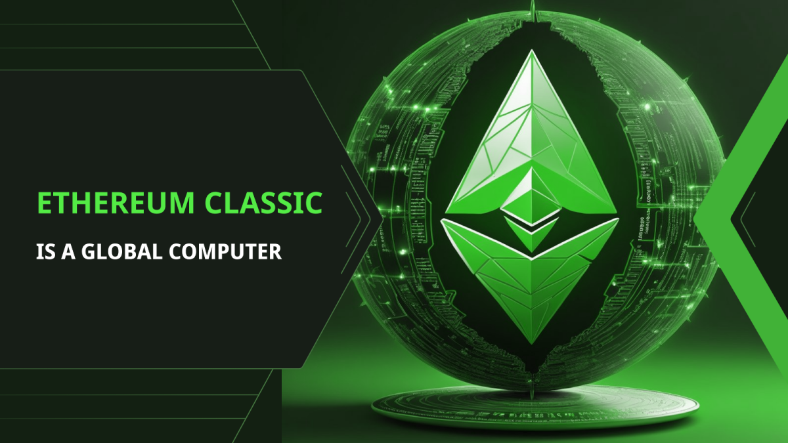
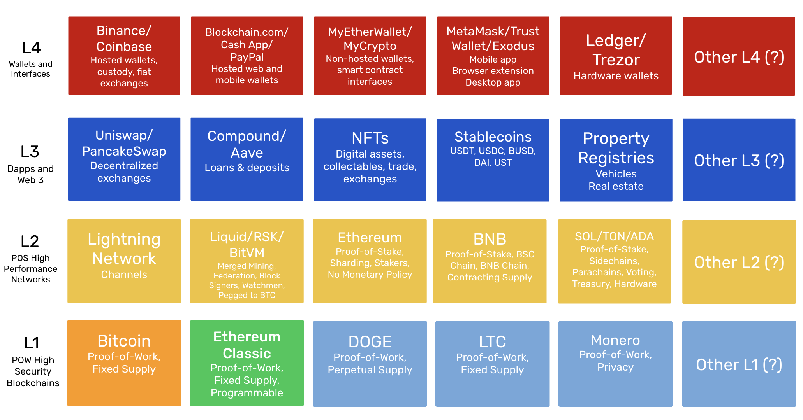

---
**You can listen to or watch this video here:**

<iframe width="560" height="315" src="https://www.youtube.com/embed/kAFzF90DTtY" title="YouTube video player" frameborder="0" allow="accelerometer; autoplay; clipboard-write; encrypted-media; gyroscope; picture-in-picture; web-share" allowfullscreen></iframe>

---

## Bitcoin as a Payments System

As we noted in our [previous post](https://ethereumclassic.org/blog/2024-05-28-bitcoin-is-a-pocket-calculator-ethereum-classic-is-a-computer) Bitcoin’s amazing invention was not really digital money, peer-to-peer networks, or even proof of work (POW). The real invention was to use the proof of work itself as a consensus mechanism to enable sound digital money in a truly decentralized peer-to-peer network.

POW consensus unlocked the door to synchronize computers on the same state of the data on a global scale with no need of central arbiter or administrator. 

This was the crucial discovery that changed everything.

However, Bitcoin is a very basic system. It only moves coins from one account to the other. Nothing more!

Hence, it may be said that Bitcoin is really a payments system.

## Ethereum Classic as a Global Computer

The next generation of blockchain technology would be the same as Bitcoin but programmable.

This is how Ethereum Classic (ETC) was designed.

ETC has the same basic structure as Bitcoin but includes smart contracts. Smart contracts are enabled by a technology called Ethereum Virtual Machine (EVM), a Turing complete programming language called Solidity, and a transaction fee payment mechanism called the gas system.

Combined, these components on top of the basic structure of Bitcoin created a global computing system that may be used to program the money of the protocol.

Hence, ETC is a decentralized global computer rather than a payments system.

## The Limitations of ETC

However, ETC may not be considered a decentralized cloud service.

Traditional centralized cloud services put enormous amounts of computing power and storage capacity at the service of corporations and the public.

These infrastructures may easily handle and process big data, artificial intelligence, and machine learning applications. These technologies require ample computing capacity and data storage.

ETC, because all the information and execution of software programs must be fully replicated and handled in parallel in all the computers of the network so that it may remain decentralized, is very inefficient and, consequently, has a limited data storage and computing capacity.

## Social Scalability

Nevertheless, this computing and storage inefficiency is actually purposeful!

In ETC there is a deliberate tradeoff between computing scalability and what [Nick Szabo](https://en.wikipedia.org/wiki/Nick_Szabo), a blockchain pioneer, termed as [social scalability](https://unenumerated.blogspot.com/2017/02/money-blockchains-and-social-scalability.html).

Social scalability means that the system is permissionless and censorship resistant. It means that anyone in the world may use it, as long as they are following protocol rules, and they will not be limited in their access.

Traditional systems may scale computationally to handle large computational and data tasks, processing big volumes of transactions per day, but because they must be centralized to offer this efficiency, they will impose restrictions and barriers according to political correctness and ideological bias.

ETC does away with these barriers at the cost of computational and data scalability.

## Decentralized Applications

So, if ETC is a decentralized, thus secure, uncensorable, and permissionless global computer, but inefficient, what is it good for?

Well, it turns out that there are many use cases that are still valuable because of ETC’s security. 

Some examples may be:

**Decentralized exchanges:** Decentralized exchanges are critical infrastructure in ETC as they provide a way of exchanging assets without the risks and restrictions of trusted third parties.

**Stablecoins:** Stablecoins have proven to be an enormous use case, especially in third world countries where people needed a way to get a hold of stable money to hedge their rapidly devaluing national currencies.

**NFTs:** NFTs are also critical infrastructure as they not only may be used to represent art that can be traded on the blockchain, but they may represent many other kinds of assets, even in the real world.

**Property registries:** Some of the assets that may be represented on the blockchain as NFTs are real estate and vehicles. These will be bought and sold on the blockchain and the property titles and loans against them will be executed seamlessly on the same action, shortening settlement times from days, weeks, or months to seconds.

## Web 3

Speaking of use cases, another kind of application of a decentralized programmable blockchain or global computer as ETC is to serve as the back end code for decentralized web applications.

The concept of decentralized web applications or the Web 3 stems from the understanding that the first websites were static, hence they were called Web 1. Then, social media websites revolutionized the world by enabling dynamic user generated content, and was called Web 2. And, the next generation will be a web with decentralized uncensorable applications, which is why it is called Web 3.

ETC, as a global computer, will serve as the core code of these applications, handling the security and the underlying value, and other decentralized networks will provide file storage, image management, scalability of transactions, and other features.

## The Layered Future of the Blockchain Industry

As all these different components evolve, the topology of the blockchain industry will more and more look like as a layered ecosystem where ETC will likely be a base layer secure technology that will handle backend code and large amounts of value.

Above this base layer, there will be proof of stake and scalability solutions that will enable larger volumes of smaller transactions. There will also be file storage and other solutions that will enable the full vision of the Web3.

Above this second layer, a third layer with decentralized applications will provide the end user services, such as decentralized exchanges, lending and deposits services, NFTs, stablecoins, and property registries, amongst many others.

And, finally, the fourth layer, or user facing layer, will be the wallet web and mobile apps that users will use to interact with all these systems.

---

**Thank you for reading this article!**

To learn more about ETC please go to: https://ethereumclassic.org
