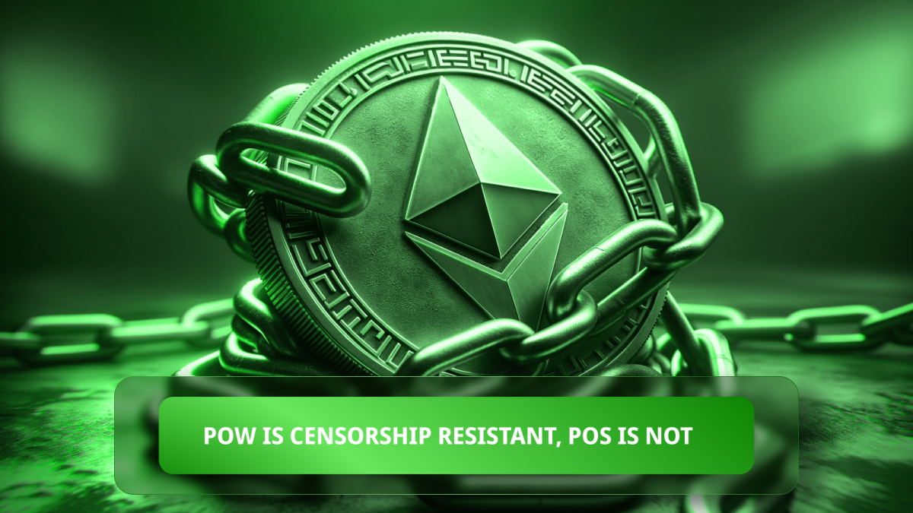
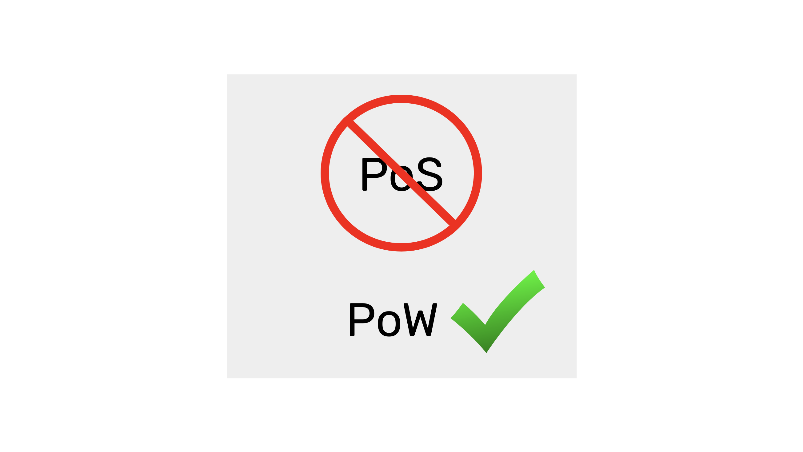

---
**You can listen to or watch this video here:**

<iframe width="560" height="315" src="https://www.youtube.com/embed/QSNub65Osso" title="YouTube video player" frameborder="0" allow="accelerometer; autoplay; clipboard-write; encrypted-media; gyroscope; picture-in-picture; web-share" allowfullscreen></iframe>

---

In the previous class, 27, we explained what is the meaning of “security” in proof of work (POW) blockchains. 

We delved into what are the safety goals of POW networks and the external benefits that they bring to the world in the context of the techno tyranny that is coming. 

In this class, 28, we will talk about censorship resistance, why POW is censorship resistant, and proof of stake (POS) networks are not.

## POW Is Censorship Resistant

As we explained in the previous class, only POW blockchains will enable us to not comply with the techno-tyranny that is coming. This is because POW is censorship resistant, and all other systems are not.

POW enables computers around the world join and leave the network without having to check with third parties which is the correct block or blockchain. This is a very powerful feature because third parties are the source of arbitrary control and corruption.

In POW networks as Ethereum Classic (ETC) and Bitcoin (BTC) there is no need to ask permission to participate nor to send transactions. As long as transactions are correctly formed, they will be accepted by nodes and miners of the system.

If there is no third party controlling these systems, then there is no possibility of censorship.

## Economies of Scale In POS Produce Centralization

POS is censorable because it is prone to staker, validator, and staking pool centralization due to economies of scale. 

Because staking has no geographic or technical friction as it is just a deposit in the global ledger, then economies of scale in that model are extremely efficient. 

This makes staking through exchanges or staking through smart contracts equally centralized. 

The smart contract based staking pools are centralized because they pool money anonymously on the network, but filter who can be validators through DAO voting, governance schemes, and other methods. We predict that soon they will start filtering stakers with [KYC](https://en.wikipedia.org/wiki/Know_your_customer) and [AML](https://en.wikipedia.org/wiki/Anti%E2%80%93money_laundering) restrictions as well.

## Governments Will Take Over Staking in POS

The smart contract pools are prone to backdoors, developer directed upgrades, and arbitrary rule changes. 

This is because they have DAOs that are used to vote on new changes and upgrades to their systems, and because governments may pressure the pool developers, who may have majority control of these voting DAOs, to add arbitrary control mechanism to the systems.

Staking through exchanges is easily capturable by special interests and governments because the exchanges themselves are traditional regulated financial services, therefore they take staking deposits from their customers only after they do the KYC and AML checks, and they use their own validator nodes to produce blocks for the network.

With this setup, it’s only a decision of the exchange managers to censor the blocks they produce.

## POW Mining Has Diseconomies of Scale

In proof of work, mining is exactly the same as sending transactions or running a node in those networks in the sense that miners may connect or disconnect from the network whenever they wish, from anywhere in the world, without any possibility of censorship because the proof of work information is all they need to join and leave in a decentralized way.

Additionally, electricity generation and logistics is distributed around to the world, making economies of scale in that industry not efficient. 

The Chinese Bitcoin mining industry is an example that POW is censorship resistant as the government prohibited crypto mining in 2021, but in early 2024 that country still had 15% of Bitcoin’s hashpower making it the second largest mining country behind the US.

## How Staking Pools Work

A description of the operation of the two types of staking pools will illustrate why they are centralized.

In centralized staking pools or exchange run staking pools, the exchanges are traditional financial services controlled by regulators. This means that making staking deposits is already not censorship resistant because many potential stakers are left out when they fail the KYC and AML filters.

As these pools run their own nodes, and they must comply with regulations, they have to censor transactions and smart contracts based on government restrictions such as those imposed by the Office of Foreign Assets Control (OFAC) in the United States.

As we explained before, “decentralized” staking pools do accept anonymous stakers on the blockchain for now, but they filter who may validate transactions to maximize uptime and minimize penalties.

As they can pick and choose who may validate, then they have the power to impose conditions to those validators, and those conditions may include what to censor and what not.

## How Mining Pools Work

In POW mining all these points of control are avoided. 

This is because as transactions are received by the network, they are distributed to all nodes globally. Some of these nodes are miners who may be anywhere in the world there is cheap electricity to mine.

When the miners get the transactions they create batches of them and do the POW hashing to stamp the blocks. 

When these blocks are sent to the rest of the network, each node in their complete isolation knows that it is the correct next block in the network just by checking the POW. This is what determines the decentralization in POW.

Pools, in POW networks as ETC and BTC, just aggregate smaller miners around the world and allow them to have a smoother cash flow by representing a larger share of the mining in the network than if they would be mining by themselves. 

However, POW mining pools hardly do any KYC or AML checks on their users because they do not act as financial institutions as mining is a physical operation done externally to the network. 

Additionally, POW mining pools would be deserted if they censored transactions as they would soon lose profitability as compared to other competing pools elsewhere.

---

**Thank you for reading this article!**

To learn more about ETC please go to: https://ethereumclassic.org
