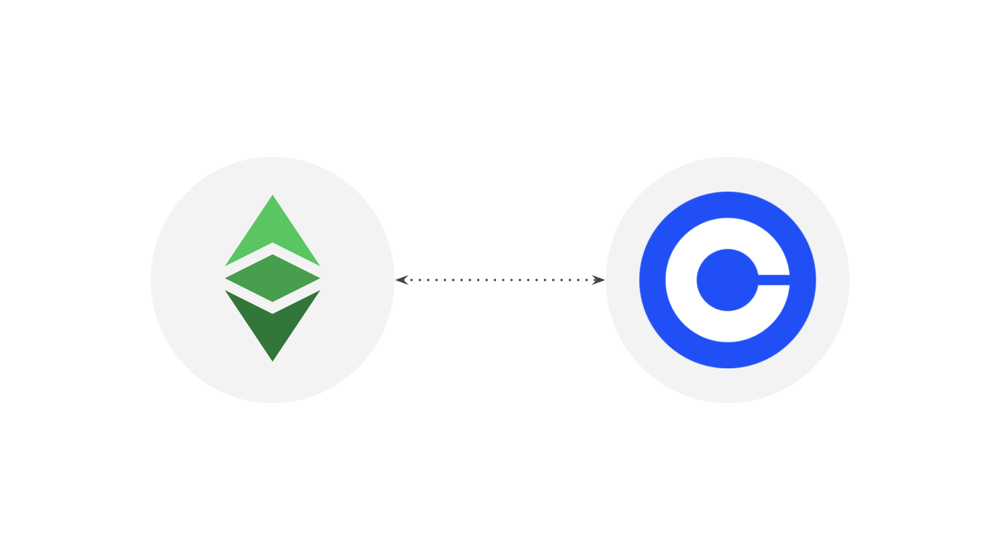

The crypto exchange [Coinbase](https://coinbase.com) has two articles about Ethereum Classic (ETC) with the titles “What Is Ethereum Classic” and “About Ethereum Classic” in the following links:

What Is Ethereum Classic?:

https://help.coinbase.com/en/coinbase/getting-started/crypto-education/what-is-ethereum-classic

About Ethereum Classic: 

https://www.coinbase.com/price/ethereum-classic

The text in both posts have some good information, however some parts have mistakes or common misconceptions that we wish to clarify. 

Additionally, we would also like to add some more content to reflect a more complete picture of ETC while respecting Coinbase’s reporting format and style.

In the following sections we will go over Coinbase’s statements on both articles, we will propose corrected phrases and additional content, and express our rationale for the changes and additions.

# Post: What Is Ethereum Classic?

**Coinbase Statement:**

Ethereum Classic is a digital currency created as a result of the hard fork of the Ethereum blockchain in July 2016. The compromise of an organization known as the DAO (which had made use of Ethereum's smart contract features) led to the Ethereum Foundation deciding to implement a hard fork. This hard fork rolled back all DAO-related transactions and allowed the original smart contract contributors to withdraw their funds.

The new blockchain created by the hard fork inherited the name Ethereum, and continued to be maintained by the Ethereum Foundation development team. The remaining portion of the community continued to run the original Ethereum blockchain, which became known as "Ethereum Classic."

**Our Corrections and Additions:**

Ethereum Classic is the original Ethereum blockchain created between 2014 and 2015 and launched on July 30 2015. In July of 2016, what is known today as the “Ethereum” network split from the mainnet, known today as “Ethereum Classic”. 

The compromise of an organization known as the DAO (which had made use of Ethereum's smart contract features) led to the Ethereum Foundation deciding to implement a hard fork. This hard fork rolled back all DAO-related transactions and allowed the original smart contract contributors to withdraw their funds.

The new blockchain created by the hard fork inherited the name “Ethereum”, and continued to be maintained by the Ethereum Foundation development team. The remaining portion of the community continued to run the original Ethereum blockchain, which became known as "Ethereum Classic." 

**Rationale:**

This Coinbase post is very correct in the majority of the content, but still contained a common misconception that Ethereum Classic (ETC) was created as a result of the hard fork of 2016. However, in the second paragraph it is well described that ETC is the original chain!

# Post: About Ethereum Classic

## Section: Introduction

**Coinbase Statement:**

Ethereum Classic is a cryptocurrency with a special focus on immutability, popularly expressed as “code is law.”

**Our Corrections and Additions:**

No changes proposed.

**Rationale:**

This is an excellent tagline to start a professional explanation of what is ETC. 

## Section: What Is Ethereum Classic?

**Coinbase Statement:**

Ethereum Classic (ETC) is a decentralized, open-source blockchain network that came into existence in July 2016 after the Ethereum network experienced a hard fork, a change to the blockchain's protocol or basic set of rules, creating two separate blockchains: Ethereum (ETH) and Ethereum Classic (ETC). Though sometimes confused with Ethereum, Ethereum Classic is now a totally different cryptocurrency with different technological and philosophical goals, specifically focusing on immutability, popularly expressed as "code is law." Ethereum Classic was established to uphold the integrity of the original Ethereum blockchain in the wake of a substantial hacking incident. The network's primary role is to function as a smart contract network, facilitating the development and support of decentralized applications (DApps). ETC is Ethereum Classic's native currency, which is used to power transactions and smart contracts on its network. Ethereum Classic strives to preserve the original Ethereum blockchain without artificially reversing the consequences of the DAO hack. It operates on a proof-of-work (PoW) mining algorithm and does not intend to transition to a proof-of-stake (PoS) consensus mechanism like Ethereum did., Ethereum Classic is a decentralized computing system that can run a wide variety of applications.

**Our Corrections and Additions:**

Ethereum Classic (ETC) is a decentralized, open-source blockchain and the original Ethereum network that was launched in July 2015. What is known today as “Ethereum” came into existence in 2016 after the network experienced a hard fork, a change to the blockchain's protocol or basic set of rules, creating two separate blockchains: Ethereum (ETH) and Ethereum Classic (ETC). Though sometimes confused with Ethereum, Ethereum Classic is now a totally different cryptocurrency with different technological and philosophical goals, specifically focusing on immutability, popularly expressed as "code is law." Ethereum Classic was established to uphold the integrity of the original Ethereum blockchain in the wake of a substantial hacking incident. The network's primary role is to function as a smart contract network, facilitating the development and support of decentralized applications (DApps). ETC is Ethereum Classic's native currency, which is used to power transactions and smart contracts on its network. Ethereum Classic strives to preserve the original Ethereum blockchain without artificially reversing the consequences of the DAO hack. It operates on a proof-of-work (PoW) mining algorithm and does not intend to transition to a proof-of-stake (PoS) consensus mechanism like Ethereum did. Ethereum Classic is a decentralized computing system that can run a wide variety of applications.

**Rationale:**

We corrected in initial part of this section to indicate that ETC is the original blockchain and that Ethereum was created as a result of the DAO hard fork. The rest of the section is perfect.

## Section: How does Ethereum Classic work?

**Coinbase Statement:**

Ethereum Classic functions on a proof-of-work (PoW) consensus algorithm akin to Bitcoin. Like Ethereum and its native unit ETH, Ethereum Classic users pay fees in ETC to execute smart contracts, and you can think of it as the fuel that keeps the whole thing running (which is why those fees are called "gas"). Miners utilize their hardware to solve intricate mathematical equations and validate transactions on the Ethereum Classic network. The first miner to solve the equation and validate a new block is compensated with a block reward in the form of ETC tokens. Biweekly, the network automatically modifies the difficulty of mining Ethereum Classic to maintain a consistent block production rate. The new difficulty is determined by the total computational power of the network, and it becomes increasingly challenging to mine ETC as more miners join the network. Like ETH, new ETC is issued to the circulating supply as a reward for miners as new blocks of transactions are added to the blockchain. Unlike ETH, however, which doesn't have a fixed supply, ETC has a maximum supply of 210,700,000 coins.

**Our Corrections and Additions:**

Ethereum Classic functions on a proof-of-work (PoW) consensus algorithm akin to Bitcoin. Like Ethereum and its native unit ETH, Ethereum Classic users pay fees in ETC to execute smart contracts, and you can think of it as the fuel that keeps the whole thing running (which is why those fees are called "gas"). Miners utilize their hardware, doing a lot of computational work, using a lot of electricity, to produce a cryptographic stamp or hash for each block, validating transactions on the Ethereum Classic network. The first miner to hit a target hash imposed by the protocol and validate a new block is compensated with a block reward in the form of ETC tokens and the transaction fees for that block. ETC adjusts the target difficulty to stamp or hash blocks by a small fraction on a block by block basis to maintain a consistent block production rate. The new difficulty is determined by the total computational power of the network, and it becomes increasingly challenging to mine ETC as more miners join the network. Like ETH, new ETC is issued to the circulating supply as a reward for miners as new blocks of transactions are added to the blockchain. Unlike ETH, however, which doesn't have a fixed supply, ETC has a maximum supply of 210,700,000 coins.

**Rationale:**

Miners in ETC do not solve intricate mathematical equations in POW, they just use a basic cryptographic function to try many times to hit a target hash imposed by the protocol.

Miners are rewarded block rewards and transaction fees in the form of gas.

ETC actually adjusts the difficulty to mine blocks on a block by block basis, not every two weeks like Bitcoin.

## Section: What are the potential use cases for Ethereum Classic?

**Coinbase Statement:**

The primary use case for Ethereum Classic is to function as a platform for decentralized applications (DApps) and smart contracts. It strives to uphold the principle of "Code is Law," resisting censorship and delivering unstoppable applications. This positions it as a potential foundational layer for future smart contract platforms. Ethereum Classic also aims to distinguish itself from Ethereum by preserving its original PoW algorithm and adhering to its decentralized philosophy.

**Our Corrections and Additions:**

The primary use case for Ethereum Classic is to function as a platform for decentralized applications (DApps) and smart contracts. It strives to uphold the principle of "Code is Law," resisting censorship and delivering unstoppable applications. This positions it as a potential foundational layer, or base layer or layer 1 (L1) blockchain, for future smart contract applications or decentralized applications (DApps). Ethereum Classic also aims to distinguish itself from Ethereum by preserving its original PoW algorithm and adhering to its decentralized philosophy. Where Ethereum seeks scalability and secure the network with a philosophy called “Social Consensus”, Ethereum Classic seeks to be an immutable chain where DApps may be the most secure in the world. Where Ethereum may run high volume low security applications, ETC will run low volume, high high security applications. 

**Rationale:**

ETC is positioned as a potential foundational layer, or base layer or layer 1 (L1) blockchain, for future smart contract applications, or decentralized applications (DApps).

We added that ETH seeks scalability and to secure this through the community, which is they called “Social Consensus”. This makes ETC well positioned for highly secure applications, and Ethereum for low security but high volume applications.

## Section: What is the history of Ethereum Classic?

**Coinbase Statement:**

Ethereum Classic was introduced in July 2016 as a hard fork of Ethereum, a radical change to the protocol of Ethereum that resulted in two branches, one that followed the previous protocol (Ethereum) and one that follows the new version (Ethereum Classic). This fork resulted from disagreements within the Ethereum community about how to address a significant hack that led to the theft of 3.6 million ETH. Those who disagreed with the decision to revert the blockchain to negate the effects of the hack continued on the original chain, which became Ethereum Classic, while other users upgraded to the latest version of Ethereum. Ethereum Classic has since diverged from Ethereum in terms of technical roadmap and philosophy.

**Our Corrections and Additions:**

Ethereum Classic is the original Ethereum blockchain and was launched in July 2015. What is known today as "Ethereum" was created in 2016 as a hard fork of the original chain, a radical change to the protocol of Ethereum that resulted in two branches, one that followed the previous protocol (Ethereum Classic) and one that follows the new version (Ethereum). This fork resulted from disagreements within the Ethereum community about how to address a significant hack that led to the theft of 3.6 million ETH. Those who disagreed with the decision to revert the blockchain to negate the effects of the hack continued on the original chain, which became Ethereum Classic, while other users upgraded to the latest version of Ethereum. Ethereum Classic has since diverged from Ethereum in terms of technical roadmap and philosophy.

**Rationale:**

The second part of this section is correct, but we modified the first part to reflect that ETC is the origial chain and that Ethereum is the one that split from the mainnet and was created in 2016.

## Section: How is ETC mined?

**Coinbase Statement:**

Powerful computers mine (understand "create") ETC, adding it to the circulating supply. While Ethereum Classic can be mined using widely available graphics processors, it's most likely not profitable unless you use an ASIC, a specialized device designed for crypto mining. After Ethereum Classic's fork from Ethereum in 2016, Ethereum Classic has struggled to compete in terms of market capitalization, developers, and network security as measured by total mining power. Over its history, Ethereum Classic has been subject to numerous "51% attacks" in which malicious actors control most of the mining power and can thus spend coins they didn't own (also known as a double spend attack).

**Our Corrections and Additions:**

Powerful computers mine (understand "create") ETC, adding it to the circulating supply. While Ethereum Classic can be mined using widely available graphics processors, it's most likely not profitable unless you use an ASIC, a specialized device designed for crypto mining. After Ethereum's fork from Ethereum Classic in 2016, Ethereum Classic has struggled to compete in terms of market capitalization, developers, and network security as measured by total mining power. Over its history, Ethereum Classic has been subject to numerous "51% attacks" in which malicious actors control most of the mining power and can thus spend coins they didn't own (also known as a double spend attack). However, ETC has become the largest proof of work smart contracts blockchain in the world after Ethereum migrated to proof of stake, therefore it is unlikely to be attacked as before because it enjoys a large and leading position in its mining algorith.

**Rationale:**

We corrected the part that says that ETC forked from ETH and we wrote that ETH forked from ETC. Then we added a comment describing how ETC has become the largest proof of work smart contracts blockchain, therefore it is unlikely to be attacked as before.

## Section: How do I buy ETC?

**Coinbase Statement:**

You can buy, send, and receive ETC via exchanges like Coinbase.

**Our Corrections and Additions:**

No changes proposed.

**Rationale:**

We have made no corrections in this section!

## Section: What is the history behind the Ethereum Classic fork and the DAO incident?

**Coinbase Statement:**

Ethereum Classic's history is closely tied to a noteworthy event in the world of digital assets known as the DAO incident. In 2016, a decentralized autonomous organization called "The DAO" was launched on the Ethereum blockchain. The DAO was an ambitious project that aimed to utilize Ethereum's smart contract capabilities to create a global initiative open to anyone. However, a few months after its launch, a hacker exploited vulnerabilities in The DAO's code and drained a large amount of Ether. This event led to a heated debate within the Ethereum community about how to respond. The majority aimed to implement a hard fork, a distinct solution that involved altering the blockchain's code to return the drained funds. This decision was controversial, as it contradicted the principle of blockchain immutability. Those who disagreed with the hard fork continued to use the original, unaltered version of the Ethereum blockchain, which came to be known as Ethereum Classic. The DAO incident and the subsequent fork were noteworthy moments in Ethereum's history, influencing its ongoing development and the current approach to blockchain security and project funding.

**Our Corrections and Additions:**

Ethereum Classic and Ethereum's histories are closely tied to a noteworthy event in the world of digital assets known as the DAO incident. In 2016, when Ethereum and Ethereum Classic were one network, a decentralized autonomous organization called "The DAO" was launched on the Ethereum blockchain. The DAO was an ambitious project that aimed to utilize Ethereum's smart contract capabilities to create a global investment fund open to anyone. However, a few months after its launch, a hacker exploited vulnerabilities in The DAO's code and drained a large amount of Ether. This event led to a heated debate within the Ethereum community about how to respond. The majority aimed to implement a hard fork, a distinct solution that involved an irregular state change that removed funds from the hacker's address to return the drained funds. This decision was controversial, as it contradicted the principle of blockchain immutability. Those who disagreed with the hard fork continued to use the original, unaltered version of the Ethereum blockchain, which came to be known as Ethereum Classic. The DAO incident and the subsequent fork were noteworthy moments in Ethereum's history, influencing its ongoing development and the current approach to blockchain security and project funding.

**Rationale:**

At the beggining of this section we added language to show that ETC and ETH's histories are the same up to the point of the DAo hard fork. We also clarify that the DAO was a sort of global investment fund.

The "solution" of the hard fork was to make an irregular state change to remove funds from the hacker's address to return it to the original the DAO investors.

The final part of this section is well written.

## How does Ethereum Classic's technology and consensus mechanism (Proof of Work) work?

**Coinbase Statement:**

Ethereum Classic uses a consensus mechanism called Proof of Work (PoW) to validate and record transactions on its network. PoW utilizes computational power to maintain network security. It plays a crucial role in maintaining the integrity of the blockchain, facilitating security and utility. In Ethereum Classic, miners perform computational work to seal a new batch or block of transactions using a cryptographic stamp. This work is then sent to the rest of the network for verification and inclusion in the chain. This process is decentralized and permissionless, meaning any node globally can participate, regardless of their country, race, religion, language, or politics. Ethereum Classic intends to continue utilizing PoW as its consensus mechanism, with a focus on maintaining its decentralized nature and network security.

**Our Corrections and Additions:**

Ethereum Classic uses a Proof of Work based consensus mechanism called "Nakamoto Consensus" to validate and record transactions on its network. PoW utilizes computational power to maintain network security. It plays a crucial role in maintaining the integrity of the blockchain, facilitating security and utility. In Ethereum Classic, miners perform computational work to seal a new batch or block of transactions using a cryptographic stamp. This work is then sent to the rest of the network for verification and inclusion in the chain. This process is decentralized and permissionless, meaning any node globally can participate, regardless of their country, race, religion, language, or politics. Ethereum Classic intends to continue utilizing PoW as its consensus mechanism, with a focus on maintaining its decentralized nature and network security.

**Rationale:**

In this section we only corrected the first line to add the term "Nakamoto Consensus" as the official name of the consensus mechanism that ETC use. The rest of the section is remarkably correct!

## What is the role of smart contracts on the Ethereum Classic blockchain?

**Coinbase Statement:**

Smart contracts on the Ethereum Classic blockchain function as autonomous software applications that oversee agreements. These agreements can span from simple to highly complex. The idea of smart contracts, introduced by Nick Szabo, predates blockchain technology. Smart contracts are essentially computerized transaction protocols that carry out the terms of a contract. They strive to meet common contractual conditions, minimize exceptions, and lessen the reliance on trusted intermediaries. Ethereum Classic (ETC) serves as a platform for smart contracts, allowing them to handle numerous agreements with a focus on reliability and trustless operation. ETC smart contracts have the capability to interact with each other, which is a feature within the scope of their design. They have the potential to streamline existing agreements and facilitate contracts that may have been challenging due to overhead costs. ETC smart contracts are also referred to as decentralized applications or dapps.

**Our Corrections and Additions:**

Smart contracts on the Ethereum Classic blockchain function as autonomous software applications that oversee agreements. These agreements can span from simple to highly complex. The idea of smart contracts, introduced by Nick Szabo, predates blockchain technology. Smart contracts are essentially computerized transaction protocols that carry out the terms of a contract. They strive to meet common contractual conditions, minimize exceptions, and lessen the reliance on trusted intermediaries. Ethereum Classic (ETC) serves as a platform for smart contracts, allowing them to handle numerous agreements with a focus on reliability and trust minimized operation. ETC smart contracts have the capability to interact with each other, which is a feature within the scope of their design. They have the potential to streamline existing agreements and facilitate contracts that may have been challenging due to overhead costs. ETC smart contracts are also referred to as decentralized applications or dapps.

**Rationale:**

This section is largely correct, but we replaced the term "trustless" with trust minimized as users still have to trust ETC node operators and miners for their addresses, balances, and dapps.

## Can developers build decentralized applications (DApps) on Ethereum Classic?

**Coinbase Statement:**

Yes, developers have the capability to construct decentralized applications (DApps) on Ethereum Classic. Ethereum Classic includes a decentralized Turing-complete virtual machine, known as the Ethereum Virtual Machine (EVM), which can execute scripts using an international network of public nodes. Ethereum Classic provides the necessary tools and functionalities for developers to build DApps. It is a version of the Ethereum blockchain that operates under slightly different rules and features.

**Our Corrections and Additions:**

Yes, developers have the capability to construct decentralized applications (DApps) on Ethereum Classic. Ethereum Classic includes a decentralized Turing-complete virtual machine, known as the Ethereum Virtual Machine (EVM), which can execute scripts using an global network of public nodes. Ethereum Classic provides the necessary tools and functionalities for developers to build DApps. It is a version of the Ethereum blockchain that operates under slightly different rules and features.

Among the benefits for developers to build their dapps on ETC are:

- ETC is a proof of work blockchain, this makes it truly decentralized and trust minimized, therefore DaAps provide safety and confidence to users.
- ETC is hard money, hence it will keep its value over time.
- ETC is programmable, therefore valuable dapps with utility and governance tokens inside its highly secure proof of work environment may be built.
- ETC is fully replicated, which makes it extremely redundant worldwide, making dapps uncensorable and capable of surviving a nuclear war!
- ETC is composable, which means that DApp systems may be built, DApps may interact with third party DApps, and ETC may execute multi-application transactions at once, saving gas fees, reducing settlements times, and increasing convenience to users.
- ETC is the largest proof of work smart contracts blockchain in the world, meaning it is extremely safe and difficult to attack which makes DApps much more stable and persistent.
- Because ETC is proof of work, programmable, hard money, fully replicated, composable, and the largest in its segment, this means that DApps in ETC will be the most secure apps in the world.

**Rationale:**

We changed the term "international" for "global" as the nationality or jurisdiction of these public nodes is irrelevant in a truly decentra;ized blockchain as ETC.

We added 7 reasons that we always stress of why DApp developers would use ETC.

## What updates or changes have been implemented in the Ethereum Classic network?

**Coinbase Statement:**

Aa

**Our Corrections and Additions:**

Aa

**Rationale:**

Aa

---

**Thank you for reading this article!**

To learn more about ETC please go to: https://ethereumclassic.org
