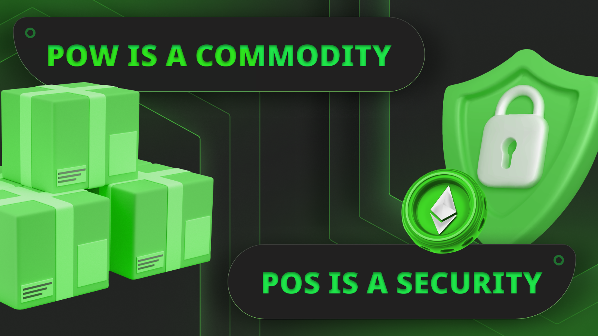
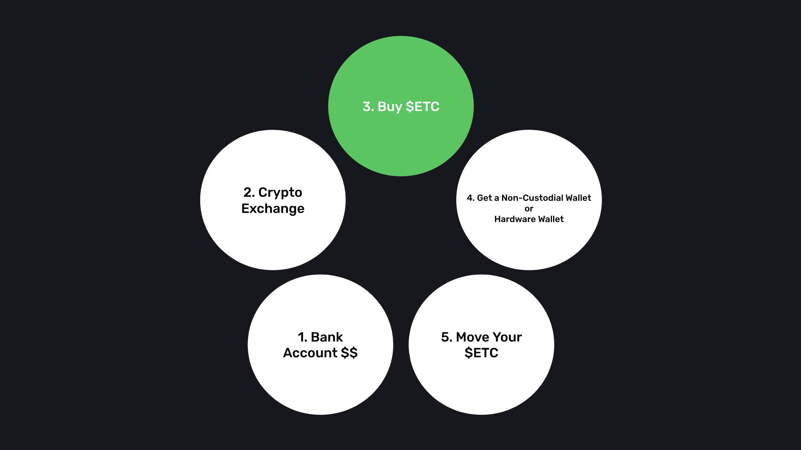
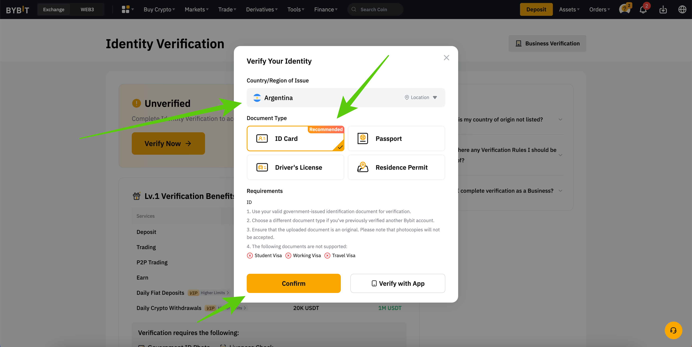
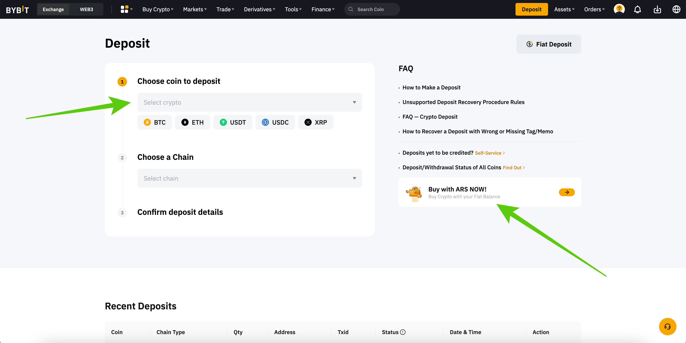
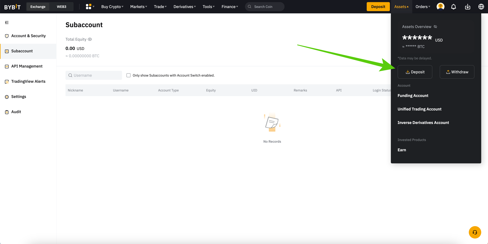
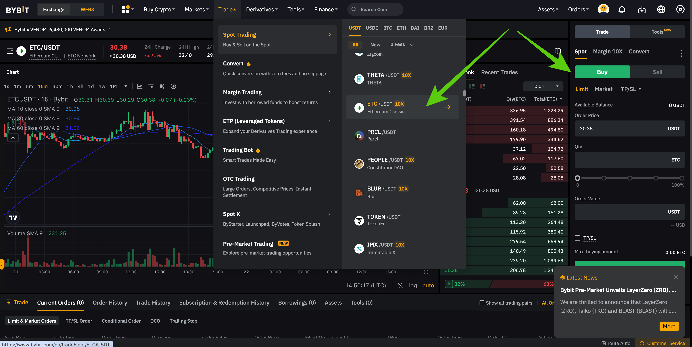
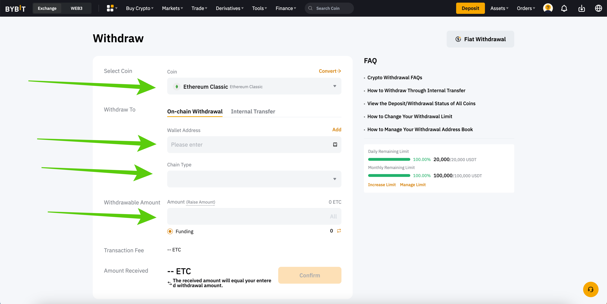
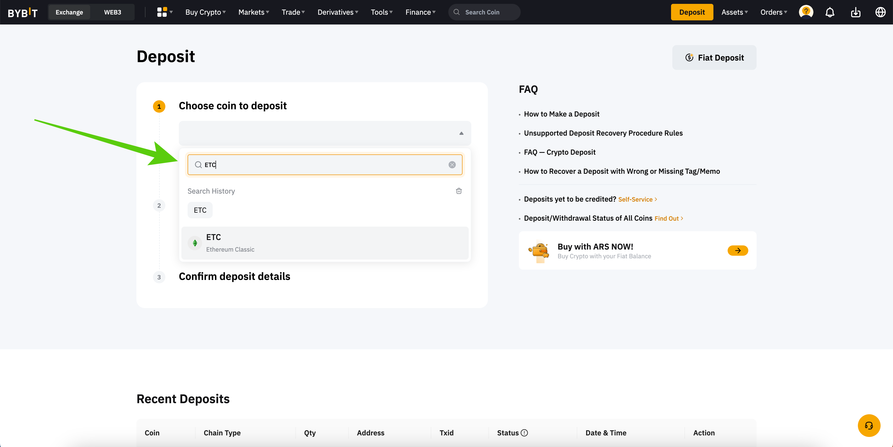

---
**You can listen to or watch this video here:**

<iframe width="560" height="315" src="https://www.youtube.com/embed/FUdUb_zDPTw" title="YouTube video player" frameborder="0" allow="accelerometer; autoplay; clipboard-write; encrypted-media; gyroscope; picture-in-picture; web-share" allowfullscreen></iframe>

---

## What Is Bybit?

Bybit is a centralized cryptocurrency exchange.

A centralized cryptocurrency exchange (CEX) is a virtual location on the internet that serves as a meeting point for trading crypto assets such as Bitcoin (BTC) and Ethereum Classic (ETC).

Bybit provides its servers over the internet for its customers to open accounts, send money, and start exchanging BTC, ETC, Ethereum (ETH), and other tokens.

CEXs must follow regulations, so they may be very restrictive, demanding customers to present evidence of identity and residence, performing background checks, and asking what is the source of their funds.

Among the risks of centralized exchanges is that they may go bankrupt and customers may lose their deposits and assets.

Bybit in particular is one of the largest cryptocurrency exchanges in the world, it started operations in 2018 and, according to its website, it has more than 20 million customers, its daily average trading volume is more than $10 billion, and it operates in more than 160 countries.

## Moving Your ETC to Non-Custodial Wallets

Although you may be using a centralized cryptocurrency exchange for buying and trading in Ethereum Classic, the best way to [manage your ETC](https://ethereumclassic.org/blog/2023-05-31-how-to-start-using-etc-from-scratch) is to buy them in the centralized exchanges but then moving them to [non-custodial wallets](https://ethereumclassic.org/blog/2023-05-04-ethereum-classic-course-20-what-are-custodial-and-non-custodial-wallets) that you control.

The steps are as follows:

1. You start with your cash in your bank account
2. You move your cash to the crypto exchange
3. You buy ETC at the crypto exchange
4. You get a non-custodial wallet or hardware wallet
5. You move all your ETC to your non-custodial wallet

The above method is the most secure method because you end up with your ETC on the blockchain directly, under your own control with your private keys, rather than at the centralized exchange, under their control.

In other words, it is more trust minimized.

## Opening a Bybit Account

The first step to create your account on Bybit will be to go to [Bybit.com](https://bybit.com), then press on the “Sign up” button, and proceed with the next steps.

The next steps will involve a process of verification. Bybit uses this system to comply with “Know Your Customer”, “Anti-Money Laundering”, and other laws in various countries.

The first thing Bybit will ask you for is your personal information. If you live in the United States, Bybit.com will reject your application as it only operates outside of the US. For this post, we will show how Bybit works out of Argentina to provide a generic international account demonstration.

The first data point that they ask for to open an account is your email address or phone number so they may send you a code to verify it.

Then, Bybit will verify your identity with a government ID and other information.

Again, all these steps are because they need to make sure they know you for compliance reasons.

## Depositing Crypto or Money to Bybit

After creating your account on Bybit, you can deposit crypto to it. To do this go to the “Deposit” button on the top right of the website.

The deposit options are to send crypto assets such as Bitcoin, USDT, and others to your account or to use their local fiat currency service.

If you wish to use their local fiat currency service they will send you to their peer-to-peer market where you will be able to buy a crypto in the local market such as Bitcoin or USDT and then send it to your Bybit account.

To buy ETC you need to deposit or transform your crypto assets to USDT on Bybit as ETC/USDT is the trading pair that it supports for trading Ethereum Classic.

## Bybit as a Wallet

Many people around the world use Bybit as their main wallet. This is not the best for securing your crypto as we explained above, but for keeping some of your crypto for trading or to make crypto payments it is acceptable.

It is always best to keep at least 80% of your crypto secure in self custody wallets or hardware wallets.

Nevertheless, Bybit does have easy “deposit” and “withdraw” features for crypto in your country.

By using the Bybit website or their mobile app, you may keep track of your holdings.

To see your assets on your Bybit account you need to go to the “Main account” link on your profile dropdown menu.

## Buying ETC on Bybit

Once you are all set with the Bybit account and you moved USDT to it or exchanged another crypto asset to USDT to buy ETC, then you will be ready to buy or trade Ethereum Classic on the exchange.

This is because global crypto markets don’t trade in all the currencies of the world, but in a few reserve currencies, or against other major cryptocurrencies. However, most trade against the stablecoin that tracks the US dollar called “Tether” of which its symbol is ”USDT”.

If you move your local currency to USDT using the Bybit “P2P trading” service, then you will be ready to purchase ETC!

To trade USDT for ETC go to the “Trade” menu item on the top menu, then hover to the “Spot Trading” option, and then scroll down on the USDT column to find the ETC/USDT trading pair.

Then, on the right hand side of the page you will find the order ticket where you will be able to buy ETC using your USDT.

If you sent other crypto assets to trade ETC, such as Bitcoin, then you will need to exchange it there for USDT first.

## Sending ETC

When you buy ETC on Bybit, they will probably become available to withdraw after your initial purchase of USDT is cleared in your local currency if you used their peer-to-peer service. After this, you will be able to send them to your non-custodial wallet or other destinations.

If you live in a jurisdiction that has instant bank transfers or other fast money transfer systems, you may have your purchased ETC available for withdrawal sooner.

The way to send your ETC to your non-custodial wallet or to any other destination is by clicking on the “Withdraw” link on the “Assets” item on the top menu.

Then, on the “Withdraw” page, search and select ETC as the coin to send, put the ETC address you wish to send it to, select ETC as the chain type, select the amount to send, and send it.

## Receiving ETC

To receive ETC, you need to go again to your Bybit “Assets” menu, and then click on the “Deposit” link.

In the “Deposit” page, search and select ETC as the coin you wish to deposit, select ETC as the “chain type”, copy the address provided, and use it to send ETC to your account from your non-custodial wallet or to give it to third parties to send you ETC.

## Who Uses Bybit for Buying and Selling ETC?

**Investors:** ETC is an excellent long term investment alternative. This has attracted many investors who use exchanges such as Bybit to transfer their funds to exchange them for Ethereum Classic. However, these ETC buyers should think of moving their holdings to non-custodial wallets as explained before, so their assets may be more secure.

**Miners:** A segment that uses exchanges frequently to trade ETC are miners. Ethereum Classic miners earn an average of 17,000 ETC per day at the time of this writing, but they have to pay for their operations, which include payroll, data center costs, and electricity costs. For this, they usually liquidate some of their daily earnings on exchanges such as Bybit to transform them into cash to pay for their bills.

**Speculators:** Trading volumes on ETC are high globally and much of this is by speculators who trade daily on exchanges such as Bybit. These participants are beneficial to the ecosystem as they provide liquidity to all other buyers and sellers.

**Merchants:** Merchants who let their customers purchase items with ETC may use centralized exchanges such as Bybit to liquidate their holdings for paying for their business expenses.

---

**Thank you for reading this article!**

To learn more about ETC please go to: https://ethereumclassic.org
