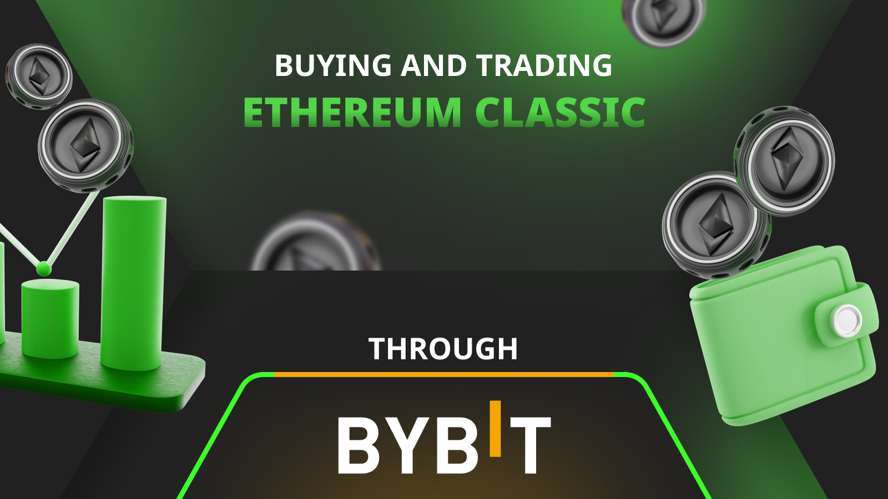

---
**由此收听或观看本期内容:**

<iframe width="560" height="315" src="https://www.youtube.com/embed/FUdUb_zDPTw" title="YouTube video player" frameborder="0" allow="accelerometer; autoplay; clipboard-write; encrypted-media; gyroscope; picture-in-picture; web-share" allowfullscreen></iframe>

---

## 什么是Bybit？

Bybit是一家中心化的加密货币交易所。

中心化加密货币交易所（CEX）是一个虚拟的互联网平台，用于交易比特币（BTC）和以太坊经典（ETC）等加密资产。

Bybit通过互联网提供服务器，供客户开设账户、汇款，并开始交易BTC、ETC、以太坊（ETH）和其他代币。

CEX必须遵守法规，因此可能非常严格，要求客户提供身份和居住地证明、进行背景调查，并询问资金来源。

中心化交易所的风险之一是它们可能破产，客户可能会失去他们的存款和资产。

Bybit特别是世界上最大的加密货币交易所之一，始于2018年，根据其网站，它拥有超过2000万客户，日均交易量超过100亿美元，并在160多个国家运营。

## 将您的ETC转移到非托管钱包

尽管您可能使用中心化加密货币交易所购买和交易以太坊经典，但管理您的ETC的最佳方式是在中心化交易所购买它们，然后将它们转移到您控制的非托管钱包。

步骤如下：

1. 从您的银行账户开始
2. 将您的现金转移到加密货币交易所
3. 在加密货币交易所购买ETC
4. 获取一个非托管钱包或硬件钱包
5. 将所有ETC转移到您的非托管钱包

以上方法是最安全的方法，因为您最终将您的ETC直接置于区块链上，受您自己的私钥控制，而不是在中心化交易所受其控制。

换句话说，这是最小化信任的方法。

## 开设Bybit账户

创建Bybit账户的第一步是访问[Bybit.com](https://bybit.com)，然后点击“注册”按钮，并进行下一步操作。

接下来的步骤将涉及验证过程。Bybit使用此系统来遵守各国的“了解您的客户”（KYC）和“反洗钱”等法律。

Bybit首先会要求您提供个人信息。如果您居住在美国，Bybit.com将拒绝您的申请，因为它只在美国以外运营。本文将展示在阿根廷开设国际账户的操作方法。

开设账户的第一个数据点是您的电子邮件地址或电话号码，以便他们可以发送代码进行验证。

然后，Bybit会通过政府ID和其他信息验证您的身份。

再次强调，所有这些步骤都是为了确保他们了解您，以便遵守法规。

## 向Bybit存入加密货币或资金

创建Bybit账户后，您可以向其中存入加密货币。为此，请访问网站右上角的“存款”按钮。

存款选项包括将比特币、USDT等加密资产发送到您的账户，或使用其本地法币服务。

如果您希望使用其本地法币服务，他们将引导您进入他们的点对点市场，您可以在本地市场上购买比特币或USDT，然后将其发送到您的Bybit账户。

要购买ETC，您需要在Bybit上存入或转换您的加密资产为USDT，因为ETC/USDT是支持交易以太坊经典的交易对。

## Bybit作为钱包

许多人将Bybit用作他们的主要钱包。这不是保护您加密货币的最佳方式，但对于保留一些用于交易或进行加密支付的加密货币来说是可以接受的。

最好将至少80%的加密货币保存在自托管钱包或硬件钱包中。

尽管如此，Bybit确实有方便的“存款”和“提取”功能，适用于您所在国家的加密货币。

通过使用Bybit网站或其移动应用程序，您可以跟踪您的持有量。

要查看您在Bybit账户上的资产，您需要访问个人资料下拉菜单中的“主账户”链接。

## 在Bybit上购买ETC

一旦您的Bybit账户设置完毕并将USDT转入或将其他加密资产兑换为USDT，您就可以在交易所购买或交易以太坊经典。

这是因为全球加密市场不使用世界上所有的货币进行交易，而是使用一些储备货币或其他主要加密货币。然而，大多数交易使用的是跟踪美元的稳定币“Tether”，其符号为“USDT”。

如果您使用Bybit的“点对点交易”服务将您的本地货币转换为USDT，那么您就可以购买ETC了！

要将USDT换成ETC，请访问顶部菜单的“交易”菜单项，然后悬停到“现货交易”选项，然后在USDT列中向下滚动找到ETC/USDT交易对。

然后，在页面右侧的订单票上，您可以使用您的USDT购买ETC。

如果您发送了其他加密资产来交易ETC，如比特币，那么您首先需要在那边将其兑换为USDT。

## 发送ETC

当您在Bybit上购买ETC后，它们可能会在您的本地货币的USDT初次购买完成后可提取。之后，您可以将它们发送到您的非托管钱包或其他目的地。

如果您居住在具有即时银行转账或其他快速资金转移系统的司法管辖区，您购买的ETC可能会更快可提取。

将您的ETC发送到您的非托管钱包或其他目的地的方法是点击顶部菜单中的“资产”项下的“提取”链接。

然后，在“提取”页面，搜索并选择ETC作为要发送的币种，输入您要发送的ETC地址，选择ETC作为链类型，选择要发送的数量，并发送。

## 接收ETC

要接收ETC，您需要再次访问Bybit的“资产”菜单，然后点击“存款”链接。

在“存款”页面，搜索并选择ETC作为您要存入的币种，选择ETC作为“链类型”，复制提供的地址，并使用它将ETC发送到您的账户，或将其提供给第三方发送ETC给您。

## 谁使用Bybit购买和出售ETC？

**投资者：** ETC是一种很好的长期投资选择。这吸引了许多投资者，他们使用Bybit等交易所将资金兑换成以太坊经典。然而，这些ETC买家应考虑将其持有量转移到非托管钱包，以使其资产更加安全。

**矿工：** 经常使用交易所交易ETC的一个群体是矿工。以太坊经典矿工平均每天赚取约17,000 ETC，但他们必须支付运营费用，包括工资、数据中心费用和电费。为此，他们通常在Bybit等交易所出售部分每日收益，以转换为现金支付账单。

**投机者：** 全球ETC交易量很高，其中很多是日常在Bybit等交易所交易的投机者。这些参与者对生态系统有益，因为他们为其他买家和卖家提供流动性。

**商人：** 允许客户使用ETC购买商品的商人可能使用Bybit等中心化交易所清算其持有量，以支付业务费用。

---

**感谢您阅读本文！**

要了解更多关于ETC的信息，请访问：https://ethereumclassic.org
