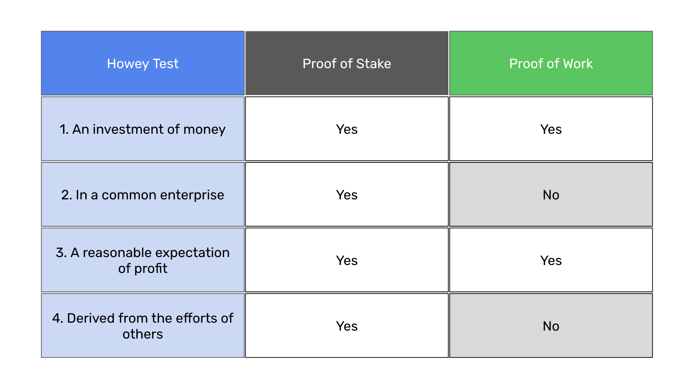

---
**You can listen to or watch this video here:**

<iframe width="560" height="315" src="https://www.youtube.com/embed/3ekCf_1D7gM" title="YouTube video player" frameborder="0" allow="accelerometer; autoplay; clipboard-write; encrypted-media; gyroscope; picture-in-picture; web-share" allowfullscreen></iframe>

---

In the previous class, 28, we talked about censorship resistance, why proof of work (POW) blockchains are censorship resistant, and proof of stake (POS) networks are not.

We explained the attributes of POW blockchains such as Bitcoin (BTC) and Ethereum Classic (ETC), what are the drivers of centralization in POS networks, and described how staking and mining pools work in both systems.

In this class, 29, we will make a similar comparison but from the standpoint of their regulatory status. We will explain why the cryptocurrencies of truly decentralized POW blockchains are commodities, and the ones of POS systems are securities.

## The SEC Says Staking Pools and Proof of Stake Networks are Securities

Although still in the courts, the Securities and Exchange Commission in the United States [has classified](https://axislc.com/public/u-s-sec-says-staking-is-a-security-and-why-staking-activities-are-securities/) staking through exchanges as a security and fined and shut down the Kraken staking pool in the US. 

However, this classification may extend to whole POS networks; [as happened](https://www.theblock.co/post/233174/solana-matic-cardano-others-securities-sec-binance-lawsuit) with Cardano, Polygon, and Solana; because POS is centralized as said in the previous class.

## What Is a Security?

A security in America means that it must be an investment of money, in a common enterprise, with an expectation of profit, that is derived from the effort of others. 

Any investment in a centralized entity that is operated by others would fall in this description.

As may be seen in the table in this section, if we compare POS with POW, we will realize that POS checks all the boxes of what is called the [Howey test](https://www.investopedia.com/does-crypto-pass-the-howey-test-8385183), the legal definition test of a security. 

This is because they are centralized systems controlled by corporations or foundations and staking elites.

## Proof of Work Is Not a Security 

In the case of POW, it is clear that blockchains such as BTC and ETC are not securities because they are not common enterprises as they are trust minimized, censorship resistant, and permissionless.

If POW networks are a collection of strangers from around the world that don’t even know each other, then they do not provide profits derived from the efforts of others.

Because POW is truly decentralized, then it avoids the categories of common enterprise and that returns are dependent on third parties. 

Indeed, the brilliant invention of Bitcoin was not hard money on the internet, it was to accomplish true decentralization using POW based Nakamoto Consensus.

In POW blockchains, each participant uses or joins and leaves the system in their complete isolation with no dependence on others. 

## What Makes Proof of Stake a Security?

Proof that POS, and other non-POW solutions, are centralized and, therefore, securities is that immediately after the classification as securities by the SEC the organizations that created Cardano and Solana started their informal and formal [defenses](https://www.coindesk.com/policy/2023/06/09/cardano-developer-rejects-sec-claim-its-ada-token-is-a-security/) [of their systems](https://www.coindesk.com/policy/2023/06/08/solana-foundation-sol-is-not-a-security/) in the United States.

They can do this because these systems have corporations, foundations, developers, and administrators that created, manage, and lead them.

If we define the firm as a legal entity that puts together the founders, shareholders, a unit of value that distributes its ownership and rights, and a set of rules that governs the system, we can perfectly fit this analogy to POS systems.

POS networks are what may be described as “synthetic firms”.

## POW Doesn't Have Kings, Presidents, CEO's, or Administrators

In contrast with POS, POW blockchains have no organizations or leaders that anyone can prosecute or fine, or that could formally represent those systems for legal defenses. 

POW networks have no corporations, foundations, developers, or administrators that created, manage, and lead them.

Whatever is their regulatory status, they would just keep working regardless of what people say about them or how they are classified in the legal system.

For example, BTC and ETC don’t have any ICO or VC funding, big development teams, or well funded foundations or corporations managing them.

All these parts in the ecosystem grow organically and in a distributed manner globally not only because the world knows that BTC and ETC have true decentralist principles, but because their decentralist principles are actually encoded in their systems and scale with them.

## Why Is it Important for the Law to Distinguish These Things

That networks such as Ethereum and Ripple, and all other proof of stake and proof of authority networks, including all dapp utility tokens that have DAOs with governance voting, must be declared securities is not because they will be taken out of the market, but because the truth of their centralization, legal liability, and fiduciary duty must be unveiled.

Unfortunately, if they find them to be unregistered securities, regulators will fine the developer teams, corporations, and foundations supporting Ethereum, Ripple, Cardano, Avalanche, Solana, Polkadot, and all the other false "decentralized" coins only between $25M and $50M at most, [as they did](https://www.sec.gov/news/press-release/2019-202) with EOS in 2019, and that will be all. 

They will survive the new status, but the information that they are centralized is the key. Only well designed POW blockchains are truly decentralized blockchains. 

In any civilized society just laws must apply fairly to all and truth must prevail.

---

**Thank you for reading this article!**

To learn more about ETC please go to: https://ethereumclassic.org
