---
**由此收听或观看本期内容:**

<iframe width="560" height="315" src="https://www.youtube.com/embed/cd-Mea3UrRg" title="YouTube video player" frameborder="0" allow="accelerometer; autoplay; clipboard-write; encrypted-media; gyroscope; picture-in-picture; web-share" allowfullscreen></iframe>

---

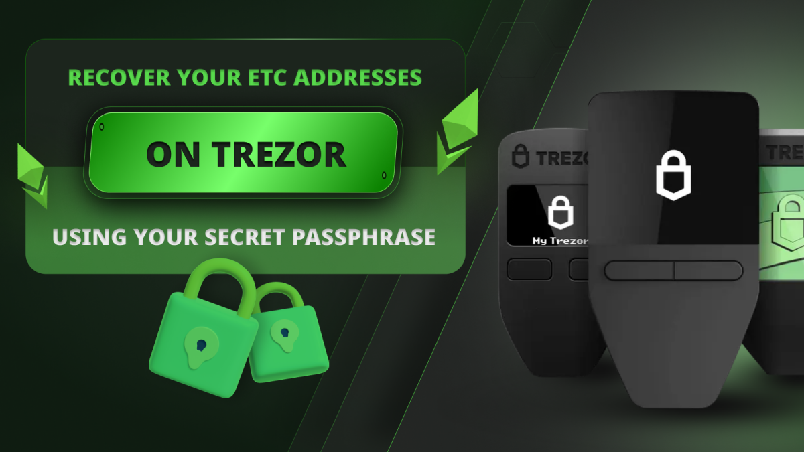

在本文中，我们将解释如何使用您的秘密密码短语在Trezor Safe 3上恢复您的ETC地址。这在您的Trezor Safe 3丢失、被盗或损坏时是必需的。

秘密密码短语或助记词是一组12、18或24个单词，您应将其写在纸上并保存在安全的地方，正如我们在[我们的文章](https://ethereumclassic.org/blog/2024-03-27-using-ethereum-classic-with-trezor)中解释的那样，关于如何使用Trezor Safe 3与ETC。

## Trezor硬件和软件组件

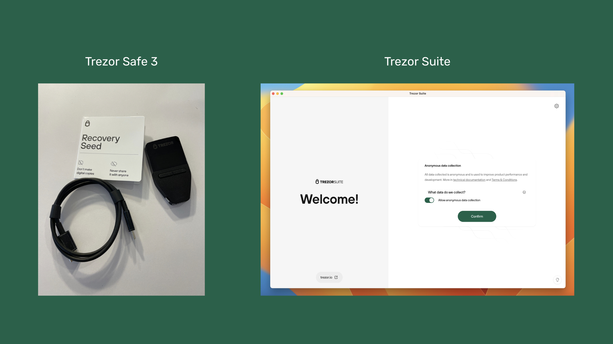

Trezor Safe 3是一款硬件钱包，因此要恢复它，您需要获得一个新的Trezor Safe 3设备，并在您的电脑上重新安装Trezor Suite应用程序。您还需要首次安装时写下的12、18或24个单词的秘密密码短语或助记词。

在接下来的部分中，我们将解释如何使用您的Trezor秘密密码短语来恢复您的ETC地址。

我们将在适当的时候展示您在Trezor Safe 3设备和电脑上的并行操作。

## 1. 访问Trezor启动页面并获取Trezor Suite应用程序

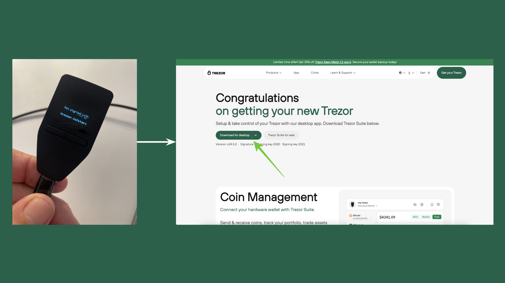

当您拆箱并将新的Trezor Safe 3连接到电脑时，首先它会要求您访问https://trezor.io/start。

在您的电脑浏览器中访问该页面，下载适用于您的操作系统的Trezor Suite应用程序并打开它。

## 2. 打开Trezor Suite并安装固件

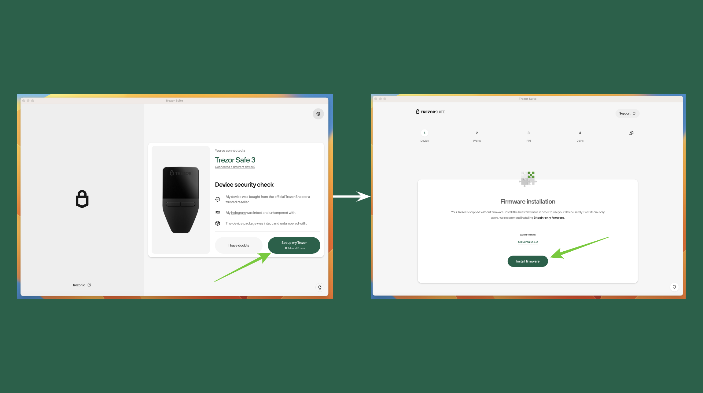

当您在电脑上打开Trezor Suite时，它会显示设备安全检查。阅读并完成检查后，点击“设置我的Trezor”按钮。

在下一个屏幕上，点击“安装固件”。

## 3. 设备检查、教程和恢复钱包

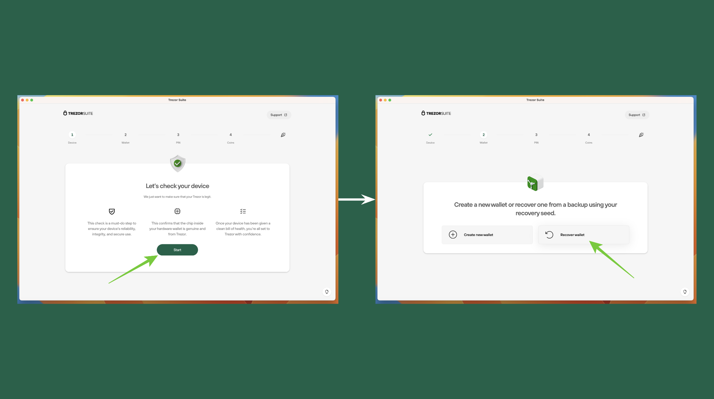

在接下来的几个屏幕中，Trezor将执行设备检查。在设备上，接受设备检查。

然后，Trezor会要求您完成一个教程。这是为新用户准备的，您可以跳过教程。

跳过教程后，您会看到“创建新钱包”或“恢复钱包”的选项。由于我们正在使用12、18或24个单词的秘密密码短语来恢复您的ETC地址，因此我们需要点击“恢复钱包”。

## 4. 开始恢复

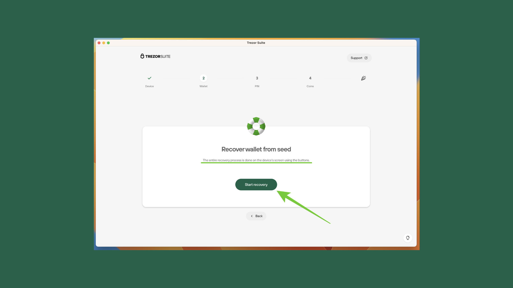

在下一个屏幕中，Trezor Suite会提示您开始恢复。它还会告诉您整个恢复过程将在您的Trezor Safe 3设备上进行。

要开始恢复过程，请点击“开始恢复”。

## 5. 选择单词数量

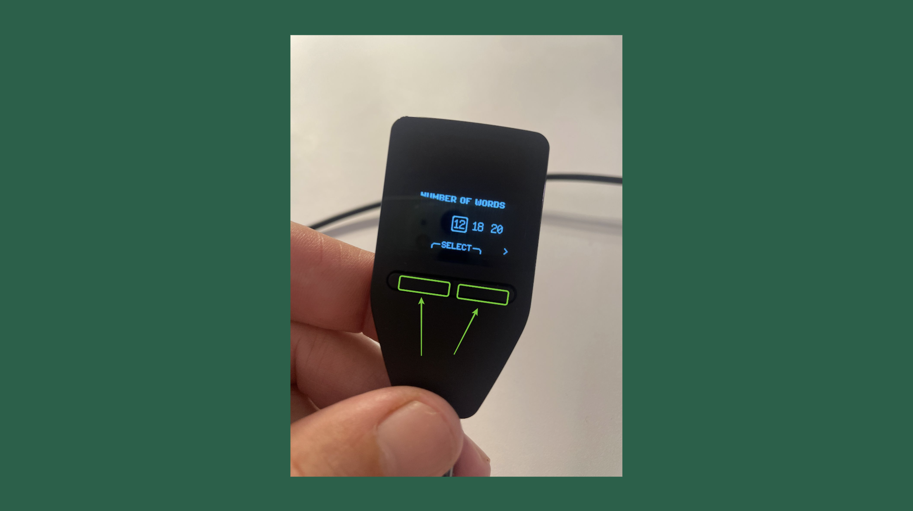

在Trezor Safe 3设备上的下一个步骤中，您将通过一系列提示来恢复您的钱包。当您需要选择恢复备份的单词数量时，我们将在此示例中选择12个单词，因为我们在首次设置Trezor时选择了该数量的单词作为秘密密码短语。

但是，您可能有18或24个单词，所以如果是这种情况，请选择相应的数量。

选择恢复的单词数量后，按照图片中的指示，同时按下设备上的两个按钮。

## 6. 输入您的12、18或24个单词

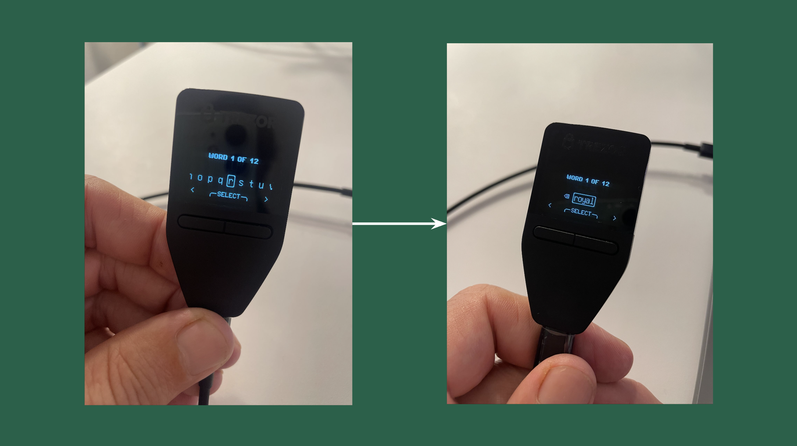

阅读Trezor Safe 3设备上的说明后，开始输入单词以恢复您的ETC地址。

您只需要输入每个单词的2到4个字母。当您输入每个单词的2到4个字母时，设备会显示您可以选择的单词选项。在每一轮输入中，务必小心选择与您的密码短语对应的单词。

## 7. 成功！

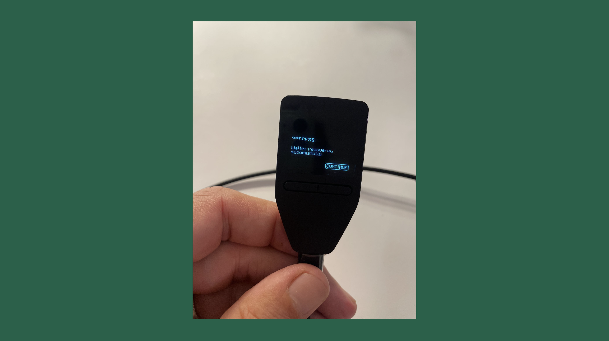

在您的Trezor Safe 3设备上输入12、18或24个单词的秘密密码短语后，它会提示您操作成功。从这里，您需要在电脑上的Trezor Suite应用程序中完成恢复过程。

## 8. 设置PIN或跳过

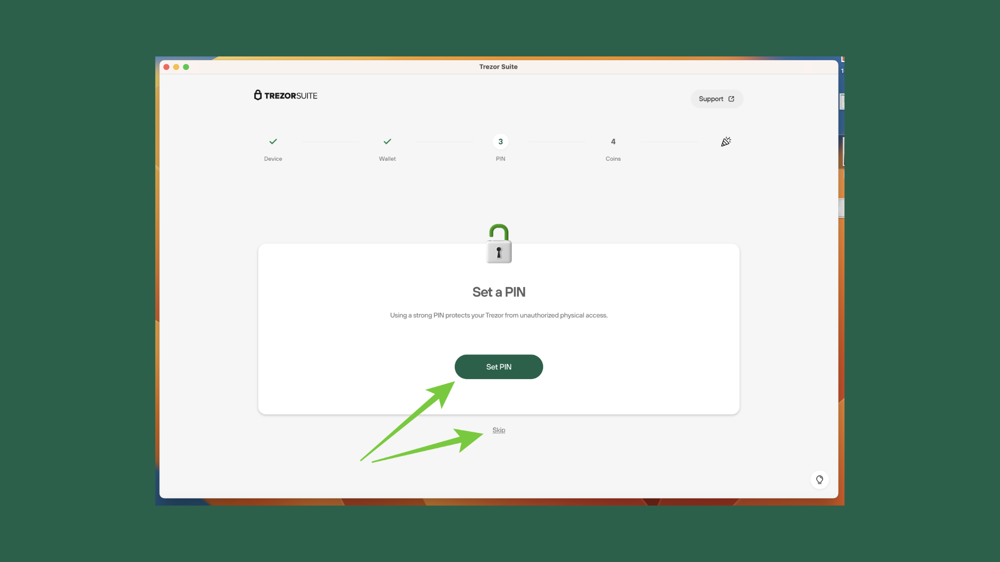

在下一个屏幕中，Trezor Suite会提示您设置PIN码，就像您之前在旧的Trezor Safe 3设备上设置的一样。

点击“设置PIN”或“跳过”如果您不想为您的Trezor设置PIN码。

## 9. 激活ETC

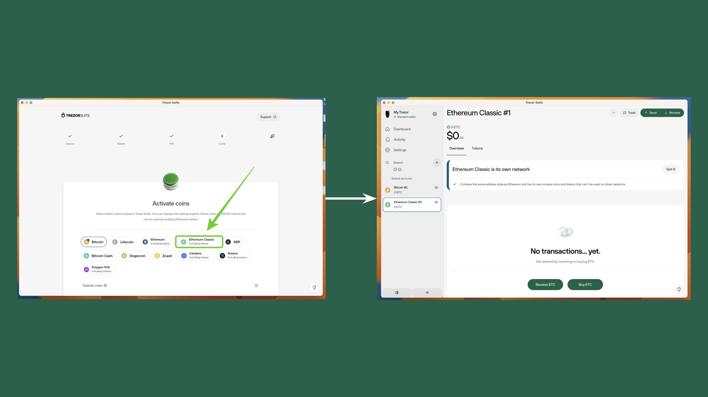

最后，在您设置PIN码或跳过该步骤后，Trezor Suite应用程序会要求您激活硬币。

要再次添加您的旧ETC地址，请点击“Ethereum Classic”按钮并完成激活ETC和添加地址的过程。

如果您有多个ETC地址，您可以多次重复此过程，所有地址都会被恢复。

---

**感谢您阅读本文！**

要了解更多关于ETC的信息，请访问：https://ethereumclassic.org
