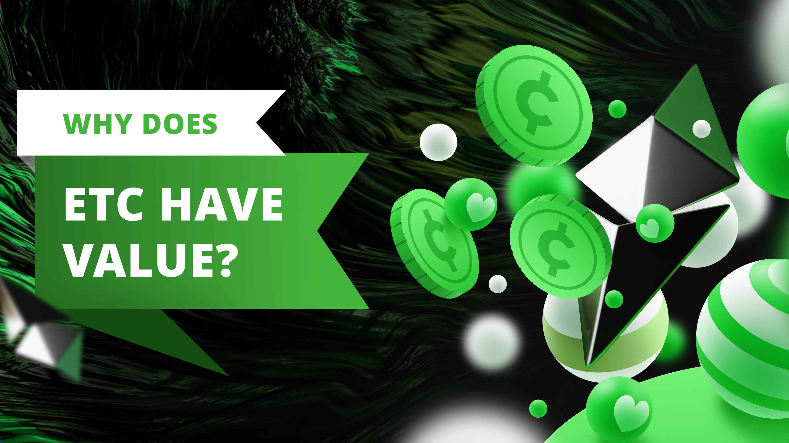
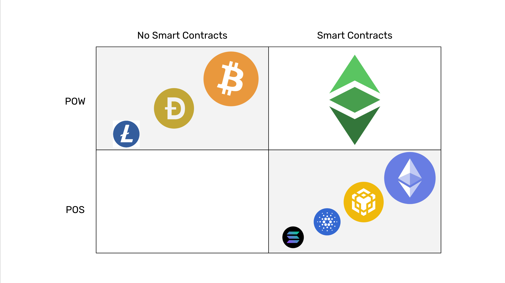

---
**由此收听或观看本期内容:**

<iframe width="560" height="315" src="https://www.youtube.com/embed/s4WN5VEd-Uc" title="YouTube video player" frameborder="0" allow="accelerometer; autoplay; clipboard-write; encrypted-media; gyroscope; picture-in-picture; web-share" allowfullscreen></iframe>

---

在前面的课程28和29中，我们从抗审查和其作为商品或证券的监管地位的角度比较了工作量证明（POW）和权益证明（POS）。

在本课程30中，我们将这些概念应用于以太坊经典（ETC），解释为什么它有价值。

鉴于以太坊和以太坊经典的历史和现状，以及ETC似乎是一个次级链的事实，我们将解释其优势，并为什么它应该成为世界上最大的区块链之一。

## ETC的核心

行业内的许多人会问自己，ETC为什么有价值？

核心原因是ETC是一条工作量证明（POW）区块链，具有固定的货币政策，并在其高度安全的环境中支持智能合约。

这种属性组合使ETC成为可编程的数字黄金。

工作量证明是保持区块链无许可的唯一真正去中心化设计。随着时间的推移，当我们看到其他系统中的审查和不稳定性时，这一点变得更加明显。

固定的货币政策和供应上限，加上POW，使ETC成为硬通货，而硬通货使其成为像比特币（BTC）一样的数字黄金。

智能合约是添加可编程性的组成部分，使ETC独一无二。

## ETC的安全内部环境

上述属性使ETC非常有吸引力，因为应用程序可以存在于其高度安全的环境内，而不是通过不安全的连接存在于外部。

例如，比特币有诸如[RSK](https://www.investopedia.com/news/what-rsk-it-threat-ethereum/)和[BitVM](https://bitvm.org/)等解决方案来为其系统添加智能合约，但它们是外部设备和设计，永远无法达到在其POW环境内拥有去中心化程序的安全性。

在ETC中，带有账户和余额的分类账支持添加智能合约，从而使ETC成为可编程货币，也称为“可编程数字黄金”。

## ETC的定位

在定位方面，ETC是POW并具有智能合约，这是一种非常有价值的定位，因为在以太坊转向权益证明之后，ETC仍然是世界上最大的POW可编程区块链，是数字黄金。

比特币、狗狗币（DOGE）和莱特币（Litecoin）等优秀系统是POW区块链，但仅支持带有账户和余额的分类账，因此在其POW环境内最多只能将硬币从一个地址转移到另一个地址。

以太坊、BNB智能链、Cardano、Solana和其他POS智能合约网络无法与ETC的POW安全性相媲美。这使它们成为可编程区块链，但它们无法像ETC那样成为数字黄金。它们更适合作为可编程的社区法定货币。

## 为什么市场没有看到以太坊经典的价值

上述原因解释了为什么ETC有如此大的价值，但问题是，为什么市场没有看到这一点？

答案是因为以太坊基金会和ICO资助的POS项目仍然拥有大量的炒作和资金。

这些组织和社区有能力继续误导市场，声称POS更安全、更具可扩展性、更创新、可以拯救树木，以及所有这些虚假陈述。

不幸的是，这就是当今世界的运作方式。伦理和真理排在最后，而机会主义和误导排在第一。

## 时间将证明哪些区块链是真正去中心化的

然而，在区块链行业中，真相最终会浮现，因为人们会用他们的财富和基本权利来支付中心化的代价。

届时，ETC可能会得到更广泛的认可。

随着时间的推移，POW + 数字黄金 + 可编程性的组合具有巨大的价值将变得显而易见，而POS是中心化的，因此排名将相应调整。

在某种程度上，POS和权威证明（POA）系统是陷阱。人们正在蜂拥而至，投资他们的储蓄并使用他们的dapps，但当他们被锁定时，政府可能会捕获这些网络，然后人们会感到被背叛。

只有在像ETC这样的系统中，才能不遵守即将到来的科技暴政。

## 以太坊经典中的应用是世界上最安全的

因此，既然ETC是可编程的比特币，那么我们在本课程第16课中所写的内容得到了确认；

*“总而言之，以太坊经典是世界上最安全的应用程序存在的环境，因为它是一条工作量证明区块链，因此真正去中心化；它有一个固定的货币政策，因此它是健全的货币；并且它是可编程的，因此比替代方案更加多功能和安全。*

*除了这些品质之外，ETC还是一个完全复制的区块链，这增加了它的安全性；并且是可组合的，这降低了风险和结算成本；并且是世界上最大的结合了这种设计的区块链！*

*这些在同一集成系统中的属性提供了最高水平的去中心化，从而最小化了信任，从而为托管在其中的任何应用程序提供了安全性。”*

---

**感谢您阅读本文！**

要了解更多关于ETC的信息，请访问：https://ethereumclassic.org
