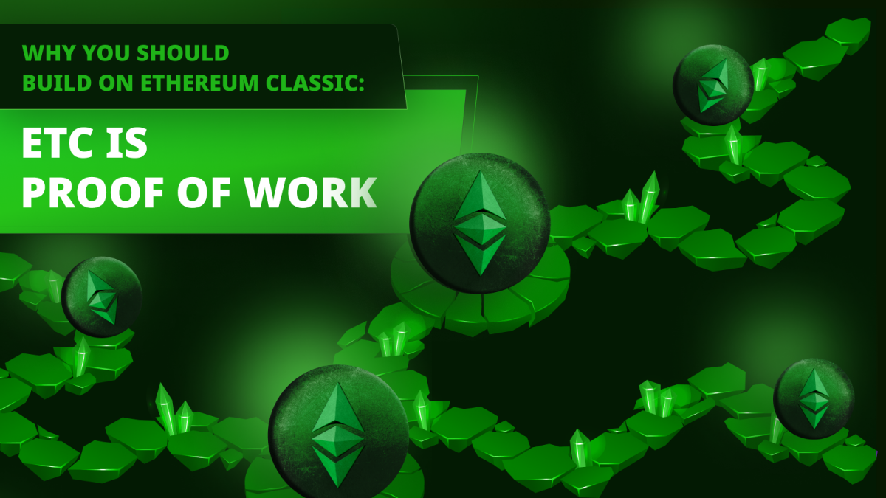

---
**You can listen to or watch this video here:**

<iframe width="560" height="315" src="https://www.youtube.com/embed/5UTFslKruSI" title="YouTube video player" frameborder="0" allow="accelerometer; autoplay; clipboard-write; encrypted-media; gyroscope; picture-in-picture; web-share" allowfullscreen></iframe>

---

This post is the first of a series that will explain to dapp developers why they should build on Ethereum Classic (ETC).

The titles of the series will start with the prefix “Why You Should Build on Ethereum Classic” and followed by the highlighted feature of that post.

The 9 highlighted features in this series will be:

- ETC Is Proof of Work
- ETC is Hard Money
- ETC Is Programmable
- ETC Is Fully Replicated
- ETC Is Composable
- ETC Is the Largest POW Smart Contracts Blockchain in the World
- Applications in ETC are the Most Secure Apps in the World
- ETC Is Code Is Law
- ETC Is Bitcoin but With Ethereum Technology

In this post we will explain why developers should build on ETC because it is proof of work (POW).

## The Purpose of Blockchains Is Trust Minimization

Trust minimization is the highest value in true blockchains such as ETC, and should also be for your dapps!

The whole point of creating Bitcoin, the first blockchain, was to reduce the dependency on the banking system and central banks.

Indeed, Satoshi Nakamoto mentioned trust minimization 14 times in the Bitcoin white paper!

Trust minimization means that your users should know that their money and functions of your dapp on ETC will not be subject to the whims of any trusted third party or even the developer team.

Additionally, it is not enough for your dapp to be trust minimized by design if the underlying platform on which it is running is not. 

## Trust Minimization Enables Censorship Resistance

For example, you could actually build your app to work the same way on AWS, Azure, or Google Cloud, but you know that those services are centralized and captured by government and special interests, meaning that your app may be censored whenever they wish.

Trust minimization is the opposite of censorship. 

Because the dependency on trusted third parties is significantly reduced, then there is no entity or team that controls the system and, therefore, there is no way that government or special interests can capture it.

This is very powerful because it does not only entail that your users will not be prevented from transacting with your dapps, but you as a developer will not be restricted when deploying your smart contracts or launching them.

## Trust Minimization Enables Permissionlessness

On ETC, not only will user transactions not be censored when sent to the blockchain, but creating and holding addresses and assets on various dapps by the public will be permissionless.

Permissionlessness means that users don’t have to fill out forms, give their IDs, or pass background checks just to have an account on the ETC blockchain and interacting with your dapps.

And, again, this also applies to your team. Sending smart contracts to ETC is completely permissionless.

Indeed, today developer teams from all over the world have deployed dapps on ETC without barriers imposed by trusted thirds parties.

## Only Proof of Work Is Decentralized

The important thing to understand of all this is that only the technology of proof of work can enable decentralization in a blockchain on a global scale.

Proof of work based Nakamoto Consensus in ETC enables all nodes and miners around the world to be synchronized on the same state of the blockchain every 13 seconds without the need to consult or check with any trusted third party!

This means that anyone can join and leave the network running a node or mining whenever they wish. 

This is the key to decentralization, and decentralization means trust minimization, and trust minimization means censorship resistance and permissionlessness for your dapps and users.

## Proof of Work Makes Your Dapps Safer

Because of all of these reasons, a POW blockchain as ETC is the only environment where your dapps will be safe.

If your dapps are safe in ETC, then your users can rest assured that their money and interactions with your dapps will be safe.

The problem with proof of stake (POS) and proof of authority (POA) systems such as Ethereum, Solana, and Ripple is that today they may seem decentralized, but the truth is that by doing away with POW they have eliminated the decentralization that enables trust minimization.

This means that it will become very easy for government and special interests to capture these systems in the future and start censoring and restricting them. 

## Proof of Work Gives Your Users More Confidence

As the world realizes that POW in ETC is the only way of keeping accounts, balances, and applications decentralized and safe, then, in time, they will gain more confidence in the system and migrate to it.

More confidence in ETC will foster more confidence in well designed and decentralized dapps on that blockchain.

As users migrate to ETC, developer teams who pioneered the way by building useful dapps on that blockchain will reap the benefits of their vision.

---

**Thank you for reading this article!**

To learn more about ETC please go to: https://ethereumclassic.org
