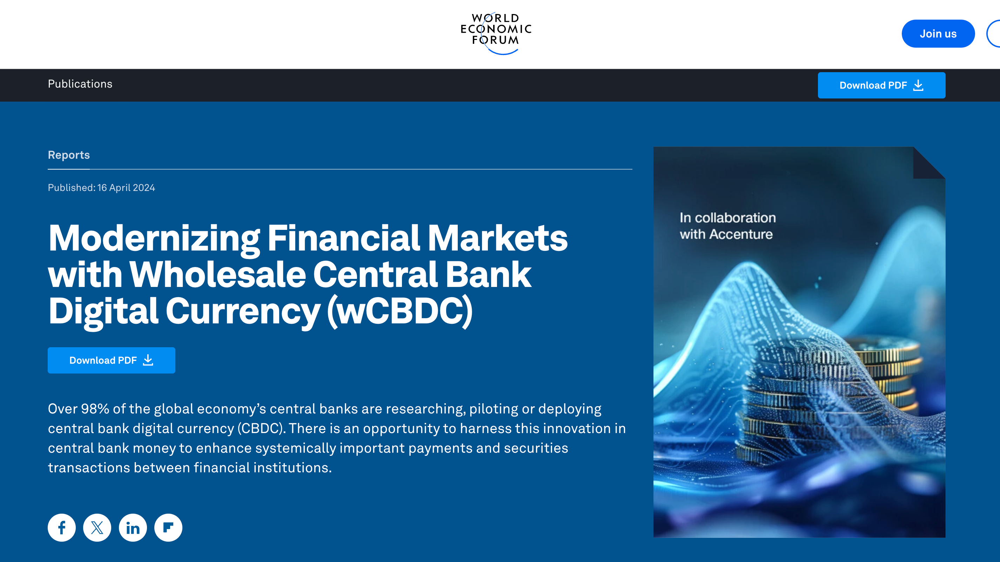
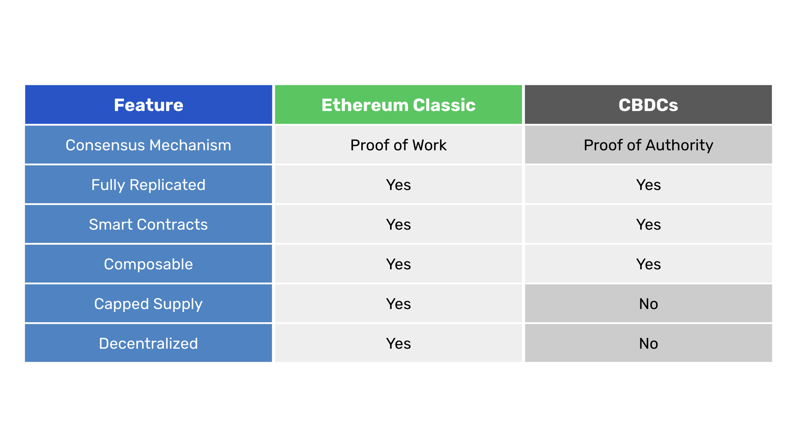
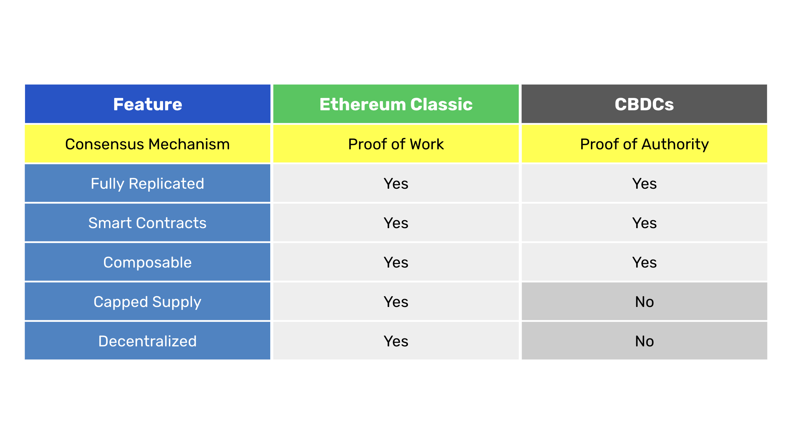
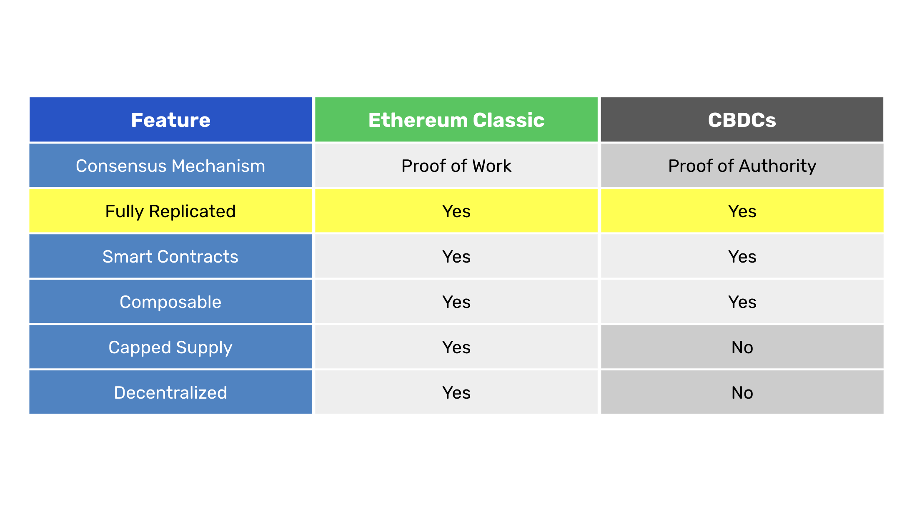
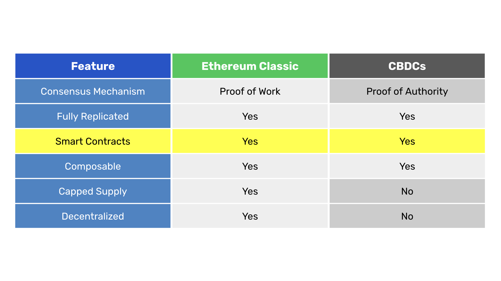
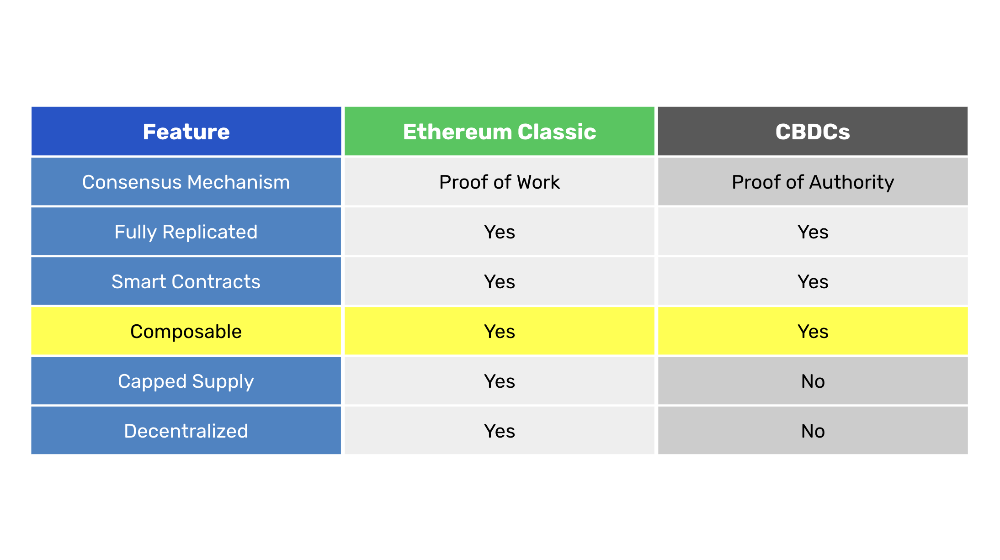
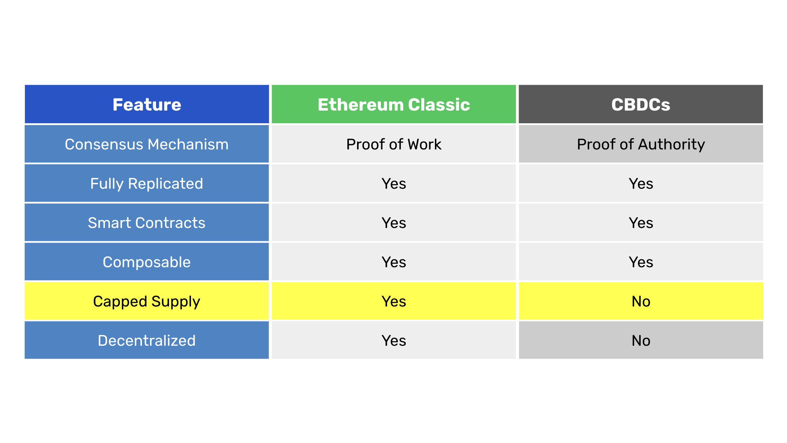
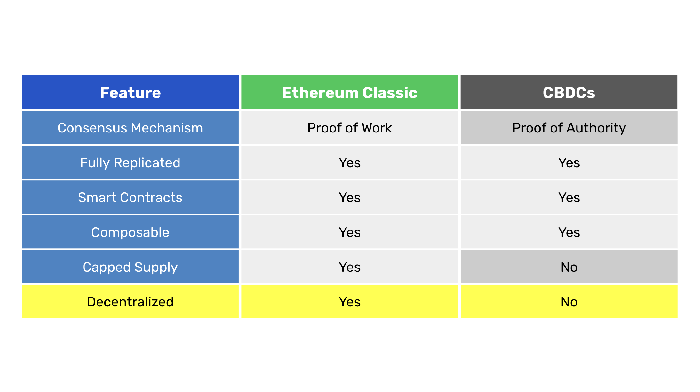

---
**由此收听或观看本期内容:**

<iframe width="560" height="315" src="https://www.youtube.com/embed/IDr_mPliX70" title="YouTube video player" frameborder="0" allow="accelerometer; autoplay; clipboard-write; encrypted-media; gyroscope; picture-in-picture; web-share" allowfullscreen></iframe>

---

随着全球各地的中央银行竞相推出中央银行数字货币（CBDCs）以取悦诸如[世界经济论坛](https://www.weforum.org/publications/modernizing-financial-markets-with-wcbdc/)等全球精英，我们作为公民只能通过学习和了解这些新技术对我们的生活、自由和财产的影响来应对。

为了说明什么是CBDCs，一个好的方法是将它们与以太坊经典（ETC）进行比较。

ETC是世界上最安全和先进的区块链技术，而CBDCs则试图模仿其设计，但添加了中央控制和规划的装置。

比特币并不是他们可以效仿的有用模式，因为它过于基础，无法实现任何形式的中央规划。

然而，由Vitalik Buterin发明的EVM模型，是ETC所遵循的设计，非常多功能，并且只有在与基于工作量证明的中本聪共识机制结合使用时，才是真正去中心化的。

甚至以太坊（ETH）如今也不是去中心化的。

ETH在2022年决定从POW迁移到权益证明（POS），这将其转变为ETC和CBDCs之间的混合体。

然而，这种混合体由于不使用任何工作来实现去中心化，容易被政府和特殊利益团体捕获，就像CBDCs本质上和构造上已经被捕获一样。

在接下来的部分中，我们将对比ETC和CBDCs，以说明这些系统的惊人相似之处，同时也展示它们之间的关键区别，这些区别基本上意味着自由和专制的区别。

## 对比表

上表列出了我们将比较的ETC和CBDCs的特性，并标明它们如何满足每个规格。

下面我们将逐行解释这些比较。

### 共识机制

如前所述，使区块链网络去中心化的唯一方法是使用工作量证明作为共识机制。这一现实在区块链行业中产生了三个部分：POW去中心化区块链，如比特币和以太坊经典；POS或权威证明（POA）网络，如以太坊和瑞波；以及严格的POA中央规划政府系统，如CBDCs。

虽然看起来非政府的POS和POA加密货币可能是中间的某种混合体，但这只是光学错觉。POS和POA网络与金融机构一样容易被政府和特殊利益团体捕获。这些系统中也没有信任最小化。

POW意味着矿工进行大量计算工作来构建区块；POS意味着权益持有人出资构建区块；POA意味着受信实体可以构建区块；而CBDCs意味着政府许可的银行和实体可以在这些系统中构建区块。

我们可以说，CBDCs是超级集中的。

### 完全复制

区块链安全的核心在于数据在网络的所有参与节点中完全复制。这是政府和银行最初讨厌的，因为它涉及向公众开放用户使用的所有账户、产品和应用的信息。

更重要的是，这种透明性也显著减少了银行对其客户的锁定，并揭示了其高昂定价和费用的重负。

然而，现在金融系统、中央银行和政府，尤其是安全和间谍机构，对这些技术非常感兴趣，因为信息的透明和全球复制对监控和控制人口来说是一个巨大的机会。

在传统金融系统中，所有数据都分布在由不同金融机构控制的独立数据中心。

例如，美国银行有自己的数据中心，存有其产品和客户信息，摩根大通有自己的独立系统，信用卡公司有自己的交易处理网络，支付应用如PayPal和Stripe将客户账户和余额的状态保存在自己的云端。

所有这些独立且不协调的系统代表了一个戈尔迪之结，使得政府和监控系统难以高效和及时地捕获所有信息。

然而，像ETC这样的完全复制的区块链意味着系统中的所有参与节点都拥有网络中发生的所有信息。

CBDCs模仿了这一特性，使其像ETC一样完全复制，因为现在这些系统中的所有参与节点将拥有经济中发生的所有信息，其细节和粒度水平前所未有。

不仅如此，完全复制的区块链以毫秒级的全球范围内将客户交易的信息传递给系统中的所有节点。

这意味着，当世界上任何人使用CBDC进行交易时，其交易将在实时被其本地政府、安全和间谍机构、国家政府，甚至是联合国、世界卫生组织和世界银行等多边机构知晓！

### 智能合约

作为EVM技术，ETC和CBDCs支持智能合约，这意味着它们是可编程的。

可编程性使加密货币非常灵活，但也可用于集中系统如CBDCs，以对公民进行更多控制。

例如，今天为了执行没收或暂停账户的使用，相关当局或政府必须向所有金融机构发送消息以冻结客户的资产或抑制其账户。

由于可编程区块链将所有去中心化应用放在同一系统中，并且这些去中心化应用可以在集群中互动，现在当局或政府可以只向区块链发送一个交易，所有节点操作员将在几秒钟内知道哪些用户、地址和资产需要干预。

完全复制和可编程性的结合，赋予了前一节所列的各级政府极大的权力，这些政府将知道所有这些活动。

一旦他们拥有了这种权力，他们将能够通过社会评分、碳足迹、是否服用规定的医疗处方、政治关联等多种方式对每个人进行剖析。

所有这些衡量工具都是暴政的工具，完全主观且广泛，增强了他们随意执行其世界观和压迫的能力。

### 组合性

作为完全复制和可编程的区块链，ETC和CBDCs都是可组合的。

组合性意味着用户可以同时与多个去中心化应用互动，因为复杂的多应用交易可以在单一交易执行中进行。

再次强调，所有这些对系统中的所有参与节点都是可见的，这些节点可能是回应全球精英的科技公司、安全和间谍机构、本地和国家政府，甚至是多边组织。

在CBDCs中，组合性进一步增强了中央规划者监视用户和控制其交易的能力。

令人难以置信的是，完全复制、智能合约和组合性在公众使用的不同系统上有如此相反的效果。

在ETC上，由于它是POW和真正的去中心化区块链，用户可以享受安全、可编程性和组合性的好处，使他们的储蓄和财富更安全，减少对可信第三方的依赖，并降低成本和结算风险。

然而，在使用CBDCs时，这些相同的特性实际上代表了中央规划者和控制者对整个人口施加意志的全部范围。

例如，在CBDCs上，科技公司、监控机构和多边组织可以协调执行其政治议程。

这些包括气候变化政策；全球健康紧急限制；多样性、公平和包容教条；环境、社会和治理企业限制；反犹主义；以及任何其他种类的任意哲学或意识形态。

在不久的将来，通过CBDCs，政府和政治活动家将能够控制人们是否购买肉类，是否向教堂捐款，或者是否给汽车加油。

CBDCs是中央规划者梦想成真的工具！

### 供应上限

就区别而言，CBDCs永远不会模仿ETC的一个特点，那就是其供应上限。

如果暴政需要无限期地资助其方式，那就是无休止的印钞。

作为世界储备货币；如美元、人民币、英镑、欧元和日元；将被转变为CBDCs，这些国家和州将继续通过利率和货币供应变化来操纵其经济。

相反，ETC不仅代表自由，还通过作为[数字黄金](https://ethereumclassic.org/blog/2023-11-22-ethereum-classic-is-programmable-digital-gold)来保护其用户财富的价值。

### 去中心化

毋庸置疑，ETC是真正去中心化的，而CBDCs是超级集中的。

再次强调，这是因为POW是唯一允许去中心化的共识机制。

在CBDC中，系统中唯一参与节点的方式是从控制它的中央银行获得许可。

在POW中，世界上任何计算机都可以下载ETC软件并开始运行节点或开始挖矿。

ETC中的节点和矿工可以匿名加入和离开网络，无需咨询任何第三方或请求许可，也没有审查风险。

在CBDCs中，金融提供者和用户必须经历繁琐的官僚程序，甚至才能在其系统中开户！

在一个文化、政治和意识形态差异显著加深的世界里，技术使得对整个社会进行中央计划和控制成为可能，不难想象，那些不愿意顺应社会上各种集体狂热形式的人将会受到各种形式的迫害。

团体将会因不遵循政府和特殊利益集团的不合理和任意指令而遭受完全的取消、甚至监禁，甚至更糟。

在这种情况下，理解这些技术之间的差异以便进行辨别显得尤为重要。

---

**感谢您阅读这篇文章！**

想了解更多关于 ETC 的信息，请访问：https://ethereumclassic.org
