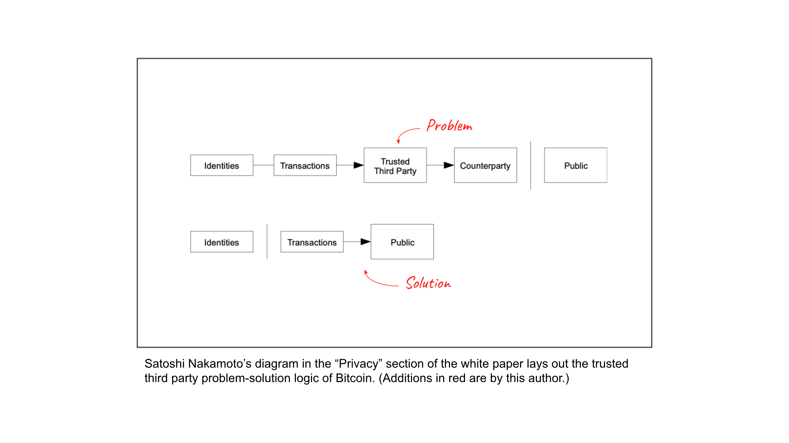

---
**You can listen to or watch this video here:**

<iframe width="560" height="315" src="https://www.youtube.com/embed/vl_esIzHRmg" title="YouTube video player" frameborder="0" allow="accelerometer; autoplay; clipboard-write; encrypted-media; gyroscope; picture-in-picture; web-share" allowfullscreen></iframe>

---

In the previous class, 30, we explained why Ethereum Classic (ETC) has value by describing its core features of proof of work (POW), hard money, and smart contracts, and we argued why it has a unique and valuable position in the industry.

In this class, 31, we will talk about the focus of POW blockchains, which is that they always seek trust minimization. 

We will explain the meaning of trust minimization and its benefits, and why it is the root of security in blockchains such as ETC and Bitcoin.

Trust minimization is important because trusted third parties in traditional systems manage our information and wealth, but they can behave badly or be hacked by crooks. 

Also, it is a general assumption in these systems that wherever trust is deposited, that trust will always be abused.

## Satoshi Was Focused on Trust Minimization

POW is about trust minimization. 

Proof of this is that Satoshi Nakamoto actually mentioned trust minimization [14 times](https://etherplan.com/2020/02/29/satoshi-nakamoto-mentioned-trust-minimization-14-times-in-the-bitcoin-white-paper/10210/) in the Bitcoin white paper. 

For example, right from the get-go, in the abstract he wrote “but the main benefits are lost if a trusted third party is still required”.

In the context of the blockchain industry, the term “security” means to depend the least possible on trusted third parties when it comes to money and applications to manage that money.

Mr. Nakamoto was sharp-focused on trust minimization and the device he invented to achieve the decentralization needed to accomplish it was proof of work.

## “Trustless” Is Not the Correct Term

As my mentor, Nick Szabo, taught me, it is important to understand that POW is a trust minimization technology, not a “trustless” technology as frequently simplified. 

Even in Bitcoin there is some minimal marginal dependency, thus trust, in the aggregate of miners, node operators, and core developers of the system.

Indeed, if all node operators, miners, mining pools, and developers of Bitcoin were to agree on a nefarious change on the system, they could theoretically do it.

However, this is highly unlikely because of what is called the “[coordination problem](https://ethereumclassic.org/blog/2023-03-02-ethereum-classic-course-11-ethereum-classic-social-and-physical-layer-security#4-social-layer-coordination-problem-security)”, which is a barrier to implementing unwanted changes due to Bitcoin’s physical decentralization and ability of participants to [split from the system](https://ethereumclassic.org/blog/2024-03-07-etc-proof-of-work-course-17-pow-has-division-of-power-pos-does-not#the-right-to-split) whenever they wish.

## The Issue of Toxicity

The difference between trustlessness and trust minimization is important to understand because it sheds additional light on the issue of “toxicity” and the need for strong opposition to bad ideas proposed for future upgrades of POW blockchains.

Because these systems are truly decentralized, then there are no administrators or leaders dictating the direction of the projects.

The only way to argue for or against a change is by sheer brute force on discussion channels and social media.

Indeed, toxicity is actually good for POW decentralized blockchains because it is the only way to stop nefarious changes into these systems.

## Proof of Stake and Proof of Authority Are Centralized

Of course, as POW is trust minimized, the same cannot be said of POS or POA consensus networks. 

These are technologies nearly as centralized and trust maximized as traditional corporate and government systems.

We say “nearly” because there is a small degree of decentralization in the fact that their information is fully replicated in all nodes of the system.

However, because of their efficient economies of scale, very few players actually control these systems. This means that, because these blockchains have no work done, it is very easy for them to reverse past transactions.

Also, because they are managed by concentrated special interests, they can easily censor them and make irregular state changes going forward.

## Trust Minimization = Censorship Resistance

An important benefit of trust minimization produced by POW is censorship resistance.

Censorship resistance means that, as long as they are correctly formed according to protocol rules, anyone in the world may send a transaction or smart contract to a proof of work blockchain without the risk of them being stopped or cancelled by any central authority for any reason.

Censorship resistance is achieved because anyone in the world may put a computer to run a node in a network as ETC or Bitcoin and that node will send and receive all transactions that reach it. 

In the same way, anyone may start mining ETC or Bitcoin whenever they wish from anywhere in the world. 

All this means that there will always be a node or miner willing to include a transaction in the system, no matter its origin or purpose.

## Trust Minimization = Permissionlessness

The other important benefit of POW is permissionlessness.

Although similar to censorship resistance, permissionlessness is more focused on the participants rather than on the free flow of transactions and smart contracts.

If a blockchain that hosts accounts, balances, and smart contracts requires permission to participate as in the traditional banking industry, then all the benefits of decentralization are lost.

Permission means that to run a node, to mine, or to send transactions and smart contracts to a network people need special permissions, it requires identification, and the need to prove the source and destination of funds to be able to do these things.

Permissionlessness in blockchains such as ETC and Bitcoin means no such restrictions and is achieved by the same POW mechanism that keeps the network synchronized without the need to check with any third parties.

This is why trust minimization enabled by proof of work is the root of security in truly decentralized blockchains.

---

**Thank you for reading this article!**

To learn more about ETC please go to: https://ethereumclassic.org
