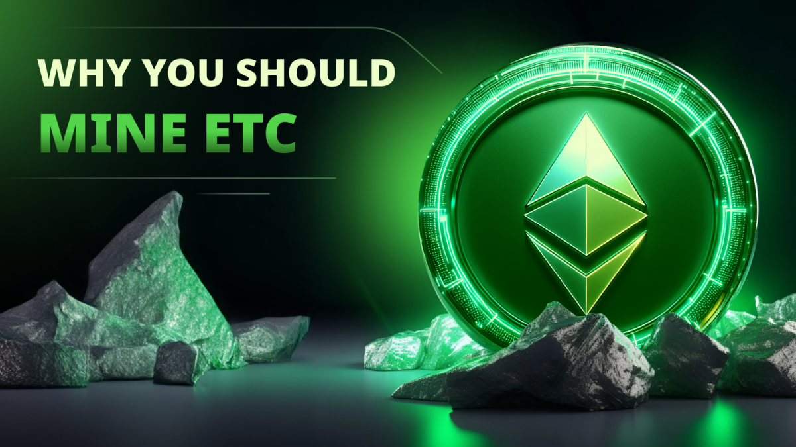
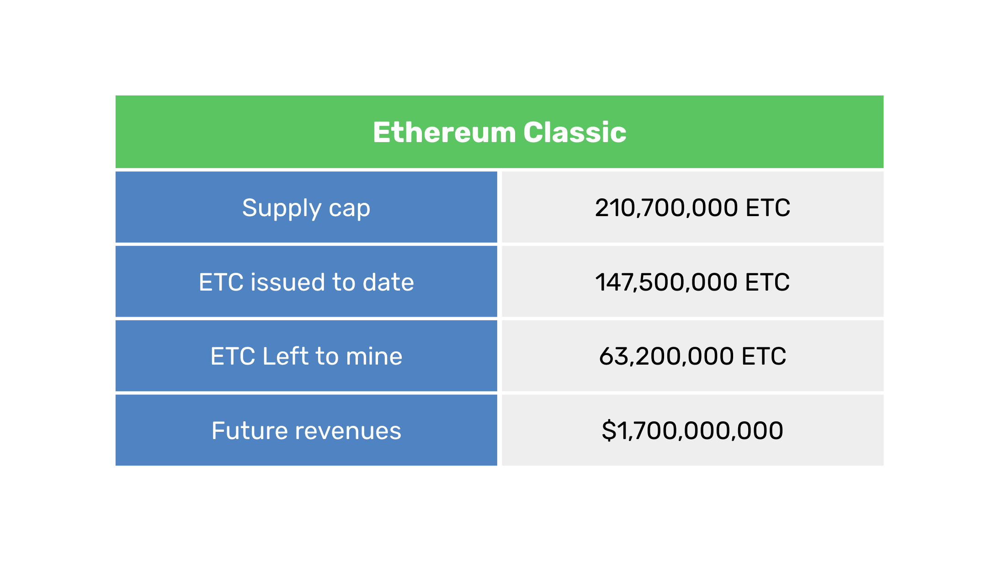
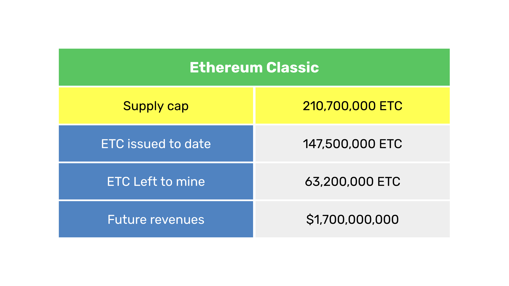
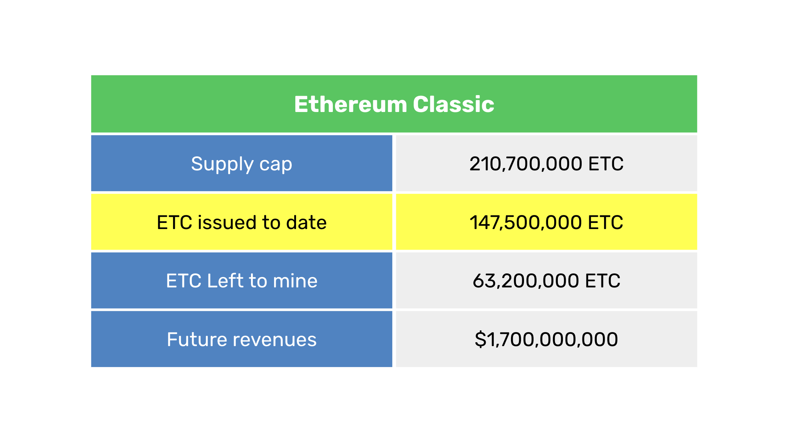
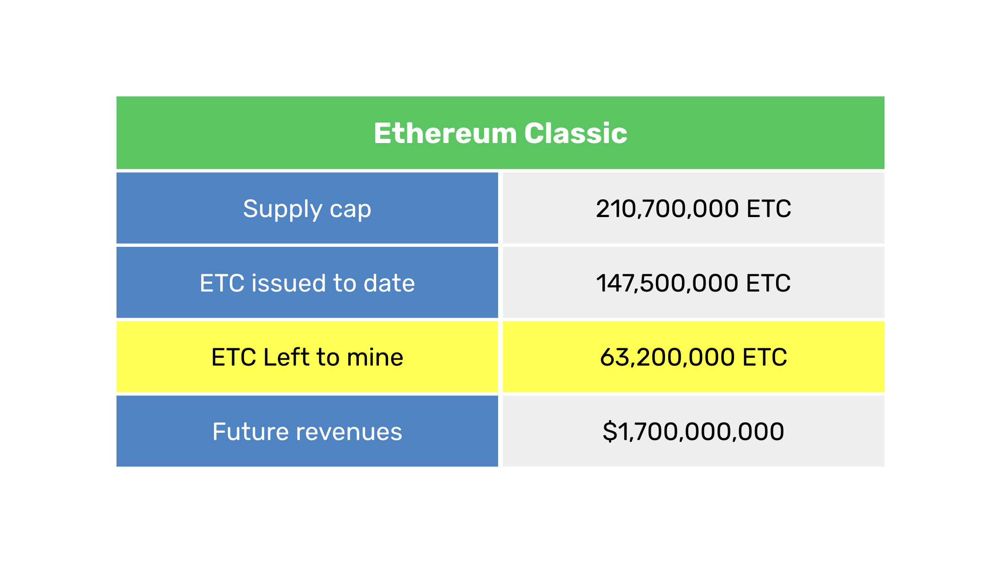
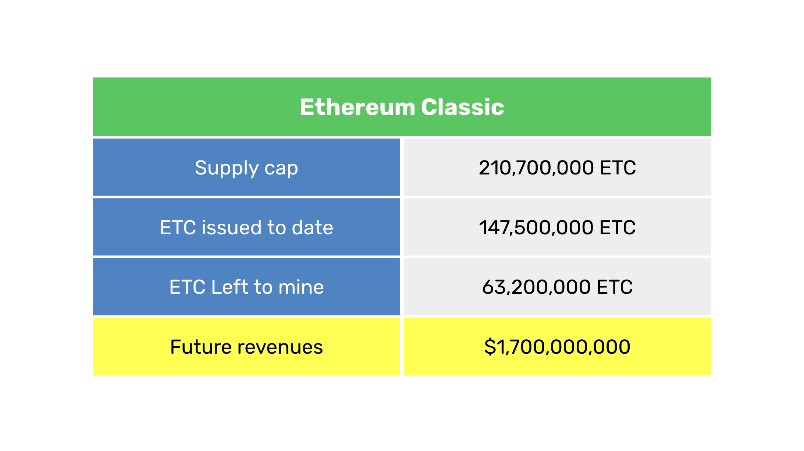

---
**由此收听或观看本期内容:**

<iframe width="560" height="315" src="https://www.youtube.com/embed/q0PKDo_FFyM" title="YouTube video player" frameborder="0" allow="accelerometer; autoplay; clipboard-write; encrypted-media; gyroscope; picture-in-picture; web-share" allowfullscreen></iframe>

---

挖矿是工作量证明（PoW）区块链的基本本地业务。

矿工通过算力（哈希率）为区块链提供计算能力，以便每个区块能够以非常高的成本进行标记。

这些标记是系统中所有节点和其他矿工需要知道的唯一信息，用以完全去中心化的方式确认每一轮中的正确区块。

这种系统在比特币（BTC）上已经连续运行了15年，在以太坊经典（ETC）上已经运行了9年。

矿工们将他们的机器用于像ETC这样的区块链的动力是每个区块的奖励。

这些奖励包括以新创建的ETC形式支付的每个区块的报酬，以及每个区块中所有交易的费用。

你应该挖掘ETC的原因在于它所代表的收益机会！

确实，ETC将在未来几年内产生大量收入，那些挖掘它的人将享受其成功和增长带来的好处。

在上表中，我们列出了量化ETC总可用市场的四个主要指标，这些指标不包括交易费用，而交易费用有望同样巨大！

在接下来的部分中，我们将解释每个指标及其对矿工的意义。

## 供应上限

比特币的一个显著特点是它有一个自始至终设定的固定供应量。系统于2009年开始每个区块支付50个BTC，并且每210,000个区块减半支付一次。

通过计算，可以推算出比特币将在2130年代某个时间达到21,000,000 BTC的供应上限。

以太坊经典在2017年采用了类似的货币政策。ETC开始时每个区块支付5个ETC，并且从那时起，每5,000,000个区块减20%。

通过计算，可以推算出以太坊经典将在与比特币相同的时间达到210,700,000个供应上限。

这种供应上限使ETC成为数字黄金，因此挖掘这种数字黄金是矿工们业务的关键。

## 已发行的ETC

当以太坊和以太坊经典在2015年还是一个区块链时，网络启动时预挖了72,009,990枚硬币。这是ETC在开始之前发行的初始库存。

在撰写本文时，我们处于第20,081,198个区块，ETC的总供应量接近1.475亿ETC，确切地说是147,494,079.63 ETC。

这个库存包括以下几个部分：

- 预挖：72,009,990
- 区块奖励：73,966,294
- 叔块：1,517,796

叔块是少量的发行量，支付给那些偶尔同时生成有效区块但未被纳入规范链的矿工。

已发行的ETC指标对于计算剩余的ETC具有重要意义。

## 剩余的ETC

剩余的ETC指标对矿工来说至关重要，因为它量化了业务的总可用市场！

这是通过从供应上限数量中减去已发行的ETC数量来计算的。

如果ETC的总供应量为210.7百万，那么从中减去已发行的总库存，即1.475亿，我们将得到未来剩余的ETC。

这个数字是63,200,000 ETC。

然而，剩余的ETC并不是均匀分布在直到2130年代的所有年份中。由于递减的货币政策，大约50%的剩余ETC将在未来10年内支付给矿工。这是一个巨大的机会！

## 未来收入

如果我们将剩余的ETC乘以过去几周ETC的平均价格，我们将得出一个大约17亿美元的美元数字。

这意味着如果一切保持不变，ETC矿工将赚取17亿美元，其中50%将在未来10年内赚取。

然而，矿工们需要考虑两个方面。首先，ETC是一条可能继续增长的区块链，这意味着ETC的价格可能会上涨，使这些收入估算相形见绌。

其次，矿工们在挖掘ETC的过程中可能会积累ETC作为储备，这将很可能成为未来的伟大投资。

## 挖矿设备

要开始你的ETC矿工之旅，你必须购买专用计算机，称为ASICs。

为了方便你，我们介绍了一些你可能觉得有用的品牌：

**BITMAIN Antminer:** https://ethereumclassic.org/blog/2023-06-07-mining-ethereum-classic-with-an-antminer-e9-pro-through-antpool

**Jasminer:** https://ethereumclassic.org/blog/2023-11-07-mining-ethereum-classic-with-the-jasminer-x16-q-high-throughput-quiet-miner

**iPollo:** https://ethereumclassic.org/blog/2023-03-14-mining-ethereum-classic-with-an-ipollo-asic-through-2miners-pool

## 矿池

一旦你拥有了矿机，你需要将机器连接到矿池。

我们在这个网站上也介绍了矿池：

**F2pool:** https://ethereumclassic.org/blog/2023-09-13-mining-ethereum-classic-through-f2pool

**一般矿池:** https://ethereumclassic.org/blog/2024-03-06-what-do-mining-pools-do-in-ethereum-classic

我们希望这些信息能帮助你开始你的ETC挖矿业务！

---

**感谢阅读本文！**

想了解更多关于ETC的信息，请访问：https://ethereumclassic.org
