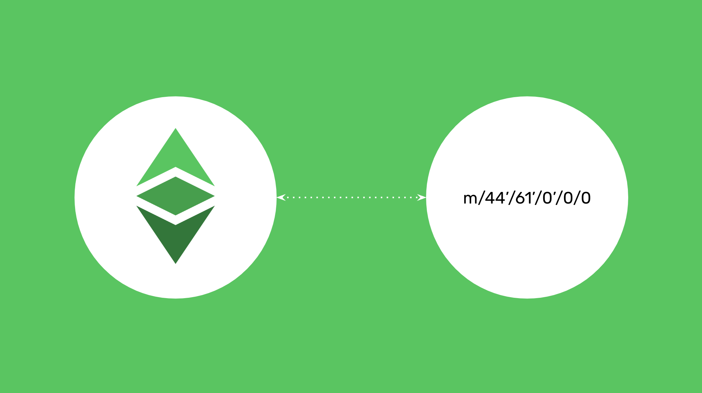

---
**由此收听或观看本期内容:**

<iframe width="560" height="315" src="https://www.youtube.com/embed/m_fRfs2II-k" title="YouTube video player" frameborder="0" allow="accelerometer; autoplay; clipboard-write; encrypted-media; gyroscope; picture-in-picture; web-share" allowfullscreen></iframe>

---


## 什么是推导路径？

现在使用加密货币的许多人都熟悉需要将秘密密码短语写在纸上或放在安全的地方，以便能够恢复他们的区块链地址。

它们的工作原理是用来生成多个区块链的私钥和公钥对。

为了生成这些区块链的多个密钥，以及每个区块链的多个地址，它们会经过所谓的推导路径：

```
秘密密码短语 -> 推导路径 -> 多条链 -> 多个地址
```

某种程度上，推导路径是一种分割路径的方法，以便同一个根密码短语可用于生成多个私钥和公钥对。

## 使用您的秘密密码短语与其他钱包

推导路径的结构如下：

```
m / purpose' / coin_type' / account' / change / address_index
```

“m”只是一个符号，表示这是一个推导路径；“purpose”项表示它与哪个[BIP](https://www.coindesk.com/learn/what-are-bips-and-why-they-matter-to-bitcoins-future/)相关；“coin_type”项表示它为哪个区块链生成密钥对的ID；“account”项是序列中的地址的序号，以便生成更多地址。

其他两个项要么是比特币特有的，要么很少使用。

例如，从一个秘密密码短语生成比特币地址的推导路径是：

```
m/84’/0’/0’/0/0
```

“84”是此地址对应的BIP，“0”是比特币的链ID，“0”是要生成的序列中的第一个地址。

然而，如果使用不同的推导路径，例如：

```
m/84’/0’/1’/0/0
```

那么会生成一个完全不同的私钥和地址！

由于多年来，几个钱包品牌使用了不同的标准，这导致了一些人尝试恢复他们的地址或迁移到不同的钱包时出现了一些麻烦和问题。

例如，如果有人在MetaMask上创建了ETC地址，但将他们的秘密密码短语转移到Trust Wallet上，那么他们将无法在那里看到他们的ETC地址！

这是因为它们使用了不同的推导路径。

## 什么是以太坊经典的标准推导路径？



鉴于市场上存在这种情况，我们在此呼吁钱包品牌请使用ETC的标准推导路径。

ETC的推导路径与以太坊非常相似。

以太坊的标准基础推导路径是：

```
m/44’/60’/0’/0/0
```

“coin_type”是60，因为这是以太坊的链ID。

以太坊经典的标准推导路径是：

```
m/44’/61’/0’/0/0
```

这是基础推导路径，具有正确的“coin_type”，所有钱包都应该使用它。

## 用户如何生成更多ETC地址？

上面我们说“基础推导路径”，因为它仅用于生成第一个私钥和地址对。

从那里开始，要生成更多地址，必须继续“account”项中的序列，如下所示：

```
m/44’/61’/0’/0/0
```

```
m/44’/61’/1’/0/0
```

```
m/44’/61’/2’/0/0
```

```
m/44’/61’/3’/0/0
```

等等。

以上每一个推导路径都会生成ETC中的不同私钥和公钥对。

## 向MetaMask发出的呼吁

ETC用户面临的主要问题是他们使用MetaMask作为最受欢迎的以太坊虚拟机钱包之一，但MetaMask使用以太坊推导路径生成ETC地址，即：

```
m/44’/60’/0’/0/0
```

我们恳请MetaMask团队配置他们的钱包，使用户在将以太坊经典添加到他们的MetaMask时，使用链ID 61，也使用以下具有正确“coin_type”的基础推导路径，如下所示：

```
m/44’/61’/0’/0/0
```

## 向MyEtherWallet发出的呼吁

在MyEtherWallet (MEW)的情况下，当用户将Ledger硬件钱包链接到他们的应用程序时，使用了一个奇怪的基础推导路径。

MEW为Ledger ETC地址使用的推导路径如下：

```
m/44’/60’/160720’/0/0
```

但Ledger实际上使用正确的ETC标准推导路径，因此我们恳请MEW在其服务中使用Ledger时调整ETC的推导路径，应如下所示：

```
m/44’/61’/0’/0/0
```

## 如果在不同的钱包中看到不同的地址，不必担心！

上述所有内容不应使ETC用户感到担忧，因为这只是不同钱包中的一种整理问题。

要恢复或看到在其他钱包中看起来不同的ETC地址，只需纠正推导路径。

尽管MetaMask目前不允许这样做，但其他钱包如MyEtherWallet和MyCrypto确实允许用户选择他们的推导路径。

这意味着，即使您在使用相同的秘密密码短语时在使用不同钱包时最初看不到您的地址，您的地址仍然在您的控制之下，并且有办法重新获得访问权限。

---

**感谢您阅读本文！**

要了解更多关于ETC的信息，请访问：https://ethereumclassic.org
