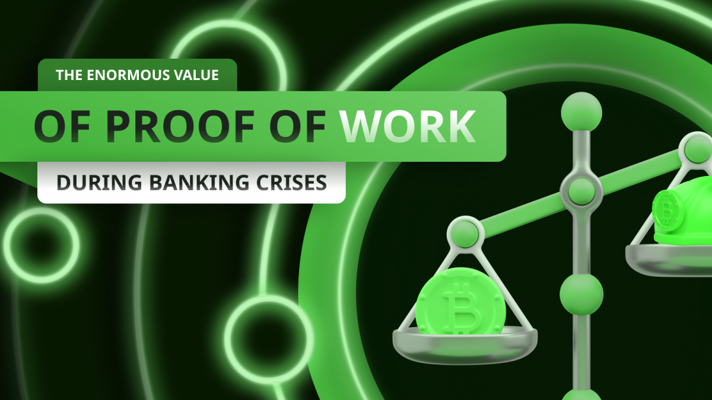
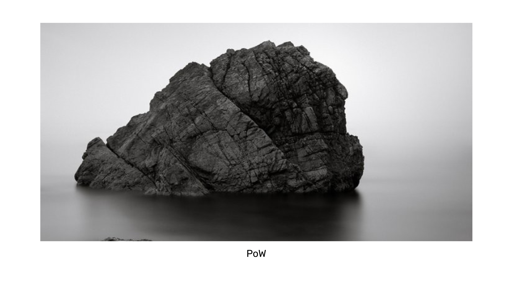

---
**由此收听或观看本期内容:**

<iframe width="560" height="315" src="https://www.youtube.com/embed/Hb-Pnh5BbGs" title="YouTube video player" frameborder="0" allow="accelerometer; autoplay; clipboard-write; encrypted-media; gyroscope; picture-in-picture; web-share" allowfullscreen></iframe>

---

在上一节课（第31节）中，我们讨论了工作量证明（POW）区块链的重点，即它们总是寻求信任最小化。

我们解释了信任最小化的含义及其好处，以及为什么它是以太坊经典（ETC）和比特币（BTC）等区块链安全性的根本原因。

信任最小化很重要，因为传统系统中的受信任第三方管理我们的信息和财富，但他们可能行为不当、破产或被黑客攻击。

在本节课（第32节）中，我们将讨论这些受信任第三方的负面影响之一，即银行危机期间的情况，以及工作量证明区块链在这些时刻的巨大价值。

## 2023年的银行危机

2023年初，美国经历了一次过山车般的经历，因为一些小银行被清算。

在五天内，三家银行发生挤兑，资金被抽空，政府不得不出手救助其客户并清算这些机构。

这些银行是硅谷银行，其客户主要是科技初创公司、科技公司和富裕个人；银门银行和签名银行，它们的客户中有许多加密公司和非营利组织。

然而，那些在POW区块链（如ETC和BTC）上存有资金的人在情感和财务上受影响较小，而不是那些在银行持有法定货币或在加密货币交易所持有加密货币的人。

## 危机被用来迫害加密企业

在2023年的银行危机期间，许多加密公司和非营利组织遭受了一种迫害。

这由中央银行监管机构引导市场，他们暗示对加密货币的暴露不受欢迎。

政府的这种姿态使银门银行和签名银行的清算比平常更加繁琐，造成了加密公司和非营利组织在危机后是否还能拥有银行关系的不确定性。

具有讽刺意味的是，许多这些加密初创公司和组织将其加密货币持有在中心化交易所，这暴露了他们运行的受信任第三方的额外风险，这与行业的宗旨似乎相矛盾！

## 银行危机是系统本身造成的！

法定货币系统的一个扭曲之处在于，由于它与现实脱节，因此会制造自己的问题，包括银行危机！

2023年的清算是由中央银行本身引发的，因为它诱导银行购买国债，但随后又大幅提高利率，使债券价格暴跌。

当银行机构积累了长期政府债券时，利率非常低或接近于零。当2020年实施COVID政策时，政府印刷了数万亿美元，导致通货膨胀增加，必须由联邦储备系统控制。

当中央银行提高利率以控制通货膨胀时，它在18个月内以非常快的速度从接近零提高到超过5%。这导致债券市场崩溃，为银行机构带来了数千亿美元的损失。

## 银行基本上都破产了

正如[Caitlin Long](https://x.com/CaitlinLong_)正确指出的那样，银行危机的发生是因为银行本质上是永久性破产的。

这是因为银行进行所谓的期限错配，即他们以短期期限吸收存款，并以长期期限发放贷款。这使他们能够在利率差额中获得额外的利润。

问题是，他们客户的短期存款非常具有流动性，因此客户基本上可以随时提取他们的钱。

当经济稳定时，银行通常可以从其他存款者那里获得现金储备以应对提取，但当所有或大多数客户同时想要他们的钱时，银行就不得不倒闭。

## POW区块链是危机中的坚实避难所

工作量证明区块链没有中央银行或监管机构，不会借贷，没有首席财务官或财务部门将资金分配到不良投资中，没有人可以没收资金，也没有人可以告诉任何人他们是否可以开设账户。

中本聪在发明比特币时的主要目标是尽量避免受信任的第三方。

在ETC和比特币等区块链中，人们可以拥有自己的地址，并通过私钥独家控制它们。没有其他人可以访问他们的资产，钱是实物持有的，而不是借出的。

这是一个巨大的范式转变，因为在POW区块链上，资产的所有者控制自己的资产，而在传统银行系统中，几乎所有的钱都是由受信任的第三方控制的。

## 非托管钱包的额外重要性

对于许多人来说，比特币和ETC在2023年银行危机期间是一个极大的安慰。

然而，最重要的是将你的加密资产放在非托管钱包中。

仅仅拥有BTC和ETC只能在一定程度上提供好处，因为如果它们存放在Coinbase、Kraken、Binance、OKX或Bybit等中心化交易所中，大多数好处都将丧失。

持有者必须将他们的加密货币转移到非托管钱包，如MetaMask、Trust Wallet、Ledger、Trezor、MyEtherWallet、MyCrypto或Exodus。

非托管钱包使用户能够控制他们的私钥，直接访问区块链上的加密资产，绕过受信任的第三方，从而避免银行危机。

---

**感谢阅读这篇文章！**

要了解更多关于ETC的信息，请访问：https://ethereumclassic.org
