---
**You can listen to or watch this video here:**

<iframe width="560" height="315" src="https://www.youtube.com/embed/MTPH3xUkxs8" title="YouTube video player" frameborder="0" allow="accelerometer; autoplay; clipboard-write; encrypted-media; gyroscope; picture-in-picture; web-share" allowfullscreen></iframe>

---

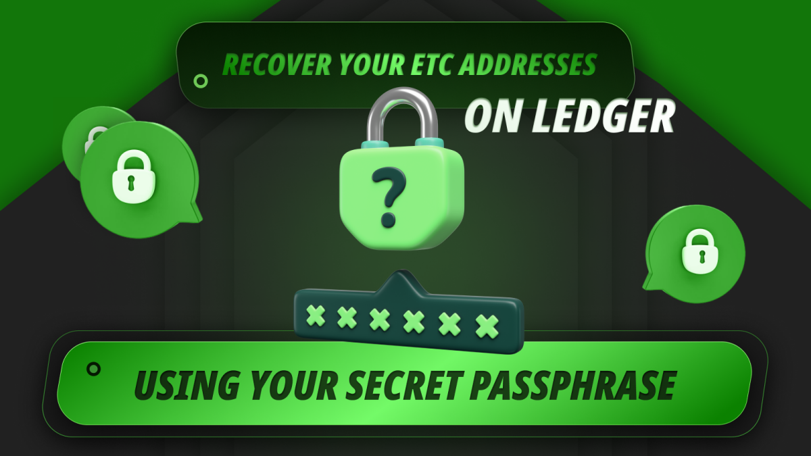

In this post we will explain how to recover your ETC addresses on the Ledger Nano S Plus using your secret passphrase. This is needed if your Ledger was lost, compromised, or damaged. 

The secret passphrase or mnemonic phrase is a group of words that you should have written on paper and stored in a safe place as we explained in [our post](https://ethereumclassic.org/blog/2024-02-27-using-the-ledger-nano-s-plus-with-ethereum-classic) about using ETC with Ledger Nano S Plus.

## The Ledger Hardware and Software Components

Ledger Nano S Plus is a hardware wallet, so to recover it you need to acquire a new device and install the Ledger Live app again on your computer. You will also need the card where you wrote your 24, 18, or 12 word secret passphrase, or mnemonic phrase, when you installed it the first time.

In the following sections we will explain the steps to recover your ETC addresses using your Ledger secret passphrase.

We will show the parallel actions on your Ledger Nano S Plus and on your computer where appropriate.

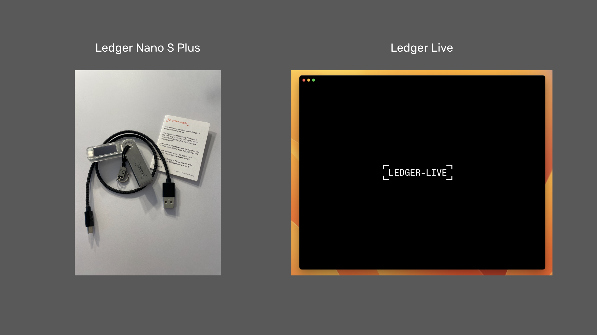

## 1. Get Started and Select Your Ledger Device

To begin the process of recovery of your Ethereum Classic addresses with your secret passphrase, open Ledger Live on your desktop and press on the “Get started” button on the home.

In the next screen, select the Ledger device you are using, for this example we will use the Ledger Nano S Plus.

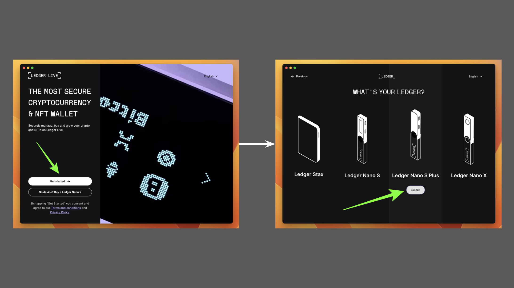

## 2. Initiate the “Restore Your Recovery Phrase” Process

In the next screen you will see three options to start using your Ledger Nano S Plus. Because we are going to recover your ETC addresses using your passphrase on a new Ledger Nano S Plus device, we will select the “RESTORE YOUR RECOVERY PHRASE ON A NEW DEVICE” option.

In the next screen, click on the “OK, I’m ready!” button.

## 3. Enter Secret Passphrase on Your Device

In the next screen, Ledger Live will explain the steps you need to follow on your device which we will show in the next few sections.

Once you enter the secret passphrase on your Ledger Nano S Plus device, you will need to come back to your Ledger Live app on your computer.

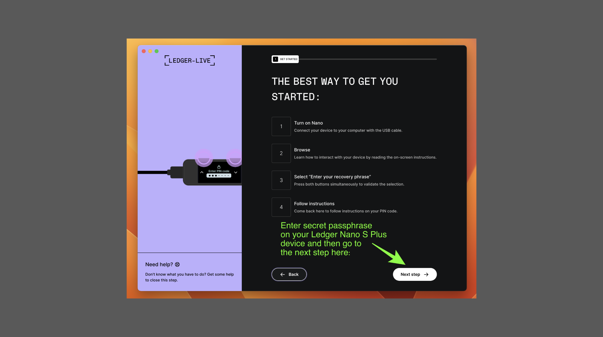

## 4. Set Up Ledger Nano S Plus Device

Once you connect your new Ledger Nano S Plus device to your computer you will see a welcome message and then instructions of how to navigate the device, follow the process.

Once you went through these steps select the “Restore” option and then go to “Restore from Recovery phrase”. 

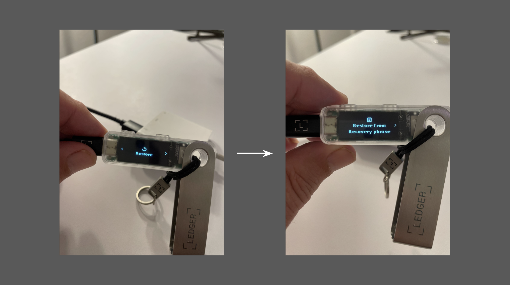

## 5. Choose PIN

On the device click on the two top buttons to choose a new PIN, then enter a 4 to 8 digit PIN to use your Ledger Nano S Plus from now on.

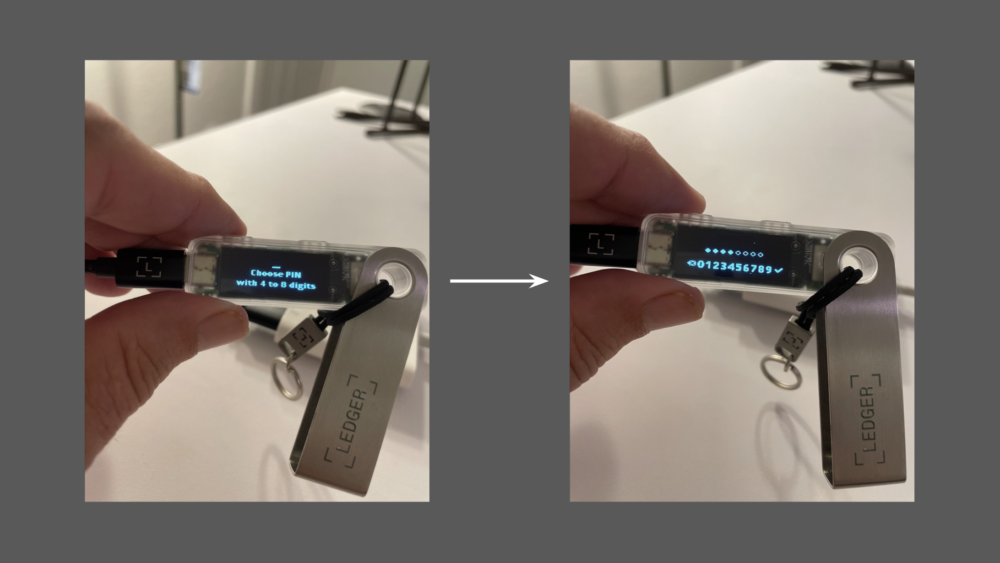

## 6. Select the Number of Words in Your Recovery Phrase

In the next step press the two top buttons on your device to start entering the recovery phrase, then do the same to select the number of words in your recovery phrase. 

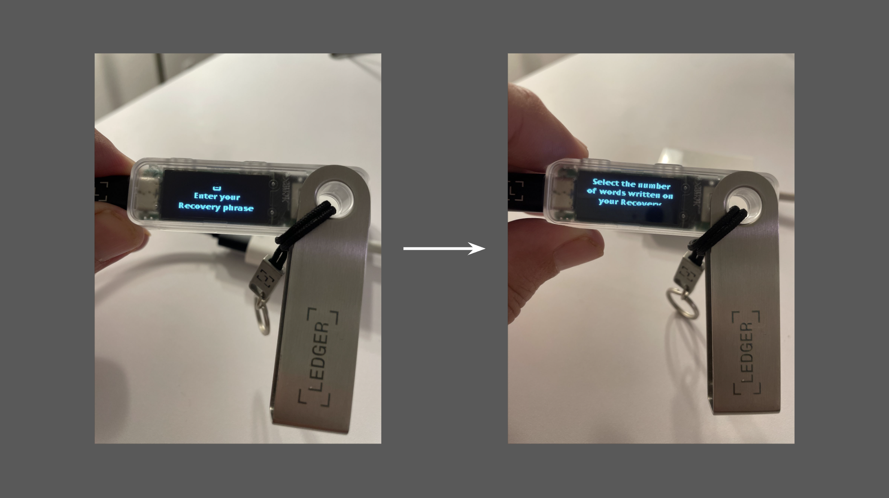

## 7. Start Entering Your Secret Passphrase

Once you selected the number of words of your recovery phrase, in the next steps select the first few letters for each word in your secret passphrase and enter all the words.

When you enter the first 2 or 3 letters of each word, the Ledger device will show you a menu of words to choose from for each word in your secret passphrase.

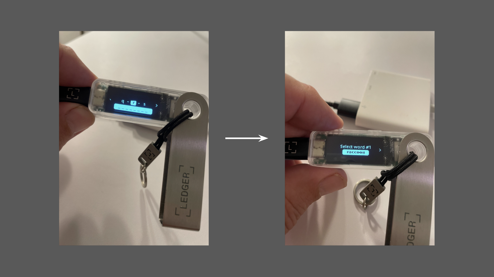

## 8. Do the Genuine Check

Once you entered all the words, Ledger Nano S Plus will ask you to go to the dashboard. Once on the dashboard, go back to your Ledger Live app on your computer and go forward in the process until you get to “GENUINE CHECK”.

Once there, press the “Check my Nano” button to perform a check of your device.

On your device, you must allow a secure connection with your computer to let it do the genuine check.  

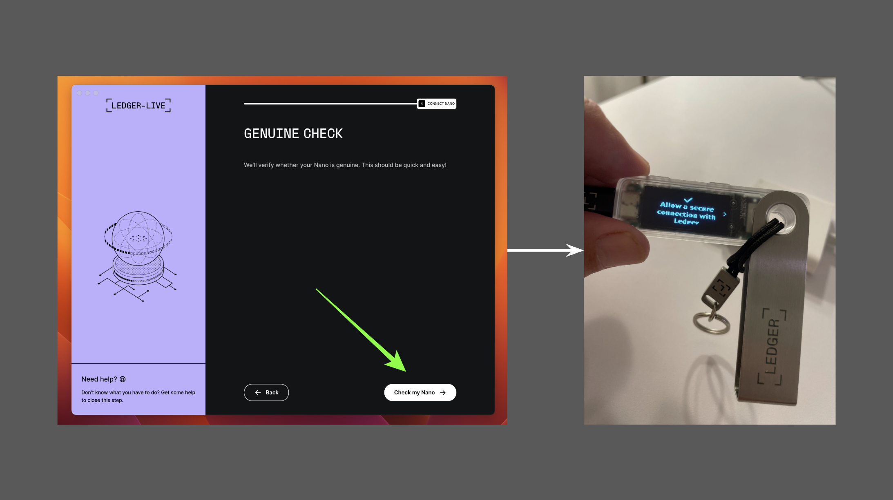

## 9. Add the Ethereum Classic App

After the genuine check, Ledger Live will continue connected to your Ledger Nano S Plus and will ask you to add apps to your device. Apps, are the actual cryptocurrencies, so go to ETC and click on the “Install” button.

Because Ledger needs the Ethereum app to be able to add ETC, then the system will add both, so, on the pop-up box click on “Install apps”.

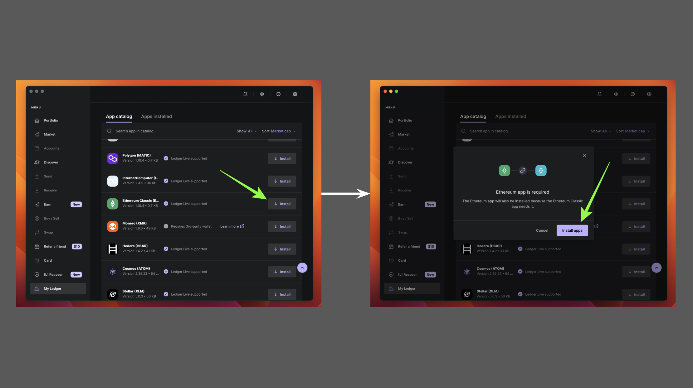

## 10. Add Back Your ETC Addresses

Once the ETC app is added to your Ledger Nano S Plus, then it is time to restore your ETC addresses!

For this click on the “Add account” button on the Ledger Live app, and then search for the ETC crypto asset.

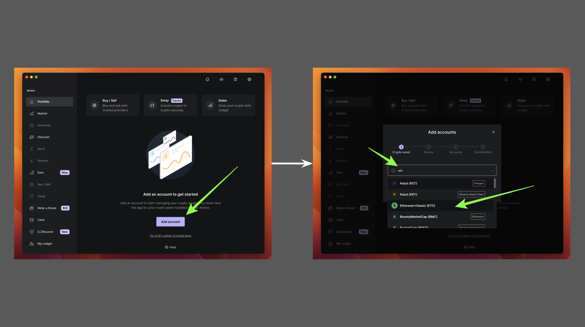

## 11. Open the ETC App on Your Ledger Nano S Plus

In the next step, Ledger Live will prompt you to go to your Ledger Nano S Plus and open the Ethereum Classic app.

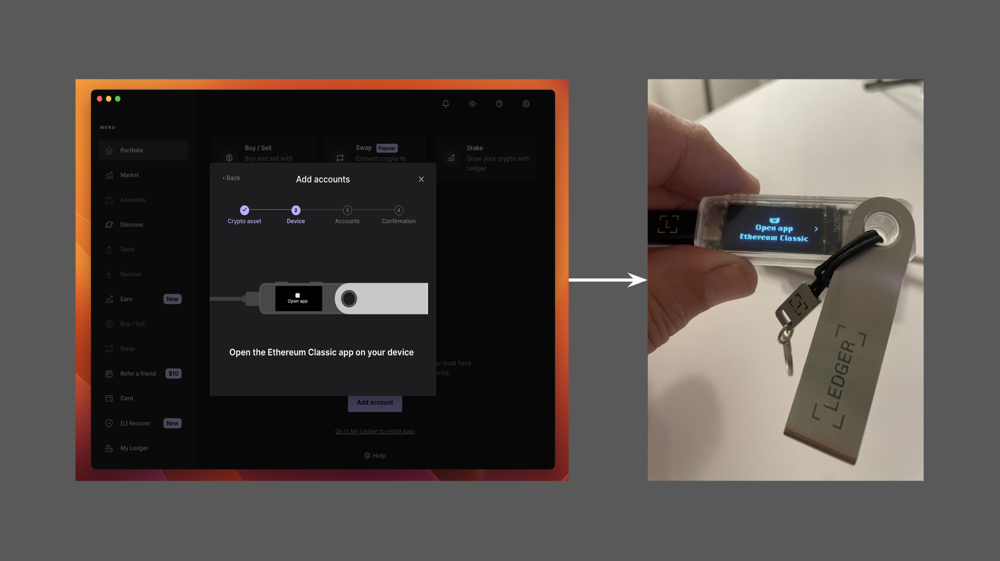

## 12. Select Your ETC Addresses

Once you opened the ETC app on your device go back to your Ledger Live app on your computer.

There, you will see your old ETC addresses, which you can select to add them back. To do this, press on the “Add account” button.

In the next screen, press “Done”.

Congratulations! You have recovered your ETC addresses on your Ledger using your secret passphrase!

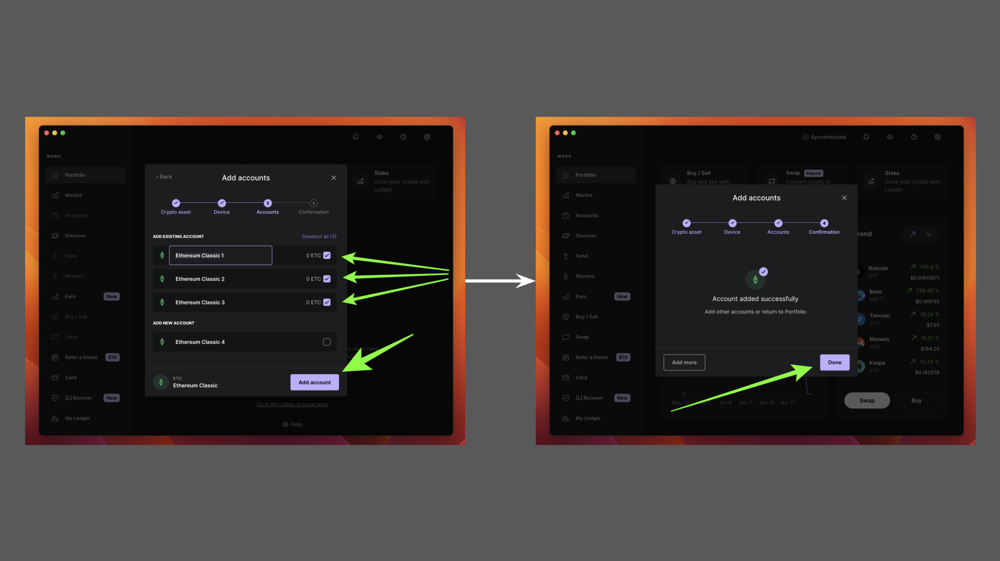

---

**Thank you for reading this article!**

To learn more about ETC please go to: https://ethereumclassic.org
