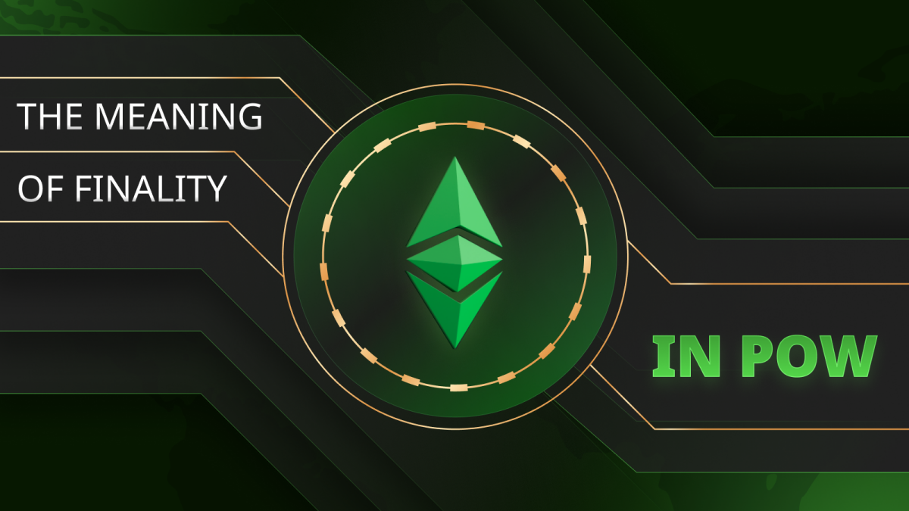

---
**由此收听或观看本期内容:**

<iframe width="560" height="315" src="https://www.youtube.com/embed/RtWd4Jrq0FA" title="YouTube video player" frameborder="0" allow="accelerometer; autoplay; clipboard-write; encrypted-media; gyroscope; picture-in-picture; web-share" allowfullscreen></iframe>

---

在之前的课程32中，我们讨论了传统系统中受信任的第三方带来的负面影响之一，即在银行危机时的影响，以及在这种情况下工作量证明区块链的价值。

在相关主题中，在本课程33中，我们将讨论与金钱和去中心化应用程序（dapps）相关的最终性（Finality）的意义。

我们将解释经济学中的最终性概念，证明权益证明（POS）最终性是一个噱头，法律和软件的最终性很弱，最终性并不会因为人为规则而魔法般地存在，而比特币（BTC）和以太坊经典（ETC）等区块链中的物理工作量证明（POW）最终性是真实且强大的。

## 什么是最终性？

最终性是指交易状态已完成且不可逆的术语。支付的最终性是指它们被认为已完成。

当资金转移是最终的时，接收方对资金有不可撤销的访问权。

最终性是经济学中的关键概念，因为商业依赖于交易和支付的不断流动。

支付最终性的不确定性会破坏交易链，从而影响经济的效率和增长。

同样，在区块链中，不确定的交易最终性和dapps状态会破坏使用这些系统的人类行为。

## 权益证明圈中的虚假声明

在POS圈中，有一种说法认为权益证明提供最终性，而POW因为只提供概率最终性而较差。

这是一个幼稚且不诚实的论点，因为在POS中交易被删除或逆转（或整个账户被冻结、没收或禁止）的概率远高于POW，因为POS是中心化的，而POW是去中心化的。

在权益证明区块链中，只有少数参与者控制这些系统，并且没有阻止任意更改的工作。这意味着他们可以聚在一起轻易地修改余额、没收资金或在账本中执行任何其他操作。

工作量证明区块链有更高的最终性保证，因为过去完成的工作确实构成了篡改账本的障碍。

## POS和POW都是概率性的

事实是POS和POW都是概率性的。

POS中所声称的确定性最终性并不存在，因为只需要安装新版本的软件和具有更改的新的账本来取消最终性。

在POS中，法官、监管者或任何民事当局强制链逆转交易的概率远高于POW区块链交易被逆转的概率，即使是同样的法官、监管者、民事当局，甚至军队通过暴力手段强制执行。

如前所述，在工作量证明区块链中，要更改数据库的历史非常困难，因为这意味着需要重新完成工作。这将非常昂贵且耗时，使其不具备实际可行性。

此外，POW允许所有矿工和节点运营商脱离链，从而提供另一种保护原始未篡改账本的方法。

## 权益证明和银行系统一样不安全

POS协议不会考虑一定数量的区块、槽位、时代、纪元或其他他们称之为复杂设计后的更多更改，只是一个噱头，正如传统银行业中的“不可变性”和“最终性”是噱头一样。

在银行业，只需法官发出命令，银行就会冻结、没收资金或停止或逆转任何账户的支付。

认为“确定性最终性”存在是因为开发人员在协议中设计了规则，这是非常幼稚的。

真正的最终性必须意味着更改实施起来极其困难。

## 工作量证明是金融安全的新范式

POW区块链交易是不可逆的，不是因为协议中有人为规则禁止它，而是因为需要做的工作的规模如此之大，以至于变得完全不可行。

这是金融范式的重大变化，因为在过去的600年中，整个社会几乎完全依赖受信任的第三方来处理支付和经济活动。

区块链将交易和余额的责任和安全转移给终端用户。只有拥有任何地址的私钥，资金才可以被触动或与dapps进行交互。

这消除了受信任第三方在经济中的影响。

## 最终性的新范式改变了更好的参与规则

POW区块链中的真正最终性，如BTC和ETC，迫使当局寻找其他方法来打击犯罪和执行法律，而实际上尊重基本人权。

今天，当局已经发展了令人难以置信的侵入性方法来控制整个社会，因为他们对受信任的第三方有影响或直接控制，并通过他们任意操纵支付平台。

随着设计良好的POW区块链的存在，篡改支付平台变得不可能，因此当局需要针对实际犯罪的代理人，而不是假设整个群体或人口是默认的罪犯，直到被证明无罪。

仅仅是法律、协议和软件的最终性是弱的。

物理的、POW的最终性是强大的，是一种善的力量。

---

**感谢阅读本文！**

要了解更多关于ETC的信息，请访问：https://ethereumclassic.org
