---
**由此收听或观看本期内容:**

<iframe width="560" height="315" src="https://www.youtube.com/embed/yReHZjsd2jI" title="YouTube video player" frameborder="0" allow="accelerometer; autoplay; clipboard-write; encrypted-media; gyroscope; picture-in-picture; web-share" allowfullscreen></iframe>

---

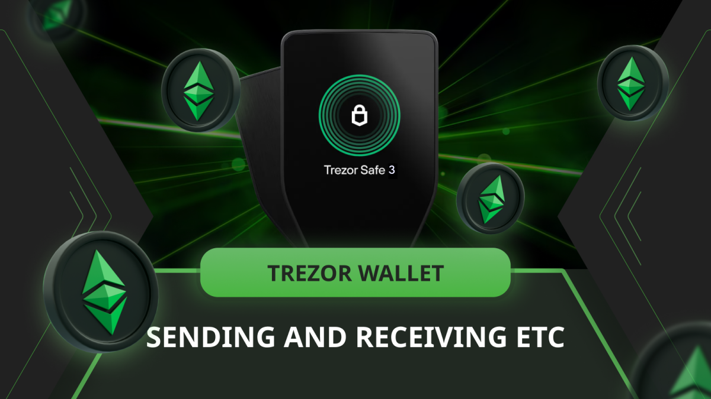

在这篇文章中，我们将解释如何在 Trezor Safe 3 上发送和接收以太坊经典 (ETC)。

我们将展示需要的 Trezor 组件，并解释发送和接收 ETC 的步骤。

我们将展示在 Trezor Safe 3 和计算机上的并行操作。

## Trezor 硬件和软件组件

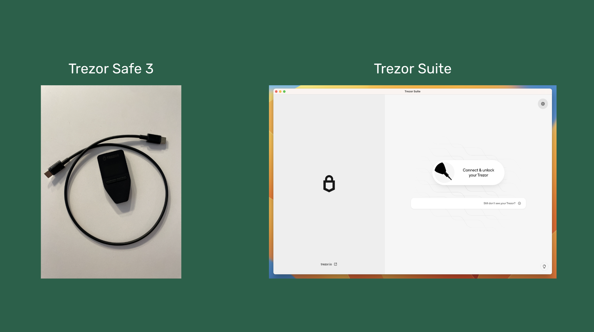

Trezor Safe 3 是一款硬件钱包，因此要在 Trezor 上发送或接收 ETC，您需要硬件设备和安装在计算机上的应用程序，如我们在文章 [“使用 Trezor 管理以太坊经典”](https://ethereumclassic.org/blog/2024-03-27-using-ethereum-classic-with-trezor) 中所解释的那样。

接下来，我们创建了两个部分，分别解释如何使用 Trezor Safe 3 接收和发送 ETC。

## 接收 ETC

### 1. 打开 Trezor Suite 并连接 Trezor Safe 3

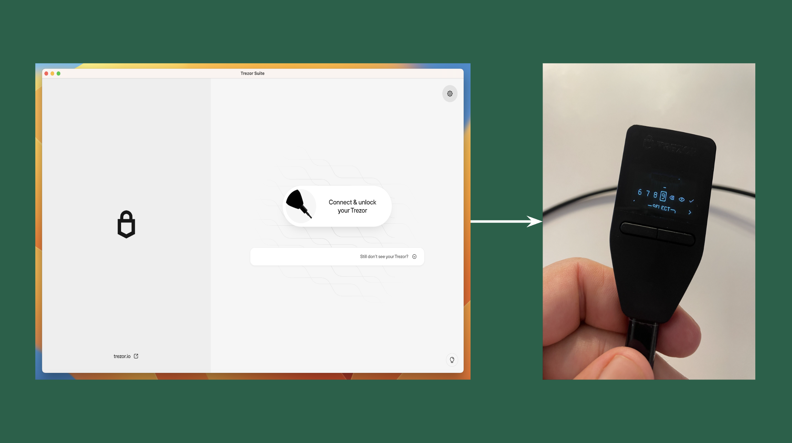

接收 ETC 的第一步是在您的计算机上打开 Trezor Suite 应用程序并连接 Trezor 设备。

连接后，在您的设备上输入 PIN 码，以将其与计算机上的应用程序关联。

### 2. 选择标准钱包

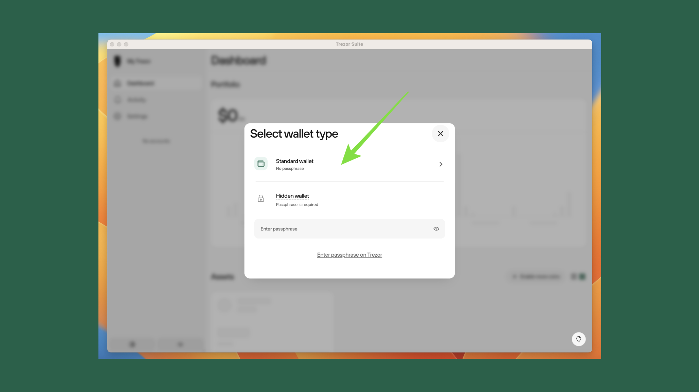

输入 PIN 码后，计算机上的 Trezor Suite 应用程序将要求您选择使用何种钱包类型。在本例中，我们选择了“标准钱包”选项，这是我们在这些教程中一直使用的。

### 3. 选择以太坊经典资产

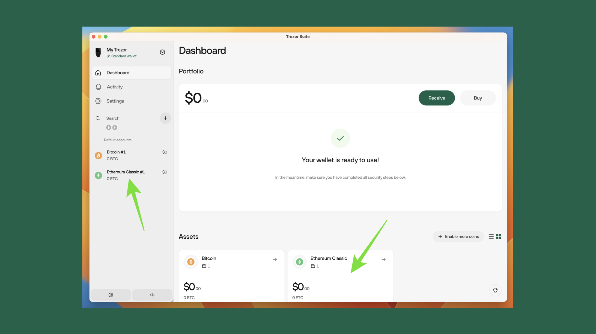

在下一步中，计算机上的 Trezor Suite 应用程序将显示您已设置的资产首页。

要在 Trezor 上接收 ETC，请在左侧垂直菜单中选择“以太坊经典”或点击资产部分下的以太坊经典框。

### 4. 获取您的 ETC 地址

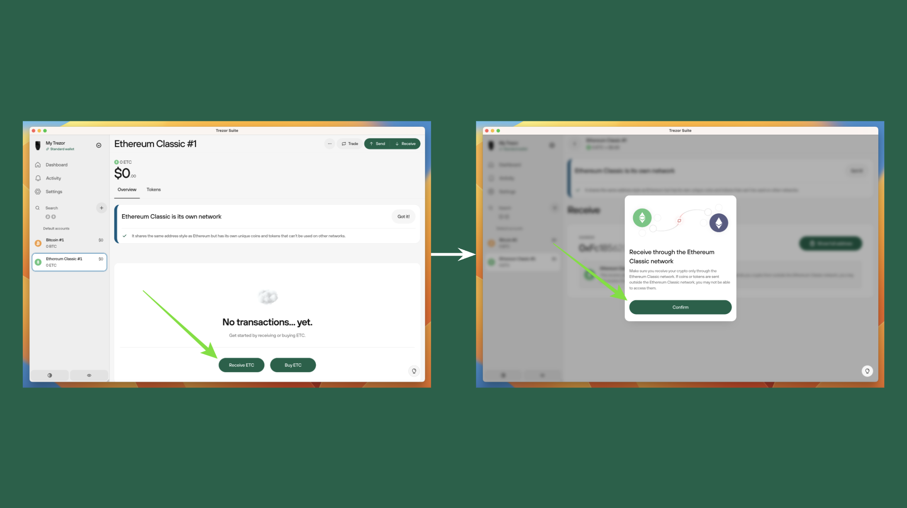

在下一个屏幕中，点击页面底部的“接收 ETC”按钮，Trezor Suite 将显示您的 ETC 地址。

当弹出框询问 ETC 是否通过 ETC 网络接收时，按“确认”按钮。

### 5. 显示完整地址

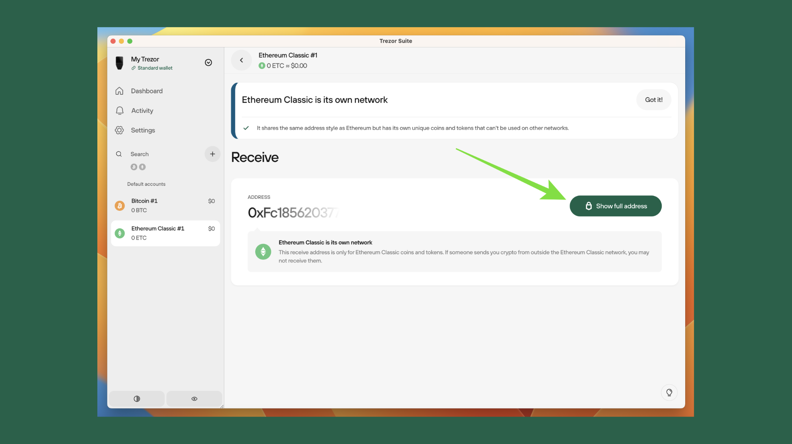

在下一个屏幕中，Trezor Suite 将显示您的部分地址，因为需要通过 Trezor 硬件钱包确认。

在此步骤中按“显示完整地址”按钮，然后转到您的 Trezor 设备。

### 6. 确认并复制地址

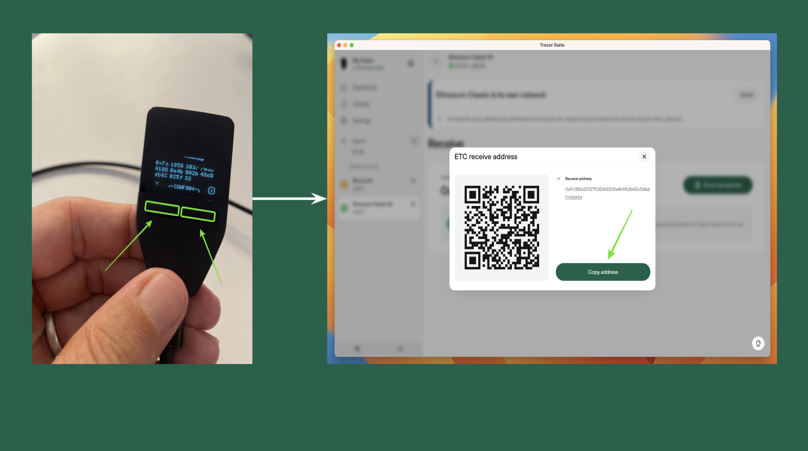

在您的 Trezor Safe 3 设备上，您需要输入 PIN 码以解锁计算机上 Trezor Suite 应用程序的地址。

输入 PIN 码后，您将在设备和计算机上看到完整的地址。如果地址相同，则地址已确认，您可以继续复制并使用它来接收来自第三方或其他钱包的 ETC。

## 发送 ETC

### 1. 设置 Trezor Suite 和 Trezor Safe 3

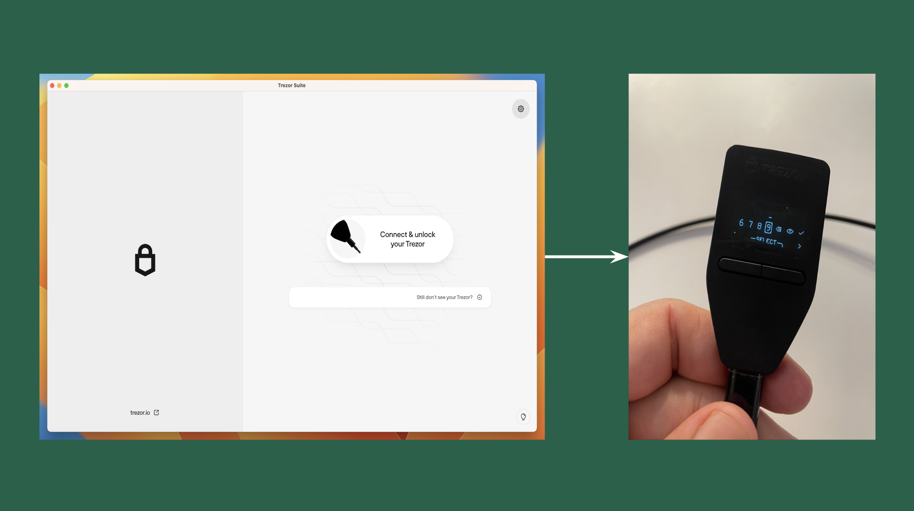

从 Trezor Safe 3 发送 ETC 的第一步是在您的计算机上打开 Trezor Suite 应用程序并连接 Trezor 设备。

连接后，在您的设备上输入 PIN 码，以将其与计算机上的应用程序关联。

### 2. 选择标准钱包

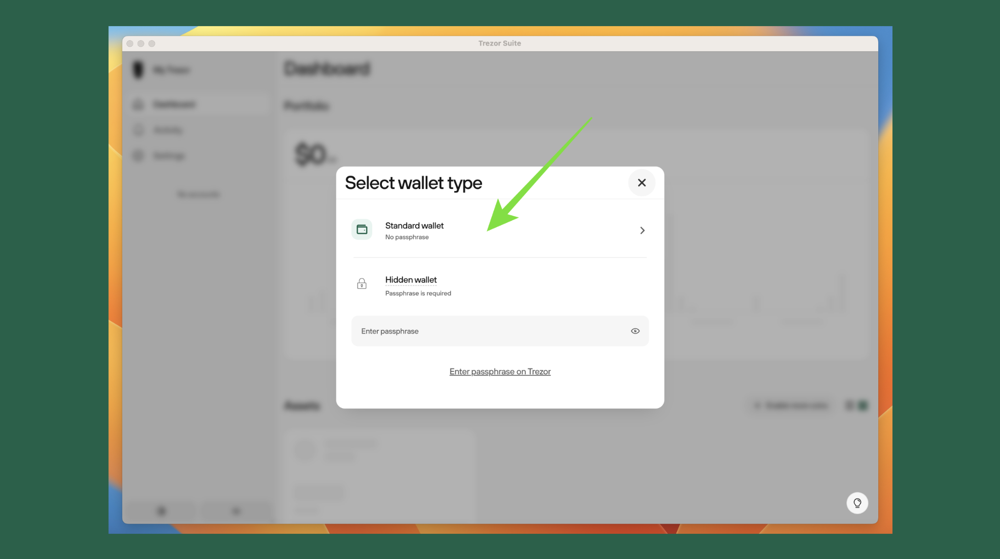

输入 PIN 码后，计算机上的 Trezor Suite 应用程序将要求您选择使用何种钱包类型。在本例中，我们选择了“标准钱包”选项，这是我们在这些教程中一直使用的。

### 3. 选择以太坊经典资产

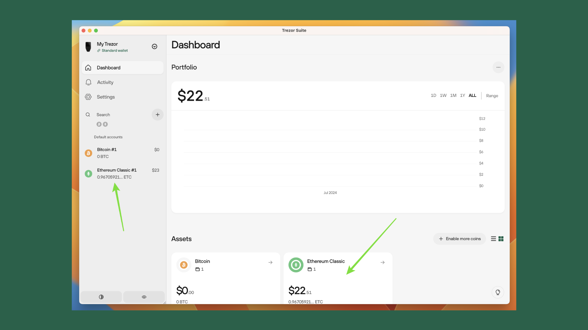

在下一步中，计算机上的 Trezor Suite 应用程序将显示您已设置的资产首页。

要从 Trezor 发送 ETC，请在左侧垂直菜单中选择“以太坊经典”或点击资产部分下的以太坊经典框。

### 4. 准备发送 ETC 的交易

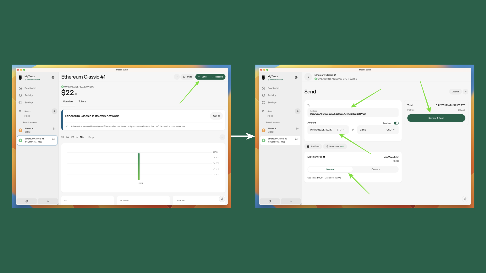

在下一个屏幕中，您将看到钱包的 ETC 主页。要准备发送 ETC 的交易，请点击右上角的“发送”按钮。

然后，在下一个屏幕中输入您要发送 ETC 的地址、发送金额、您想要的普通或自定义 gas 费级别，然后按“审查并发送”按钮。

### 5. 审查交易

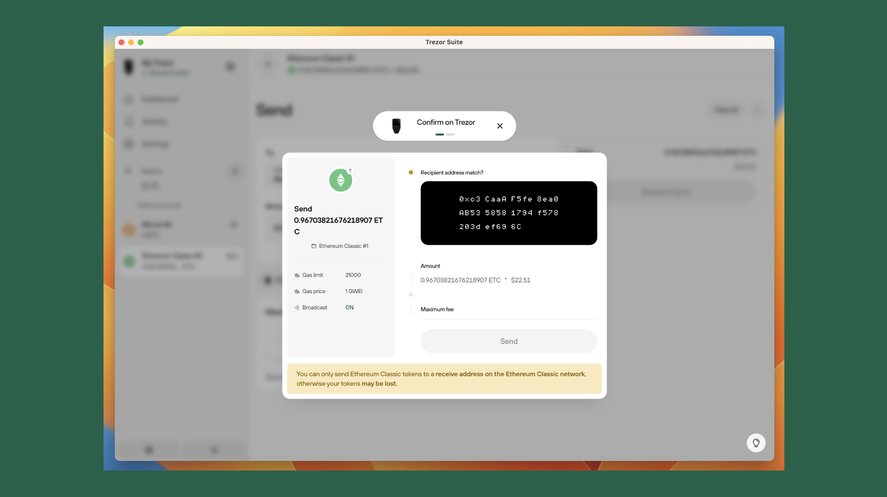

接下来，您将看到一个弹出框，其中包含交易的详细信息供您审查。

但是，由于您使用的是硬件钱包，您需要转到它并在设备上确认交易。

### 6. 在 Trezor Safe 3 设备上确认交易

在您的 Trezor Safe 3 设备上，您将看到屏幕上的收件人地址。如果正确，请按“继续”。

在下一个屏幕中，您将能够查看您选择的金额和 gas 费。

如果一切正常，请按设备上指示的两个按钮，然后转到计算机上的 Trezor Suite 应用程序。

### 7. 发送 ETC

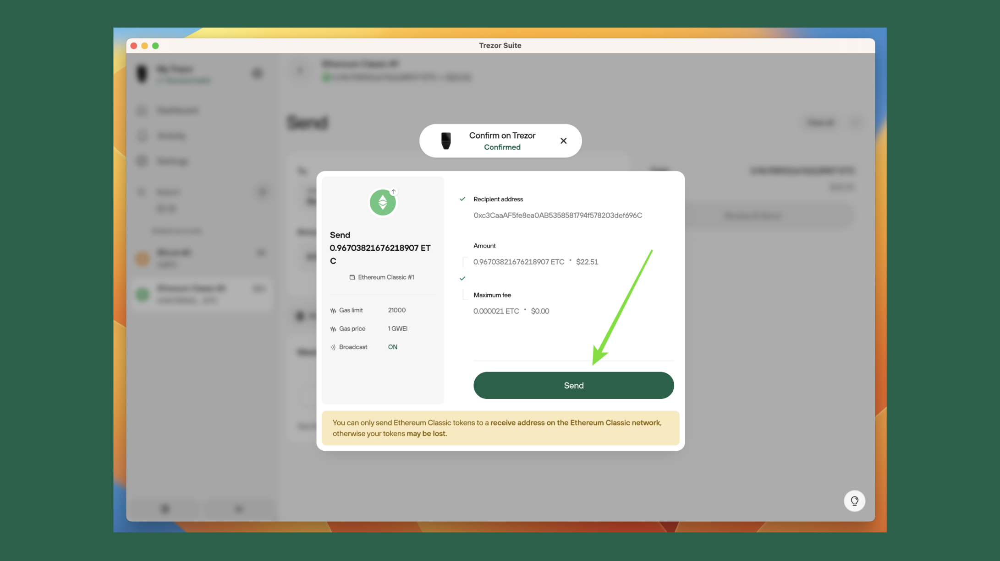

当您转到计算机上的 Trezor Suite 应用程序时，您将看到交易已准备好发送，因为它已由您的 Trezor Safe 3 设备确认并签名。

要发送 ETC，请按“发送”按钮。

---

**感谢您阅读这篇文章！**

要了解更多关于 ETC 的信息，请访问：https://ethereumclassic.org
