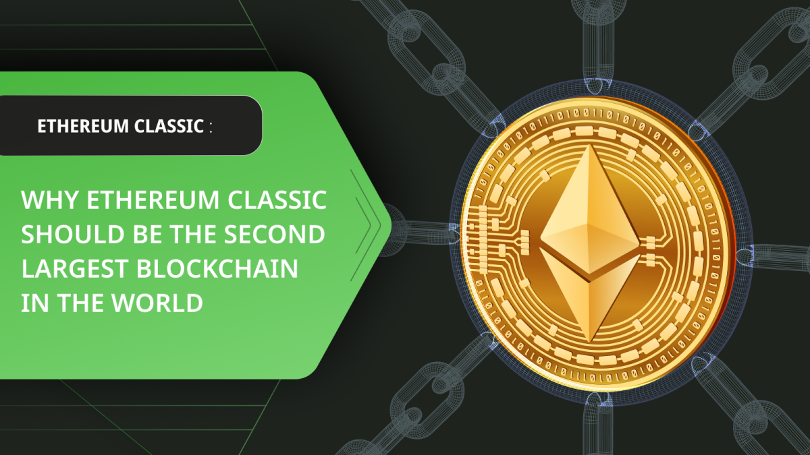

---
**You can listen to or watch this video here:**

<iframe width="560" height="315" src="https://www.youtube.com/embed/YtcPtzgCFzQ" title="YouTube video player" frameborder="0" allow="accelerometer; autoplay; clipboard-write; encrypted-media; gyroscope; picture-in-picture; web-share" allowfullscreen></iframe>

---

One of the most powerful arguments that we use when explaining Ethereum Classic (ETC) to the world is that it is Bitcoin’s philosophy with Ethereum’s technology.

There are only two major inventions in the blockchain industry. The first one is proof of work (POW) as a consensus mechanism, and the second one is smart contracts that provide programmability to the blockchain.

The greatest and most secure blockchain that is proof of work is Bitcoin, and the largest smart contracts blockchain is Ethereum.

However, the only and largest blockchain that has both features at the same time is ETC.

This will make ETC, together with Bitcoin, one of the most important and valuable technologies of the future.

## There Are Four Big Categories of Blockchains

Unfortunately, there is not a lot of honesty in the blockchain industry and many participants have little awareness of the core principles of decentralization.

This has created four main segments in the sector, of which only one is truly decentralized.

There is a small group of blockchains that are permissionless and censorship resistant and those are POW because it is the only consensus mechanism that enables a peer to peer cryptocurrency to be truly decentralized.

Then, there is a larger group of proof of stake (POS) networks that were created opportunistically as a reaction to the energy consumption of POW. However, these systems have no real innovation and are nearly as centralized as traditional banking.

Proof of authority (POA) blockchains are an even more centralized model because all the nodes participating in the system are selected trusted third parties.

Finally, there is a government sponsored type of networks called Central Bank Digital Currencies (CBDCs) that imitate the decentralized design of blockchains but are completely controlled by the government and banking system.

## Blockchains Must be Judged By Their Weakest Link

As we wrote above, of the four segments that we mentioned, only POW blockchains may be considered truly decentralized.

Furthermore, it is important to note that any cryptocurrency will be as weak as its weakest link. 

This is that, of all the components used to build it, if it has one minor detail that is centralized then the whole system will be centralized.

For example, hybrid blockchains that combine POW and POS, or POW and POA, must be centralized because the security brought by POW is cancelled by the centralized technology.

## There Are Also Badly Designed Proof of Work Blockchains

Another important fact to bear in mind is that just because a blockchain may be POW does not mean that it will be decentralized.

Although POW is a necessary factor, it is not sufficient to make a blockchain decentralized.

There are three main things that would make a POW blockchain centralized: Hybridization, rank, and block size.

As we mentioned before, hybridization is that it is a mix of POW and another weaker consensus mechanism. When a centralized component is added to a chain, then the whole system will be centralized.

Rank is the size of the blockchain and whether it is the leader in its consensus mechanism. ETC, for example, is extremely valuable because it is the largest POW smart contracts blockchain in the world and the leader in its consensus mechanism. If there is a fork that is smaller, it doesn’t matter that it has the same design, it will always be vulnerable.

Block size determines the bloating of the network, and bloating of the database leads to centralization. The counter strategy to bloating is pruning the data, but pruning also makes the system centralized because the whole system will be either unverifiable or dependent on a few full nodes.

## There Are Only Two Inventions in the Blockchain Industry

As we mentioned in the introduction, there are only two important inventions in the blockchain industry, proof of work and smart contracts.

The major invention by Satoshi Nakamoto when he built Bitcoin was to use the information of the block stamps so that all nodes in the network would know which is the correct block in each round without having to check with trusted third parties.

The same information serves as the unifying focal point when the network splits, or when nodes want to join for the first time, or leave the network and join again.

However, Bitcoin could not be programmable so the next step was to add smart contracts to POW.

This is when Vitalik Buterin came with the brilliant idea of combining the Ethereum Virtual Machine (EVM), with the gas systems, and a programming language, which gave programmability to POW.

## Ethereum Classic Is the Only Blockchain That Has Both!

The amazing thing is that of the top two blockchains in the world, Bitcoin is proof of work but is not programmable and Ethereum is programmable with smart contracts but is not proof of work!

This is what creates this incredible void in the market that only ETC can fill because it has both inventions in one system!

ETC is incredibly well designed because it is the original Ethereum but it stayed with the POW consensus mechanism.

Philosophically, ETC shares the same ideology as Bitcoin as its motto is “Code Is Law”, and it values immutability as its highest principle.

Technologically ETC is a state of the art EVM blockchain because it constantly upgrades the system to be on par with the Ethereum Virtual Machine standard.

## Only Bitcoin and Ethereum Classic Should Prevail

In terms of market positioning Bitcoin is a very strong system because it is the first mover, has network effects, it is truly digital Gold, and it is the largest POW blockchain in the world making it extremely resilient and safe.

As a single function system Bitcoin is perfect in its position and very difficult to dethrone.

However, of all the systems below Bitcoin we only reach ETC to see which is the next one with equal value.

The systems in between in the ranks imitate the qualities of Bitcoin and add smart contracts, but none can be as secure because they have all chosen either POS or POA as their consensus mechanisms.

This means that, eventually, it would be only natural for ETC to become one of the top two blockchains in the world together with Bitcoin.

---

**Thank you for reading this article!**

To learn more about ETC please go to: https://ethereumclassic.org
