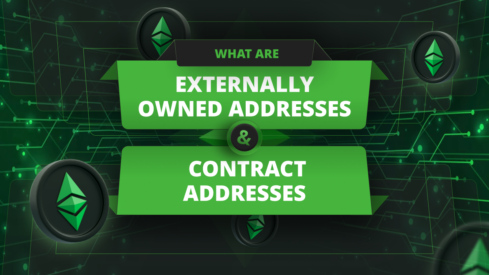

---
**You can listen to or watch this video here:**

<iframe width="560" height="315" src="https://www.youtube.com/embed/aaUuQgDJkLY" title="YouTube video player" frameborder="0" allow="accelerometer; autoplay; clipboard-write; encrypted-media; gyroscope; picture-in-picture; web-share" allowfullscreen></iframe>

---



Ethereum Classic (ETC) has two kinds of addresses: externally owned addresses (EOAs) and contract addresses, also called smart contract addresses.

These kinds of addresses may also be referred to as “externally owned accounts” or “contract accounts”.

At the base, blockchains are ledgers with accounts that hold balances of the native tokens or other kinds of tokens such as ERC-20 tokens.

However, programmable blockchains such as Ethereum or Ethereum Classic also support smart contracts and these need to have their own accounts to be able to hold assets and code to execute.

An address or an account in a blockchain is a large number that serves like a bank account number where users can hold their balances or other assets.

This is an example of an address in ETC:
```
0xf9AbbAd9d103522BCdC72DD38F009c6aa22F82eD
```
ETC addresses or accounts are also called “public keys” because they are published in the public ledger of the blockchain and may be seen by everyone.

Externally owned addresses are controlled by users through their private keys. These private keys are also large numbers that must remain secret so that only the holders may control the balances and assets under the public keys.

Externally owned accounts can be created at no cost; can initiate transactions in the network; transactions between this type of accounts can only be ETC or token transfers; 
and are composed of cryptographic pairs of private and public keys, as mentioned before.

On the other hand, smart contract accounts have a cost to create because they use network storage; they can only send transactions in response to receiving a transaction; transactions from an external account to a contract account can trigger code which can execute many different actions; and they don't have private keys as they are controlled by the logic of their smart contract code.

As smart contracts power decentralized applications (dapps), then the contract accounts are also the accounts that must used to interact with dapps.

---

**Thank you for reading this article!**

To learn more about ETC please go to: https://ethereumclassic.org
