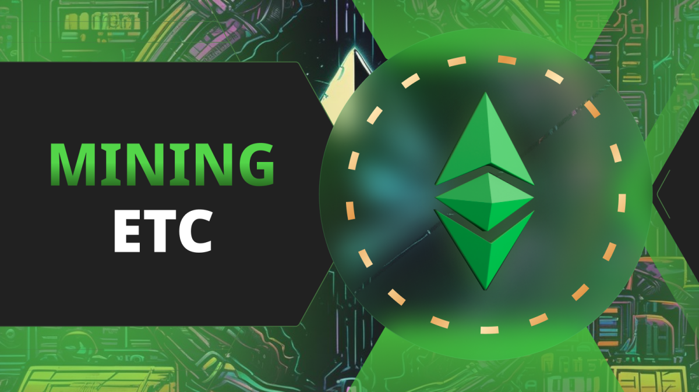
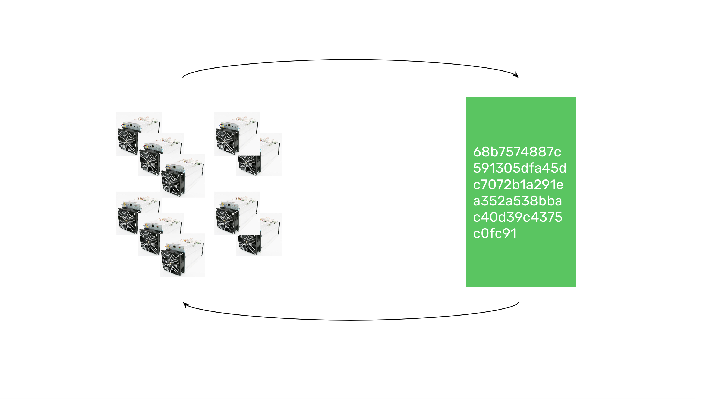
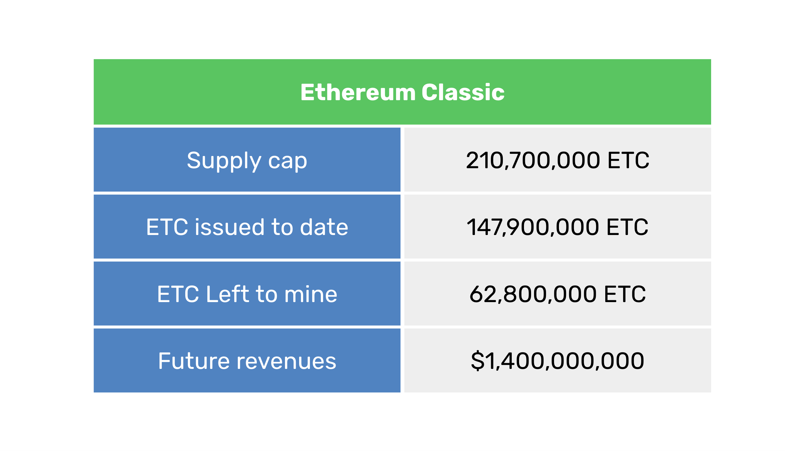

---
**由此收听或观看本期内容:**

<iframe width="560" height="315" src="https://www.youtube.com/embed/003RqJu7rc0" title="YouTube video player" frameborder="0" allow="accelerometer; autoplay; clipboard-write; encrypted-media; gyroscope; picture-in-picture; web-share" allowfullscreen></iframe>

---

在上一课（第33课）中，我们解释了货币和去中心化应用（dapps）中的最终性含义。

我们解释了经济学中的最终性概念，以及比特币（BTC）和以太坊经典（ETC）等区块链中的物理工作量证明（POW）最终性是真实且强大的。

在本课（第34课）中，我们将讨论在像ETC这样的POW区块链中，生产最终性和安全性的活动，即挖矿。

我们将解释使ETC成为全球加密货币矿工的绝佳商业机会的指标。

挖矿是工作量证明区块链的基本本土业务。

矿工以哈希率的形式向区块链提供计算能力，以便每个区块可以以非常高的成本被标记。

这些标记是系统中所有节点和其他矿工确认每一轮中正确区块所需知道的唯一信息，以完全去中心化的方式进行。

这个系统在比特币中已经不间断地运行了15年，在以太坊经典中运行了9年。

矿工为ETC这样的区块链工作机器的动机是每个区块的奖励。

这些奖励是以新创建的ETC形式支付的每个区块的支付，以及每个区块中包含的所有交易的费用。

你应该挖掘ETC的原因是它代表了一个赚钱的机会！

本节中的表格显示了ETC挖矿的四个主要指标。

在接下来的几个部分中，我们将解释每一个。

## ETC供应上限

比特币的一个显著特点是它有一个自始至终设定的固定供应量。系统在2009年开始每个区块支付50 BTC，并且每210,000个区块减少50%的支付。

通过计算，可以推算出比特币将在2130年代某个时候达到2100万个BTC的供应上限。

以太坊经典在2017年采用了类似的货币政策。ETC开始每个区块支付5 ETC，从那时起，每500万个区块减少20%的支付。

通过计算，可以推算出以太坊经典将在与比特币同时达到210,700,000的供应上限。

这个ETC的供应上限使其成为数字黄金，因此对矿工来说，挖掘这个数字黄金是他们业务的关键。

## 已发行的ETC

当以太坊和以太坊经典[在2015年是一个区块链](https://ethereumclassic.org/blog/2023-01-26-ethereum-classic-course-6-ethereum-classic-is-the-original-chain)时，网络启动时预挖了72,009,990个币。这是ETC在开始前发行的初始存量。

在撰写本文时，我们处于区块20,288,076，总供应量接近1.479亿ETC，确切来说是147,925,137 ETC。

这个存量包括以下几个部分：

- 预挖：72,009,990
- 区块奖励：74,389,980
- 叔块：1,525,167

叔块是对那些偶尔在同一时间生成有效区块但未包含在规范链中的矿工支付的一小部分发行量。

已发行的ETC指标对计算剩余可挖掘ETC指标非常重要。

## 剩余可挖掘的ETC

剩余可挖掘ETC指标对矿工来说是关键，因为它量化了业务的总可用市场！

这是通过将已发行的ETC数量从供应上限中减去来计算的。

如果ETC的总数是210.7百万个，那么如果我们从中减去已经发行的总存量，即1.479亿个，我们将得到未来剩余可挖掘的ETC。

这个数字是62,800,000个ETC。

然而，剩余可挖掘的ETC并不是均匀分布在2130年代之前的每一年。由于递减的货币政策，大约50%的剩余可挖掘ETC将在未来10年内支付给矿工。这是一个巨大的机会！

## ETC未来收入

如果我们将剩余可挖掘的ETC乘以撰写本文时的ETC价格，我们将得出大约14亿美元的美元数额。

这意味着如果没有变化，ETC的矿工将赚取1,400,000,000美元，其中50%将在未来10年内赚取。

然而，矿工在考虑ETC时需要注意两点。首先是它可能会继续增长的区块链，这意味着ETC的价格可能会上升，使这些收入估算相形见绌。

第二个考虑因素是矿工可以在挖掘过程中积累ETC作为储备，这可能成为未来的重大投资。

---

**感谢阅读本文！**

想了解更多关于ETC的信息，请访问：https://ethereumclassic.org
