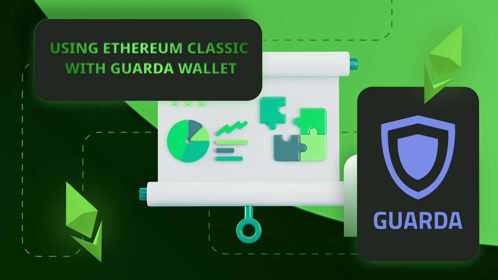
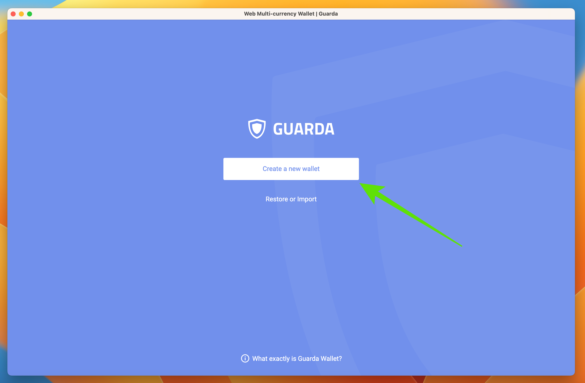
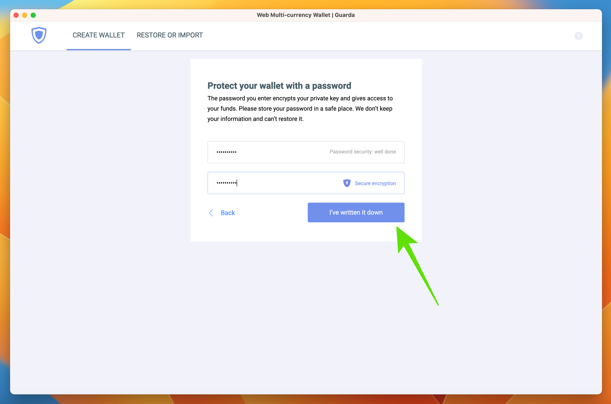
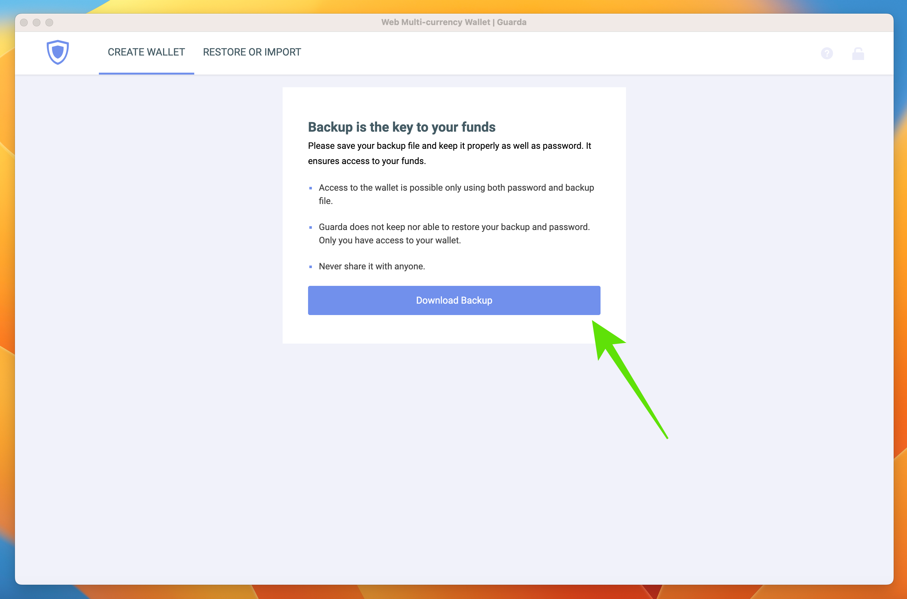
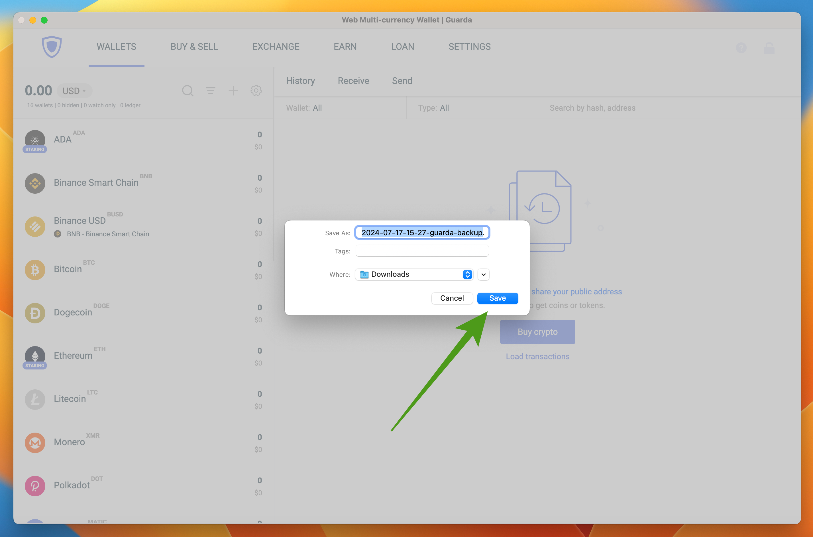
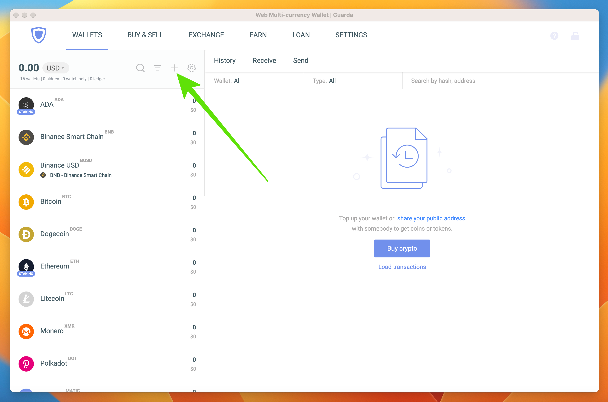
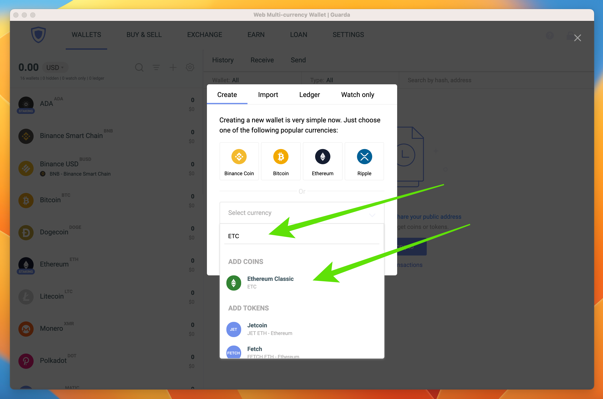
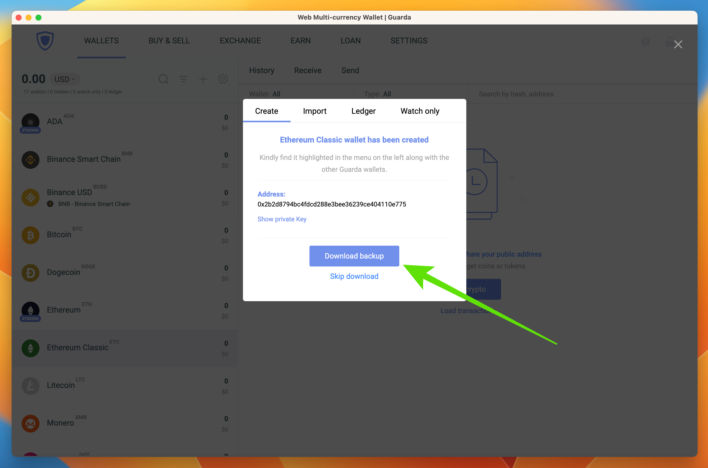
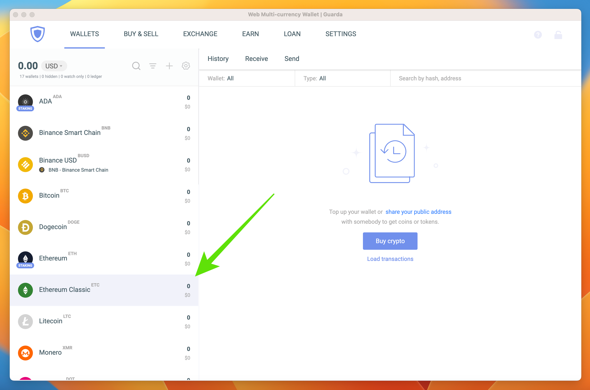
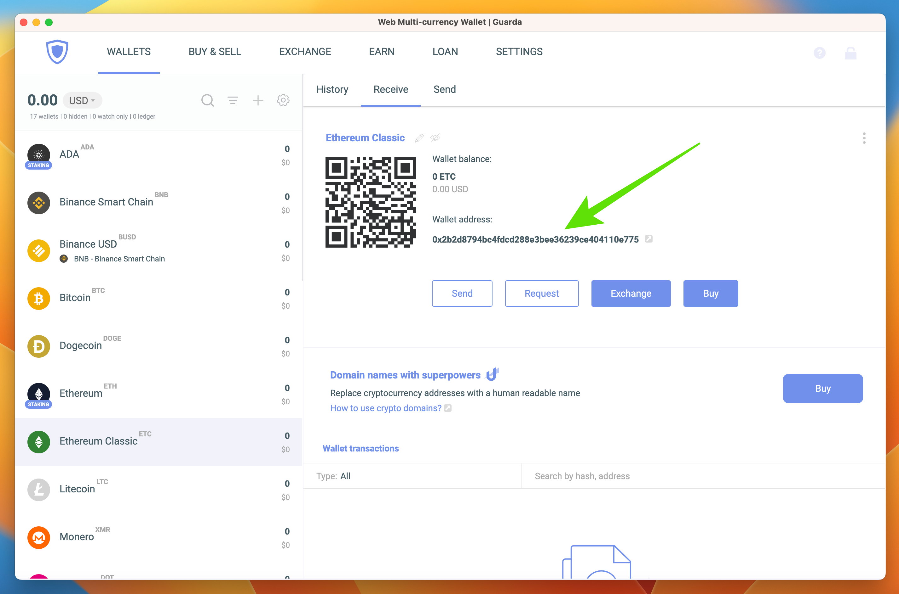

---
**由此收听或观看本期内容:**

<iframe width="560" height="315" src="https://www.youtube.com/embed/4IqQbHdVdFg" title="YouTube video player" frameborder="0" allow="accelerometer; autoplay; clipboard-write; encrypted-media; gyroscope; picture-in-picture; web-share" allowfullscreen></iframe>

---

在这篇文章中，我们将解释如何使用Guarda钱包操作以太坊经典（ETC）。

Guarda钱包与我们通常在本网站介绍的钱包不同，因为它不是使用秘密助记词作为备份，而是使用所谓的“备份文件”。

在接下来的部分中，我们将解释如何下载、设置和备份您的Guarda钱包。

## 1. 下载Guarda钱包

使用Guarda钱包操作ETC的第一步是下载其桌面应用程序并将其安装在您的电脑上。

为此，请访问https://guarda.com 并下载适用于您的操作系统的Guarda钱包应用程序文件。然后进行安装。

## 2. 在您的电脑上打开Guarda钱包

下载并安装Guarda钱包后，打开它并点击“创建新钱包”开始设置过程（在未来的文章中，我们将解释如何从备份文件恢复您的Guarda钱包）。

## 3. 创建密码

Guarda钱包要求您为钱包创建一个密码。

由于Guarda钱包不会存储您的密码，因此您需要将此密码写下来并存放在安全的地方。没有密码，您将无法访问您的加密货币！

## 4. 下载备份文件

在下一步中，Guarda钱包会要求您在打开新钱包之前备份它。这是为了确保您在继续操作之前已经将备份文件存储在电脑中。

为此，请点击“下载备份”。

## 5. 将备份文件存储在电脑的文件夹中

点击“下载备份”后，您的操作系统将提示您选择将Guarda钱包备份文件保存到电脑的哪个文件夹中。

请确保将其放在您以后容易找到的文件夹中。此外，如果您将备份文件备份到一个U盘中作为额外的安全措施，以防丢失或电脑被盗，那将是一个额外的安全层。

## 6. 在Guarda上创建以太坊经典钱包

将Guarda钱包备份文件下载到电脑后，您将被带到Guarda钱包的主页。

要将以太坊经典添加为钱包资产，请点击加密资产列顶部菜单中的“+”号链接。

## 7. 搜索并选择ETC

在下一步中，Guarda钱包会要求您搜索要添加的资产。

要添加ETC，在搜索字段中输入“ETC”或“Ethereum Classic”，并点击列表中出现的ETC资产。

## 8. 下载更新后的备份文件

在将您带回应用程序主页之前，Guarda钱包会要求您再次备份，因为之前的备份文件中尚未包含ETC数据。这将是您所有资产的新Guarda钱包备份。

要备份包含新ETC地址的最新Guarda钱包，请点击“下载备份”。

## 9. 添加新的ETC钱包

备份钱包后，Guarda钱包将您带回应用程序主页，您将在左侧加密资产列表中看到ETC资产。

要打开您的ETC钱包，请点击“以太坊经典”资产。

## 10. 现在您可以在Guarda钱包上使用ETC了！

当Guarda钱包将您带到ETC主页时，您将看到新以太坊经典地址的所有功能。

现在，您可以在Guarda钱包上使用以太坊经典来发送、接收、交换或购买ETC了。

---

**感谢您阅读本文！**

要了解更多关于ETC的信息，请访问：https://ethereumclassic.org
