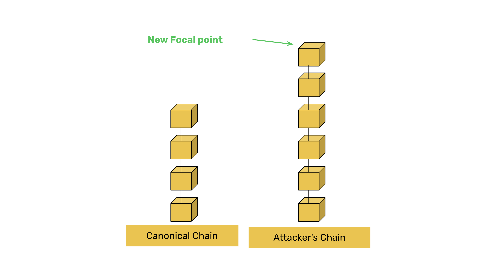

---
**由此收听或观看本期内容:**

<iframe width="560" height="315" src="https://www.youtube.com/embed/30Xhv2Wt85c" title="YouTube video player" frameborder="0" allow="accelerometer; autoplay; clipboard-write; encrypted-media; gyroscope; picture-in-picture; web-share" allowfullscreen></iframe>

---

在前一节课34中，我们讨论了在POW区块链（如ETC）中产生最终性和整体安全性的活动，即挖矿。

我们解释了使ETC成为全球加密货币矿工的绝佳商业机会的指标。

在本节课35中，我们将解释为什么工作量证明（POW）区块链必须具备可攻击性才能确保安全。

## 向区块链添加主观性的倾向

在POW区块链上，51%攻击是指不诚实的行为者积累了超过50%的区块链挖矿能力，并使用它来删除账本中的过去交易。删除交易的目的是从受害者那里窃取财产。

51%攻击是POW区块链中的已知攻击向量，但这是一种特性，而不是这些系统的缺陷。

人们认为，由于POW区块链在坏人控制超过50%的挖矿能力时可能被攻击，因此有必要添加主观装置以拒绝替代块或替换规范链的链。

## 示例：检查点和MESS

例如，如果一个POW网络正在处理第100,000块，并且突然攻击者重新组织了第99,000到100,000块以替换或删除最近的交易，那么应该添加新的规则，例如检查点或要求指数级更多的哈希能力来防止这些重新组织。

检查点预先确定过去的某些区块编号，网络节点将不接受任何重新组织。

像MESS（修改后的指数主观评分）这样的系统会使节点拒绝任何哈希能力不足以重新组织的链。

## 但弱主观性是有害的

然而，如果这样做，会将决定正确链的权力交到人类手中，而通过简单的工作验证实现的区块链去中心化，即任何人可以随时加入或离开而无需许可或与他人核对，将被抛弃以防止51%攻击。

使用POW作为共识机制的初衷是为了消除任何主观性，准确实现系统的完全去中心化。

如果加入或重新加入网络的节点必须与其他节点核对哪个是基于任意指标和标记的正确区块链，而不是单纯的计算能力，那么“受信任的第三方”这一角色将再次被引入系统！

## 而且51%攻击并没有那么重要

仅仅为了防止51%攻击而在POW区块链中引入信任是不值得的，因为这些攻击并不严重。

51%攻击是非常有限的攻击，非常不可能发生，受害者非常少，受害者有其他方法保护自己，例如在接收币时等待正确数量的区块确认。

这就是为什么向POW区块链添加主观规则不是一个好主意，以及为什么它们必须具备可攻击性才能实际确保安全，而不是相反。

---

**感谢阅读本文！**

要了解更多关于ETC的信息，请访问：https://ethereumclassic.org
