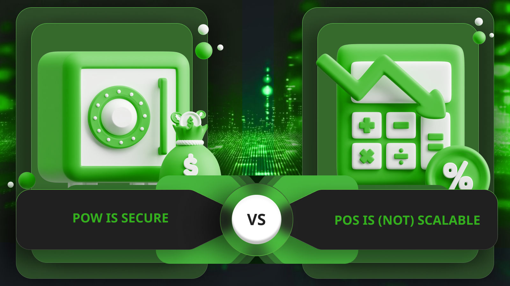

---
**由此收听或观看本期内容:**

<iframe width="560" height="315" src="https://www.youtube.com/embed/Nh2OPLswPSY" title="YouTube video player" frameborder="0" allow="accelerometer; autoplay; clipboard-write; encrypted-media; gyroscope; picture-in-picture; web-share" allowfullscreen></iframe>

---

## 最初的想法是信息的完全复制

在 1998 年的文章《通过所有者权威保护财产权》中，区块链先驱 Nick Szabo 奠定了如何在去中心化网络中保护财产所有权和转让的基础。

这些想法后来在比特币（BTC）和以太坊经典（ETC）等网络中成为现实，推动了货币和其他加密资产的控制和转移。

他提出的基本假设是所有权记录的信息将在网络的所有参与节点中复制。

这种复制将为用户提供三种形式的安全性：信任最小化、全球范围内的财产数据冗余，以及在发生腐败时能够携带正确信息从网络中分离出来。

## 工作量证明共识只是同步节点的一种方式

很可能中本聪偶然发现了工作量证明（POW）作为共识机制的解决方案。

POW 本质上是一种生成 Bit Gold 的方式，但他发现它可以用来同步所有节点，使其每十分钟都保持一致，这是比特币诞生的关键。

从那一刻起，POW 不仅仅是生成稀缺数字对象的方法，还是使网络中所有节点保持完整复制数据的机制。

到此为止，安全模型是信任最小化、冗余和分裂能力，但 POW 还带来了其他东西。

## 然后工作量证明成为安全模型的一部分

实际上，POW 不仅生成了数字稀缺性，或以 Bit Gold 形式出现的数字黄金，以及让所有节点保持相同数据副本的共识，它还通过为攻击者设置障碍来腐败系统，成为了安全模型的一个额外安全机制，或者说是安全模型的补充。

因为生成 Bit Gold 的方法需要大量工作，而这种工作正是使系统中的所有节点在共识中同步的关键，这同样的工作也成为了系统的一个安全组成部分，因为它要求任何试图重新组织区块链的人都必须重新完成整个工作。

这一特性为已经通过在系统中所有节点中分布信息而安全的数据库增加了极其强大的保护。

## 但完全复制并不具有可扩展性

然而，信息完全复制这一特性本身是一个复杂的过程，这对系统施加了不同类型的成本。

为了将所有账户、余额、智能合约和交易分布并复制到网络中所有参与的机器上，需要耗费大量的时间和资源。

如果区块链的理念是让尽可能多的节点在网络中复制数据，那么这些节点就需要更多的带宽、本地处理能力和存储容量，以适应系统的增长。

这些限制对每一轮可以处理的数据量设置了限制，因此限制了系统按每秒交易量衡量的可扩展性。

## 权益证明不安全，因为它是中心化的

区块链行业的许多人认为，POW 是这些系统缺乏可扩展性的原因，但事实是，真正的原因是信息复制的要求。

然而，为了追求可扩展性，同时也为了“节约资源”，许多项目走上了不需要 POW 挖矿的权益证明（POS）道路，以解决这一问题。

POS 的问题在于，不需要工作就失去了在去中心化方式下实现共识的关键组成部分；它不需要成本来创造货币；并且它取消了阻止攻击者腐败系统的障碍！

所有这些设计变化使得 POS 区块链成为中心化系统。

## 因此，权益证明既不安全也不可扩展！

因此，如果 POW 只是实现区块链真正目标的手段，即信息的完全复制；同时它还为系统增加了更多的安全属性；但所有这些好处都在 POS 网络中被移除；如果完全复制是导致区块链不可扩展的原因；那么权益证明加密货币不仅不安全，而且也不可扩展！

这个惊人的现实是该行业中最令人困惑的事情之一：为了追求未能实现的目标而逆转新技术的所有好处和属性，实际上削弱了整个实验的承诺！

---

**感谢您阅读本文！**

要了解更多关于 ETC 的信息，请访问: https://ethereumclassic.org
