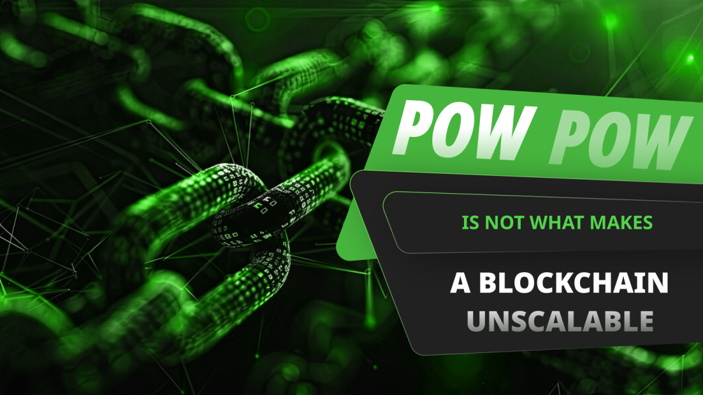
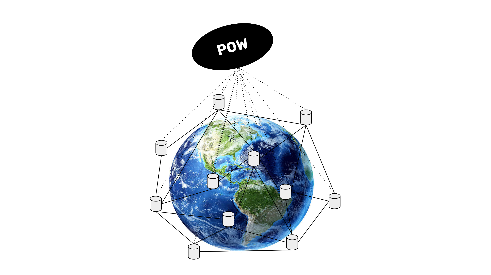

---
**You can listen to or watch this video here:**

<iframe width="560" height="315" src="https://www.youtube.com/embed/0JC-lgVwayE" title="YouTube video player" frameborder="0" allow="accelerometer; autoplay; clipboard-write; encrypted-media; gyroscope; picture-in-picture; web-share" allowfullscreen></iframe>

---

In the previous class, 35, we explained why proof of work (POW) blockchains must be attackable to be secure, we went over the way POW works and how the bias to subjectivity could put at risk the consensus mechanism.

It is the format and security of POW based Nakamoto Consensus that puts constraints to the amount of data that can be distributed across secure blockchains, thus their unscalability.

This means that it is not the work in POW that makes blockchains unscalable, so in this class, 36, we will explain the elements that make them limited in this dimension.

## What Is Scalability?

Scalability means to process more transactions per unit of time.

Bitcoin (BTC) processes from 7 to 14 transactions per second, Ethereum Classic (ETC) can process from 7 to 17 transactions per second, but Visa processes 24,000 transactions per second.

This gap of Proof of Work (POW) blockchains with respect to the large traditional payment systems has made a lot of people worry about the lack of scalability in these networks and blame the work in POW for it.

Many people think that POW is unscalable because it requires a lot of work, therefore it must process less transactions.

However, POW is not the cause! 

The inefficiency is caused by the rule of full replication of the database in all nodes globally, which requires smaller and slower blocks. Proof of Stake (POS) and Proof of Authority (POA) networks that require full replication have exactly the same inefficiency.

## Full Replication Is the Culprit

In a truly secure POW blockchain, both transactions and blocks are fully retransmitted to all participating nodes in the system. This is done so that all can keep and maintain an identical copy of the whole database.

This full replication of the database is the key security strategy of the blockchain model. The idea is to have all the accounts, balances, and smart contracts replicated in as many computers around the world as possible so they may be as decentralized as possible, and impossible to take down by man or natural events.

However, full replication of databases; let alone ledgers with accounts, balances, and smart contracts; in a totally decentralized way was not possible before, making the systems insecure and dependent on trusted third parties.

The solution to accomplish full replication globally in a totally decentralized way was the Proof of Work algorithm, which is a component of the Nakamoto Consensus design.

But POW is not what makes blockchains such as Bitcoin and Ethereum Classic unscalable. Full replication globally is the reason these networks have a cap of transactions they can process per day.

This is why Ethereum moved to POS but is still unscalable. 

## Any Truly Decentralized Blockchain Must Be Unscalable

Any truly decentralized POW blockchain will have to be unscalable. 

The Nakamoto Consensus design specifies that all data must be replicated in all nodes, and all nodes must hold exactly the same copy of the database. 

This puts a physical constraint in the size and frequency of blocks to ensure full propagation and synchronicity of all the nodes globally. 

Restricted size and frequency of blocks means a limited amount of transactions will fit per block, thus making these systems unscalable.

It is important to understand that POW can process any size of block at any frequency. It is because of restrictions in retransmission and full replication, not POW, that blocks must be small and less frequent.

## How Does Full Replication (And Not POW) Restrict Scalability?

Below we list several reasons why blocks must be small and less frequent in fully replicated networks, therefore produce less transactions per second:

**1. Bloating:** If blocks were larger and faster, then the database would grow larger very quickly and that would put pressure on node operators who have to keep up with sufficient computational storage to maintain their nodes. This would reduce the number of nodes in the chain and increase centralization. It would also go against common principles in the industry which are to “run your own node” and “verify everything” as people would prefer to use third party nodes rather than their own.

**2. Technical:** Related to bloating and centralization, the technical reasons why larger and faster blocks would be disadvantageous are that they would require higher bandwidth, thus limiting the areas in the world and kinds of operators who could process the data; they would require more powerful CPUs for validating the blocks, large data centers with big bandwidth, limiting the reach to operators with more capacity; and the initial blockchain download time (IBD) for new entrants or re-entrants would be very long, creating an additional barrier to participating in the system.

**3. Miner economics:** As the monetary policy in Bitcoin and ETC is decreasing and capped, miners will depend on fee revenues in the future. If blocks were larger and faster, then transaction fees would be lower. With scarce block space and low frequency, then fees will be higher thus financing the security that miners provide to these networks with their hashing power.

**4. Block propagation:** If blocks were larger, block propagation would be slower. This would benefit the larger, well geographically positioned miners in the world and eliminate the smaller miners in remote areas from the network, and would make mining centralized.

## Layer 2 Systems Can Make Proof of Work Scalable

The solution to scalability is either to build layer 2 systems that may process more transactions, net them out, and then settle them at the POW base layer, or for users just to pay higher fees if they wish to use the security of POW blockchains.

Examples of layer 2 systems that may make Bitcoin and ETC more scalable are channel payments systems such as [Lightning Network](https://en.wikipedia.org/wiki/Lightning_Network), regular centralized apps that settle on the POW blockchains such as centralized exchanges, and layer 2 decentralized networks that use proofs to anchor their systems on the base layer POW blockchains, such as [Polygon](https://www.coinbase.com/learn/crypto-basics/what-is-polygon) and [BitVM](https://www.coinbase.com/learn/crypto-glossary/what-is-bitcoin-bitvm).

---

**Thank you for reading this article!**

To learn more about ETC please go to: https://ethereumclassic.org
