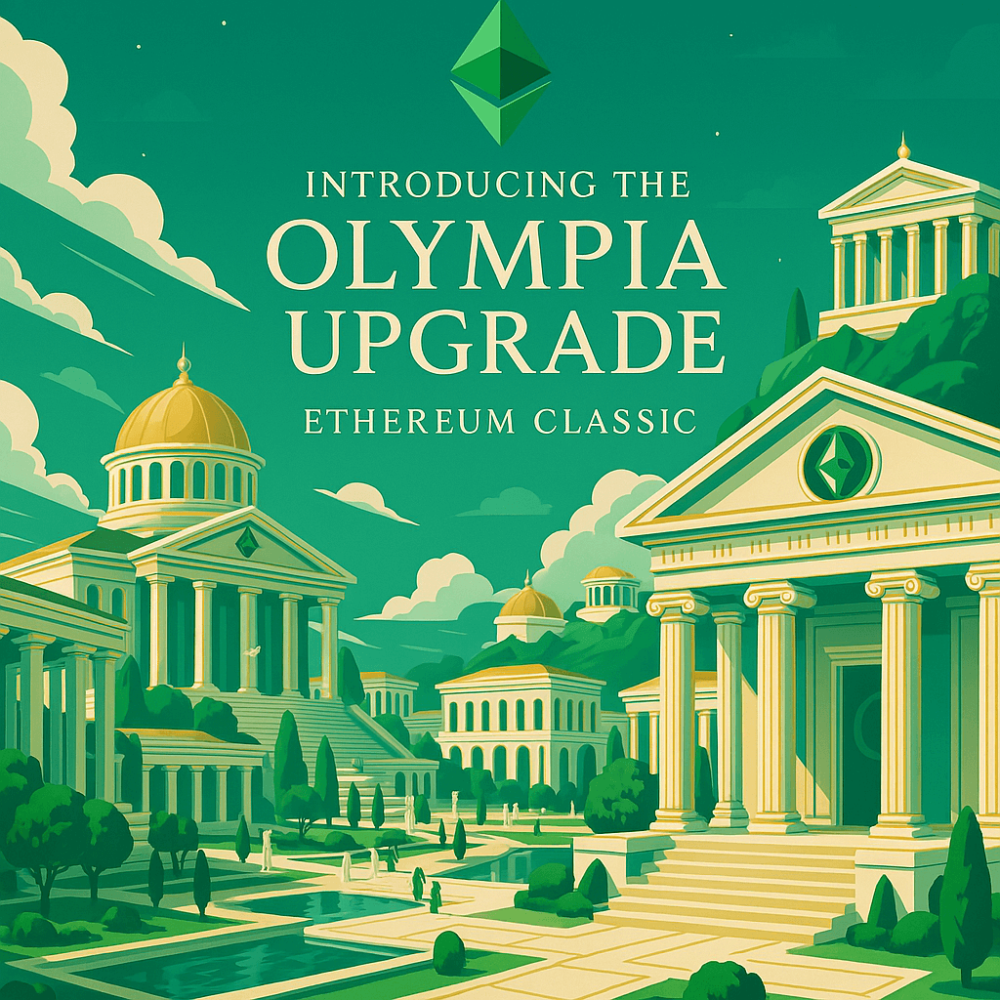

# Olympia Upgrade: Protocol Funding and Governance for Ethereum Classic

Ethereum Classic community developers have submitted a set of four Ethereum Classic Improvement Proposals (ECIPs) under the collective banner of the **Olympia Upgrade**. This coordinated protocol initiative introduces a decentralized, non-inflationary system for funding and governance built natively into the Ethereum Classic network.

All four ECIPs are now in **Draft** status and open for public comment per the [ECIP-1000 process](https://ecips.ethereumclassic.org/ECIPs/ecip-1000).

---

## 📜 Included ECIPs

| ECIP # | Title | Summary |
|--------|-------|---------|
| **[1111](https://ecips.ethereumclassic.org/ECIPs/ecip-1111)** | *Olympia Network Upgrade* | Activates EIP-1559 on Ethereum Classic and redirects the `BASEFEE` to an on-chain treasury contract. |
| **[1112](https://ecips.ethereumclassic.org/ECIPs/ecip-1112)** | *Olympia Treasury Contract* | Introduces an immutable, non-custodial smart contract to hold protocol-level revenue. |
| **[1113](https://ecips.ethereumclassic.org/ECIPs/ecip-1113)** | *Olympia DAO Governance Framework* | Defines a modular, on-chain governance system to manage treasury fund disbursement. |
| **[1114](https://ecips.ethereumclassic.org/ECIPs/ecip-1114)** | *Ethereum Classic Funding Proposal Process (ECFP)* | Establishes a standardized lifecycle for submitting, reviewing, and executing funding requests. |

---

## 🎯 Motivation

Ethereum Classic has long struggled with decentralized funding for core development, infrastructure, and ecosystem growth. Historically, funding decisions have relied on off-chain donations, central entities, or ad hoc coordination — models that are not sustainable, transparent, or permissionless.

The Olympia Upgrade solves this by:

- 🔁 Redirecting protocol revenue into a public treasury (ECIP-1111, ECIP-1112)  
- 🗳 Empowering ETC holders to govern disbursements through on-chain voting (ECIP-1113)  
- 📄 Establishing a standardized process for builders to propose, justify, and receive funding (ECIP-1114)  

This architecture brings Ethereum Classic into alignment with modern, DAO-first networks — without requiring inflation, custody, or off-chain gatekeeping.

---

## 🔍 Addressing Common Concerns

Some initial questions and concerns are expected, especially around compatibility, decentralization, and network ethos. The Olympia Upgrade has been designed from first principles to align with ETC’s core values:

### ✅ Opt-In, Non-Disruptive, Additive

- **Olympia is opt-in** — participation in governance is entirely voluntary.
- **Legacy transactions (Type 0)** are unaffected. No changes are required for users, dApps, or miners not using the treasury.
- **Client compatibility is preserved** — no changes to the EVM, state format, or core consensus logic beyond EIP-1559 activation.

### 🛠 No Inflation or Monetary Dilution

- **No new tokens are minted** — Olympia is entirely funded by redirecting the introduced `BASEFEE`, which would otherwise be burned under EIP-1559.
- **Miners retain their block rewards and priority fees**, while the protocol-level basefee serves public goods.

### 🌐 Anti-Centralization by Design

- The Olympia Treasury is **non-custodial**, **immutable**, and enforced on-chain by smart contracts — not human signers.
- The Olympia DAO uses **permissionless governance** with public proposals, timelocks, and auditability.
- Disbursements are **executed automatically** via smart contracts after successful on-chain votes — no single party can override or block community-approved proposals.

### 🧱 Decentralization and Transparency Improvements

Olympia represents a meaningful shift away from opaque, centralized funding structures that have historically:

- Blocked contributors from accessing support
- Made arbitrary decisions behind closed doors
- Mismanaged resources with little accountability

Instead, Olympia introduces:

- **Transparent on-chain voting** and funding records  
- **Reproducible proposal formats** (ECFPs) open to all contributors  
- **Immutable audit trails** enforced at the protocol layer  
- **No gatekeeping or favoritism** — if a proposal meets quorum and passes, it executes  

Olympia is not a centralizing force — it is the antidote to centralization that has plagued ETC’s growth in the past.

---

## ⛓ Technical Overview

- **EIP-1559 activation** introduces a `BASEFEE`, which Olympia redirects to a protocol treasury instead of burning.
- The **Olympia Treasury** holds these funds in a verifiable smart contract (ECIP-1112).
- The **Olympia DAO** governs the treasury using on-chain voting with secure execution mechanisms (ECIP-1113).
- Builders submit **ECFPs** (ECIP-1114) to propose work and receive funding through a standardized, transparent process.

---

## 🧪 Rollout Plan

- **Testnet deployment** on Mordor is scheduled for Q4 2025.
- Security audits, governance testing, and documentation will follow.
- **Target Mainnet activation**: By end of 2026, subject to ecosystem consensus and readiness.

---

## 🗣 Community Discussion

These proposals are currently in **Draft** form and subject to revision. Feedback from all corners of the community is encouraged.

- Join the discussion:  
  [https://github.com/orgs/ethereumclassic/discussions/530](https://github.com/orgs/ethereumclassic/discussions/530)

---

## 📣 Call to Action

Please review the proposals and share feedback. This is your opportunity to shape the future of funding and coordination on Ethereum Classic:

- [ECIP-1111: Olympia Network Upgrade](https://ecips.ethereumclassic.org/ECIPs/ecip-1111)  
- [ECIP-1112: Olympia Treasury Contract](https://ecips.ethereumclassic.org/ECIPs/ecip-1112)  
- [ECIP-1113: Olympia DAO Governance Framework](https://ecips.ethereumclassic.org/ECIPs/ecip-1113)  
- [ECIP-1114: Ethereum Classic Funding Proposal Process (ECFP)](https://ecips.ethereumclassic.org/ECIPs/ecip-1114)

This is the most significant advancement to ETC’s sustainability since the project’s inception. With your feedback and support, Olympia can ensure that Ethereum Classic remains decentralized, permissionless, and self-sovereign — for the long haul.

—
*Posted by [Chris Mercer](https://github.com/chris-mercer), with contributions from [Cody Burns](https://github.com/dontpanicburns)*
