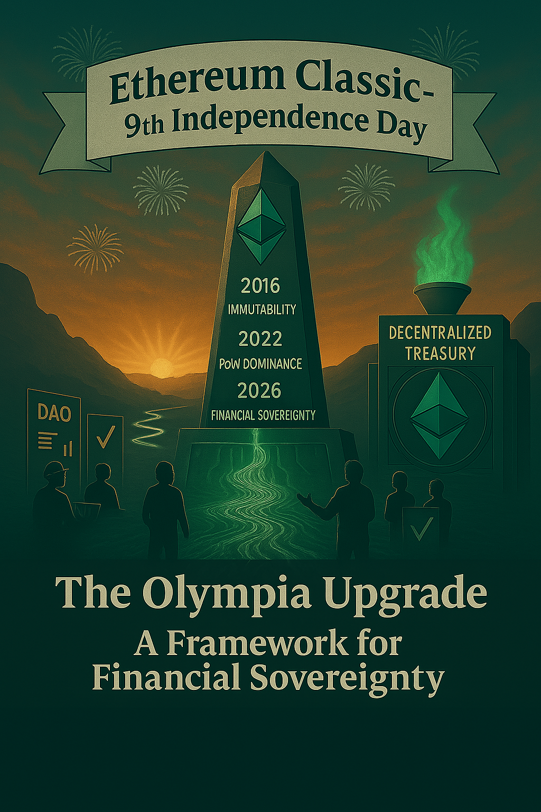

# Olympia: Unlocking Sustainable Funding for Ethereum Classic

Nine years ago today, Ethereum Classic made a choice that still echoes across blockchain history: **it rejected the DAO bailout**, embraced *code is law*, and stood firmly for immutability on **July 20, 2016**.

Today, on ETC’s **9-Year Independence Day**, we look not just to the past — but to the future. The newly released **Olympia Upgrade** proposes the most significant transformation in ETC’s history:

> ✅ The **first open, permissionless, and protocol-native treasury system** in Proof-of-Work — powered entirely by ETC’s native smart contract capabilities and secured by Layer 1 Proof-of-Work consensus.

Drafted as ECIPs **1111–1114**, Olympia enables **sustainable, decentralized funding** — without inflation, trusted third parties, or centralized control.

> ⚠️ **Status:** The Olympia Upgrade is currently in **Draft**. It is under active community review and has not yet been finalized for mainnet.

---

## 🛡 A New Chapter in Ethereum Classic’s Mission

Ethereum Classic is the chain of first principles — immutability, censorship resistance, Proof-of-Work, and minimized trust.

But principles alone can’t fund testnets, clients, or bug bounties.

Now, Olympia proposes the next leap forward:

- 🔗 **2016** – *Immutability Chosen*: DAO fork rejected, code is law upheld  
- 🔨 **2022** – *PoW Anchor*: ETC becomes the largest smart contract PoW chain  
- 🧱 **2025** – *Olympia Drafted*: A complete on-chain funding framework is proposed

Olympia completes Ethereum Classic’s transition from a blockchain that *resists capture* to one that can also *fund itself*.

---

## 📜 What Olympia Introduces

| ECIP # | Title | Summary |
|--------|-------|---------|
| **[1111](https://ecips.ethereumclassic.org/ECIPs/ecip-1111)** | *Olympia EVM and Protocol Upgrades* | Introduces EIP-1559 and EIP-3198 to ETC and redirects `BASEFEE` to a public treasury. |
| **[1112](https://ecips.ethereumclassic.org/ECIPs/ecip-1112)** | *Olympia Treasury Contract* | Deploys an immutable, auditable smart contract to hold protocol-level funds. |
| **[1113](https://ecips.ethereumclassic.org/ECIPs/ecip-1113)** | *Olympia DAO Governance Framework* | Defines a secure, on-chain DAO to allocate funds through community votes. |
| **[1114](https://ecips.ethereumclassic.org/ECIPs/ecip-1114)** | *Ethereum Classic Funding Proposal Process (ECFP)* | Creates a standardized workflow for proposing, reviewing, and executing grants. |

---

## 🔥 Kickstarting ETC’s Fee Market

Under **ECIP-1017**, Ethereum Classic’s block reward is declining over time. As of today, the network earns only **~$20/day in transaction fees** — nowhere near sustainable to secure the chain long-term.

Olympia corrects this:

- ✅ Activates **EIP-1559**, introducing a predictable, market-based `BASEFEE`  
- ✅ Redirects that BASEFEE to a smart contract treasury  
- ✅ Incentivizes dApps, tooling, and usage — growing network activity  
- ✅ Creates a feedback loop where growth → usage → revenue → funding → more growth

Olympia **aligns every participant** — miners, developers, users, investors — around the shared goal of building a vibrant on-chain economy secured by ETC.

Fee market revenue is no longer an afterthought. **It becomes the long-term security budget.**

---

## 🧠 Why Ethereum Classic Is Uniquely Positioned

Most Proof-of-Work chains cannot natively support a decentralized funding system.

Ethereum Classic is different.

- 🧠 ETC has **Layer 1 native smart contracts** — secured directly by PoW  
- 🔐 No validator committees, no trust bridges  
- 💡 No separation between execution and consensus

This means ETC can build a decentralized funding framework **fully validated by Layer 1 miners** — something Bitcoin, Litecoin, and Monero cannot do without introducing new trust assumptions.

**Olympia is only possible because Ethereum Classic preserved the original Ethereum design.**

---

## 🧱 Supporting What Keeps ETC Running

Today, Ethereum Classic’s infrastructure depends on a shrinking pool of centralized donations.

Critical systems still funded off-chain include:

- 🧱 **Core-Geth** client maintenance  
- 🌐 **RPC services** for dApps and users  
- 🔍 **Block explorers**, **subgraphs**, and **indexers**  
- 🕰️ **Archival nodes** and sync infrastructure  
- 🔄 **EVM upgrades** for compatibility  
- 🚨 **Security fixes** and bug bounties  

Grayscale’s $5M donation in 2022 was a lifeline to ETC Cooperative — but it’s nearly exhausted.

In total, **five independent teams** — ETCDEV, IOHK’s Grothendieck Team, ETC Commonwealth, ETC Labs, and ETC Cooperative — were funded by private donors. Each built critical infrastructure, but none had access to sustainable, on-chain revenue. When grants ran dry, or priorities shifted, they lacked a native funding mechanism to continue operations.

**Olympia addresses this failure directly.**  
By redirecting `BASEFEE` revenue into a decentralized treasury, it creates a **predictable and permissionless funding stream** — so that maintaining core infrastructure no longer depends on the generosity (or continued existence) of outside sponsors.

---

## 🤝 A New Path for Donors

Olympia isn’t anti-donor — it’s **pro-accountability, transparency, and legal clarity**.

For the first time, Ethereum Classic offers a **formalized, compliant, and trust-minimized framework** for centralized funders to support the network — not through backchannels or privileged agreements, but **through an open, on-chain treasury system** with clear rules and auditable execution.

### ✅ Legal Accountability via DAO LLC

The **Ethereum Classic DAO LLC**, registered in Wyoming, acts as a **legally recognized execution layer** for Olympia DAO votes. It ensures:

- 🧾 **Binding execution** of on-chain votes  
- 📂 **Proper reporting**, receipts, and documentation for donors  
- ⚖️ **Regulatory compliance** for enterprise contributors

---

### 🏛 A Framework Built for Strategic Funders

Ethereum Classic doesn’t exist in isolation — it’s part of a broader ecosystem of service providers, infrastructure maintainers, miners, and capital allocators who all **depend on the chain’s reliability**.

These actors benefit when ETC is stable, performant, and growing — but until now, they’ve had no transparent, compliant, or on-chain way to contribute to that growth.

**Olympia fixes that.**

It creates a public, auditable funding system that allows **every class of strategic funder** to support the Ethereum Classic network in a secure and mission-aligned way:

- 🏦 **Centralized Exchanges** — need stable RPCs, explorer APIs, and wallet infra  
- 🪓 **Mining Pools & Hardware Manufacturers** — benefit from a thriving fee market  
- 📈 **ETC Investment Products (e.g. Grayscale, ETFs)** — rely on ETC network credibility  
- 🚀 **Web3 Venture Firms** — need base-layer stability to fund native ETC dApps  
- 🏗 **Infra Sponsors** — want visibility and voting over upgrade and maintenance funding

With Olympia, they finally have a **legal and on-chain path** to participate in ETC’s future.

---

## 💡 The Takeaway

These aren’t just abstract “donors” — they’re **essential to ETC’s day-to-day operations and long-term adoption**.

Olympia empowers them to contribute **with confidence**, knowing that:

- Funds are only used when proposals pass on-chain votes  
- Every disbursement is public and verifiable  
- Legal compliance is handled by a dedicated DAO LLC  

By aligning the incentives of ETC’s most critical stakeholders, Olympia brings **stability to the base layer**, so that real economic activity — and long-term value — can grow on top of it.

---

## 🧩 Built to Protect Ethereum Classic’s Principles

Olympia reinforces, not replaces, ETC’s values:

### 🔓 Fully Permissionless  
- Type 0 transaction users are unaffected  
- No token premine or airdrops  
- Governance is **opt-in only**

### 🛠 No Inflation, No Dilution  
- `BASEFEE` is redirected, not newly issued  
- Tips still go to miners  
- No new token — no new trust assumptions

### 🔐 Transparent and Immutable  
- Treasury contract is deterministic and non-upgradeable  
- Governance contracts are modular and auditable  
- Emergency fallback multisig has signer diversity safeguards  
- DAO LLC limited to execution only — no veto rights

---

## 🧪 What’s New in the July 20 Drafts

Since the initial drafts, all ECIPs have been strengthened based on community feedback:

- ✅ Solidity code examples for EIP-1559 and proposal flow  
- ✅ Modular, upgrade-ready governance architecture  
- ✅ Replay protection and proposal hashing standards  
- ✅ Emergency fallback logic with signer rotation  
- ✅ Legal wrapper limited to enforcing passed votes  
- ✅ Rollout plan with community checkpoints and audits  
- ✅ Precedent from Ronin, Celo, Mantle, Optimism, and others

---

## 📆 Rollout Timeline

| Milestone | Target |
|-----------|--------|
| ✍️ Draft ECIPs Published | July 4, 2025 |
| 📢 Independence Day Release | July 20, 2025 |
| 💬 Community Consensus & Feedback | Summer–Fall 2025 |
| 🧪 Testnet Deployment (Mordor) | Early 2026 |
| 🔍 Security Audits & DAO Testing | Mid 2026 |
| 🚀 Mainnet Activation (Pending Community Approval) | End of 2026 |

---

## 📣 Call to Action: Secure ETC’s Future

Ethereum Classic has survived attacks, rejection, and irrelevance.

Now, it’s time to thrive.

**Olympia is the only serious, decentralized funding solution ever proposed for ETC.**  
If you have a better one — let’s see it.  
If not — then it’s time to unite behind the path that aligns with ETC’s values.

🔗 [Join the discussion →](https://github.com/orgs/ethereumclassic/discussions/530)  
🧠 [Review the ECIPs →](https://ecips.ethereumclassic.org)

- [ECIP-1111: Olympia EVM and Protocol Upgrades](https://ecips.ethereumclassic.org/ECIPs/ecip-1111)  
- [ECIP-1112: Olympia Treasury Contract](https://ecips.ethereumclassic.org/ECIPs/ecip-1112)  
- [ECIP-1113: Olympia DAO Governance Framework](https://ecips.ethereumclassic.org/ECIPs/ecip-1113)  
- [ECIP-1114: Ethereum Classic Funding Proposal Process](https://ecips.ethereumclassic.org/ECIPs/ecip-1114)

---

### 👥 Invitation to Builders: Your Protocols Helped Forge Olympia

Olympia is built on the shoulders of giants — inspired by the innovations of Ronin, Celo, Mantle, Optimism, and Arbitrum.  
To the teams behind these protocols and DAO frameworks: **we welcome your input, insight, and contributions** as we adapt these ideas to Ethereum Classic’s unique Proof-of-Work architecture.

Let’s finish what started at block 1,920,000.  
Let’s make Ethereum Classic sustainable.  
**Let’s activate Olympia.**
